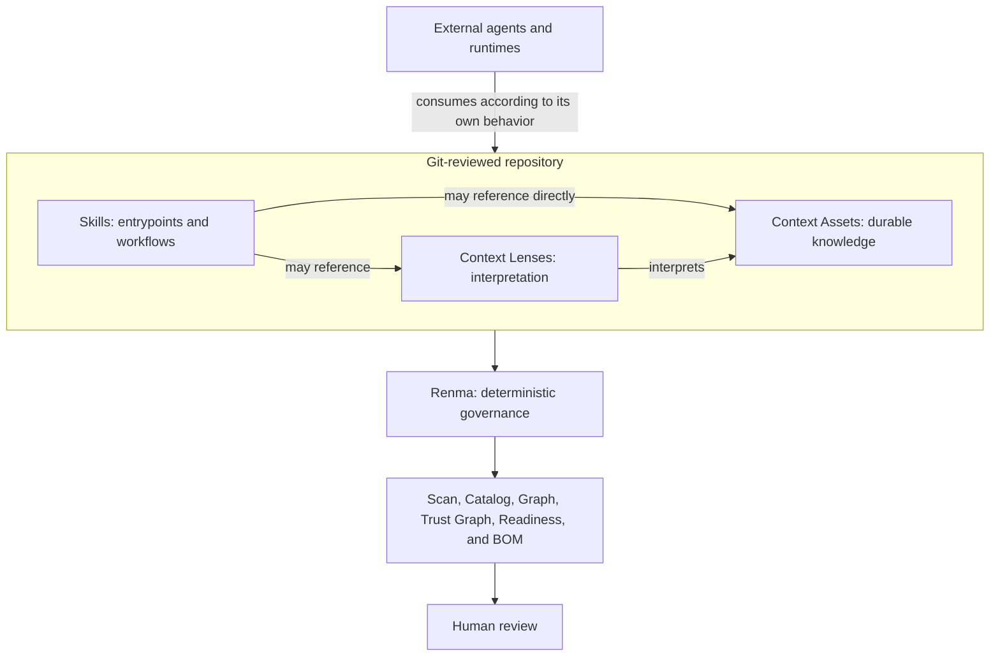

# Renma

[](https://npmjs.org/package/renma)
[](https://npmjs.org/package/renma)

Renma is a Git-native context repository and deterministic governance CLI for
LLM-facing knowledge. It keeps Skills, Context Lenses, Context Assets,
references, ownership, lifecycle, dependencies, security policy, and evidence
reviewable as maintainable software assets.

Agent-facing knowledge tends to spread across copied prompts, one-off Markdown,
and team-local instructions. Renma gives that material stable repository
identity, explicit relationships, deterministic validation, and CI-friendly
reports without becoming an agent runtime.

## Why A Context Repository?

A Context Repository is a Git-reviewed source of truth for reusable knowledge
that LLMs and agents can consume. Without that repository boundary, important
guidance is copied across prompts and Skills, buried in one-off instructions,
detached from an owner, difficult to review, and increasingly inconsistent as
teams and workflows evolve. It also becomes hard to tell maintained guidance
from obsolete or unofficial material.

Independently maintained context should be treated as a software asset:
identified, owned, versioned in Git, connected through explicit relationships,
reviewed by humans, and validated deterministically. Cross-Skill reuse is one
reason for a Context Asset, but an independent lifecycle or source-of-truth role
is also sufficient. A Skill is an agent-facing entrypoint and workflow guide;
the broader Context Repository preserves knowledge with an independent reason
to outlive and be governed separately from one Skill. Task-specific knowledge
does not become Context merely because it matters to correctness.

Renma operationalizes this model through deterministic repository governance.
It is not a prompt library, agent runtime, live Context selector, vector
database, agent memory, replacement for RAG, or generic Markdown linter. See the
[Context Repository notes](https://kazucocoa.blog/context-repository/) for the
broader product framing.

## Agent Skills And Renma

Run `renma guide skill` before generation. Renma establishes repository asset,
metadata, placement, and responsibility boundaries first; the deterministic
scaffold is the repository-compatible starting point. Platform-native Skill
guidance may then refine trigger descriptions, ordered instructions, positive
and negative usage boundaries, inputs, constraints, completion criteria, and
examples that resolve real ambiguity within those boundaries.

Platform-native guidance is not the authority for Renma metadata, Context
placement, repository asset boundaries, file count, source-of-truth
representation, or whether support files and scripts should exist. Renma does
not replace semantic authoring judgment, and human review remains required.

Renma is **Agent Skills-compatible, but not Agent Skills-defined**. Canonical Agent Skills entrypoints
are discovered under `skills/**/SKILL.md` and
`.agents/skills/**/SKILL.md`. Renma also discovers historical `skill.md` and
`*.skill.md` entrypoints for migration diagnostics, but discovery does not make those spellings Agent Skills-compatible.
The broader repository model also
includes independently governed Context Assets, Context Lenses, policies,
references, and evidence.

See [Agent Skills Compatibility and Migration](docs/agent-skills-compatibility.md)
for the exact format and one-way migration contract.

## Product Boundary

Renma discovers, parses, normalizes, and validates repository assets. It does
not:

- select a Skill or Context for a live task;
- assemble or inject prompts;
- execute Skills, agents, or tools;
- call an LLM for core analysis;
- collect runtime telemetry; or
- automatically rewrite Skill bodies or weaken policy.



## Primary Skill Workflows

For a new Skill, establish the Renma contract before generation:

```text
renma guide skill
  -> define the smallest intended asset structure
  -> renma scaffold skill
  -> scaffold or reuse justified Context Assets
  -> complete the focused workflow
  -> renma scan . --fail-on high
  -> inspect catalog and graph evidence
  -> fix and rerun
  -> human review
```

For an existing Skill:

```text
renma scan . --fail-on high
  -> inspect relevant diagnostics and repository evidence
  -> use suggest-metadata only for metadata or migration work
  -> prepare the smallest intended patch
  -> renma scan . --fail-on high
  -> fix relevant diagnostics
  -> rerun validation
  -> human review
```

Do not create a generic Skill first and enrich it afterward with Renma-like
metadata, and do not run two independent generators against the same target
file. If a platform-native tool can generate Skills, ask it to refine semantics
inside the existing Renma scaffold and asset graph. `suggest-metadata` never
edits the target and does not improve the Skill body.

For existing-Skill maintenance, use `renma guide skill` only when the work
intentionally reconsiders Skill-versus-Context responsibility, file or resource
boundaries, source-of-truth placement, scripts, support files, or the asset
graph. Ordinary maintenance starts with `scan`.

An external URL in a Context Asset records authority; it does not grant network
permission. Decide whether execution reads the URL or uses content supplied by
an approved process. Runtime access requires an evidence-backed effective
security-policy decision, including reviewed data, network, destination,
upload, secrets, and human-approval semantics where applicable. Do not infer
permissive values from the URL.

The [Authoring Guide](docs/authoring-guide.md) is the canonical walkthrough for
both workflows.

Renma 0.19.x continues to use focused workflows rather than a thin-router
model. See the [canonical quality profile](docs/quality-profile.md) for every
fixed threshold, unit, rationale, provenance, and diagnostic mapping. Quality
thresholds are not configurable through `renma.config.json` in this release.

## Install And Quick Start

Run Renma without installing it globally:

```bash
npx renma scan . --fail-on high
npx renma catalog . --format markdown
npx renma graph . --format markdown
npx renma readiness . --format markdown
```

Create and complete a new Skill:

```bash
npx renma guide skill
npx renma scaffold skill skills/testing/spec-review/SKILL.md --owner qa-platform
# Refine semantics within the Renma asset and metadata boundaries.
npx renma scan . --fail-on high
npx renma catalog . --format markdown
npx renma graph . --format markdown
```

Review an existing Skill without editing it automatically. Start with `scan`;
use `suggest-metadata` only when the evidence identifies metadata retrofit or
migration work:

```bash
npx renma scan . --fail-on high
npx renma inspect skills/testing/spec-review/SKILL.md
# Conditional: metadata retrofit, explicit owner retrofit, or migration only.
npx renma suggest-metadata skills/testing/spec-review/SKILL.md
```

Inspect one file or an exact slice:

```text
renma inspect <file>
renma inspect <file> --lines L10-L42
```

When developing from this checkout:

```bash
npm install
npm run build
node dist/index.js scan . --fail-on high
```

## Command Guide

| Command | Main question |
| --- | --- |
| `scan` | What concrete problems should be fixed? |
| `catalog` | What assets and metadata exist? |
| `graph` | How are assets structurally connected? |
| `trust-graph` | What trust-relevant evidence is connected to each asset? |
| `readiness` | Is the repository broadly prepared for agent-facing use? |
| `bom` | What declared repository context manifest should be reviewed? |
| `ownership` | Where is ownership missing or concentrated? |
| `diff` | What deterministic evidence changed between Git refs? |
| `ci-report` | What should a CI or pull-request reviewer inspect? |
| `inspect` | What is the outline or exact line slice of one file? |
| `guide` | What is the smallest justified asset graph for a new Skill? |
| `scaffold` | How can a new asset start from a deterministic structure? |
| `suggest-metadata` | What metadata retrofit or one-way Skill migration is safe to review? |
| `suggest-semantic-split` | How can a mixed-purpose asset be split reviewably? |

Run `renma --help` and `renma <command> --help` for current options, output
contracts, and next steps. The [User Manual](docs/user-manual.md) is the
operational command reference.

## Repository Shape

Renma supports independently owned knowledge rather than requiring every piece
of Context to live inside a Skill directory:

```text
skills/
  testing/
    spec-review/
      SKILL.md
contexts/
  testing/
    boundary-value-analysis.md
    negative-testing.md
lenses/
  testing/
    spec-review-boundary-values.md
```

This is an illustrative layout, not a required domain hierarchy. `contexts/`
is preferred and `context/` remains supported. Skill-local `references/`,
`assets/`, `scripts/`, `examples/`, and `profiles/` are valid support material.
Files under those canonical support directories are structurally Skill-local.
When repository evidence resolves exactly one parent Skill, local support
without a declared owner may inherit its effective ownership; reports
distinguish inherited ownership from declarations.
When deterministic evidence shows that knowledge is reusable beyond one Skill,
promote it to an owned Context Asset rather than moving it based on location
alone.

The relationship model supports both:

```text
Skill -> Context Lens -> Context Asset
Skill -> Context Asset
```

These are static governance relationships, not runtime Context selection.

## Context Asset Discovery Boundary

`contexts/**` is the preferred independently governed Context Asset root;
`context/**` remains supported for compatibility. Once a human places a file
under either root, Renma classifies it deterministically from that root. A
nested support-like directory name does not override the recognized root.

Files under canonical Skill `references/`, `profiles/`, `examples/`, `scripts/`,
and `assets/` directories are structurally Skill-local. Renma claims one parent
and possible inherited governance only after repository evidence resolves
exactly one Skill. Explicit supported local metadata remains valid, but
independent metadata is not mandatory. Top-level `references/**` is not a
Context root, top-level `tools/**` is repository implementation, and
`skills/**/tools/**` is not canonical Skill-local support; use local `scripts/`
for executable support. See
[classification evidence](docs/diagnostics.md#how-to-read-classification-evidence)
for the detailed contract.

```text
contexts/foo/references/policy.md
  -> independent Context Asset

skills/foo/references/policy.md
  -> Skill-local Reference

references/policy.md
  -> outside the Context root

tools/helper.mjs
  -> repository implementation

skills/foo/tools/helper.mjs
  -> not canonical Skill-local support
```

Promoting local knowledge to independent Context is a human design decision
about ownership, lifecycle, reuse, and source of truth. Renma never moves a
file or infers that intent from content. `inspect` explains deterministic
classification separately from governance. `suggest-metadata` returns the
successful `no-proposal` mode when no safe metadata change is recommended.
`inspect --format json` also preserves `repositoryBoundary` evidence. If no
single repository root can be resolved, suggestions fail closed and do not
recommend scanning the caller's current directory.
For Skill-local support, the path supplies only a parent candidate; Renma claims
inheritance only after repository evidence resolves one parent Skill. A missing
or ambiguous parent blocks a metadata proposal and directs the reviewer to the
layout and scan evidence.

For an LLM-assisted improvement, start with
`renma scan . --fail-on high --format json`, inspect the target Skill and its
relevant local or Context resources, and use `suggest-metadata` only when the
evidence supports a retrofit or migration. Apply the smallest intended patch,
rerun the scan, and stop without manufacturing work when Renma returns
`no-proposal`. For a question about one path boundary, start with
`renma inspect <target> --format json`.

## Canonical Skill Example

```yaml
---
name: spec-review
description: Review specifications for ambiguity and missing boundaries. Use when requirements need evidence-backed review before implementation.
metadata:
  renma.id: skill.testing.spec-review
  renma.title: Spec Review
  renma.owner: qa-platform
  renma.status: stable
  renma.tags: '["testing","spec-review"]'
  renma.requires-context: '["context.testing.boundary-value-analysis"]'
  renma.optional-context: '[]'
---
```

Agent Skills owns the standard identity and body. Renma governance and security
values use flat, string-valued `metadata.renma.*` entries; list values are JSON
array strings. Context Assets and other non-Skill assets retain their documented
top-level metadata syntax.

See the [Authoring Guide](docs/authoring-guide.md) for authoring responsibility
and the [compatibility guide](docs/agent-skills-compatibility.md) for the exact
canonical and migration rules.

## Examples And Documentation

- [Documentation index](docs/README.md)
- [User Manual](docs/user-manual.md)
- [Authoring Guide](docs/authoring-guide.md)
- [Agent Skills Compatibility and Migration](docs/agent-skills-compatibility.md)
- [Diagnostics Reference](docs/diagnostics.md)
- [Renma Quality Profile](docs/quality-profile.md)
- [Security Policy Guide](docs/security-policy.md)
- [Repository Context BOM contract](docs/repository-context-bom.md)
- [Architecture](architecture.md)
- [Product Design](design.md)
- [Current Roadmap](plan.md)
- [Deferred Skill-to-Skill Discovery Design](plan-discovery.md): unassigned
  exploratory route/index design, separate from implemented repository and
  support-resource discovery.
- [Interactive Placeholder Example](examples/interactive-placeholder): minimal
  hands-on clarify-before-act Skill interaction with a local tool.
- [Example Context Repository](examples/context-repo): richer repository-aware
  Skill, Context Lens, and Context Asset governance.
- [Context Lens Example](examples/context-lens): focused Context Lens governance.
- [GitHub Actions Example](examples/github-actions/renma-ci-report.yml): CI report
  integration.

The governing review loop remains:

```text
LLM proposes. Renma verifies. Human approves.
```
