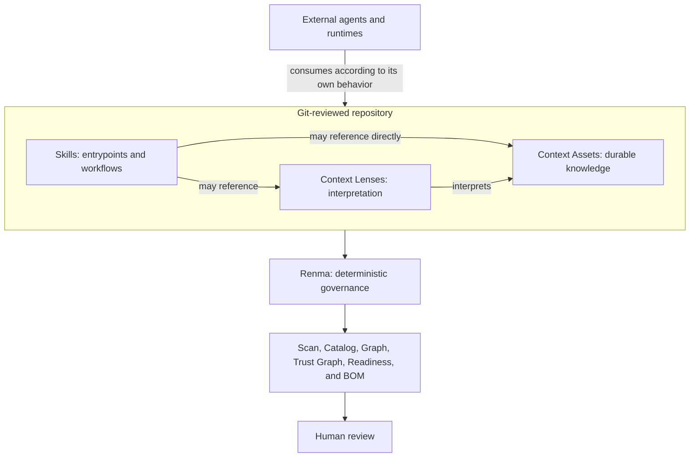

# Renma - 練磨 in Japanese

[](https://npmjs.org/package/renma)
[](https://npmjs.org/package/renma)

Renma is a Git-native context repository and deterministic governance CLI for LLM-facing knowledge. It keeps Skills, Context Lenses, Context Assets, references, ownership, lifecycle, dependencies, security policy, and evidence reviewable as maintainable software assets.

Agent-facing knowledge tends to spread across copied prompts, one-off Markdown, and team-local instructions. Renma gives that material stable repository identity, explicit relationships, deterministic validation, and CI-friendly reports without becoming an agent runtime.

### You May Need Renma When

- The same guidance is copied across multiple Skills, prompts, or repository instructions.
- Nobody can confidently identify which version is authoritative.
- Skills or Context Assets reference files that have moved, disappeared, or become outdated.
- Ownership, lifecycle status, or review history is unclear.
- A shared knowledge change may affect multiple Skills, teams, or workflows.
- Pull-request reviewers cannot easily determine what agent-facing knowledge changed.

## Why A Context Repository?

A Context Repository is a Git-reviewed source of truth for reusable knowledge that LLMs and agents can consume. Without that repository boundary, important guidance is copied across prompts and Skills, buried in one-off instructions, detached from an owner, difficult to review, and increasingly inconsistent as teams and workflows evolve. It also becomes hard to tell maintained guidance from obsolete or unofficial material.

Independently maintained context should be treated as a software asset:
identified, owned, versioned in Git, connected through explicit relationships,
reviewed by humans, and validated deterministically. Cross-Skill reuse is one
reason for a Context Asset, but an independent lifecycle or source-of-truth role
is also sufficient. A Skill is an agent-facing entrypoint and workflow guide;
the broader Context Repository preserves knowledge with an independent reason
to outlive and be governed separately from one Skill. Task-specific knowledge
does not become Context merely because it matters to correctness.

Renma operationalizes this model through deterministic repository governance.
It is not a prompt library, agent runtime, live Context selector, vector
database, agent memory, replacement for RAG, or generic Markdown linter. See the
[Context Repository notes](https://kazucocoa.blog/context-repository/) for the
broader product framing.

Renma analyzes the security posture of LLM-facing Markdown instructions and
metadata. It does not perform language-specific analysis of referenced or
embedded executable scripts; use appropriate SAST and dependency-scanning tools
for executable code.

## Agent Skills And Renma

Run `renma guide skill` before generation. Its deterministic output tells the
consuming LLM to clarify the recurring task and expected result, inspect
applicable user-provided artifacts, repository evidence, and permitted
authoritative source content, distinguish confirmed facts from proposals and
unresolved human truth, separately classify progression, and ask one to three
focused questions per batch while retaining every blocker. Repository
evidence confirms facts only when it is applicable, effective, and unambiguous;
source designation alone does not confirm source-content facts. Renma itself
does not conduct the conversation. After blocking decisions are resolved, the
deterministic scaffold is the repository-compatible starting point. A runtime
task unknown that the finished Skill can detect and report with evidence does
not automatically block authoring.

The protocol is domain-neutral and structurally separate from its optional,
non-normative illustrations. Renma does not classify a Skill request by matching
it to a built-in example. The consuming LLM applies the normative protocol to
the current request and evidence; illustrations may clarify individual
decisions, may be combined or ignored, and must not be copied as templates. A
report-first pattern and a fictional source-backed Product API pattern remain
concrete only to demonstrate particular authoring tensions.

When a finished Skill may recursively follow references found inside external
sources, the normative guide requires an explicit bounded traversal contract:
logical-source identity, visited-source handling, relevance and source
boundaries, termination and safety caps, cycle/access/ambiguity behavior, and
unresolved-scope reporting. Named source reading alone does not trigger that
contract. Renma itself does not fetch, normalize, or crawl external sources.

Platform-native Skill authoring guidance may then refine trigger descriptions,
ordered instructions, positive and negative usage boundaries, inputs,
constraints, completion criteria, and examples that resolve real ambiguity
within the agreed boundaries. It is not the authority for Renma metadata,
Context placement, repository asset boundaries, file count, source-of-truth
representation, or whether support files and scripts should exist. Renma does
not replace semantic authoring judgment, and human review remains required.

The expanded authoring loop elaborates the existing boundary: **LLM proposes.
Renma verifies. Human approves.**

Renma is **Agent Skills-compatible, but not Agent Skills-defined**. Canonical Agent Skills entrypoints
are discovered under `skills/**/SKILL.md` and
`.agents/skills/**/SKILL.md`. Renma also discovers historical `skill.md` and
`*.skill.md` entrypoints for migration diagnostics, but discovery does not make those spellings Agent Skills-compatible.
The broader repository model also
includes independently governed Context Assets, Context Lenses, policies,
references, and evidence.

See [Agent Skills Compatibility and Migration](docs/agent-skills-compatibility.md)
for the exact format and one-way migration contract.

## Product Boundary

Renma discovers, parses, normalizes, and validates repository assets. It does
not:

- conduct an authoring conversation, ask the user questions, or retain session
  state;
- select a Skill or Context for a live task;
- assemble or inject prompts;
- execute Skills, agents, or tools;
- call an LLM for core analysis;
- collect runtime telemetry; or
- automatically rewrite Skill bodies or weaken policy.



## Primary Skill Workflows

For a new Skill, establish the Renma contract before generation:

```text
renma guide skill
  -> consuming LLM clarifies human truth and inspects applicable evidence
  -> separate authoring decisions from runtime task unknowns
  -> classify confirmed, proposed, and unresolved decisions
  -> classify blocking, reversible-default, and deferred progression
  -> ask one to three focused questions per batch and retain queued blockers
  -> pass the creation gate and define the smallest intended asset structure
  -> renma scaffold skill
  -> scaffold or reuse justified Context Assets
  -> complete the focused workflow
  -> renma scan . --fail-on high
  -> classify findings and inspect relevant evidence
  -> re-enter the creation gate if asset boundaries may change
  -> apply uniquely supported repairs and rerun
  -> human review
```

For an existing Skill:

```text
renma scan . --fail-on high
  -> inspect relevant diagnostics and repository evidence
  -> use suggest-metadata only for metadata or migration work
  -> prepare the smallest intended patch
  -> renma scan . --fail-on high
  -> fix relevant diagnostics
  -> rerun validation
  -> human review
```

Do not create a generic Skill first and enrich it afterward with Renma-like
metadata, and do not run two independent generators against the same target
file. Use platform-native Skill authoring guidance only after the clarification
gate and only to refine semantics inside the existing Renma scaffold and asset
graph.
`suggest-metadata` never edits the target and does not improve the Skill body.

For existing-Skill maintenance, use `renma guide skill` only when the work
intentionally reconsiders Skill-versus-Context responsibility, file or resource
boundaries, source-of-truth placement, scripts, support files, or the asset
graph. Ordinary maintenance starts with `scan`.

An external URL in a Context Asset records user-designated authority; it does
not prove the source's schema or behavior.

A Markdown URL does not grant network permission. Authoring-time consultation
depends on the current request, tools, and environment. Finished-Skill runtime
access is a separate decision that must agree with the effective security policy,
including reviewed data, network, destination, upload, secrets, and human-approval
semantics where applicable. Future Skill metadata never retroactively authorizes
the authoring agent. When source content cannot be consulted, request it through
an approved process or leave source-dependent facts unresolved.

The [Authoring Guide](docs/authoring-guide.md) is the canonical walkthrough for
both workflows.

Renma 0.20.x continues to use focused workflows rather than a thin-router
model. See the [canonical quality profile](docs/quality-profile.md) for every
fixed threshold, unit, rationale, provenance, and diagnostic mapping. Quality
thresholds are not configurable through `renma.config.json` in this release.

## Install And Quick Start

Run Renma without installing it globally:

```bash
npx renma init .
```

`renma init` initializes repository-level Renma configuration. It does not
create Skills or Context Assets. Use it when a new repository wants to record
explicit Renma adoption and pin the minimal initial policy in
`renma.config.json`.

An existing repository can use Renma's built-in defaults without running
`renma init`; initialization is optional for the existing-repository workflow:

```bash
npx renma scan . --fail-on high
npx renma catalog . --format markdown
npx renma graph . --format markdown
npx renma graph . --view discovery --format markdown
npx renma skill-index .
npx renma graph . --view composition --focus <asset-id-or-path> --format markdown
npx renma graph . --view impact --focus <asset-id-or-path> --format markdown
npx renma readiness . --format markdown
```

### Create a Skill interactively

You do not need to prepare a complete Skill specification before starting.

Ask your coding agent:

```text
I want to create a Skill with `renma guide skill`.
```

The agent should run the guide, clarify the highest-impact unknowns in small
question batches, and create the smallest justified Renma asset structure after
blocking decisions are resolved.

Renma remains deterministic and non-interactive; the consuming LLM conducts the
conversation. See the [Authoring Guide](docs/authoring-guide.md) for the complete
protocol.

After the clarification gate, scaffold and verify the new Skill:

```bash
npx renma guide skill
# The consuming LLM clarifies blocking human decisions before file creation.
npx renma scaffold skill skills/testing/spec-review/SKILL.md --owner qa-platform
# Use platform-native Skill authoring guidance within the agreed boundaries.
npx renma scan . --fail-on high
npx renma catalog . --format markdown
npx renma graph . --format markdown
```

Review an existing Skill without editing it automatically. Start with `scan`;
use `suggest-metadata` only when the evidence identifies metadata retrofit or
migration work:

```bash
npx renma scan . --fail-on high
npx renma inspect skills/testing/spec-review/SKILL.md
# Conditional: metadata retrofit, explicit owner retrofit, or migration only.
npx renma suggest-metadata skills/testing/spec-review/SKILL.md
```

Inspect one file or an exact slice:

```text
renma inspect <file>
renma inspect <file> --lines L10-L42
```

When developing from this checkout:

```bash
npm install
npm run build
node dist/index.js scan . --fail-on high
```

## Command Guide

| Command | Main question |
| --- | --- |
| `init` | How can this repository record explicit Renma adoption? |
| `scan` | What concrete problems should be fixed? |
| `catalog` | What assets and metadata exist? |
| `graph` | How are assets structurally connected? |
| `skill-index` | Where can static Skill Discovery begin and continue? |
| `trust-graph` | What trust-relevant evidence is connected to each asset? |
| `readiness` | Is the repository broadly prepared for agent-facing use? |
| `bom` | What declared repository context manifest should be reviewed? |
| `ownership` | Where is ownership missing or concentrated? |
| `diff` | What deterministic evidence changed between Git refs? |
| `ci-report` | What should a CI or pull-request reviewer inspect? |
| `inspect` | What is the outline or exact line slice of one file? |
| `guide` | What is the smallest justified asset graph for a new Skill? |
| `scaffold` | How can a new asset start from a deterministic structure? |
| `suggest-metadata` | What metadata retrofit or one-way Skill migration is safe to review? |
| `suggest-semantic-split` | How can a mixed-purpose asset be split reviewably? |

Run `renma --help` and `renma <command> --help` for current options, output
contracts, and next steps. The [User Manual](docs/user-manual.md) is the
operational command reference.

`renma scaffold` creates one explicitly requested Skill, Context Asset, or
Context Lens after its responsibility and asset boundary have been decided. It
does not initialize repository configuration. Init the repository. Scaffold an
asset.

## Repository Shape

Renma supports independently owned knowledge rather than requiring every piece
of Context to live inside a Skill directory:

```text
skills/
  testing/
    spec-review/
      SKILL.md
contexts/
  testing/
    boundary-value-analysis.md
    negative-testing.md
lenses/
  testing/
    spec-review-boundary-values.md
```

This is an illustrative layout, not a required domain hierarchy. `contexts/`
is preferred and `context/` remains supported. Skill-local `references/`,
`assets/`, `scripts/`, `examples/`, and `profiles/` are valid support material.
Files under those canonical support directories are structurally Skill-local.
When repository evidence resolves exactly one parent Skill, local support
without a declared owner may inherit its effective ownership; reports
distinguish inherited ownership from declarations.
When deterministic evidence shows that knowledge is reusable beyond one Skill,
promote it to an owned Context Asset rather than moving it based on location
alone.

The relationship model supports both:

```text
Skill -> Context Lens -> Context Asset
Skill -> Context Asset
```

These are static governance relationships, not runtime Context selection.

## Declared Composition

Renma models explicit composition, not general natural-language inheritance.
For one resolved Skill, Lens, or Context root, the composition view follows
only explicit `requires_context`, `optional_context`, `requires_lens`,
`optional_lens`, and Lens `applies_to` declarations:

```bash
renma graph . --view composition \
  --focus skill.testing.spec-review \
  --format json
```

An all-required route produces required membership. After an optional edge,
descendants on that route remain optional. If both routes reach the same stable
asset ID, Renma lists it once as required while preserving both declarations'
line-level provenance. Declaration order never defines precedence or
overriding.

Reports separate required and optional resolution completeness from cycle
freedom, so a fully resolved cyclic closure can be complete while still
requiring design review. Declared conflicts are reported without a winner.
`extends` remains an overlay/profile relationship and is not general
composition. See the [Declared Composition contract](docs/declared-composition.md).

## Declared Impact

Renma 0.20.1 adds the reverse change-review question: which repository assets
and Skills explicitly include a focused asset through valid Declared
Composition routes?

```bash
renma graph . --view impact \
  --focus context.shared-api \
  --format markdown
```

The impact report distinguishes required and optional declared dependents,
direct and transitive impact, and required and optional affected Skills. It
preserves original declaration direction and line-level evidence through
intermediate Context Assets and Context Lenses. If an asset is reached through
both route classes, required membership wins while both provenance classes
remain visible.

Impact expands the same explicit relationships as composition and does not
expand general references, conflicts, ownership, policy, lifecycle, static
support, or `extends`. It reports declared repository impact, not actual runtime
consumers, optional selection, required tests, guaranteed breakage, or files
that must change. See the [Declared Impact contract](docs/declared-impact.md).

## Context Asset Discovery Boundary

`contexts/**` is the preferred independently governed Context Asset root;
`context/**` remains supported for compatibility. Once a human places a file
under either root, Renma classifies it deterministically from that root. A
nested support-like directory name does not override the recognized root.

Files under canonical Skill `references/`, `profiles/`, `examples/`, `scripts/`,
and `assets/` directories are structurally Skill-local. Renma claims one parent
and possible inherited governance only after repository evidence resolves
exactly one Skill. Explicit supported local metadata remains valid, but
independent metadata is not mandatory. Top-level `references/**` is not a
Context root, top-level `tools/**` is repository implementation, and
`skills/**/tools/**` is not canonical Skill-local support; use local `scripts/`
for executable support. See
[classification evidence](docs/diagnostics.md#how-to-read-classification-evidence)
for the detailed contract.

```text
contexts/foo/references/policy.md
  -> independent Context Asset

skills/foo/references/policy.md
  -> Skill-local Reference

references/policy.md
  -> outside the Context root

tools/helper.mjs
  -> repository implementation

skills/foo/tools/helper.mjs
  -> not canonical Skill-local support
```

Promoting local knowledge to independent Context is a human design decision
about ownership, lifecycle, reuse, and source of truth. Renma never moves a
file or infers that intent from content. `inspect` explains deterministic
classification separately from governance. `suggest-metadata` returns the
successful `no-proposal` mode when no safe metadata change is recommended.
`inspect --format json` also preserves `repositoryBoundary` evidence. If no
single repository root can be resolved, suggestions fail closed and do not
recommend scanning the caller's current directory.
For Skill-local support, the path supplies only a parent candidate; Renma claims
inheritance only after repository evidence resolves one parent Skill. A missing
or ambiguous parent blocks a metadata proposal and directs the reviewer to the
layout and scan evidence.

For an LLM-assisted improvement, start with
`renma scan . --fail-on high --format json`, inspect the target Skill and its
relevant local or Context resources, and use `suggest-metadata` only when the
evidence supports a retrofit or migration. Apply the smallest intended patch,
rerun the scan, and stop without manufacturing work when Renma returns
`no-proposal`. For a question about one path boundary, start with
`renma inspect <target> --format json`.

## Canonical Skill Example

```yaml
---
name: spec-review
description: Review specifications for ambiguity and missing boundaries. Use when requirements need evidence-backed review before implementation.
metadata:
  renma.id: skill.testing.spec-review
  renma.title: Spec Review
  renma.owner: qa-platform
  renma.status: stable
  renma.tags: '["testing","spec-review"]'
  renma.published-entrypoint: "true"
  renma.continues-with: '["skill.testing.test-case-generation","skills/testing/risk-review/SKILL.md"]'
  renma.requires-context: '["context.testing.boundary-value-analysis"]'
  renma.optional-context: '[]'
---
```

Agent Skills owns the standard identity and body. Renma governance and security
values use flat, string-valued `metadata.renma.*` entries; list values are JSON
array strings. Context Assets and other non-Skill assets retain their documented
top-level metadata syntax.

`renma.continues-with` declares exact possible next Skills after the source
Skill completes its own bounded responsibility. Renma resolves exact stable IDs
or repository-relative `SKILL.md` paths and reports the result with
`graph --view discovery`; it does not select, load, invoke, rank, or execute the
target. See the [Skill Discovery Graph and Index contract](docs/skill-discovery.md).

`renma.published-entrypoint: "true"` explicitly publishes one valid, active,
unique-ID canonical Skill as a first hop. Publication is never inferred from a
structural root or incoming/outgoing routes. Repository-wide adoption is a
separate JSON configuration decision:

```json
{
  "skill_discovery": {
    "adopted": true
  }
}
```

`graph --view discovery` reports `not-adopted`, `partial`, `incomplete`, or
`adopted` plus explicit published entrypoints. Published entrypoints define
where Discovery starts, usable `continues-with` routes define where it can
continue, and reachability reports what can be found through those declarations.
Partial adoption with an effective entrypoint produces descriptive evidence;
adopted repositories produce authoritative coverage and warnings for eligible
Skills with no usable path from any effective entrypoint. Renma still does not
decide which Skill matches a user request.

`renma skill-index [path]` is the compact, stdout-only first-hop report over the
same prepared Discovery index. Markdown is the default; `--format json` or
`--json` emits canonical `renma.skill-index.v1` JSON. Exact
`--focus <skill-id-or-path>` retains the selected Skill's direct incoming and
outgoing declarations while repository-wide adoption, coverage, and repository
diagnostics stay global. Coverage is repository-scoped; summary counts and
visible ID arrays are projection-scoped. The command creates no files and does
not interpret task text, recommend a Skill, load Context, infer routes, or
execute a workflow.

See the [Authoring Guide](docs/authoring-guide.md) for authoring responsibility
and the [compatibility guide](docs/agent-skills-compatibility.md) for the exact
canonical and migration rules.

## Examples And Documentation

- [Documentation index](docs/README.md)
- [User Manual](docs/user-manual.md)
- [Authoring Guide](docs/authoring-guide.md)
- [Agent Skills Compatibility and Migration](docs/agent-skills-compatibility.md)
- [Diagnostics Reference](docs/diagnostics.md)
- [Renma Quality Profile](docs/quality-profile.md)
- [Security Policy Guide](docs/security-policy.md)
- [Repository Context BOM contract](docs/repository-context-bom.md)
- [Skill Discovery Graph and Index contract](docs/skill-discovery.md)
- [Architecture](architecture.md)
- [Product Design](design.md)
- [Current Roadmap](plan.md)
- [Skill Discovery Design](plan-discovery.md): complete layered direction and
  release slicing. The 0.22.0 route foundation, 0.22.1 publication/adoption,
  0.22.2 reachability/coverage, and 0.22.3 versioned Skill Index report/command
  slices are implemented.
- [Interactive Placeholder Example](examples/interactive-placeholder): minimal
  hands-on clarify-before-act Skill interaction with a local tool.
- [Example Context Repository](examples/context-repo): richer repository-aware
  Skill, Context Lens, and Context Asset governance.
- [Context Lens Example](examples/context-lens): focused Context Lens governance.
- [GitHub Actions Example](examples/github-actions/renma-ci-report.yml): live
  Skill validation, focused composition, catalog, CI report artifacts, and an
  updatable CI report comment on same-repository pull requests.

The governing review loop remains:

```text
LLM proposes. Renma verifies. Human approves.
```
