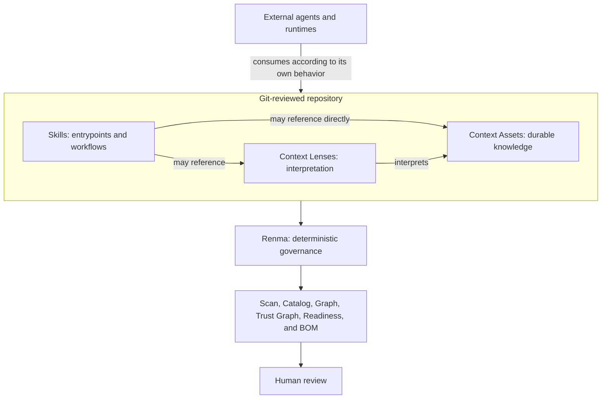

# Renma

[](https://npmjs.org/package/renma)
[](https://npmjs.org/package/renma)

Renma is a Git-native context repository and deterministic governance CLI for
LLM-facing knowledge. It keeps Skills, Context Lenses, Context Assets,
references, ownership, lifecycle, dependencies, security policy, and evidence
reviewable as maintainable software assets.

Agent-facing knowledge tends to spread across copied prompts, one-off Markdown,
and team-local instructions. Renma gives that material stable repository
identity, explicit relationships, deterministic validation, and CI-friendly
reports without becoming an agent runtime.

## Why A Context Repository?

A Context Repository is a Git-reviewed source of truth for reusable knowledge
that LLMs and agents can consume. Without that repository boundary, important
guidance is copied across prompts and Skills, buried in one-off instructions,
detached from an owner, difficult to review, and increasingly inconsistent as
teams and workflows evolve. It also becomes hard to tell maintained guidance
from obsolete or unofficial material.

Reusable context should be treated as a maintainable software asset: identified,
owned, versioned in Git, connected through explicit relationships, reviewed by
humans, validated deterministically, and usable across more than one Skill or
runtime. A Skill is an agent-facing entrypoint and workflow guide; the broader
Context Repository preserves knowledge that can outlive or serve multiple
Skills.

Renma operationalizes this model through deterministic repository governance.
It is not a prompt library, agent runtime, live Context selector, vector
database, agent memory, replacement for RAG, or generic Markdown linter. See the
[Context Repository notes](https://kazucocoa.blog/context-repository/) for the
broader product framing.

## Agent Skills And Renma

Use your platform's standard Skill authoring guidance for general Skill design,
then use Renma for repository-specific governance and validation.

Platform-native guidance owns the Skill's name, trigger description,
instructions, workflow, constraints, examples, and completion criteria. Renma
complements it with canonical metadata, Agent Skills compatibility, dependency
and graph validation, ownership and lifecycle governance, security policy
validation, workflow diagnostics, repository-wide scan, and readiness views.
Renma does not replace general Skill authoring guidance.

Renma is **Agent Skills-compatible, but not Agent Skills-defined**. Canonical Agent Skills entrypoints
are discovered under `skills/**/SKILL.md` and
`.agents/skills/**/SKILL.md`. Renma also discovers historical `skill.md` and
`*.skill.md` entrypoints for migration diagnostics, but discovery does not make those spellings Agent Skills-compatible.
The broader repository model also
includes independently governed Context Assets, Context Lenses, policies,
references, and evidence.

See [Agent Skills Compatibility and Migration](docs/agent-skills-compatibility.md)
for the exact format and one-way migration contract.

## Product Boundary

Renma discovers, parses, normalizes, and validates repository assets. It does
not:

- select a Skill or Context for a live task;
- assemble or inject prompts;
- execute Skills, agents, or tools;
- call an LLM for core analysis;
- collect runtime telemetry; or
- automatically rewrite Skill bodies or weaken policy.



## Primary Skill Workflows

For a new Skill, use platform-native guidance to design the workflow, then run
one generator for the target file:

```text
platform-native Skill authoring guidance
  -> renma scaffold skill
  -> review and complete the generated Skill
  -> renma scan . --fail-on high
  -> fix relevant diagnostics
  -> rerun validation
  -> human review
```

For an existing Skill:

```text
review with platform-native Skill authoring guidance
  -> renma scan . --fail-on high
  -> inspect relevant diagnostics and repository evidence
  -> use suggest-metadata only for metadata or migration work
  -> prepare and review intended changes
  -> renma scan . --fail-on high
  -> fix relevant diagnostics
  -> rerun validation
  -> human review
```

Do not run two independent generators against the same target file. If a
platform-native tool can generate Skills, ask it to review or refine the Renma
scaffold, or ask it to use `renma scaffold skill` as its starting point.
`suggest-metadata` never edits the target and does not improve the Skill body.

The [Authoring Guide](docs/authoring-guide.md) is the canonical walkthrough for
both workflows.

Renma 0.18.x uses focused workflows rather than a thin-router model. See the
[canonical quality profile](docs/quality-profile.md) for every fixed threshold,
unit, rationale, provenance, and diagnostic mapping. Quality thresholds are not
configurable through `renma.config.json` in this release.

## Install And Quick Start

Run Renma without installing it globally:

```bash
npx renma scan . --fail-on high
npx renma catalog . --format markdown
npx renma graph . --format markdown
npx renma readiness . --format markdown
```

Create and complete a new Skill:

```bash
npx renma scaffold skill skills/testing/spec-review/SKILL.md --owner qa-platform
# Review the file with your platform's standard Skill authoring guidance.
npx renma scan . --fail-on high
```

Review an existing Skill without editing it automatically. Start with `scan`;
use `suggest-metadata` only when the evidence identifies metadata retrofit or
migration work:

```bash
npx renma scan . --fail-on high
npx renma inspect skills/testing/spec-review/SKILL.md
# Conditional: metadata retrofit, explicit owner retrofit, or migration only.
npx renma suggest-metadata skills/testing/spec-review/SKILL.md
```

Inspect one file or an exact slice:

```text
renma inspect <file>
renma inspect <file> --lines L10-L42
```

When developing from this checkout:

```bash
npm install
npm run build
node dist/index.js scan . --fail-on high
```

## Command Guide

| Command | Main question |
| --- | --- |
| `scan` | What concrete problems should be fixed? |
| `catalog` | What assets and metadata exist? |
| `graph` | How are assets structurally connected? |
| `trust-graph` | What trust-relevant evidence is connected to each asset? |
| `readiness` | Is the repository broadly prepared for agent-facing use? |
| `bom` | What declared repository context manifest should be reviewed? |
| `ownership` | Where is ownership missing or concentrated? |
| `diff` | What deterministic evidence changed between Git refs? |
| `ci-report` | What should a CI or pull-request reviewer inspect? |
| `inspect` | What is the outline or exact line slice of one file? |
| `scaffold` | How can a new asset start from a deterministic structure? |
| `suggest-metadata` | What metadata retrofit or one-way Skill migration is safe to review? |
| `suggest-semantic-split` | How can a mixed-purpose asset be split reviewably? |

Run `renma --help` and `renma <command> --help` for current options, output
contracts, and next steps. The [User Manual](docs/user-manual.md) is the
operational command reference.

## Repository Shape

Renma supports independently owned knowledge rather than requiring every piece
of Context to live inside a Skill directory:

```text
skills/
  testing/
    spec-review/
      SKILL.md
contexts/
  testing/
    boundary-value-analysis.md
    negative-testing.md
lenses/
  testing/
    spec-review-boundary-values.md
```

This is an illustrative layout, not a required domain hierarchy. `contexts/`
is preferred and `context/` remains supported. Skill-local `references/`,
`assets/`, `scripts/`, `examples/`, and `profiles/` are valid support material.
Local support without a declared owner inherits effective ownership from its
nearest owning Skill; reports distinguish inherited ownership from declarations.
When deterministic evidence shows that knowledge is reusable beyond one Skill,
promote it to an owned Context Asset rather than moving it based on location
alone.

The relationship model supports both:

```text
Skill -> Context Lens -> Context Asset
Skill -> Context Asset
```

These are static governance relationships, not runtime Context selection.

## Canonical Skill Example

```yaml
---
name: spec-review
description: Review specifications for ambiguity and missing boundaries. Use when requirements need evidence-backed review before implementation.
metadata:
  renma.id: skill.testing.spec-review
  renma.title: Spec Review
  renma.owner: qa-platform
  renma.status: stable
  renma.tags: '["testing","spec-review"]'
  renma.requires-context: '["context.testing.boundary-value-analysis"]'
  renma.optional-context: '[]'
---
```

Agent Skills owns the standard identity and body. Renma governance and security
values use flat, string-valued `metadata.renma.*` entries; list values are JSON
array strings. Context Assets and other non-Skill assets retain their documented
top-level metadata syntax.

See the [Authoring Guide](docs/authoring-guide.md) for authoring responsibility
and the [compatibility guide](docs/agent-skills-compatibility.md) for the exact
canonical and migration rules.

## Examples And Documentation

- [Documentation index](docs/README.md)
- [User Manual](docs/user-manual.md)
- [Authoring Guide](docs/authoring-guide.md)
- [Agent Skills Compatibility and Migration](docs/agent-skills-compatibility.md)
- [Diagnostics Reference](docs/diagnostics.md)
- [Renma Quality Profile](docs/quality-profile.md)
- [Security Policy Guide](docs/security-policy.md)
- [Repository Context BOM contract](docs/repository-context-bom.md)
- [Architecture](architecture.md)
- [Product Design](design.md)
- [Current Roadmap](plan.md)
- [Deferred Skill-to-Skill Discovery Design](plan-discovery.md): unassigned
  exploratory route/index design, separate from implemented repository and
  support-resource discovery.
- [Interactive Placeholder Example](examples/interactive-placeholder): minimal
  hands-on clarify-before-act Skill interaction with a local tool.
- [Example Context Repository](examples/context-repo): richer repository-aware
  Skill, Context Lens, and Context Asset governance.
- [Context Lens Example](examples/context-lens): focused Context Lens governance.
- [GitHub Actions Example](examples/github-actions/renma-ci-report.yml): CI report
  integration.

The governing review loop remains:

```text
LLM proposes. Renma verifies. Human approves.
```
