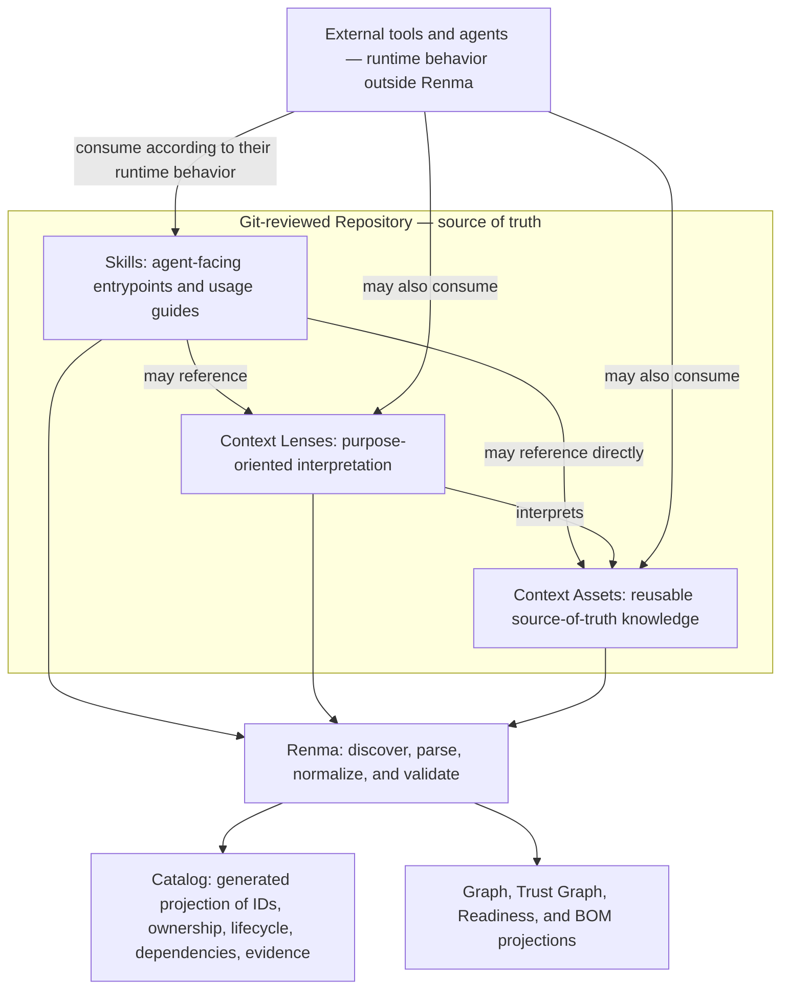

# Renma

[](https://npmjs.org/package/renma)
[](https://npmjs.org/package/renma)


Renma is a Git-native context repository and deterministic governance tool for
LLM-facing knowledge. It manages reusable Skills, Context Lenses, Context
Assets, references, ownership, lifecycle, dependencies, and evidence as
maintainable software assets.

Instead of letting critical knowledge get copied into prompts or buried in
one-off Markdown files, Renma keeps it named, owned, versioned, linked, checked
in CI, and reviewed through deterministic diagnostics. Agents, coding tools,
and other runtimes consume those repository assets according to their own
runtime behavior.

Renma now supports `scan`, `catalog`, `ownership`, `graph`, focused graph views, `trust-graph`, `readiness`, Repository Context BOM reports, repeated-context diagnostics, semantic diff, `ci-report`, `inspect`, `scaffold`, `suggest-metadata`, `suggest-semantic-split`, and security diagnostics.

Renma is especially useful when a repository contains agent-facing material such as:

- Codex, Claude, Cursor, or other agent skills
- `AGENTS.md` and repository instructions
- Shared product, domain, QA, platform, or tool guidance
- Team-owned context assets that should outlive a single prompt
- References and examples that agents should be able to cite or inspect

Renma is not an agent runtime, prompt builder, live context selector, workflow
engine, telemetry collector, vector database, or general Markdown linter.
Markdown is the storage format today; the product is the repository model and
the deterministic governance views around agent-consumable knowledge.

Use Renma when you need to answer repository-level questions such as:

- What agent-consumable knowledge exists in this repo?
- Which skills, context assets, examples, and tool notes are reusable?
- Which assets are unowned, stale, orphaned, incomplete, deprecated, or broken?
- Which product decisions, bug history, testing strategy, or platform guidance should be promoted from one-off prompt text into shared context?
- What changed in the agent-facing knowledge catalog during this pull request?

## What Is a Context Repository?

A Context Repository is a Git-reviewed source of truth for reusable knowledge that LLMs and agents can consume.

It is not a prompt library. It is not a vector database. It is not an agent memory.

It is a place where teams maintain context assets with ownership, lifecycle state, dependencies, references, and review history.

## Agent Skills Compatibility

Renma recognizes and validates [Agent Skills-compatible syntax](https://agentskills.io/specification)
as a familiar, portable authoring entrypoint. This lowers adoption cost without
making the Agent Skills format Renma's complete repository model: shared
Context Assets, Context Lenses, policies, references, ownership, lifecycle,
dependencies, and evidence remain independently governed repository assets.

In short, Renma is **Agent Skills-compatible, but not Agent Skills-defined**. A
repository may organize its broader knowledge assets around domains, products,
teams, or workflows without embedding them inside Skill directories. Canonical
Skill entrypoints in 0.16.0 are still discovered only under
`skills/**/SKILL.md` and `.agents/skills/**/SKILL.md`; arbitrary Skill roots are
not implemented. Renma is not an Agent Skills runtime, registry, or live
router. For the exact 0.16.0 syntax and migration boundary, see
[Agent Skills Compatibility and Migration](docs/agent-skills-compatibility.md).

## The Layer Model



Skills may point through a Context Lens or directly to a Context Asset; a Lens
is not required for every asset. Renma generates the Catalog and other
governance projections from repository source assets and declarations; the
Catalog describes those assets rather than creating them. Renma validates
static declarations but does not select a Skill, choose or inject task Context,
assemble a prompt, or execute the consumer's workflow.

## Primary Workflows

Renma supports two common user journeys:

1. [Create a new Skill with `scaffold`](docs/user-manual.md#user-story-create-a-new-skill-with-scaffold), add reusable Context, validate the repository, and review the result.
2. [Improve an existing Skill or context repository](docs/user-manual.md#user-story-improve-existing-skills-with-diagnostics) from deterministic diagnostics, optionally using a coding agent to propose a patch that a human reviews.

The [`examples/context-repo`](examples/context-repo) fixture demonstrates the
second journey as a repository-aware, statically navigable specification review
with an explicit Renma, agent, and human responsibility boundary.

## How Renma Relates to RAG and Agent Memory

Renma does not replace RAG, vector databases, or agent memory.

RAG helps systems retrieve relevant information. Renma helps teams organize reusable knowledge before it is retrieved. Agent memory grows from an agent's experience. A Context Repository grows from human-curated knowledge.

These layers can work together:

```text
People create knowledge -> Renma organizes it -> RAG retrieves it -> agents consume it -> agent memory records experience
```

## Why Renma?

As AI-agent repositories grow, expertise often gets duplicated across skills and prompts. Testing heuristics, domain risks, tool usage notes, product decisions, and team-specific contracts drift apart. Ownership becomes unclear. References break. Deprecated guidance remains reachable. New engineers and agents cannot tell which knowledge is authoritative.

Renma gives that material the same operational posture teams expect from source code:

- Reusable across skills and agents
- Owned by a team or maintainer
- Reviewable in pull requests
- Versioned in Git
- Composable through explicit references and dependencies
- Validated with deterministic checks
- Easy to inspect locally and in CI

For example, a testing organization can keep boundary value analysis, negative testing, regression risk, payment idempotency, duplicate charge prevention, refund edge cases, mobile offline behavior, mobile automation notes, and known team-specific risks as shared context assets instead of burying them inside individual skills.

## Repository Shape

Renma supports existing skill-local references, profiles, and examples. The preferred model is to give reusable knowledge first-class space under `contexts/`:

```text
skills/
  testing/
    test-case-generation/
      SKILL.md
    spec-review/
      SKILL.md
    regression-planning/
      SKILL.md

contexts/
  testing/
    boundary-value-analysis.md
    negative-testing.md
    regression-risk.md
  domain/
    payment/
      idempotency.md
      duplicate-charge.md
      refund-risk.md
  mobile/
    offline-behavior.md
    background-resume.md
  tools/
    appium/
      usage-guideline.md
      limitations.md
  teams/
    checkout/
      payment-api-contracts.md
      known-risk-patterns.md

lenses/
  testing/
    spec-review-boundary-values.md
```

This is an illustrative domain-oriented layout, not a required repository
schema. `contexts/` is preferred and `context/` is also scanned for
compatibility. Files under either root are cataloged as first-class `context`
assets, while `context_lens` assets live under `lenses/` or opt in from context
files with `type: context_lens`. Skill-local `references/` remain supported as
`reference` assets.

## What Renma Does Today

Renma is a minimal-dependency TypeScript CLI that scans local repositories and builds a deterministic catalog of agent-consumable assets.

It currently scans:

- AI-agent skills
- Repository instructions such as `AGENTS.md`
- Shared context Markdown under `context/` and `contexts/`
- Skill profiles, references, and examples
- Tool guidance and support files
- README-level repository documentation

It produces:

- File and line-level diagnostics
- Catalog reports with deterministic asset IDs
- Ownership coverage reports
- Dependency graph reports
- Trust Graph evidence reports
- Agent readiness reports
- Repository Context BOM manifests
- JSON output for CI and downstream tooling
- Text output designed to become actionable repair prompts for humans or agents

Findings are meant to explain what is wrong, why it matters, where the evidence is, what to preserve while fixing it, and how to verify the repair. Renma does not apply large semantic rewrites itself; it emits structured diagnostics so a human or coding agent can propose a reviewable patch and run Renma again.

JSON scan output also includes additive `diagnosticsV2` and `reviewBundles` fields for LLM-assisted repair and review tooling. These normalize findings and diagnostics into stable codes, locations, typed repair constraints, structured verification steps, concise `llmHint` guidance, and deterministic groups of related issues. See the [Diagnostics Reference](docs/diagnostics.md) for the schema and examples.

## Scan, Catalog, Graph, Readiness, And BOM

Renma exposes several deterministic views over the same repository evidence. They answer different questions.

| Command | Main question | Best for | Output shape |
| --- | --- | --- | --- |
| `scan` | What concrete problems were found? | Fixing diagnostics and CI checks | Finding list |
| `catalog` | What assets exist? | Reviewing IDs, owners, lifecycle metadata, hashes, tags, and declared dependencies | Asset inventory |
| `graph` | How are assets connected? | Inspecting dependencies and references | Asset relationship graph |
| `trust-graph` | What evidence helps reviewers decide whether assets are safe, owned, current, and usable enough? | Tracing owner, lifecycle, policy, dependency, reference, and diagnostic evidence per asset | Evidence graph |
| `readiness` | Is the repository broadly ready for agent-facing use? | Maintainer summary and CI reporting | Repository-level scorecard |
| `bom` | What declared repository context manifest should reviewers inspect? | Combining catalog, graph, readiness, diagnostics, lifecycle, hashes, and security posture evidence | Repository Context BOM |

`trust-graph` does not decide that an asset is trustworthy. It connects deterministic evidence that humans and downstream tools can review: owner, lifecycle status, dependency and reference relationships, selected security profiles, effective policy fingerprints, and diagnostics.

In short:

- `scan` lists problems.
- `catalog` lists what assets exist.
- `graph` shows structural relationships.
- `trust-graph` connects trust-relevant evidence.
- `readiness` summarizes repository health.
- `bom` combines declared asset inventory, dependencies, hashes, lifecycle, diagnostics, readiness, and security posture evidence into a reviewable repository manifest.

Useful command examples:

```bash
renma scan . --format json
renma catalog . --format json
renma graph . --format json
renma trust-graph . --format markdown
renma trust-graph . --format json
renma readiness . --format markdown
renma bom . --format json
renma bom . --format markdown
renma bom . --format json --omit-generated-at
```

### Repository Context BOM

`renma bom` prints a declared Repository Context BOM generated from existing Renma evidence. See the [Repository Context BOM contract](docs/repository-context-bom.md) for the authoritative v1 schema, snapshot, reproducibility, provenance, and future consumed-context evidence boundaries.

```bash
renma bom . --format json
renma bom . --format markdown
renma bom . --format json --omit-generated-at
```

The BOM is a repository manifest, not a runtime usage report. It combines the catalog asset inventory, content hashes, owners, lifecycle metadata, declared dependency graph evidence, diagnostics, readiness checks, security posture, and security policy inventory into one reviewable artifact.

Renma derives each BOM from one in-memory repository snapshot: configuration, discovered artifacts, parsed documents, catalog, graph evidence, diagnostics, readiness, and security summaries all come from the same collected state.

It does not describe what an LLM actually used, assemble prompts, select task-specific context, inject context into agents, import consumed-context evidence, or collect telemetry. JSON is the source of truth; Markdown is the compact pull-request review view.

By default, `generatedAt` records the actual generation time. Use `--omit-generated-at` when CI or review automation needs to avoid clock-based diffs. With the same checkout path, config path, repository contents, Renma version, and UTC evaluation date, repeated `--omit-generated-at` runs should produce byte-identical JSON. The option does not remove metadata freshness dates, suppress freshness diagnostics, normalize absolute `root` or `configPath`, hide file moves, or guarantee portable byte-for-byte output across runners.

### Repeated context diagnostics

`renma scan` reports deterministic repeated-context candidates across discovered skills, agents, profiles, references, examples, and shared context assets. These findings are evidence for consolidation, not automatic source-of-truth decisions:

```text
LLM proposes. Renma verifies. Human approves.
```

The MVP rule IDs are:

- `MAINT-REPEATED-SECTION` for repeated normalized section hashes.
- `MAINT-REPEATED-HEADING` for repeated non-generic headings.
- `MAINT-REPEATED-CODE-BLOCK` for repeated substantial code fences.
- `MAINT-REPEATED-LINK` for repeated repository context link targets.
- `MAINT-REPEATED-CONTEXT-PATTERN` for repeated token shingles.

Renma normalizes whitespace and only reports cross-file candidates with stable parser evidence. Remediation text asks maintainers to preserve ownership boundaries, procedural detail, and human approval while consolidating owned knowledge.

LLM-authored skills and context assets often converge on similar wording, structure, and safety boilerplate. That uniformity can make deterministic checks more useful, not less: Renma can catch repeated sections, duplicated guidance, stale ownership, risky commands, and policy drift without needing to call an LLM. The findings are evidence for review, not automatic rewrite decisions.

## How Renma differs from adjacent tools

Prompt-management and eval tools focus on prompts, traces, and model outputs.

Renma focuses one layer lower: the reusable context assets and skills that prompts, agents, and tools depend on.

Knowledge-management tools help humans organize notes and documents.

Renma focuses on machine-consumable repository knowledge that can be owned, referenced, validated, and reused in AI workflows.

Software catalogs track services, libraries, ownership, and lifecycle.

Renma applies a similar catalog model to context assets.

## First-Time Use

Try Renma against the current repository:

```bash
npx renma scan .
npx renma catalog . --format json
npx renma graph . --format mermaid
npx renma trust-graph . --format json
npx renma readiness .
npx renma diff . --from main --to HEAD --format markdown
```

The first command does not require you to design a knowledge architecture up front. It scans the repository, builds a local catalog, and reports obvious health issues such as broken links, unclear ownership, risky instructions, weak structure, and context that may be hard for agents to trust.

Command-specific help is designed for both humans and coding agents: start with `renma --help`, then run `renma <command> --help` before choosing a workflow. For guided workflows, see the User Manual sections on [LLM-assisted skill maintenance](docs/user-manual.md#llm-assisted-skill-maintenance), [creating a new skill with scaffold](docs/user-manual.md#user-story-create-a-new-skill-with-scaffold), and [improving existing skills with diagnostics](docs/user-manual.md#user-story-improve-existing-skills-with-diagnostics).

If you are developing Renma from source:

```bash
npm install
npm run build
node dist/index.js scan .
```

Then inspect the catalog and graph:

```bash
node dist/index.js catalog . --format json
node dist/index.js graph . --format mermaid
node dist/index.js trust-graph . --format json
node dist/index.js readiness .
node dist/index.js diff . --from main --to HEAD --format markdown
```

Author a skill, context asset, or context lens with `scaffold`:

```bash
npx renma scaffold skill skills/testing/spec-review/SKILL.md --id skill.testing.spec-review --title "Spec Review" --owner qa-platform --tags testing,spec-review
npx renma scaffold context contexts/testing/boundary-value-analysis.md --id context.testing.boundary-value-analysis --title "Boundary Value Analysis" --owner qa-platform --tags testing
npx renma scaffold context_lens lenses/testing/spec-review-boundary-values.md --id lens.testing.spec-review.boundary-values --title "Spec Review Boundary Values Lens" --owner qa-platform --tags testing,spec-review
```

The Skill scaffold writes a canonical Agent Skills `SKILL.md` directly, with
Renma governance values under flat, string-valued `metadata.renma.*` keys.
Context and context-lens scaffolds retain their existing top-level metadata.

Inspect a focused graph for the new skill:

```bash
npx renma graph . --focus skill.testing.spec-review --format mermaid
npx renma inspect skills/testing/spec-review/SKILL.md
```

Focused graph views are inspection tools; they do not choose, inject, or load runtime context for an agent.

`scaffold --format prompt` emits a Codex/Claude-ready authoring prompt for `<asset-id-or-path>` without writing files. `scaffold --format json` emits structured scaffold data.

Semantic diff compares deterministic catalog, graph, readiness, and finding
snapshots across Git refs. It does not interpret arbitrary prose semantics,
assemble prompts, choose context, call an LLM, repair files, or check out or
mutate the working tree.

A practical first pass is:

1. Run `catalog` to see which skills, context assets, references, examples, and support files Renma discovered.
2. Run `scan` to find broken links, weak structure, risky instructions, missing lifecycle metadata, and other repairable issues.
3. Run `graph` to inspect dependencies and discover orphaned or overly coupled knowledge.
4. Run `trust-graph` to inspect deterministic owner, lifecycle, policy, dependency, and diagnostic evidence without introducing a trust score.
5. Run `readiness` to summarize whether the repository is healthy enough for agent use.
6. Run `ownership` to find assets without clear ownership.
7. Run `suggest-metadata` on existing assets that need a safe metadata retrofit prompt for a reviewed patch.

Renma does not require an LLM for this loop. Its core analysis is deterministic so the same repository state produces stable evidence in local development, CI, and code review.

## Example repository

See [`examples/context-repo`](examples/context-repo) for a repository-aware
Skill and shared-context fixture you can inspect with Renma.

See [`examples/context-lens`](examples/context-lens) for a Context Lens governance example with valid lenses, readiness output, inspect output, and expected diagnostics for an invalid lens.

## CLI Commands

```bash
renma scan <path>
renma bom <path>
renma catalog <path>
renma ownership <path>
renma graph <path>
renma trust-graph <path>
renma readiness <path>
renma diff <path> --from <ref> --to <ref>
renma ci-report <path> --from <ref> --to <ref>
renma inspect <file>
renma inspect <file> --lines L10-L42
renma scaffold <skill|context|context_lens> <path>
renma suggest-metadata <file>
renma suggest-semantic-split <file>
```

Common examples:

```bash
renma scan .
renma scan . --format json
renma scan . --fail-on high
renma catalog . --format json
renma ownership . --include-owned
renma ownership . --owner qa-platform
renma graph . --format json
renma graph . --format mermaid
renma graph . --focus skill.testing.spec-review --view full
renma trust-graph . --format json
renma trust-graph . --format markdown
renma readiness . --format markdown
renma diff . --from main --to HEAD --format markdown
renma ci-report . --from main --to HEAD --format markdown
renma inspect contexts/testing/boundary-value-analysis.md
renma suggest-metadata skills/testing/spec-review/SKILL.md --format prompt
renma suggest-metadata skills/testing/spec-review/SKILL.md --owner qa-platform --format json
```

Use JSON output when Renma is part of CI or another tool. Use markdown output for PR-review artifacts. Use text output when a person or coding agent needs a concise repair list.

`renma trust-graph . --format markdown` is useful for human review. `renma trust-graph . --format json` is the source of truth for downstream Trust Graph consumers, and `renma scan . --format json` includes the same data under `trustGraph`.

Trust Graph helps reviewers inspect owner evidence, lifecycle status evidence, dependency and reference evidence, selected security profiles, effective policy fingerprints, and diagnostics in one deterministic layer. Common review questions include finding assets without owners or lifecycle status, identifying assets that share the same effective policy fingerprint, and connecting diagnostics back to asset evidence.

`ci-report` exit behavior:

- PASS/WARN: exit 0
- FAIL: exit 1
- command, runtime, or config error: exit 2

## What Gets Scanned

Canonical Agent Skills entrypoints use the exact `SKILL.md` filename:

```text
skills/**/SKILL.md
.agents/skills/**/SKILL.md
```

Renma 0.16.0 requires Agent Skills format for operational Skills. Renma
governance and security values use flat, string-valued `metadata.renma.*`
entries; list values are JSON-array strings and booleans are the exact strings
`"true"` or `"false"`. Pre-0.16 top-level Skill metadata is discovered only as
migration input for `suggest-metadata`; catalog, ownership, graph, readiness,
BOM, Trust Graph, lifecycle, and security consumers do not use it. Contexts and
other non-Skill assets keep their existing top-level metadata syntax. See
[Agent Skills Compatibility and Migration](docs/agent-skills-compatibility.md)
for the normative boundary.

Renma also discovers these historical spellings so `scan` can report migration
diagnostics; they are not Agent Skills-compatible entrypoints:

```text
skills/**/skill.md
skills/**/*.skill.md
.agents/skills/**/skill.md
.agents/skills/**/*.skill.md
```

For migration, `skills/demo/skill.md` targets `skills/demo/SKILL.md`, while
`skills/testing/spec-review.skill.md` targets
`skills/testing/spec-review/SKILL.md`. `suggest-metadata` reports these path
changes explicitly and does not edit files.

Other default scan inputs include:

```text
.agents/**/*.md
AGENTS.md
README.md
context/**/*.md
contexts/**/*.md
lenses/**/*.md
skills/**/profiles/**/*.md
skills/**/references/**/*.md
skills/**/examples/**/*.md
skills/**/scripts/**/*
tools/**/*
```

Skill-like files outside `skills/**` or `.agents/skills/**` are not treated as
Renma skill assets by default. Renma may emit an informational layout diagnostic
to suggest moving the file if it is intended to be a Renma skill.

Under explicit skill roots, the path segments `examples`, `profiles`,
`references`, and `scripts` are reserved for skill-local support files. These
are valid support paths:

- `skills/demo/examples/happy-path.md`
- `skills/demo/references/spec.md`
- `skills/demo/scripts/helper.sh`
- `skills/demo/profiles/local.md`

The same reserved names apply under `.agents/skills/**`.

Avoid using reserved support directory names as skill names. For example,
`skills/examples/SKILL.md`, `skills/references/SKILL.md`,
`skills/scripts/SKILL.md`, and `skills/profiles/SKILL.md` are not treated as
skill entrypoints by default. Rename the skill directory, such as
`skills/example-review/SKILL.md`, if the file is intended to define a Renma
skill.

Renma can still discover legacy skill-local support files for compatibility, but canonical reusable knowledge belongs in `contexts/`, experimental interpretation layers belong in `lenses/`, and helper implementations belong in `tools/`. Shared knowledge that is reused across skills should usually move into `contexts/` so it can have its own owner, lifecycle, dependencies, and review history.

## Configuration

Add `renma.config.json` at the repository root to tune discovery and CI behavior:

```json
{
  "fail_on": "high",
  "format": "json",
  "globs": [
    "skills/**/SKILL.md",
    ".agents/skills/**/SKILL.md",
    "AGENTS.md",
    "contexts/**/*.md"
  ],
  "exclude": [
    "node_modules",
    "dist",
    ".git"
  ],
  "suppressions": [
    {
      "id": "SEC-ENV-COPY",
      "paths": ["skills/testing/**"],
      "reason": "This skill intentionally documents env passthrough test cases.",
      "expires": "2026-09-30"
    },
    {
      "id": "LAYOUT-SKILL-NOT-THIN",
      "paths": ["skills/legacy/**"],
      "reason": "Legacy skill kept for compatibility with existing workflows.",
      "expires": "never"
    }
  ],
  "max_file_size_bytes": 524288,
  "max_depth": 16,
  "concurrency": 16,
  "layout": {
    "workflow_aliases": {}
  }
}
```

Use `exclude` only for paths Renma should not scan. Use `suppressions` when Renma should still scan a file, detect matching findings internally, then omit those findings from normal reports and failure thresholds. Suppressions apply only when both the finding `id` and at least one `paths` entry match, so keep path patterns narrow.

Each suppression requires a rule `id`, one or more path patterns, and an audit `reason` that stays in config for review. `expires` is optional, but audited suppressions should usually include either a date in `YYYY-MM-DD` for temporary workarounds or `"never"` for an intentionally permanent exception. Date-based expirations reactivate matching findings after the date passes. Suppression paths use repository-relative POSIX-style paths, exact matches, directory-prefix matches for non-glob patterns, and a small glob subset: `*` within a path segment and `**` across directories.

## Asset Metadata

Contexts and other non-Skill assets declare lightweight metadata in frontmatter
using the existing top-level syntax. Skills use canonical Agent Skills
frontmatter and `metadata.renma.*` as described above.

```markdown
---
id: context.testing.boundary-value-analysis
owner: qa-platform
status: stable
last_reviewed_at: 2026-06-28
review_cycle: P90D
expires_at: 2026-12-31
requires_context:
  - context.testing.negative-testing
---

# Boundary Value Analysis
```

Useful metadata semantics include the following. The spellings shown here are
the top-level non-Skill form; canonical Skills use the corresponding
`metadata.renma.*` keys.

- `id`: Stable catalog ID
- `title`: Human-readable asset title
- `owner`: Recommended team, person, or group responsible for the asset
- `status`: Lifecycle state such as `experimental`, `stable`, `deprecated`, or `archived`
- `version`: Asset version when the repository uses explicit versioning
- `last_reviewed_at`: ISO date for the last human review, such as `2026-06-28`
- `review_cycle`: ISO 8601 day duration for expected review cadence, such as `P90D`
- `expires_at`: ISO date when the asset should be treated as expired
- `tags`: Search and grouping labels
- `requires_context`: Context assets this asset normally depends on
- `optional_context`: Context assets useful only in some cases
- `conflicts`: Context assets that should not be applied together
- `superseded_by`: Replacement asset when this asset is deprecated

Renma can infer some information from paths and headings, but explicit metadata makes ownership and dependency reports much more valuable.

### Ownership policy

Renma treats `owner` as governance metadata. Declaring an owner is recommended because it makes context assets easier to review, maintain, and share across teams.

However, owner metadata is not globally required yet. Assets without an owner are accepted and reported as unowned in the ownership coverage report.

Renma does not infer owners automatically. If an asset is unowned, choose an owner through human review or team policy.

To retrofit metadata onto an existing skill or context asset without overwriting its body, ask Renma for a deterministic prompt or JSON payload:

```bash
renma scan .
renma ownership .
renma suggest-metadata skills/testing/spec-review/SKILL.md --format prompt
```

`suggest-metadata` is not an auto-fixer. It tells a human or coding agent to inspect the existing asset, preserve existing frontmatter and Markdown body content, add only compact missing metadata that is clearly supported, and rerun `renma scan .` and `renma ownership .`. It does not infer owners. If you pass `--owner qa-platform`, the output may include that owner because it was explicitly provided; otherwise missing owner remains allowed and is reported as unowned by `ownership`. If an existing asset already declares an owner, `suggest-metadata` preserves it; a different `--owner` value is treated as a human-review ownership change, not an automatic metadata suggestion.

For non-Skill assets, YAML-style block lists are supported for selected
metadata fields, which keeps authored metadata explicit and reviewable.
Pre-0.16 Skill fields may use this shape as migration input, but are not
operational in Renma 0.16.0:

```yaml
---
id: context.testing.boundary-value-analysis-v2
title: Boundary Value Analysis
owner: qa-platform
status: stable
version: 1.0.0
last_reviewed_at: 2026-06-28
review_cycle: P180D
expires_at: 2026-12-31
tags:
  - testing
  - spec-review
when_to_use:
  - Designing tests around numeric, date, quantity, or limit boundaries
when_not_to_use:
  - For exploratory testing notes that do not depend on boundaries
requires_context:
  - context.testing.negative-testing
optional_context:
  - context.domain.payment.duplicate-charge
conflicts:
  - context.testing.boundary-value-analysis-v1
superseded_by:
  - context.testing.boundary-value-analysis-v3
---
```

Supported YAML-style block-list fields in that syntax are `tags`,
`when_to_use`, `when_not_to_use`, `requires_context`, `optional_context`,
`conflicts`, and `superseded_by`. Canonical Skills instead encode the
corresponding `renma.*` values as JSON-array strings. Renma does not infer
missing dependencies with an LLM during `scan`.

Catalog and scan diagnostics preserve field-level evidence for metadata. For
block-list dependency fields such as `requires_context` and `optional_context`,
findings point to the specific list item line that produced the edge or
diagnostic.

## CI Example

For PR review artifacts, see [`examples/github-actions/renma-ci-report.yml`](examples/github-actions/renma-ci-report.yml).

```yaml
name: renma

on:
  pull_request:
  push:
    branches:
      - main

jobs:
  renma:
    runs-on: ubuntu-latest
    steps:
      - uses: actions/checkout@v4
      - uses: actions/setup-node@v4
        with:
          node-version: 22
      - run: npx renma scan . --fail-on high --format json
```

## Design Philosophy

Renma has an opinionated design.

It is built around the idea that reusable LLM context should be treated like a software asset: owned, versioned, referenced, reviewed, and checked for readiness.

This means Renma favors structured, Git-friendly context repositories over ad hoc prompt snippets or untracked notes.

## Design Boundaries

Renma intentionally stays below the agent runtime layer.

Renma does:

- Catalog LLM-consumable repository assets
- Validate links, structure, lifecycle state, safety signals, and ownership
- Emit deterministic reports with file and line evidence
- Help humans and agents repair knowledge repositories through reviewable patches

Renma does not:

- Choose task-specific context for a live agent session
- Assemble prompts
- Inject context into model calls
- Execute agent workflows
- Act as a provider gateway
- Own runtime telemetry collection
- Replace product, QA, platform, or documentation ownership

This boundary keeps Renma useful as repository infrastructure. Agent tools can consume its reports, but the catalog remains grounded in Git, code review, and deterministic checks.

## Security Diagnostics

Security diagnostics v2 extends the deterministic v1 command checks with
LLM-facing policy and data-handling diagnostics. Renma recognizes small policy
metadata such as `allowed_data`, `network_allowed`, `external_upload_allowed`,
`secrets_allowed`, and `requires_human_approval`; reports contradictory or
violated policy; flags sensitive file and secret-material instructions; and
detects external uploads, bulk sharing, cloud upload, overbroad context
collection, and instructions that disable or discourage redaction.

Security diagnostics v3 also enforces approved destination allowlists such as
`approved_network_destinations` for URL and domain-like network instructions.

Security diagnostics v4 can also read repository-wide security policy from
`renma.config.json`:

```json
{
  "security": {
    "approvedDomains": ["github.com", "registry.npmjs.org"],
    "approvedUploadDomains": ["internal-artifacts.example.com"],
    "disallowedCommands": ["gh gist create", "pastebin", "webhook.site", "nc"]
  }
}
```

Global `approvedDomains` combine with artifact-local
`approved_network_destinations`. Upload destinations must be approved separately
with `approvedUploadDomains`.

Security profiles can be defined under `security.profiles` and selected by artifacts with `security_profile` or `securityProfile`. Artifact-local explicit denials such as `network_allowed: false` and `external_upload_allowed: false` remain stricter than inherited profile or repository allowances.

```json
{
  "security": {
    "profiles": {
      "appium-local-diagnostics": {
        "networkAllowed": true,
        "externalUploadAllowed": false,
        "secretsAllowed": false,
        "humanApprovalRequired": true,
        "allowedData": ["repo-local-files", "sanitized-ci-diagnostics"],
        "forbiddenInputs": ["secrets", "credentials"],
        "approvedDomains": ["github.com"],
        "approvedUploadDomains": [],
        "disallowedCommands": ["gh gist create"]
      }
    }
  }
}
```

Renma reports deterministic safety findings for agent-facing operational instructions, such as unpinned remote scripts, unsafe privileged commands, predictable temporary paths, and credential-like command arguments.

These findings are guardrails for review. They do not replace secret scanning, SAST, dependency scanning, or human security review.

Renma summarizes security posture in Readiness and CI reports, and exposes
Trust Graph evidence for effective policy, security profile resolution,
approved destinations, forbidden inputs, human approval requirements, and
high-risk findings.

Trust Graph interprets existing catalog, graph, scan, and security evidence as deterministic repository evidence. It is not a runtime system, not enforcement, not context selection or prompt assembly, not telemetry collection, not an LLM call, and not a subjective trust score.

Repository Context BOM is a declared repository manifest of assets, hashes, owners, lifecycle states, dependencies, security posture, diagnostics, and readiness evidence. It does not claim what an LLM actually used at runtime. The v1 contract deliberately keeps Git revision identity in the surrounding CI/PR artifact context and keeps any future consumed-context evidence separate from the declared BOM meaning. See the [Repository Context BOM contract](docs/repository-context-bom.md).

## Design Notes

Renma is part of a broader idea: treating reusable LLM context as software-managed knowledge.

- [Beyond Prompt Engineering: Why We Need Context Repositories](https://kazucocoa.blog/2026/06/26/beyond-prompt-engineering-why-we-need-context-repositories/)
- [Introducing Renma: An Opinionated Context Repository for LLMs](https://kazucocoa.blog/2026/06/29/introducing-renma-an-opinionated-context-repository-for-llms/)
- [Where Does a Context Repository Fit in the AI Stack?](https://kazucocoa.blog/2026/07/01/where-does-a-context-repository-fit-in-the-ai-stack/)
- Context Engineering Is Software Engineering (planned)

([Context Repository Series](https://kazucocoa.blog/context-repository/))

## Development

```bash
npm install
npm run build
npm test
```

Run the local CLI after building:

```bash
node dist/index.js scan .
```

## Documentation

- [Agent Skills Compatibility and Migration](docs/agent-skills-compatibility.md)
- [User Manual](docs/user-manual.md)
- [Authoring Guide](docs/authoring-guide.md)
- [Security Policy Guide](docs/security-policy.md)
- [Diagnostics Reference](docs/diagnostics.md)

## Related Docs

- [architecture.md](architecture.md) for the deeper system model
- [design.md](design.md) for product and rule-design notes
- [plan.md](plan.md) for current implementation direction
