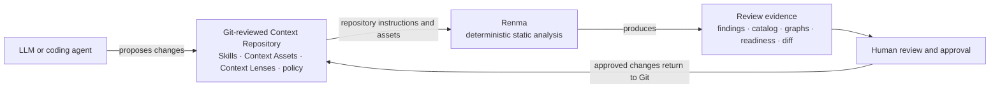

# Renma - 練磨 in Japanese

[](https://npmjs.org/package/renma)
[](https://npmjs.org/package/renma)

Renma is a Git-native Context Repository and deterministic governance CLI for
agent-facing knowledge. It keeps Skills, Context Assets, Context Lenses,
ownership, lifecycle, declared relationships, security policy, and review
evidence maintainable in Git without becoming an agent runtime.

### You May Need Renma When

- Guidance is copied across Skills, prompts, or repository instructions.
- Nobody can identify the authoritative version or owner.
- Skills or Context Assets reference files that moved or became inactive.
- Reviewers cannot see which agent-facing knowledge or relationships changed.
- Repository policy and operational instructions have drifted apart.

## Why A Context Repository?

A Context Repository is a Git-reviewed source of truth for reusable knowledge
that LLMs and agents can consume. It gives independently maintained knowledge a
stable identity, owner, lifecycle, and explicit relationships instead of
leaving it copied across prompts or buried in one workflow.

Cross-Skill reuse is one reason to create a Context Asset. Independent
ownership, lifecycle, maintenance, or source-of-truth responsibility is also
sufficient. Knowledge that exists only to explain one Skill remains in that
Skill or justified Skill-local support.

Renma operationalizes this model through deterministic repository evidence. It
is not a prompt library, vector database, memory service, RAG replacement, or
generic Markdown linter. See the
[Context Repository notes](https://kazucocoa.blog/context-repository/) for the
broader framing.

## Product Boundary

Renma discovers, parses, normalizes, validates, compares, and reports
repository assets. It does not:

- call an LLM for core analysis;
- select a live Skill, Context Asset, or Context Lens;
- assemble prompts or inject Context;
- execute Skills, agents, workflows, or operational commands found in repository
  instructions;
- collect runtime telemetry;
- perform general-purpose SAST or arbitrary language data-flow analysis;
- rewrite repository semantics or weaken policy automatically; or
- provide hosted gateways or dashboards.

Security analysis is bounded to supported forms in agent-facing instructions
and metadata. Unsupported or ambiguous syntax follows conservative fallback.
Use language-specific SAST, dependency, and secret-scanning tools for executable
code. A clean Renma scan is repository evidence, not a security proof.

The review boundary is:

```text
LLM proposes. Renma verifies. Human approves.
```


```mermaid
flowchart LR
  Proposer["LLM or coding agent"] -->|proposes changes| Repository["Git-reviewed Context Repository<br/>Skills · Context Assets · Context Lenses · policy"]
  Repository -->|repository instructions and assets| Renma["Renma<br/>deterministic static analysis"]
  Renma -->|produces| Evidence["Review evidence<br/>findings · catalog · graphs · readiness · diff"]
  Evidence --> Reviewer["Human review and approval"]
  Reviewer -->|approved changes return to Git| Repository
```

## Agent Skills And Renma

Canonical Agent Skills entrypoints are:

- `skills/**/SKILL.md`
- `.agents/skills/**/SKILL.md`

Renma also discovers historical `skill.md` and `*.skill.md` spellings under
those roots for migration diagnostics. Discovery does not make those spellings
Agent Skills-compatible. Canonical Skills use specification-valid Agent Skills
frontmatter plus flat, string-valued `metadata.renma.*` governance and security
fields. See
[Agent Skills Compatibility and Migration](docs/agent-skills-compatibility.md)
for the exact current and compatibility forms.

Run `renma guide skill` before generating a new Skill. It prints a deterministic
clarification and creation-gate protocol for the consuming LLM. Renma remains
non-interactive: the LLM investigates and proposes, Renma verifies the resulting
repository, and a human approves meaningful decisions.

After the gate, platform-native Skill authoring guidance may refine semantics
inside the agreed Renma asset graph. It is not the authority for Renma metadata,
Context placement, source-of-truth boundaries, or whether support files should
exist.

The [Authoring Guide](docs/authoring-guide.md) owns the complete new-Skill and
existing-Skill workflows.

## Install And Quick Start

Run the published CLI without a global installation:

```bash
npx renma scan . --fail-on high
npx renma catalog . --format markdown
npx renma graph . --format markdown
npx renma readiness . --format markdown
```

`renma init` initializes repository-level Renma configuration. It does not
create Skills or Context Assets. Existing repositories can use built-in
defaults without running `renma init`; use initialization only when the
repository wants to record explicit adoption:

```bash
npx renma init .
```

`renma scaffold` creates one explicitly requested Skill, Context Asset, or
Context Lens after its responsibility and boundary have been decided. It does
not initialize repository configuration.

### Create a Skill interactively

You can start with this request to a coding agent:

```text
I want to create a Skill with `renma guide skill`.
```

The normal sequence is:

```bash
npx renma guide skill
# The consuming LLM clarifies blocking human decisions and passes the gate.
npx renma scaffold skill skills/testing/spec-review/SKILL.md --owner qa-platform
# Use platform-native Skill authoring guidance within the agreed boundaries.
npx renma scan . --fail-on high
npx renma catalog . --format markdown
npx renma graph . --format markdown
```

For an existing Skill:

```bash
npx renma scan . --fail-on high
npx renma inspect skills/testing/spec-review/SKILL.md
# Use suggest-metadata only for a supported retrofit or one-way migration.
npx renma suggest-metadata skills/testing/spec-review/SKILL.md
npx renma scan . --fail-on high
```

Use `renma guide skill` only when the work intentionally reconsiders Skill and
Context responsibilities, file or resource boundaries, sources of truth,
scripts, or the asset graph. Ordinary maintenance starts with `scan`.
`suggest-metadata` and `suggest-semantic-split` print reviewable guidance; they
do not edit the target.

Inspect one file or an exact one-based inclusive line range:

```text
renma inspect <file>
renma inspect <file> --lines L10-L42
```

When developing from this checkout:

```bash
npm install
npm run build
node dist/index.js scan . --fail-on high
```

## Command Overview

| Command | Main question |
| --- | --- |
| `init` | How can this repository record explicit Renma adoption? |
| `scan` | What concrete problems should be fixed? |
| `catalog` | What assets and metadata exist? |
| `graph` | How are assets structurally connected? |
| `skill-index` | Where can static Skill Discovery begin and continue? |
| `trust-graph` | What trust-relevant evidence is connected to each asset? |
| `readiness` | Is the repository broadly prepared for agent-facing use? |
| `bom` | What declared Repository Context BOM should be reviewed? |
| `ownership` | Where is ownership missing or concentrated? |
| `diff` | What deterministic repository evidence changed between refs? |
| `ci-report` | What should a CI or pull-request reviewer inspect? |
| `inspect` | What is the outline or exact line slice of one file? |
| `guide` | What authoring contract should precede a new Skill? |
| `scaffold` | How can one agreed asset start from a deterministic structure? |
| `suggest-metadata` | What retrofit or one-way Skill migration is safe to review? |
| `suggest-semantic-split` | How can a mixed-purpose asset be split reviewably? |

Run `renma --help` and `renma <command> --help` for the authoritative usage,
options, formats, examples, and exit behavior. The
[User Manual](docs/user-manual.md) owns the operational command reference.

## Repository Conventions

An illustrative repository layout is:

```text
skills/
  testing/
    spec-review/
      SKILL.md
      references/
      scripts/
contexts/
  testing/
    boundary-value-analysis.md
lenses/
  testing/
    spec-review-boundary-values.md
renma.config.json
```

`contexts/**` is the canonical independently governed Context Asset root;
`context/**` remains accepted for compatibility. Canonical Skill-local support
directories are `references/`, `profiles/`, `examples/`, `scripts/`, and
`assets/`. Their placement supplies only a parent candidate. Cataloged local
support may inherit effective ownership only when repository evidence resolves
exactly one owning Skill. Of those support kinds, only `script` and `asset`
artifacts inherit the owning Skill's effective security policy by placement.
Missing or ambiguous parents fail closed.

Top-level `tools/**` is repository implementation, not Context. Top-level
`references/**` is not a Context root, and `skills/**/tools/**` is not canonical
Skill-local support.

Declared composition, declared impact, Skill Discovery, the Repository Context
BOM, and the Trust Graph are static repository relationships and evidence.
They do not describe runtime selection, actual consumption, prompt assembly, or
a trust score.

## Documentation

- [Documentation index](docs/README.md)
- [User Manual](docs/user-manual.md)
- [Authoring Guide](docs/authoring-guide.md)
- [Diagnostics Reference](docs/diagnostics.md)
- [Security Policy Guide](docs/security-policy.md)
- [Agent Skills Compatibility and Migration](docs/agent-skills-compatibility.md)
- [Declared Composition](docs/declared-composition.md)
- [Declared Impact](docs/declared-impact.md)
- [Skill Discovery](docs/skill-discovery.md)
- [Repository Context BOM v2](docs/repository-context-bom.md)
- [Trust Graph v2](docs/trust-graph.md)
- [Public Architecture](architecture.md)
- [Internal Architecture](docs/internal-architecture.md)
- [Product Design](design.md)
- [Changelog](CHANGELOG.md)
- [Current Roadmap](https://github.com/KazuCocoa/renma/blob/main/plan.md)
- [Examples](https://github.com/KazuCocoa/renma/tree/main/examples)

```text
LLM proposes. Renma verifies. Human approves.
```
