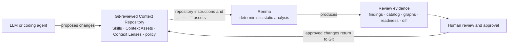

<p align="center">
  
</p>

# Renma - 練磨 in Japanese

[](https://npmjs.org/package/renma)
[](https://npmjs.org/package/renma)

Renma is a Git-native Context Repository and deterministic governance CLI for
agent-facing knowledge. It keeps Skills, Context Assets, Context Lenses,
ownership, lifecycle, declared relationships, security policy, and review
evidence maintainable in Git without becoming an agent runtime.

### You May Need Renma When

- Guidance is copied across Skills, prompts, or repository instructions.
- Nobody can identify the authoritative version or owner.
- Skills or Context Assets reference files that moved or became inactive.
- Reviewers cannot see which agent-facing knowledge or relationships changed.
- Repository policy and operational instructions have drifted apart.

## Why A Context Repository?

A Context Repository provides Git-reviewed governance for reusable knowledge
that LLMs and agents can consume. A Context Asset is a Git-reviewed governance
entry point for independently maintained knowledge and its authoritative
sources. It gives that knowledge a stable identity, owner, lifecycle, and
explicit relationships instead of leaving it copied across prompts or buried
in one workflow.

The authoritative content may live directly in the Context Repository or in an
external governed system, including another Git repository, a documentation or
specification system, or Confluence. Renma does not require duplicating
external source material into `contexts/`. A reviewed source reference is not
proof that the source was consulted, validation of its contents, permission to
access it, or a runtime dependency for Renma.

Cross-Skill reuse is one reason to create a Context Asset. Independent
ownership, lifecycle, maintenance, or source-of-truth responsibility is also
sufficient. Knowledge that exists only to explain one Skill remains in that
Skill or justified Skill-local support.

Renma operationalizes this model through deterministic repository evidence. It
is not a prompt library, vector database, memory service, RAG replacement, or
generic Markdown linter. See the
[Context Repository notes](https://kazucocoa.blog/context-repository/) for the
broader framing.

## What Renma Checks

Renma reviews discovered agent-facing repository assets and produces
deterministic evidence for humans, CI, and coding agents. `renma scan` is the
normal starting point; focused commands expose the related inventory, graph,
ownership, readiness, and change evidence.

| Area                             | Examples of what Renma checks or reports                                                                                                                                                                                                                                                                                                                           |
| -------------------------------- | ------------------------------------------------------------------------------------------------------------------------------------------------------------------------------------------------------------------------------------------------------------------------------------------------------------------------------------------------------------------ |
| Agent Skills and layout          | Canonical entrypoints and metadata shapes, historical paths, reserved-directory boundaries, and repository classification.                                                                                                                                                                                                                                         |
| Governance                       | Stable identity, declared and inherited ownership, lifecycle and freshness, required metadata, and security-profile resolution.                                                                                                                                                                                                                                    |
| Relationships and support        | Missing, inactive, conflicting, or cyclic dependencies; broken references; unreachable Skill support; and inspection blockers such as symlinks, unreadable files, size limits, or depth limits.                                                                                                                                                                    |
| Authoring quality                | Selection boundaries, required inputs, preflight and verification guidance, scaffold residue, machine-local paths, token budgets, and possible mixed responsibilities.                                                                                                                                                                                             |
| Security policy and instructions | Policy alignment for data, network and upload destinations, secrets, forbidden inputs, and human approval; sensitive-data exposure; destructive or privileged commands; risky error suppression; floating dependency or remote-script execution; hidden or untrusted instructions; hierarchy or safeguard bypass; and suspicious Unicode or frontmatter integrity. |
| Review coverage                  | Which expected files were inspected, which supported security-analysis layers ran, and which formats or surfaces remained unsupported, blocked, or not analyzable.                                                                                                                                                                                                 |

Security checks apply to documented, supported forms in agent-facing
instructions and metadata. They do not perform general code SAST, CVE lookup,
dependency-content validation, complete secret scanning of executable code, or
runtime permission enforcement. See the
[Security Policy Guide](docs/security-policy.md) for the effective-policy and
instruction-analysis boundary, and the
[Diagnostics Reference](docs/diagnostics.md) for current finding identifiers
and remediation guidance.

## Product Boundary

Renma discovers, parses, normalizes, validates, compares, and reports
repository assets. It does not:

- call an LLM for core analysis;
- select a live Skill, Context Asset, or Context Lens;
- assemble prompts or inject Context;
- execute Skills, agents, workflows, or operational commands found in repository
  instructions;
- collect runtime telemetry;
- perform general-purpose SAST or arbitrary language data-flow analysis;
- rewrite repository semantics or weaken policy automatically; or
- provide hosted gateways or dashboards.

Security analysis is bounded to supported forms in agent-facing instructions
and metadata. Unsupported or ambiguous syntax follows conservative fallback.
Use language-specific SAST, dependency, and secret-scanning tools for executable
code. Scan JSON reports per-artifact security-analysis coverage separately from
repository inspection coverage, including unsupported semantic formats. A
clean Renma scan is repository evidence, not a security proof.

The review boundary is:

```text
LLM investigates and proposes. Renma validates deterministic structure and repository evidence. Human reviews and approves.
```


```mermaid
flowchart LR
  Proposer["LLM or coding agent"] -->|proposes changes| Repository["Git-reviewed Context Repository<br/>Skills · Context Assets · Context Lenses · policy"]
  Repository -->|repository instructions and assets| Renma["Renma<br/>deterministic static analysis"]
  Renma -->|produces| Evidence["Review evidence<br/>findings · catalog · graphs · readiness · diff"]
  Evidence --> Reviewer["Human review and approval"]
  Reviewer -->|approved changes return to Git| Repository
```

## Agent Skills And Renma

Canonical Agent Skills entrypoints use `SKILL.md` under either recognized root:

- `skills/**/SKILL.md`
- `.agents/skills/**/SKILL.md`

The `**` notation is shorthand, not an unconditional path grammar: no segment
between the Skill root and `SKILL.md` may be a reserved Skill-support directory.
See the precise [entrypoint path contract](docs/agent-skills-compatibility.md#entrypoint-paths).

Repository walking reports historical `skill.md` and `*.skill.md` spellings
with migration guidance, but they are never operational Skills and do not
participate in ownership, policy inheritance, catalog relationships, or Skill
Discovery. Run `suggest-metadata` explicitly on one of those paths to obtain a
reviewable rename or move candidate. Canonical Skills use specification-valid Agent Skills
frontmatter plus flat, string-valued `metadata.renma.*` governance and security
fields. See
[Agent Skills Compatibility and Migration](docs/agent-skills-compatibility.md)
for the exact current and compatibility forms.

Run `renma guide skill` before generating a new Skill. It prints a deterministic
clarification and creation-gate protocol for the consuming LLM. Renma remains
non-interactive: the LLM investigates and proposes, Renma validates supplied
structure and the resulting repository evidence it can determine, and a human
reviews meaningful decisions. Renma does not certify caller-declared human or
domain truth.

After no declared Blocking authoring decision remains, the external LLM can
write `renma.skill-authoring-handoff.v1` and invoke:

```bash
renma scaffold skill skills/example/SKILL.md --handoff /tmp/example-handoff.json
```

The handoff remains an external exchange artifact. Renma validates its shape,
target agreement, canonical identity, declared relationships, and zero blocker
state before any write; Proposed reversible defaults and Unresolved Deferred
items may remain. Existing scaffold use with `--owner` remains supported.

After the gate, platform-native Skill authoring guidance may refine semantics
inside the agreed Renma asset graph. It is not the authority for Renma metadata,
Context placement, source-of-truth boundaries, or whether support files should
exist.

The [Authoring Guide](docs/authoring-guide.md) owns the complete new-Skill and
existing-Skill workflows.

## Install And Quick Start

Run the published CLI without a global installation:

```bash
npx renma scan . --fail-on high
npx renma catalog . --format markdown
npx renma graph . --format markdown
npx renma readiness . --format markdown
```

Renma supports the current Node.js engine range on Linux, macOS, and Windows.
The same deterministic repository contract applies on all three platforms,
including native path/filesystem handling, packaged CLI startup, and bounded
POSIX shell, PowerShell, and Windows batch evidence. Renma analyzes those
command forms as repository text; it does not require their interpreters to be
installed and never executes them during a scan.

`renma init` initializes repository-level Renma configuration. It does not
create Skills or Context Assets. Existing repositories can use built-in
defaults without running `renma init`; use initialization only when the
repository wants to record explicit adoption:

```bash
npx renma init .
```

`renma scaffold` creates one explicitly requested Skill, Context Asset, or
Context Lens after its responsibility and boundary have been decided. It does
not initialize repository configuration.

### Create a Skill interactively

You can start with this request to a coding agent:

```text
I want to create a Skill with `renma guide skill`.
```

The normal sequence is:

```bash
npx renma guide skill
# The consuming LLM clarifies blocking human decisions and passes the gate.
npx renma scaffold skill skills/testing/spec-review/SKILL.md --owner qa-platform
# Use platform-native Skill authoring guidance within the agreed boundaries.
npx renma scan . --fail-on high
npx renma catalog . --format markdown
npx renma graph . --format markdown
```

For an existing Skill:

```bash
npx renma scan . --fail-on high
npx renma inspect skills/testing/spec-review/SKILL.md
# Use suggest-metadata only for a supported retrofit or one-way migration.
npx renma suggest-metadata skills/testing/spec-review/SKILL.md
npx renma scan . --fail-on high
```

Use `renma guide skill` only when the work intentionally reconsiders Skill and
Context responsibilities, file or resource boundaries, sources of truth,
scripts, or the asset graph. Ordinary maintenance starts with `scan`.
`suggest-metadata` and `suggest-semantic-split` print reviewable guidance; they
do not edit the target.

Inspect one file or an exact one-based inclusive line range:

```text
renma inspect <file>
renma inspect <file> --lines L10-L42
```

When developing from this checkout:

```bash
npm install
npm run build
node dist/index.js scan . --fail-on high
```

### Library imports

Renma v1 intentionally exposes only the stable type surface and pure discovery
helpers to TypeScript or JavaScript consumers. For example:

```ts
import type { ScanJsonDocument } from "renma/types";
import {
  classifyAssetPath,
  normalizeRepositorySkillRelativePath,
  type CanonicalSkillEntrypointPath,
} from "renma/discovery";
```

`ScanJsonDocument` is the public wire document emitted by `formatJson()` and
`scan --format json`; it has the literal `schemaVersion: "renma.scan.v2"` and
`format: "json"`. Public discovery recognizes only exact
canonical `SKILL.md` entrypoints. Historical lowercase and flat entrypoints
remain available only to explicit CLI migration tooling.

The allowlist is `renma/types`, the focused `renma/types/classification`,
`renma/types/diagnostics`, and `renma/types/scan-result` contracts, plus
`renma/discovery`. Raw artifacts, parsed documents, normalized runtime config,
internal decision/governance projections, and the producerless core scan model
remain implementation details. Commands, renderers, guidance builders, and
migration helpers are also private. Every other semantic or `renma/dist/...`
specifier is rejected with `ERR_PACKAGE_PATH_NOT_EXPORTED`. The package root
remains a CLI entrypoint rather than a library import.

`SecurityAnalysisCoverage` and its schema constant are available from
`renma/types` as part of the composed scan contract. There is intentionally no
separate `renma/types/security-analysis-coverage` package subpath; the focused
subpaths are reserved for independently useful cohesive contracts.

## Command Overview

| Command | Main question |
| --- | --- |
| `init` | How can this repository record explicit Renma adoption? |
| `scan` | What concrete problems should be fixed? |
| `catalog` | What assets and metadata exist? |
| `graph` | How are assets and executable relationships connected? |
| `execution-contract` | What executable relationships are statically possible from one Skill? |
| `skill-index` | Where can static Skill Discovery begin and continue? |
| `trust-graph` | What trust-relevant evidence is connected to each asset? |
| `readiness` | Is the repository broadly prepared for agent-facing use? |
| `bom` | What declared Repository Context BOM should be reviewed? |
| `ownership` | Where is ownership missing or concentrated? |
| `diff` | What deterministic repository evidence changed between refs? |
| `ci-report` | What should a CI or pull-request reviewer inspect? |
| `inspect` | What is the outline or exact line slice of one file? |
| `guide` | What authoring contract should precede a new Skill? |
| `scaffold` | How can one agreed asset start from a deterministic structure? |
| `suggest-metadata` | What retrofit or one-way Skill migration is safe to review? |
| `suggest-semantic-split` | How can a mixed-purpose asset be split reviewably? |

Run `renma --help` and `renma <command> --help` for the authoritative usage,
options, formats, examples, and exit behavior. The
[User Manual](docs/user-manual.md#authoritative-metadata-reference) owns the
complete operational metadata reference, and the manual's command sections own
the operational command reference.

## Repository Conventions

An illustrative repository layout is:

```text
skills/
  testing/
    spec-review/
      SKILL.md
      references/
      scripts/
contexts/
  testing/
    boundary-value-analysis.md
lenses/
  testing/
    spec-review-boundary-values.md
renma.config.jsonc
```

`renma.config.jsonc` is the recommended repository configuration filename.
JSONC is JSON with comments, so maintainers can preserve why a governance
policy is temporarily relaxed without introducing executable configuration.
`renma.config.json` is the other supported v1 filename. A legacy `.renma.json`
is rejected with guidance to rename it; Renma does not support or execute
`.mjs` configuration.

Repositories can promote supported optional catalog metadata to an explicit
repository requirement without changing portable Agent Skills validity or
Renma's defaults:

```jsonc
{
  "metadata": {
    "ci_policy": "fail",
    "required": ["owner"]
  }
}
```

Skills satisfy this policy only with valid canonical `metadata.renma.*`
declarations; non-Skills use the registered top-level key. An inherited
effective owner still supports ownership calculations, but does not satisfy a
policy requiring an explicit `owner` declaration. Removing a requirement or
weakening `metadata.ci_policy` is governed by the stricter archived endpoint
mode in `ci-report`. See the User Manual for the exact supported vocabulary.

Repositories may set effective warning and High token-budget thresholds for
Skills and each governed Markdown content kind:

```jsonc
{
  "quality": {
    "ci_policy": "fail",
    "skill_token_warning": 6400,
    "skill_token_high": 8000,
    "context_token_warning": 6400,
    "context_token_high": 8000,
    "reference_token_warning": 7200,
    "reference_token_high": 9000,
    "profile_token_warning": 3200,
    "profile_token_high": 4000,
    "example_token_warning": 4800,
    "example_token_high": 6000
  }
}
```

These are Renma repository-governance thresholds, not portable Agent Skills
requirements. The portable Agent Skills recommendation remains 5,000 Skill
body tokens; Renma's default warning begins at 6,400. Increasing any threshold
or weakening `quality.ci_policy` (`fail` to `warn`/`off`, or `warn` to `off`)
is an explicit governance relaxation. The stricter mode from both compared
revisions determines whether that relaxation fails or warns; mode tightening
is visible and non-blocking. See the User Manual's
[authoritative configuration contract](docs/user-manual.md#configuration) for
defaults, validation, and independent fallback behavior.

`contexts/**` is the only independently governed Context Asset root;
`context/**` receives migration guidance and is not interpreted. Canonical
Skill-local support directories are `references/`, `profiles/`, `examples/`,
`scripts/`, and `assets/`. Their placement supplies only a parent candidate.
Cataloged local support may inherit effective ownership only when repository
evidence resolves exactly one owning Skill. Of those support kinds, only
`script` and `asset` artifacts inherit the owning Skill's effective security
policy by placement. Missing or ambiguous parents fail closed.

Top-level `tools/**` is repository implementation, not Context. Top-level
`references/**` is not a Context root, and `skills/**/tools/**` is not canonical
Skill-local support.

Declared composition, declared impact, Skill Discovery, the Repository Context
BOM, and the Trust Graph are static repository relationships and evidence.
They do not describe runtime selection, actual consumption, prompt assembly, or
a trust score.

## Documentation

- [Documentation index](docs/README.md)
- [User Manual](docs/user-manual.md)
- [Authoring Guide](docs/authoring-guide.md)
- [Diagnostics Reference](docs/diagnostics.md)
- [Security Policy Guide](docs/security-policy.md)
- [Agent Skills Compatibility and Migration](docs/agent-skills-compatibility.md)
- [Declared Composition](docs/declared-composition.md)
- [Declared Impact](docs/declared-impact.md)
- [Skill Discovery](docs/skill-discovery.md)
- [Repository Context BOM v3](docs/repository-context-bom.md)
- [Experimental Execution Contract](docs/execution-contract.md)
- [Trust Graph v2](docs/trust-graph.md)
- [Machine-Readable JSON Compatibility](docs/machine-readable-json.md)
- [Skill Authoring Handoff v1 Schema](docs/schemas/skill-authoring-handoff-v1.schema.json)
- [Changelog](CHANGELOG.md)
- [Examples](https://github.com/KazuCocoa/renma/tree/main/examples)

Development architecture, design, and roadmap documents are
source-repository-only and intentionally excluded from the npm package:

- [Public Architecture](docs/development/architecture.md)
- [Internal Architecture](docs/development/internal-architecture.md)
- [Product Design](docs/development/design.md)
- [Current Roadmap](docs/development/plan.md)

```text
LLM investigates and proposes. Renma validates deterministic structure and repository evidence. Human reviews and approves.
```
