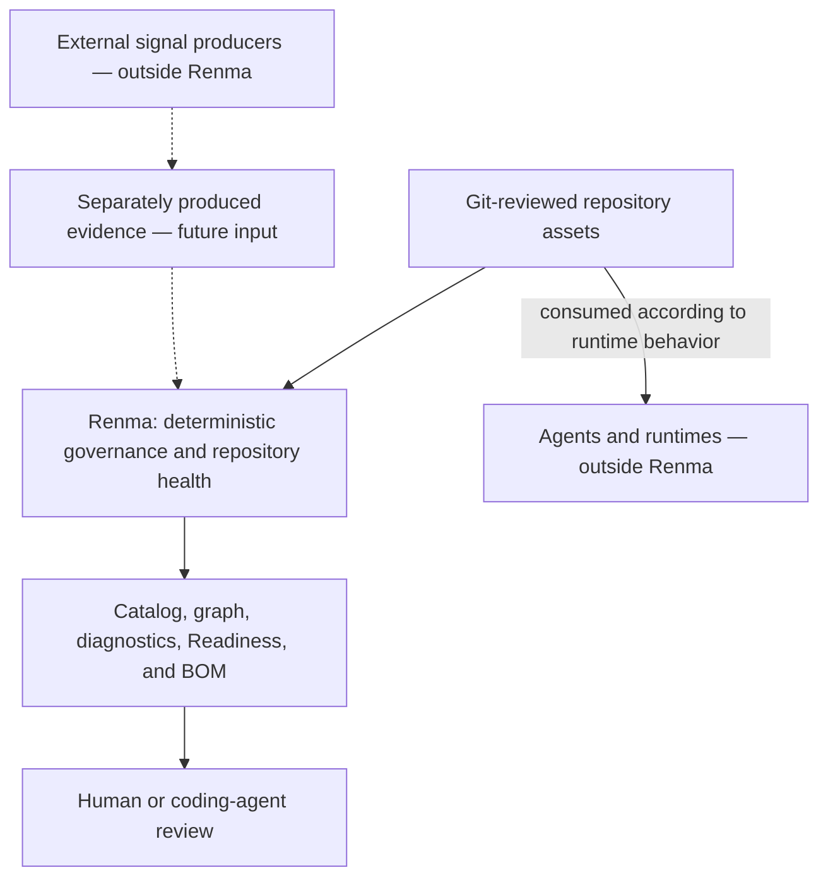
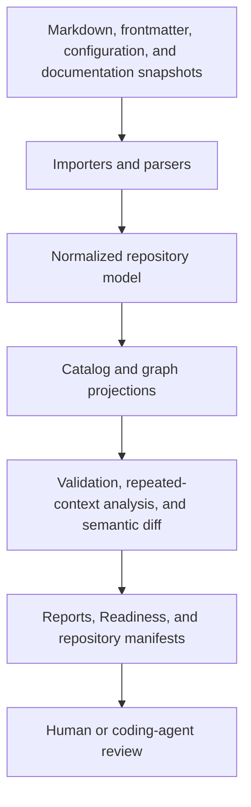

# Renma Architecture Direction

Renma is a Git-native context repository and deterministic governance layer for
LLM-facing knowledge. It keeps Skills, Context Lenses, Context Assets,
references, ownership, lifecycle, dependencies, and evidence reviewable as
maintainable software assets.

The current CLI surface covers `scan`, `catalog`, `ownership`, `graph`, focused
graph views, `trust-graph`, `readiness`, Repository Context BOM reports,
repeated-context diagnostics, semantic diff, `ci-report`, `inspect`, `guide`,
`scaffold`, `suggest-metadata`, and `suggest-semantic-split`. Agent Skills validation and
security diagnostics are deterministic repository checks; they do not execute
commands or call external services.

Renma sits at the repository governance layer, not the runtime layer.



Renma does not select Skills for live tasks, select or inject task Context,
assemble prompts, or execute workflows. Agents and runtimes decide how to use
repository assets for a task. Future evidence validation does not make Renma a
runtime telemetry collector; signal production and collection remain external.

Provenance remains repository-level. Repository Context BOM v2 is a manifest of declared assets, hashes, owners, lifecycle states, dependencies, security posture, diagnostics, and readiness evidence; it is not a report of actual LLM runtime usage. BOM v2 keeps Git revision identity in the surrounding Git/CI/PR artifact context and keeps any future consumed-context evidence separate from the declared repository manifest contract.

## Goals

- Keep skills and context assets discoverable, owned, and reviewable.
- Treat shared context as a first-class repository asset outside individual skill directories.
- Validate references, metadata, lifecycle, and dependency graph health.
- Detect orphaned, deprecated, conflicting, missing, and repeated context.
- Provide deterministic catalog and graph snapshots for Git review and CI.
- Produce repository-level deterministic readiness reports.
- Allow optional LLM assistance for suggestions and semantic review without making LLMs required for core analysis.

## Non-Goals

- Task-specific context choice
- Prompt assembly
- Agent execution
- Provider gateways
- Hosted dashboards
- Package synchronization
- Organization-wide distribution transport
- Runtime telemetry ownership

Renma is telemetry-aware, but not telemetry-responsible. It may import external signals later as evidence for repository review.

## Source Layout

One illustrative repository layout is:

```text
skills/
  testing/
    test-case-generation/
      SKILL.md
    spec-review/
      SKILL.md
    regression-planning/
      SKILL.md
contexts/
  testing/
    boundary-value-analysis.md
    negative-testing.md
    regression-risk.md
  domain/
    payment/
      idempotency.md
      duplicate-charge.md
      refund-risk.md
    mobile/
      offline-behavior.md
      background-resume.md
  tools/
    appium/
      usage-guideline.md
      limitations.md
  teams/
    checkout/
      payment-api-contracts.md
      known-risk-patterns.md
metadata/
graph/
catalog/
```

This tree is not a required layout for every repository asset. Context Assets,
Context Lenses, policies, references, and other knowledge may be organized by
domain, product, team, or workflow. Canonical Skill entrypoints in 0.16.0 are
nevertheless discovered only under `skills/**/SKILL.md` and
`.agents/skills/**/SKILL.md`. A custom scan glob does not turn an arbitrary path
such as `docs/skills/demo/SKILL.md` into a Skill. Renma's normalized repository
model is broader than the Agent Skills format, but arbitrary Skill roots are not
implemented.

`contexts/` is preferred. `context/` is also scanned for compatibility.

Skill-local `assets/`, `profiles/`, `references/`, `examples/`, and `scripts/`
remain supported. Shared Context Assets should become the durable source of
truth when knowledge is reused across Skills, teams, tools, or agents; shared
helper implementations belong under `tools/**`. Location alone does not prove
that local support should be promoted.

## Core Concepts

### Skill

A Skill is a focused task or workflow entrypoint. It tells a consuming agent
when the workflow applies, which inputs and preflight questions matter, what
ordered instructions and decisions to follow, which safety and verification
steps apply, what output completes the work, and which Context Assets or
Context Lenses are relevant. Renma recognizes Agent Skills-compatible syntax as
the portable authoring boundary without reducing its internal model to the
Agent Skills data model.

A skill should not be the only source of truth for reusable expert knowledge.

### Context Lens

A Context Lens is a purpose-oriented interpretation layer over one or more
Context Assets. It records a static repository relationship for governance and
review; Renma does not select a Lens at runtime, automatically load Context, or
assemble a prompt.

### Context Asset

A context asset is an independently owned knowledge unit. It may be maintained by QA, domain teams, tooling teams, product teams, or platform teams.

Good context assets have:

- Stable ID
- Clear owner
- Lifecycle status
- Usage guidance
- Scope boundaries
- References or dependencies where needed

### Asset

An asset is any repository object Renma can catalog, validate, reference, or include in graph checks.

Normalized asset kinds:

- `skill`
- `context`
- `context_lens`
- `profile`
- `reference`
- `example`
- `script`
- `asset`
- `agent`
- `config`
- `unknown`

Shared Markdown under `contexts/` or `context/` uses the dedicated `context`
kind. Skill-local scripts and assets are first-class inventory. Repository files
carry original-byte size and hash, text or binary classification, and Markdown
parser eligibility. Only artifacts explicitly eligible for Markdown parsing
contribute frontmatter, headings, links, fences, or repeated-context evidence.
Opaque files are never decoded into diagnostic snippets. Skill-local support
inherits effective ownership from its nearest owning Skill when it has no local
owner; catalog, graph, ownership, Readiness, Trust Graph, and BOM retain
`inherited` provenance instead of presenting that owner as locally declared.

### Dependency

A dependency is a typed edge between assets.

Initial edge kinds:

- `requires`
- `optional`
- `conflicts`
- `extends`
- `references`

`references` is a declared static repository relationship used for graph analysis and repository validation; it does not mean Renma chooses task context.

Edges should carry source evidence: source path, line range, declaration form, and reason where available.

Declared reference validation is deterministic. Renma resolves references by exact asset ID or repository-relative path, with only a leading `./` normalized away for path compatibility. Unknown declared references, duplicate asset IDs, references to deprecated or archived assets, and orphaned first-class shared context assets are reported as repository-governance findings. Renma does not use fuzzy matching, semantic search, LLM inference, or runtime context selection for these checks.

### Declared Composition

Renma models explicit composition, not general natural-language inheritance.
The pure Declared Composition resolver operates over the existing catalog. It
expands `requires_context`, `optional_context`, `requires_lens`,
`optional_lens`, and Lens `applies_to` declarations only. It does not expand
references, conflicts, lifecycle, ownership, policy, static-support, or
`extends` relationships.

Traversal uses `(stable asset ID, required-or-optional membership)` state, so
cycles terminate without recursion-driven repetition. Required membership
dominates optional membership in the asset lists, while predecessor edges keep
both route classes and every declaration's path, line range, snippet, and form.
This edge representation avoids exponential path enumeration.

Composition order is deterministic for review and never defines precedence,
override, or prose merging. `extends` retains its overlay/profile meaning only
inside dedicated typed resolvers with defined merge semantics.

The report keeps `requiredComplete`, `optionalComplete`, and `cycleFree`
separate. A complete closure can still contain a cycle. Declared conflicts are
reported as normalized asset-ID pairs with inclusion provenance; no winner is
selected. See the [Declared Composition contract](docs/declared-composition.md).

### Declared Impact

Declared Impact is the reverse transitive closure of the same valid explicit
composition relationships. The prepared composition index retains incoming
resolved declarations once, including invalid source- or target-kind evidence.
The pure impact resolver then traverses incoming declarations from one focused
asset without scanning files, rebuilding the catalog, resolving forward
composition for every possible root, or enumerating every complete path.

Reverse traversal also uses `(stable asset ID, required-or-optional
membership)` state. An all-required dependent-to-focus route produces required
declared impact; any optional declaration makes that route optional upstream.
Required membership dominates final stable-ID classification while both route
classes retain declaration provenance. The focus is separate, affected Skills
are exposed directly, and a dependent is direct only when a valid declaration
targets the focus itself.

Impact preserves original repository declaration direction in its edge data:
`dependent -> intermediate -> focus`. Invalid resolved incoming declarations
remain reviewable but never expand the closure. References, conflicts,
ownership, lifecycle, policy, static support, `extends`, and inferred
Skill-to-Skill relationships do not create impact. See the
[Declared Impact contract](docs/declared-impact.md).

## Architecture



The normalized model is the contract between files and higher-level features. Users work with Markdown and small metadata blocks. Renma uses the model internally to keep output deterministic and testable.

## LLM-Actionable Diagnostics

Renma diagnostics are repository evidence and repair guidance. They should be
structured enough for humans to review and for LLM coding agents to turn into a
safe patch. A diagnostic should carry the rule code, severity, source evidence,
why the issue matters, the recommended repair direction, constraints to
preserve, and verification steps when available.

Renma core remains deterministic: scan, catalog, validate, and emit structured
findings. Optional helpers may produce LLM-friendly suggestions, but core
validation does not call an LLM or apply semantic rewrites.

## Optional LLM Evaluation Boundary

Renma core is deterministic. LLM evaluation is optional and advisory.
Repository repair remains outside Renma.

Core commands such as `scan`, catalog construction, and rule evaluation should
not require or call an LLM. Given the same repository, configuration, and Renma
version, core validation should produce the same diagnostics. This keeps Renma
suitable for CI, code review, reproducible governance checks, and trustable
repository health reports.

Some repository improvement tasks are semantic by nature: finding similar or
overlapping knowledge across skills and contexts, deciding whether a
skill-local reference should be promoted to `contexts/`, evaluating whether two
context assets are duplicates, suggesting context asset names and boundaries, or
reviewing a semantic split proposal. Renma may support optional LLM-assisted
evaluation for these tasks, but those workflows should operate on explicit
inputs such as scan findings, catalog snapshots, selected files, or generated
review bundles. `suggest-semantic-split` is an example: it prepares a bounded
review bundle or prompt, does not call a provider, and does not rewrite files.

LLM-assisted workflows should produce suggestions, review bundles, or patch
guidance. They must not silently rewrite the repository, select task context,
assemble prompt packages, execute tools, orchestrate agents, or become required
for validation. Diagnostics such as
`MAINT-SKILL-REUSABLE-CONTEXT-CANDIDATE` and
`MAINT-SUPPORT-ASSET-SHARED-CONTEXT-CANDIDATE` can guide a calling LLM or human
toward semantic review, but Renma itself remains the deterministic evaluator.

The repair loop stays reviewable: Renma emits evidence, a human or calling
agent may propose a patch, a human reviews it, and Renma validates the updated
repository. An LLM is optional throughout this loop.

```text
renma scan/catalog -> deterministic diagnostics or review bundle
human or calling agent -> proposes a repository patch
human review -> accepts or edits the patch
renma scan/catalog -> validates the result deterministically
```

## Metadata

Renma validates a small stable metadata subset. Canonical Skills serialize
Renma fields as flat, string-valued `metadata.renma.*` entries; this top-level
example is the retained syntax for Context Assets and other non-Skill assets:

```yaml
id: domain.payment.idempotency
version: 1.0.0
owner: payments
status: stable
tags:
  - payment
  - qa
when_to_use:
  - Testing payment retry or duplicate-submit behavior
when_not_to_use:
  - Non-payment checkout UI copy review
requires_context:
  - testing.negative-testing
optional_context:
  - testing.regression-risk
conflicts:
  - archived.payment.retry-v0
```

The parser supports scalar values and YAML-style block lists for selected
non-Skill metadata fields. Canonical Skill list metadata uses JSON-array
strings. See `docs/agent-skills-compatibility.md` for the exact 0.16.0 boundary.

Status values:

- `experimental`
- `stable`
- `deprecated`
- `archived`

Fields should be added only when a command or rule uses them.

## Catalog Snapshot

`renma catalog` should provide deterministic inventory.

Catalog entries should include:

- ID
- Kind
- Source path
- Content hash
- Owner
- Status
- Tags
- Declared dependencies
- Dependents
- Diagnostics

Catalog output should be stable across filesystems and Node versions.

## Context Graph Snapshot

The graph should represent assets and typed dependencies. It should power:

- Missing reference checks
- Deprecated or archived dependency checks
- Orphaned context detection
- Conflict visibility
- Affected asset reporting
- Catalog enrichment
- Semantic diff
- Future visualization

Current commands:

```bash
renma graph . --format json
renma graph . --format markdown
renma graph . --format mermaid
renma graph . --view composition --focus <asset-id-or-path> --format json
renma graph . --view impact --focus <asset-id-or-path> --format json
```

The composition and impact views are focused forward and reverse transitive
projections over the same graph and catalog. The graph is not a runtime
selection engine or breakage predictor. It is repository evidence.

## Validation

Validation should combine local file checks and graph-backed checks.

Rule areas:

- Repeated context maintenance:
  - `MAINT-REPEATED-SECTION` detects exact repeated sections after whitespace normalization.
  - `MAINT-REPEATED-HEADING` detects repeated non-generic headings across files.
  - `MAINT-REPEATED-CODE-BLOCK` detects substantial repeated fenced code blocks.
  - `MAINT-REPEATED-LINK` detects repeated repository context link targets.
  - `MAINT-REPEATED-CONTEXT-PATTERN` detects repeated token shingles as deterministic consolidation evidence.
  - These findings do not decide semantic source of truth. They provide stable evidence so an LLM or maintainer can propose a consolidation and a human can approve it.

- Missing or weak skill description
- Missing negative routing
- Missing usage guidance
- Missing preflight guidance
- Missing verification guidance
- Oversized skills or context assets
- Reusable context candidates inside SKILL.md files
- Missing shared context owner or ID
- Invalid status values
- Unknown dependencies
- Deprecated or archived referenced context
- Orphaned context assets
- Conflicting context declarations
- Repeated or duplicate knowledge
- Secret-like literal values
- Private key material
- Destructive commands without confirmation or recovery context
- Risky remote defaults
- Broad environment copying into subprocesses
- Hardcoded user-local paths

Static checks are evidence. Passing a scan does not prove an agent workflow is safe.

## Repeated Context Discovery

Repeated context discovery is a bridge from "what exists" to "what should become shared context."

Deterministic signals:

- Normalized section hashes
- Token shingles
- Repeated headings
- Repeated command blocks
- Repeated links
- Repeated tool, domain, path, or product terms
- Similar workflow skeletons

Output should be a human-reviewable set of candidates with source paths, line ranges, signal kinds, confidence, and suggested context boundaries.

Optional LLM support may label clusters or draft refactors, but deterministic evidence remains authoritative.

## Semantic Diff

Semantic diff should explain repository-health changes that normal Git diffs make hard to see.

Categories:

- Ownership changes
- Lifecycle status changes
- Dependency changes
- Conflict changes
- Missing reference changes
- Orphaned context changes
- Repeated-context candidate changes
- Safety and risk changes

Current command:

```bash
renma diff . --from main --to HEAD
```

## Repository Health Reports

Readiness v1 is a deterministic static report that describes whether a repository is healthy enough for agents to consume.

Current v1 command:

```bash
renma readiness [path] [--format json|markdown]
```

The report summarizes level, score, workflow readiness, graph resolution, ownership coverage, diagnostics, and layout status. Markdown output is intentionally compact for PR descriptions, while JSON output keeps the same deterministic data available for CI.

The v1 report includes:

- Broken references
- Missing owners
- Missing usage boundaries
- Deprecated or archived reachable context
- Orphaned context
- Oversized assets
- Repeated knowledge
- Risk findings
- Affected skills and context assets

It should not choose task context for an agent run.

It does not call an LLM, select runtime context, assemble prompts, auto-repair files, perform cross-document semantic consistency analysis, score repairability, or plan per-skill patches.

## External Signals

External tools may later emit signals into Renma:

- Context assets loaded by agents
- Context assets ignored by agents
- Repeated confusion around an asset
- Runtime failures mapped back to source paths
- CI findings attached to owners

Renma may later import these as repository evidence. Ownership of telemetry collection, storage, runtime tracing, and dashboards remains outside Renma.

Consumed-context evidence from external agents, editor integrations, prompt wrappers, or CI tools may be useful later, but it should be a separate artifact or explicitly separate attachment. It should relate back to declared repository evidence using stable values such as BOM digest or snapshot identity, asset ID, asset content hash, producer identity/version, and observation timestamp. Renma should validate that evidence against the catalog, graph, readiness, and security model instead of becoming the telemetry producer.

## Architecture Stability

The scanner, normalized asset model, graph-backed governance, ownership,
Readiness, repeated-context evidence, semantic diff, security diagnostics,
Trust Graph v2 and Repository Context BOM v2 are implemented architecture. New
projections should reuse the shared repository-evidence snapshot and remain
additive unless a separately versioned contract requires a breaking change.

Contributors changing collection, evidence, decisions, or command rendering
should follow the [internal architecture boundaries](docs/internal-architecture.md),
including the documented fail-closed and 0.18.2 compatibility seams.

Release sequencing belongs in [plan.md](plan.md). Proposed Skill discovery is
isolated in [plan-discovery.md](plan-discovery.md) and is not implemented by the
current processing pipeline.

## Implementation Notes

Representative current CLI commands:

```bash
renma scan [path]
renma bom [path]
renma catalog [path]
renma graph [path]
renma trust-graph [path]
renma ownership [path]
renma readiness [path]
renma diff [path] --from <ref> --to <ref>
renma ci-report [path] --from <ref> --to <ref>
renma inspect <file>
renma guide skill
renma scaffold <skill|context|context_lens> <path>
renma suggest-metadata <file>
renma suggest-semantic-split <file>
```

`renma guide skill` is a pure authoring projection over installed structured
guidance. It reads no repository, writes only stdout, and establishes asset and
metadata boundaries before scaffolding. It does not call an LLM, accept task
text, fetch external sources, create assets, or claim semantic correctness.
The guidance type structurally separates normative interaction rules from a
top-level ordered collection of non-normative illustrations. Renma does not
classify requests, choose a closest example, or provide Skill-type templates.
The consuming LLM applies the protocol to current evidence and may ignore or
partially combine illustrated decision patterns. Future illustrations can be
added without modifying the normative interaction contract.
The prompt is a compact operational projection, while JSON retains optional
illustration details for external consumers. Generic verification remains
domain-neutral; structure-specific checks live with the applicable illustration.

`renma readiness` summarizes static repository health for human and external-agent review. It composes the graph/catalog model into deterministic score, level, metric, check, and diagnostic output; it does not call LLMs, select runtime context, assemble prompts, or repair files.

`renma inspect` inspects repository files and context assets by outline or line range. It does not choose task context or assemble prompts.

Baseline now in place:

- Dedicated `context` artifact kind.
- Default discovery for top-level `contexts/**/*.md` and `context/**/*.md`.
- Skill-local `references/` remain distinct from shared context assets.
- `SupportAsset` names non-skill catalog assets.
- `skill-local-support-reachability` validates static skill-local support files.
- `renma inspect` provides repository file inspection by outline or line range.
- Basic shared context metadata diagnostics.
- Duplicate asset ID detection.
- Unknown dependency and reference detection.
- Deprecated or archived dependency validation.
- Orphaned context asset detection.
- Readiness v1 repository-health report.
- Repeated context discovery across shared contexts, Skills, agents,
  references, profiles, and examples.
- Security diagnostics, security posture summaries, and effective policy
  inventory for agent-facing repository content.
- Trust Graph v2 evidence and Repository Context BOM v2.
- CI integration examples and optional LLM-assisted review bundles.

Future work may add imported external evidence after its contract is defined;
that does not move runtime selection, execution, or telemetry collection into
Renma.

## Principle

```text
LLM proposes. Renma verifies. Human approves.
```

No-LLM workflows stay first-class. Renma's core value is deterministic repository evidence.
