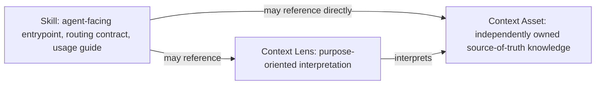

# Renma Product Design

Renma is a Git-native context repository and deterministic governance CLI for
repositories that hold LLM-facing knowledge.

Current product surface includes `scan`, `catalog`, `ownership`, `graph`,
focused graph views, `trust-graph`, `readiness`, Repository Context BOM reports,
repeated-context diagnostics, semantic diff, `ci-report`, `inspect`, `scaffold`,
`suggest-metadata`, `suggest-semantic-split`, Agent Skills validation, and
security diagnostics for agent-facing operational instructions.

Focused graph views are inspection tools; they do not choose, inject, or load runtime context for an agent.

Renma prepares deterministic repository evidence. Agents operate outside Renma
and decide how to consume repository assets according to their own runtime
behavior.

Renma helps teams keep shared knowledge discoverable, owned, validated,
reviewable, and reusable in Git. It is not an agent runtime and does not decide
what context an agent should load at task time.

## Core Distinction



Skills tell an agent when and how to use a capability. They can reference
context assets, ask preflight questions, describe safety gates, and define
verification expectations.

Context assets hold reusable expertise. They should be maintainable outside a
single skill, owned by the right team, versioned, reviewed, and reused across
skills, agents, tools, and future agent runtimes.

Context Lenses describe how one or more Context Assets should be interpreted for
a purpose. They are repository governance metadata, not runtime lens selection
or prompt assembly.

These arrows are declared repository relationships, not a runtime loading
pipeline. Renma validates them but does not select a Lens, choose task-specific
Context, or inject either asset into an agent session.

## Product Boundary

Renma owns repository quality and governance:

- Asset discovery and classification
- Owner, status, lifecycle, and metadata checks
- Broken reference and dependency checks
- Catalog and graph snapshots
- Orphaned, deprecated, archived, conflicting, and missing asset diagnostics
- Deterministic evidence for repeated or duplicated knowledge
- Deterministic readiness reports for repository maintainers

Renma does not own runtime behavior:

- No skill selection for a user task
- No prompt construction or context bundling
- No context injection into an agent
- No task-specific context choice service
- No tool execution on behalf of an agent
- No provider gateway or agent coordination layer
- No telemetry collection responsibility

Any future import of external signals from CI, IDE wrappers, agent plugins, or
other integrations must treat those signals as separately produced offline
review evidence. Renma itself is not telemetry-responsible.

## LLM-Actionable Diagnostics

Security diagnostics focus on conservative operational-instruction risks,
policy metadata, security profile resolution, approved network and upload
destination checks, and explicit human approval guards. They remain
deterministic repository checks, not runtime enforcement.

Security diagnostics are deterministic review guardrails for LLM-facing operational instructions. They flag patterns such as unpinned remote shell execution, unpinned dependency installs, privileged commands without nearby guardrails, predictable temporary paths, and credential-like command arguments; they do not replace SAST, secret scanning, dependency scanning, or human security review.

Security posture summaries in Readiness and CI reports describe effective
policy, security profile resolution, allowed data, forbidden inputs, approved
network and upload destinations, human approval requirements, and high-risk
findings without enforcing runtime behavior.

Trust Graph v1 is a deterministic interpretation of existing catalog, graph, scan, and security evidence. It exposes stable asset, owner, lifecycle, dependency, security profile, effective policy, and diagnostic evidence, but it does not introduce subjective trust scores or a separate runtime system. `scan` lists concrete problems, `graph` shows structural relationships, `trust-graph` connects trust-relevant evidence, and `readiness` summarizes repository-level preparedness.

Repository Context BOM v1 is a declared repository evidence snapshot: assets, hashes, owners, lifecycle states, dependencies, security posture, diagnostics, and readiness evidence. Snapshot consistency comes from one in-memory repository snapshot per BOM execution, not output formatting flags. `--omit-generated-at` only removes run-time generation timestamp noise; it does not ignore repository metadata timestamps such as `lastReviewedAt` or `expiresAt`, suppress freshness diagnostics, normalize environment-dependent absolute paths such as `root` or `configPath`, hide file moves, or provide portable byte-for-byte output across runners. The BOM does not claim actual LLM runtime usage. Actual consumed-context evidence remains a future separate artifact or attachment that external agents or wrappers may produce and Renma may later validate against the repository model. See `docs/repository-context-bom.md` for the resolved v1 contract.

Renma findings should be useful not only to humans, but also to LLM coding
agents. A good Renma diagnostic should explain what is wrong, why it matters for
repository governance, where the evidence is, what direction a safe fix should
take, what constraints must be preserved, and how to verify the fix.

Renma should not apply large semantic rewrites by itself. It should produce
structured diagnostics that can be pasted into Codex, Claude, Cursor, or another
agent to guide a reviewable repository patch.

Current diagnostics include evidence, `whyItMatters`, remediation, typed repair
constraints, verification steps, and LLM-facing hints where applicable. These
fields remain deterministic rule output, not LLM-generated validation.

Example diagnostic shape:

```json
{
  "id": "RMA-SKILL-TOO-MONOLITHIC",
  "severity": "medium",
  "category": "structure",
  "title": "Skill mixes reusable knowledge with usage guidance",
  "evidence": {
    "path": "skills/testing/test-case-generation/SKILL.md",
    "startLine": 42,
    "endLine": 78,
    "snippet": "boundary value analysis"
  },
  "whyItMatters": "Reusable QA and domain knowledge should be owned, reviewed, and reused as shared context assets instead of being buried in one skill.",
  "remediation": "Split reusable knowledge into first-class shared context assets and keep the skill as an LLM-facing usage guide.",
  "constraints": [
    "Do not introduce task context selection.",
    "Do not create prompt packages.",
    "Keep the skill as a routing contract / usage guide.",
    "Each context asset should have id, owner, status, and short scope."
  ],
  "verificationSteps": [
    "Run renma scan.",
    "Run any project-specific validation checks that apply to this repository.",
    "Ensure the skill no longer mixes reusable domain knowledge with usage guidance."
  ],
  "llmHint": "Create shared context assets for reusable QA knowledge, update skill metadata, and preserve the skill as a concise usage guide."
}
```

Central repair workflow:

1. A single `SKILL.md` contains reusable domain knowledge, tool guidance, and
   QA heuristics.
2. Renma emits structured findings explaining that the skill is too monolithic
   and mixes usage guidance with reusable context.
3. Codex or Claude reads the diagnostics and proposes a patch that moves
   reusable knowledge into first-class context assets under `contexts/`, keeps
   the skill concise, adds metadata, and updates declared context references.
4. A human reviews the patch.
5. Renma scans the repository again and confirms the skill/context separation is
   healthier.

Optional LLM-assisted evaluation is advisory and outside core validation. See
`architecture.md` section `Optional LLM Evaluation Boundary` for the rule:
`scan`, catalog construction, and deterministic rule evaluation do not call an
LLM; optional helpers may prepare review bundles or suggestions for a human or
calling agent to apply.

## Repository Model

An illustrative repository shape gives shared Context Assets first-class space:

```text
skills/
  testing/
    test-case-generation/
      SKILL.md
    spec-review/
      SKILL.md
    regression-planning/
      SKILL.md

contexts/
  testing/
    boundary-value-analysis.md
    negative-testing.md
    regression-risk.md
  domain/
    payment/
      idempotency.md
      duplicate-charge.md
      refund-risk.md
  mobile/
    offline-behavior.md
    background-resume.md
  tools/
    appium/
      usage-guideline.md
      limitations.md
  teams/
    checkout/
      payment-api-contracts.md
      known-risk-patterns.md

lenses/
  testing/
    spec-review-boundary-values.md

metadata/
graph/
catalog/
```

This is not a required layout for every repository asset. A repository may
organize Context Assets, Context Lenses, policies, references, evidence, and
other knowledge by domain, product, team, workflow, or a combination of those
dimensions. Canonical Skill entrypoints in 0.16.0 remain under
`skills/**/SKILL.md` and `.agents/skills/**/SKILL.md`; arbitrary Skill roots and
domain-local `*/skills/**/SKILL.md` layouts are not implemented. Renma's broader
model means repository knowledge need not be embedded inside those Skill
directories.

`contexts/` is preferred for shared context assets. `context/` remains supported
as a compatibility alias. Files under either root are classified as the
`context` artifact kind, not as `reference`. Experimental `context_lens` assets
can live under `lenses/`, or context files can opt in with `type: context_lens`.

Skill-local `assets/`, `profiles/`, `references/`, `examples/`, and `scripts/`
remain supported. They are useful for local routing variants, nearby examples,
Skill-specific supporting text, fixtures, and helpers. When evidence shows that
knowledge is reusable across Skills, teams, tools, or agents, it should move
into `contexts/` as an owned Context Asset. Shared helper implementations may
move to `tools/**`; location alone does not require either promotion.

Renma can also flag large skill-local support files as shared-context candidates when they contain generic source-of-truth structure such as setup, decision logic, troubleshooting, validation, constraints, policy, or procedure guidance. This advisory does not decide semantic reuse itself. It surfaces structurally broad support files and asks the calling LLM or human to inspect the repository for similar concepts, overlapping guidance, and reuse opportunities before making a reviewable patch.

Shared context assets should be organized by semantic scope, not migration state. Folders such as `contexts/promoted/` or `contexts/generated/` can be useful temporary staging concepts, but final context assets should live under meaning-oriented paths such as `contexts/tools/...`, `contexts/domain/...`, `contexts/testing/...`, `contexts/teams/...`, `contexts/policies/...`, or `contexts/platform/...`.

## Artifact Kinds

Renma normalizes scanned files into asset kinds:

- `skill`: LLM-facing entrypoint, routing contract, and usage guide
- `context`: shared source-of-truth knowledge asset under `contexts/` or
  `context/`
- `context_lens`: purpose-oriented interpretation layer over context assets
- `profile`: skill-local overlay or variant
- `reference`: skill-local supporting material
- `example`: skill-local example or fixture text
- `script`: Skill-local deterministic executable implementation
- `asset`: Skill-local template, image, data, font, PDF, or output resource
- `agent`: repository or agent instruction file
- `config`: Renma configuration
- `unknown`: scanned file that does not match a known kind

Catalog, graph, Trust Graph, and BOM output include script and asset inventory.
Each cataloged asset records original-byte size and hash, text/binary
classification, and Markdown-parser eligibility. Binary assets remain opaque;
Renma does not decode them as UTF-8 or expose their bytes in snippets.

The dedicated `context` kind is central to the product model. It lets catalog,
graph, and validation output distinguish reusable team-owned knowledge from
skill-local reference material.

## Context Asset Metadata

Context assets should use small, reviewable metadata blocks:

```yaml
---
id: context.testing.boundary-value-analysis-v2
title: Boundary Value Analysis
owner: qa-platform
status: stable
version: 1.0.0
tags:
  - testing
  - qa
when_to_use:
  - Designing tests around numeric, date, quantity, or limit boundaries
when_not_to_use:
  - Exploratory testing notes that do not depend on boundaries
requires_context:
  - testing.negative-testing
optional_context:
  - context.domain.payment.duplicate-charge
conflicts:
  - context.testing.boundary-value-analysis-v1
superseded_by:
  - context.testing.boundary-value-analysis-v3
---
```

The current parser supports YAML-style block lists for selected deterministic metadata fields. Supported block-list fields are `tags`, `when_to_use`, `when_not_to_use`, `requires_context`, `optional_context`, `conflicts`, and `superseded_by`; arbitrary nested maps are not metadata.

Initial status values:

- `experimental`
- `stable`
- `deprecated`
- `archived`

`status` describes lifecycle only. It should not be used for replacement,
delegation, migration provenance, or canonical-source relationships. For
example, a skill-local reference replaced by a shared context asset should use a
valid lifecycle status such as `deprecated`, plus a separate relationship field
such as `superseded_by: contexts/tools/example/setup.md` when the repository
needs to preserve that link. Renma may catalog `superseded_by` as a static
reference relationship, but it should not treat values such as `active` or
`delegated` as valid lifecycle statuses.

When reusable knowledge is promoted from a skill-local support file into
`contexts/`, the original `skills/*/references/` file may remain temporarily as
a compatibility shim. Renma can warn when a skill still routes readers through a
deprecated or superseded local support asset instead of referencing the
canonical shared context directly.

Renma can also warn when other repository assets continue to reference a
deprecated or superseded support file instead of the canonical shared context.
This broader advisory helps remove hidden indirection after context promotion
while preserving compatibility shims when they are intentionally needed.

Renma starts deterministic validation for fields it actually uses: duplicate IDs,
invalid statuses, missing owner or ID on published shared context, unknown
declared references, dependencies on deprecated or archived assets, and orphaned
first-class shared context assets. Declared references resolve by exact asset ID
or repository-relative path, with a leading `./` normalized away. Renma does not
use fuzzy matching, semantic search, LLM inference, or runtime context selection
for these checks.

## Dependency Model

Dependencies are typed relationships between assets:

- `requires`: the target asset is needed for the source asset to be complete
- `optional`: useful context that is not always required
- `applies_to`: context asset interpreted by a context lens
- `conflicts`: assets that should not both be active without human review
- `extends`: overlay or profile relationship
- `references`: declared static relationship from a skill or support asset toward a context asset or local file
- `covered_by`: evaluation or evidence coverage relationship

Edges should carry source evidence: path, range when available, declaration
form, and enough snippet text for review.

The graph is repository evidence. It must not become a task-specific context selector.

## Core Workflow

Renma should keep the deterministic path boring and reliable:

1. Load configuration from defaults, config files, and CLI flags.
2. Discover bounded repository files with stable POSIX-style paths.
3. Classify artifacts into normalized kinds, including first-class `context`.
4. Parse Markdown, frontmatter, headings, links, code fences, and metadata.
5. Build catalog entries with IDs, kind, source path, content hash, owner,
   status, tags, declared dependencies, dependents, and diagnostics.
6. Build graph snapshots from declared references and dependency metadata.
7. Run deterministic rules over parsed files and graph evidence.
8. Emit the command's documented text, JSON, Markdown, or Mermaid projection
   for Git review and CI.

Optional LLM assistance may help with semantic split suggestions, duplicate
labeling, or review summaries. LLM output is advisory. Deterministic evidence is
the authority.

## Rules

Implemented deterministic rules focus on repository health:

- Missing context asset ID
- Missing owner on shared context assets
- Invalid lifecycle status
- Duplicate asset IDs
- Unknown declared references
- Declared dependency on deprecated or archived context
- Orphaned shared context asset
- Superseded local support asset reference advisories
- Oversized skill entrypoint
- Skill may contain reusable context worth extracting
- Oversized context or skill-local support file
- Missing skill routing guidance
- Missing negative routing guidance
- Missing preflight or verification guidance
- Unused skill-local profile, reference, or example
- Literal secret-like values
- Destructive commands without nearby confirmation or recovery guidance
- Risky remote defaults
- Broad environment copying into subprocesses
- Hardcoded user-local paths in reusable guidance

Current reporting includes deterministic Readiness output, ownership coverage,
graph snapshots, repeated-context diagnostics, semantic diff, Trust Graph,
Repository Context BOM, security posture summaries, CI reports, and optional
LLM-friendly review bundles. These are repository projections and evidence, not
runtime selection or execution services.

Passing Renma checks does not prove a workflow is safe. It means the repository
met the deterministic governance checks that were enabled.

## QA And Testing Focus

QA/testing is the first strong product focus because teams often ask agents to
generate tests while the real expertise lives in scattered documents or senior
engineers' heads.

Good context assets in this domain include:

- Boundary value analysis
- Negative testing heuristics
- Regression risk models
- Payment idempotency and duplicate-charge risk
- Refund edge cases
- Mobile offline and background-resume behavior
- Appium usage limits
- Team-specific test strategy
- Known checkout or payment contract risks

Skills can reference those assets for tasks such as test-case generation, spec
review, regression planning, or release readiness. The context assets remain
the source of truth.

## Catalog Output

`renma catalog` should provide deterministic inventory:

- ID
- Kind
- Source path
- Content hash
- Owner
- Status
- Tags
- Declared dependencies
- Dependents
- Diagnostics

Catalog output should be stable across filesystems and Node versions so diffs
are useful in pull requests.

## Repository Health Readiness

Readiness v1 is a deterministic static repository-health report for maintainers:

```bash
renma readiness [path] [--format json|markdown]
```

It answers repository-level questions:

- Are shared context assets identifiable and owned?
- Are lifecycle states explicit?
- Are skills clear entrypoints rather than overloaded knowledge dumps?
- Are dependency declarations resolvable?
- Are deprecated or archived assets still reachable?
- Are important context assets orphaned?
- Is repeated knowledge visible enough for maintainers to consolidate it?
- Which changed assets affect which skills or teams?

Readiness is about preparing the repository for agents. It is not a guarantee
about any particular agent run.

The Markdown report is intentionally compact for PR review: level, score, workflow readiness, graph resolution, ownership coverage, diagnostics, and layout status. The JSON report exposes the same deterministic facts for CI.

Readiness does not call an LLM, select runtime context, assemble prompts, auto-repair files, perform cross-document semantic consistency analysis, score repairability, or plan per-skill patches.

## Implementation Principles

- Prefer deterministic analysis over hidden inference.
- Keep the CLI minimal-dependency and Git-friendly.
- Keep repository paths stable and portable.
- Parse structured metadata instead of relying on ad hoc text matching where
  reasonable.
- Preserve human ownership and review.
- Treat existing documents as changeable product design, not sacred API.
- Make shared context first-class before adding external signal features.
- Design for gradual adoption in repositories that already have skill debt.
