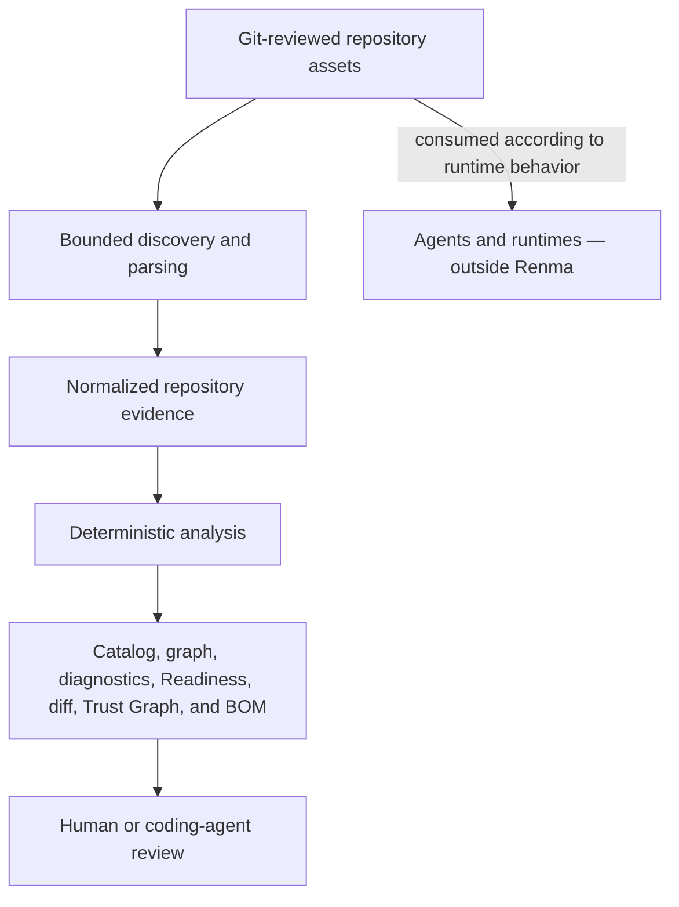

# Renma Architecture

Renma is a Git-native Context Repository and deterministic governance layer for
LLM-facing knowledge. It discovers repository assets, normalizes their metadata
and relationships, evaluates static rules, and emits reviewable evidence.

Renma sits at the repository layer, not the runtime layer.



Renma does not interpret a live task, select a Skill or Context for that task,
assemble or inject prompts, execute workflows, invoke providers, or collect
runtime telemetry. Static relationships and policies are repository evidence;
they are not proof of what a runtime selected, loaded, or did.

## Stable Layers

The architecture has four durable stages:

1. **Collection** resolves configuration, walks one bounded repository without
   following symbolic links, reads original bytes, classifies files, and parses
   eligible Markdown and metadata.
2. **Normalized evidence** records artifacts, cataloged assets, ownership,
   lifecycle, source ranges, declared relationships, and snapshot-scoped
   indexes.
3. **Analysis** derives graph views, diagnostics, composition, impact,
   security evidence, Readiness, semantic diff, Trust Graph, and BOM data
   without rereading files.
4. **Presentation** renders an already-decided result as text, JSON, Markdown,
   or Mermaid. Renderers do not reinterpret repository evidence.

One command execution collects one immutable repository snapshot per repository
state. Derived projections share that snapshot so a report cannot combine facts
from different filesystem moments. The
[internal architecture](internal-architecture.md) owns module-level
dependency direction, projection preparation, and compatibility seams.

## Repository Roles

Discovery classifies files into these artifact roles:

- `skill`
- `context`
- `context_lens`
- `profile`
- `reference`
- `example`
- `script`
- `asset`
- `agent`
- `config`
- `unknown`

Artifact classification and catalog membership are different claims. Skills,
Contexts, Context Lenses, profiles, references, examples, scripts, and assets
can become catalog entries. Agent instruction files, configuration files, and
unknown files remain discoverable and may contribute diagnostics without
becoming catalog assets.

Canonical Skill entrypoints are directory-based, exact-case `SKILL.md` files
under `skills/**` or `.agents/skills/**`, excluding paths that cross a reserved
Skill-support directory. Historical Skill spellings are migration-only inputs
to an explicit `suggest-metadata` request. A custom scan glob does not turn an
arbitrary or historical path into a Skill.

Shared Context Assets live under `contexts/`. The former `context/` root is
reported with migration guidance and is not interpreted operationally.
Skill-local `references/`, `profiles/`,
`examples/`, `scripts/`, and `assets/` remain local support. Reused knowledge
does not become shared merely because of its path: independent ownership,
lifecycle, source-of-truth status, or demonstrated cross-Skill reuse establishes
the Context boundary.

See the [Agent Skills compatibility contract](../agent-skills-compatibility.md)
and [Authoring Guide](../authoring-guide.md) for exact paths and metadata.

## Relationships

Catalog relationships have evidence: source path, declaration form and index,
and source range where available. Current catalog construction emits:

- `requires` and `optional` from explicit Context and Lens composition fields;
- `conflicts` from explicit conflict declarations;
- `applies_to` from Context Lens declarations;
- `references` for explicit supersession relationships;
- `owns_local_resource`, `statically_references`, `inherits_owner`, and
  `inherits_policy` as derived Skill-local support relationships.

Declared and derived relationships must remain distinguishable. In particular,
inherited ownership is not a local declaration, a Markdown link is not a
runtime loading instruction, and a derived local-support edge is not user-authored
composition.

The exported `DependencyKind` vocabulary also retains `extends` and
`covered_by`, but current catalog construction does not emit either kind.
They must not be presented as active metadata relationships unless a separate
implementation and compatibility decision makes them operational.

Skill Discovery continuation is another separate contract. The Discovery graph
projects exact `renma.continues-with` declarations as `continues_with` edges;
those edges do not enter `catalog.dependencies` or ordinary graph views. See the
[Skill Discovery contract](../skill-discovery.md).

Declared targets resolve by exact stable asset ID or normalized
repository-relative path. Renma does not use fuzzy matching, embeddings,
semantic similarity, or LLM inference to manufacture graph edges.

## Composition and Impact

Declared Composition expands only explicit `requires_context`,
`optional_context`, `requires_lens`, `optional_lens`, and Lens `applies_to`
relationships. It does not treat references, conflicts, ownership, policy,
lifecycle, static support, or Skill Discovery routes as composition.

Declared Impact is the reverse transitive view of those same valid composition
relationships for one focused asset. Required and optional membership remain
separate, cycles terminate deterministically, and retained edges preserve the
original declaration direction.

Composition order is review order, not precedence or prose merge order. A
complete closure may still contain a cycle, so completeness and cycle freedom
remain separate facts. See the
[Declared Composition contract](../declared-composition.md) and
[Declared Impact contract](../declared-impact.md).

## Deterministic Evidence

Stable output depends on explicit invariants:

- repository paths are normalized to POSIX-style relative paths;
- file hashes use original bytes, including for opaque binary artifacts;
- only eligible Markdown contributes headings, links, fences, or source
  snippets;
- findings retain one-based inclusive evidence ranges in original files;
- IDs, paths, relationships, diagnostics, and report collections use documented
  deterministic ordering and deduplication;
- unknown, ambiguous, unsupported, or unsafe-to-interpret states fail closed
  instead of being guessed.

Repeated-context analysis emits exact section, non-generic heading,
substantial code-block, and token-shingle evidence. Repeated links alone are
intentionally not maintenance findings because multiple assets may correctly
cite one authoritative source.

Diagnostics are repair evidence, not automatic edits. Public Finding semantics,
diagnostic IDs, classification fields, evidence conventions, and remediation
constraints are defined in the [Diagnostics Reference](../diagnostics.md).

## Report Boundaries

The command registry and generated help are the source of truth for command
names, arguments, options, and defaults. The
[User Manual](../user-manual.md) owns the current command reference; this
architecture document does not duplicate it.

The main report families answer different questions:

- catalog and ownership describe normalized assets and governance;
- graph views describe declared or derived repository relationships;
- Readiness summarizes one repository state;
- semantic diff and CI report compare two repository states;
- Skill Index describes static Discovery publication, routes, and coverage;
- Trust Graph v2 connects trust-relevant static evidence without assigning a
  subjective trust score;
- Repository Context BOM v3 is a declared repository manifest, not consumed
  runtime Context.

Catalog JSON keeps dependencies and diagnostics at report level. Catalog
Markdown may compute compact inbound dependents for review; that derived
presentation is not an extra field on every JSON catalog entry.

Versioned schemas and their focused documents own exact JSON contracts:

- [Repository Context BOM](../repository-context-bom.md)
- [Trust Graph](../trust-graph.md)
- [Skill Discovery](../skill-discovery.md)
- [Diagnostics](../diagnostics.md)

## Security Boundary

Security analysis is deterministic, non-executing, and bounded to
agent-facing repository instructions that Renma already discovers. It combines
Markdown structure, exact nearby guard evidence, bounded command recognition,
destination analysis, policy inheritance, and conservative fallback.

It is not complete shell or JavaScript parsing, cross-command or cross-file
taint analysis, a secret scanner, dependency scanner, SAST engine, runtime
policy enforcement, or a proof of safety. Unsupported syntax stays on the
conservative path. See the [Security Policy](../security-policy.md).

## Optional LLM Assistance

Core discovery, parsing, validation, graph construction, and report generation
do not require or call an LLM. Optional helpers may prepare bounded suggestions
or review bundles, but they do not rewrite files or make semantic decisions
authoritative.

The repair loop remains reviewable:

```text
Renma evidence -> human or calling agent proposes -> human reviews -> Renma verifies
```

Authoring guidance has a normative protocol structurally separate from
non-normative illustrations. Renma does not classify a request against those
illustrations or choose a closest example; a consuming LLM may ignore them.
Illustration membership does not change the normative protocol.

## External Evidence

Runtime-produced observations are outside the repository model. Any separate
evidence contract must identify its producer and relate observations back to
stable repository evidence such as an asset ID, content hash, or BOM digest.
Signal production, collection, storage, runtime tracing, and dashboards remain
outside Renma.

External review receipts may eventually be validated against that same stable
repository evidence. Review execution and provider-specific report parsing
remain outside core. The candidate boundary and first experiment are described
in [External Review Governance](../external-review-governance.md).

## Change Discipline

Public JSON fields, diagnostic identities, schema identifiers, CLI behavior,
documented semantic exports, and package-path rejection boundaries are
compatibility-sensitive.
New projections should reuse the shared repository snapshot and remain additive
unless a separately reviewed contract permits a breaking change.

Release history belongs in the [Changelog](../changelog.md). Current open
candidates and explicit non-commitments belong in [plan.md](plan.md).

```text
LLM proposes. Renma verifies. Human approves.
```
