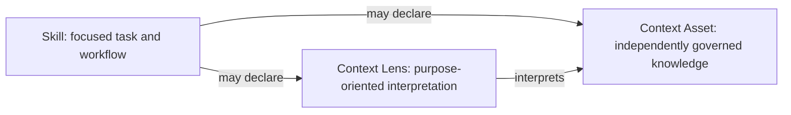
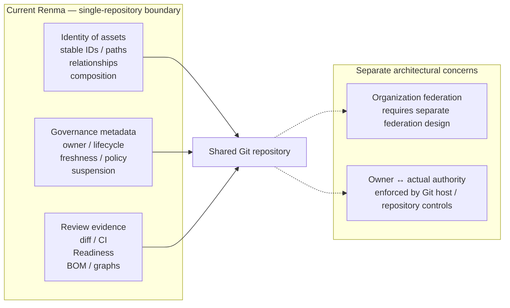

# Renma Product Design

Renma is a Git-native Context Repository and deterministic governance CLI for
repositories that hold LLM-facing knowledge.

Its product value is a reviewable repository model, not a runtime:

```text
LLM proposes. Renma verifies. Human approves.
```

## Core Distinction



A **Skill** owns a focused task or workflow: activation boundaries, required
inputs, ordered instructions, decisions, constraints, verification, output, and
completion criteria.

A **Context Asset** owns knowledge that merits independent governance. Reuse
across Skills is one reason to create one, but independent ownership, lifecycle,
source-of-truth status, or maintenance cadence is also sufficient.
Correctness importance alone does not create a Context boundary: detail used
only by one workflow can remain in that Skill or justified Skill-local support.

A **Context Lens** records how one or more Context Assets should be interpreted
for a purpose. It is a static repository relationship, not a runtime selector or
prompt template.

These relationships describe maintained source material. They do not instruct
Renma to load, rank, merge, or inject anything for a live task.

## Why a Context Repository

Knowledge used by agents has software-maintenance properties: it changes, gains
dependencies, becomes stale, acquires owners, and can conflict with other
knowledge. Keeping that material in Git makes identity, provenance, review,
history, and automation visible.

Renma therefore treats repository evidence as the authority:

- stable IDs and repository-relative paths identify assets;
- ownership and lifecycle are explicit governance, not naming heuristics;
- relationships carry source evidence;
- deterministic output makes review diffs meaningful;
- human approval remains necessary for semantic changes.

Renma does not infer ownership from directory names, prose, Git authors, or
modification history. It also does not infer that a local file should be
promoted, that two assets are semantically equivalent, or that one conflicting
asset should win.

## Product Boundary

Renma owns:

- bounded repository discovery and classification;
- metadata, lifecycle, ownership, relationship, and layout validation;
- deterministic diagnostics and security review evidence;
- catalog, ownership, graph, composition, impact, Readiness, diff, CI,
  Skill Discovery, Trust Graph, and BOM projections;
- non-editing inspection, authoring guidance, and bounded suggestions.

Renma does not own:

- interpretation of free-form live tasks;
- Skill, Context, or Lens selection and ranking;
- prompt construction, Context bundling, or injection;
- workflow or tool execution;
- provider gateways or agent orchestration;
- runtime telemetry collection;
- automatic semantic rewrites or repository-wide repair.

External agents and runtimes decide how to consume repository assets. Passing
Renma checks means the enabled deterministic governance checks passed; it does
not prove that a workflow is safe, correct, or effective at runtime.

The lists above remain authoritative; this diagram summarizes the current
single-repository boundary and adjacent repository-governance concerns.



## Focused Skills and Progressive Disclosure

A Skill should remain complete enough to own its workflow without becoming the
only source of truth for reusable knowledge. Skill-local `references/`,
`profiles/`, `examples/`, `scripts/`, and `assets/` support progressive
disclosure when they have a clear local responsibility.

Promotion to shared `contexts/` is a semantic and governance decision. File size,
location, repeated wording, or a diagnostic may provide evidence, but none
authorizes an automatic split. Shared helper implementations belong under
`tools/**`; shared knowledge belongs in Context Assets.

Context Assets should be organized by meaning rather than migration state.
Temporary staging paths may help during a reviewed move, but durable paths
should communicate domain, tool, policy, platform, team, or testing scope.

## Repository and Compatibility Model

Canonical Skills use the portable Agent Skills format plus flat,
string-valued `metadata.renma.*` governance fields. Context Assets and other
non-Skill assets use Renma's focused top-level metadata contract.

`contexts/` is the only shared-Context root. `context/` receives migration
guidance but no operational interpretation. Historical Skill entrypoint
spellings are explicit `suggest-metadata` migration input only; canonical
Skills are directory-based, exact-case `SKILL.md` entrypoints under the
supported Skill roots.

The exact current fields, encodings, paths, and migration behavior belong in the
[Agent Skills compatibility contract](../agent-skills-compatibility.md) and
[Authoring Guide](../authoring-guide.md), not in a second list here.

Supported lifecycle states are:

- `experimental`
- `stable`
- `deprecated`
- `archived`

Lifecycle is not replacement, delegation, or provenance. A superseded local
support file may remain as a documented compatibility shim, but its lifecycle
state and its explicit supersession relationship remain separate facts.

## Explicit Relationships

Renma models explicit repository relationships rather than general
natural-language inheritance.

Required and optional Context or Lens declarations describe static composition.
Lens `applies_to` describes interpretation. Conflict and supersession
declarations retain review evidence. Skill Discovery continuation is a separate
Skill-to-Skill topology contract. Skill-local ownership, policy, and static
reference edges are derived only from unambiguous repository evidence.

The distinctions matter:

- required versus optional membership is not precedence;
- declaration order is not routing priority;
- graph reachability is not runtime use;
- reverse declared impact is not proof of breakage;
- a Markdown URL is a source reference, not permission to use the network;
- a local support link is not a shared Context declaration.

The [Architecture](architecture.md) defines the active relationship vocabulary.
Focused contracts define
[Declared Composition](../declared-composition.md),
[Declared Impact](../declared-impact.md), and
[Skill Discovery](../skill-discovery.md).

## Determinism and Fail-Closed Behavior

The same repository contents, configuration, Renma version, and evaluation
inputs should produce the same deterministic facts. Stable ordering,
deduplication, normalized paths, original-byte hashes, and original-file
evidence ranges are compatibility-sensitive.

Renma fails closed when repository boundaries, identities, parents,
relationships, syntax, or policy evidence are unresolved or ambiguous.
Uncertainty remains visible instead of being converted into guessed governance.

This principle applies equally to authoring suggestions: a successful
`no-change-recommended` decision is preferable to manufacturing an edit, and a
blocked decision must not expose partial evidence as an applicable patch.

## Diagnostics and Repair

A Finding should tell a maintainer:

- what deterministic rule matched;
- why the evidence matters;
- where the original source range is;
- what repair direction is supported;
- which constraints a patch must preserve;
- how to verify the result.

Detection does not imply deterministic repair. Repeated-context evidence,
ambiguous ownership, boundary changes, conflicts, and source-of-truth choices
require repository investigation and human review.

The [Diagnostics Reference](../diagnostics.md) owns Finding fields,
diagnostic IDs, evidence conventions, severity, risk classification, and repair
constraints. Keeping the exact contract there avoids a second example or field
list drifting in product design.

## Security Design

Security diagnostics are conservative checks over agent-facing repository
instructions and effective policy metadata. They use Markdown structure, exact
guard scope, bounded command and destination recognition, policy inheritance,
and fail-closed fallback.

Renma distinguishes repository policy evidence from runtime enforcement. An
external URL in Markdown is body content, not a catalog node, approved
destination, or network grant. Renma must not manufacture permissive allowed
data, secrets, network, external-upload, or human-approval policy values.

This scope complements rather than replaces full language parsing, SAST, secret
scanning, dependency analysis, runtime controls, and human security review. See
the [Security Policy](../security-policy.md).

Renma may eventually govern external-review requirements and whether generated
evidence is current, complete, and applicable. It does not become the external
reviewer, reinterpret native findings, or treat an external report as proof of
runtime behavior. Generated review evidence remains separate from authored
repository metadata. See the candidate
[External Review Governance](../external-review-governance.md) direction.

## Authoring Guidance

Authoring guidance separates a normative interaction protocol from
non-normative illustrations. The protocol defines evidence qualification,
question behavior, the creation gate, progression, verification, and handoff.
Illustrations demonstrate tensions; they are not Skill categories or templates.

Renma does not classify a request, select a closest illustration, conduct the
conversation, or retain authoring state. A consuming LLM may ignore or combine
illustrations only when their underlying conditions independently apply.
Illustration membership does not change the normative protocol.

Authoring-time source access comes from the current request, supplied artifacts,
and available tools. Finished-Skill policy never retroactively authorizes access
during authoring. Conversation state such as Confirmed, Proposed, Unresolved,
Blocking, Deferred, or reversible defaults is not repository metadata.

## Report Interpretation

Report families remain separate because they answer different questions:

- catalog and ownership show inventory and governance;
- graph views show relationships;
- composition and impact show focused explicit closures;
- Readiness summarizes one repository state;
- diff and CI compare two states;
- Skill Index describes static Discovery topology and coverage;
- Trust Graph v2 connects trust-relevant evidence without a subjective score;
- Repository Context BOM v3 records declared repository evidence, not runtime
  consumption.

Exact command usage belongs in the [User Manual](../user-manual.md). Exact
schemas belong in their focused contract documents.

## Optional LLM Assistance

Optional LLM-facing helpers may prepare review bundles, metadata candidates, or
semantic-split suggestions from bounded deterministic evidence. Their output is
advisory. Core validation does not call an LLM, and helpers do not silently
rewrite files.

## Durable Product Decisions

- Keep repository evidence deterministic and Git-reviewable.
- Keep shared Context first-class and independently governable.
- Preserve focused Skills rather than reducing them to thin routers.
- Keep runtime selection, execution, and telemetry outside core.
- Govern external-review evidence without becoming the external reviewer.
- Preserve exact compatibility boundaries instead of inferring migrations.
- Keep semantic repair and meaningful repository design under human review.
- Add fields or projections only when a concrete deterministic consumer exists.

QA and testing remain useful product examples because their expertise is often
distributed across workflows, tool limits, domain risks, and team policy. They
are not a required repository hierarchy or a special asset model.
