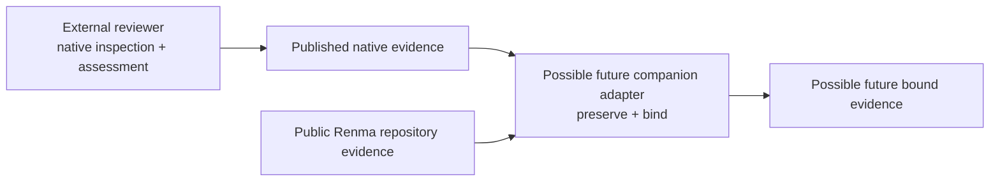

# External Review Governance

> Renma may eventually govern which external reviews are required and whether
> their evidence is current, complete, and applicable. Renma does not run,
> reproduce, or reinterpret those external reviews.

This document records the durable result of the completed two-producer concept
experiment and the responsibility boundary for any future product work. It
does not define a shipped CLI, metadata field, JSON schema, configuration
contract, adapter SDK, plugin interface, or runtime behavior. Additional
projection-shaping experiments are paused.

## Completed Experimental State

The non-production research sequence evaluated three deliberately isolated
steps:

1. The
   [SkillSpector evidence-correlation experiment](https://github.com/KazuCocoa/renma/blob/main/experiments/skillspector/evidence-correlation/README.md)
   preserved scanner-native facts and correlated normalized source paths with
   Renma catalog assets only through exact repository-relative path matches.
   Unmatched, ambiguous, missing, and unsafe paths remained explicit. The
   [executable-relationship extension](https://github.com/KazuCocoa/renma/blob/main/experiments/skillspector/evidence-correlation/executable-context/README.md)
   added direct invocation and containment context from Renma's public
   executable graph as a separate layer. It did not turn those relationships
   into reviewed scope, scanner coverage, ownership, reachability, runtime
   execution, or safety claims.
2. The
   [Cisco Skill Scanner evaluation](https://github.com/KazuCocoa/renma/blob/main/experiments/cisco-skill-scanner/EVALUATION.md)
   evaluated Cisco as a second external-review producer, not as a second
   adapter. It exposed useful subject, execution, policy, analyzer, finding,
   assessment, and artifact evidence, while also exposing material output
   contract, reviewed-scope, component-content, and completeness gaps.
3. The deliberately unstable
   [two-producer receipt concept](https://github.com/KazuCocoa/renma/blob/main/experiments/external-review-receipt-concept/README.md)
   tested whether both producers' evidence could be represented without
   translating producer semantics or manufacturing unavailable conclusions.
   It demonstrated an evidence-preserving conceptual envelope, not a
   production receipt or schema.

The receipt concept deliberately preserved unavailable and contradictory
evidence as first-class. For example, Cisco's native JSON omitted its producer
version, its native SARIF reported a version that contradicted the externally
verified installation, and neither report format supplied the missing scope or
completeness contract. The experiment retained those distinctions rather than
selecting a convenient value or treating absence as success.

## Experimental Result

### Common Governance Concepts

Both producers raised a useful common set of governance questions:

- which producer and report contract supplied the evidence;
- which logical subject the review concerns;
- which components and exact content were actually reviewed;
- whether producer execution completed;
- which assessment profile, analyzer set, policy, baseline, or suppression
  context applied;
- what the producer reported about completeness, limitations, and unavailable
  work;
- which native findings and native assessment the producer emitted;
- which exact artifact was preserved;
- whether the evidence is current; and
- whether a separately defined Renma review requirement is satisfied.

These are common conceptual dimensions, not common field names or
interchangeable values. SkillSpector and Cisco retain different rule models,
severity scales, finding identities, completeness evidence, policy semantics,
and assessment meanings. Their native findings and assessments can and should
remain producer-specific. No common finding taxonomy, severity conversion,
score, verdict, deduplication key, or safety meaning was established.

The experiment therefore resolves the former question of whether a second
producer makes provider-neutral concepts useful: the concepts are useful for
asking governance questions across both producers. It does not establish that
a provider-neutral production receipt, parser, adapter, schema, or framework
is ready or necessary.

### Binding, Relationships, And Artifact Integrity

A logical subject and its exact reviewed scope are different evidence. Exact
catalog correlation can identify a Renma asset without proving which support
files the producer reviewed or which bytes it inspected. A producer-listed
component path is not content binding without component-content evidence. A
repository revision or independently observed file set is useful provenance,
but it cannot repair a native report that omits its reviewed component set.

Executable invocation and containment relationships remain separate from
reviewed scope. They can add repository context to an exactly correlated file
finding, but they do not prove that a related Skill or script was inspected,
affected, reachable at runtime, or covered by the producer.

An exact report digest is useful only for artifact integrity: it identifies the
bytes that were preserved. It does not identify a logical subject, provide
component-content binding, prove semantic equivalence across runs, establish
freshness or completeness, or support a safety conclusion. The Cisco
evaluation also observed repeat reports whose raw digests differed because of
volatile timestamps and durations while their other observed content remained
the same.

### Completeness And Required Profiles

Three concepts must remain separate:

```text
producer-native completeness
  The external reviewer's own completeness, status, coverage, limitations,
  skipped work, failures, and unavailable or inapplicable work.

required-profile completeness
  Whether all review work required by an independently defined Renma profile
  completed for the bound subject and scope.

requirement satisfaction
  A future governance conclusion that also depends on valid binding,
  freshness, required-profile completeness, and native assessment evidence.
```

Producer-native completeness must be preserved without reinterpretation.
SkillSpector serialized a richer component and analyzer ledger, including a
native incomplete result in the captured case. Cisco did not serialize a
comparable planned, completed, skipped, failed, unavailable, or not-applicable
work ledger. Successful execution, a favorable native assessment, or a high
coverage value cannot repair incomplete or unavailable evidence.

Renma has not designed a required external-review profile. Any future profile
would need an independently reviewed identity and digest-bound definition of
the required work. Until that exists, required-profile completeness and
requirement satisfaction cannot be derived from either producer's native
assessment.

## Responsibility Boundary

The responsibility boundary remains unchanged:



```text
External reviewer
  - performs native inspection
  - owns native findings, severities, scores, and assessment
  - owns native execution coverage, suppressions, and limitations

Possible future separately installed adapter
  - consumes only a trustworthy, supported published report contract
  - preserves producer-native evidence and provenance
  - binds published evidence to stable public Renma repository evidence
  - retains unavailable, contradictory, and producer-specific evidence

Renma core
  - owns its existing repository identity and deterministic governance checks
  - does not run external scanners
  - does not load adapters or depend on review producers
  - does not translate native findings into Renma findings or diagnostics
  - does not reproduce producer assessment logic or infer safety
```

A future adapter would be a companion tool, not a plugin loaded into Renma
core. It could preserve and bind published evidence only after the applicable
producer contract and binding evidence are trustworthy. Cisco was the second
evaluated producer, not a second adapter; no production adapter exists, and the
experiment does not justify an adapter SDK, registry, or generic framework.

Any future adapter must fail closed on unsupported output versions and avoid
rescanning source, deciding whether findings are correct, suppressing findings
with an LLM, translating native rule IDs, modifying repository assets,
reproducing a producer's risk algorithm, or adding the producer as a Renma
dependency.

## Stable Requirements And Generated Evidence

Authored governance intent and generated external-review evidence remain
different artifacts. A future stable declaration could identify a required
review category or profile only after Renma independently designs that
contract. A generated report would then provide evidence about one producer
execution over a bound subject and scope. Producer results must not be stored
as authored Renma metadata because they become stale when content, producer
version, profile, policy, baseline, suppression context, or execution mode
changes.

This direction adds no review-requirement metadata field and proposes no field
layout. The current compatibility behavior for unknown string-valued
`renma.*` keys does not make scanner-result keys operational, documented, or
recommended Renma metadata.

## Relationship To Existing Renma Evidence

The [Repository Context BOM](repository-context-bom.md) remains a declared
repository manifest. Public catalog, BOM, and executable-graph evidence can
provide independent repository identity and relationships, but they cannot
manufacture facts omitted by a producer. In particular, Renma content hashes
do not become producer-observed component hashes merely because the same path
appears in both systems.

Generated external-review evidence remains separate from BOM v2, the Trust
Graph, Readiness, diagnostics, and CI policy. This direction does not create a
catalog asset kind, dependency edge, coverage relationship, security finding
family, or runtime input.

Renma continues to own its bounded deterministic checks over repository
declarations and agent-facing instructions. Specialized external tools remain
responsible for their native executable-code, taint, dependency, supply-chain,
malware, least-privilege, tool-poisoning, and semantic inspections. Neither
kind of evidence proves runtime behavior. A clean external report does not
prove that a Skill is safe, and passing Renma checks means only that the
enabled deterministic governance checks passed.

## Production Blockers And Pause

The two-producer concept did not justify production implementation. Work
remains blocked by:

- producer output and version contracts that are not yet trustworthy enough
  for fail-closed parsing;
- the inability to bind the exact producer-reviewed component set;
- missing producer-bound component-content evidence;
- incomplete serialized completeness, limitation, skipped-work, failure, and
  applicability evidence; and
- the absence of an independently designed, named, digest-bound Renma required
  review profile.

Another projection-shaping experiment would rearrange unavailable evidence
without removing those blockers. Such experiments are paused.

Revisit the concept only when at least one of these bounded conditions
materially changes the evidence:

- a producer publishes a trustworthy, versioned report contract;
- complete reviewed-component identity or content binding becomes available;
- serialized completeness and limitation evidence materially improves;
- Renma independently designs a required review profile; or
- a third producer exposes a genuinely new evidence shape.

A revisit is permission to reassess the concept, not a commitment to ship it.
There remains no commitment to a production receipt, parser, adapter, public
schema, framework, metadata field, configuration field, CLI behavior,
diagnostic, Readiness input, CI policy, BOM or Trust Graph change, dependency,
package content, package version, or release.

```text
LLM proposes. Renma verifies. Human approves.
```
