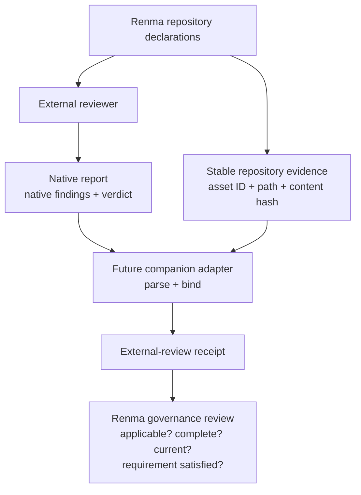

# External Review Governance

> Renma governs which external reviews are required and whether their evidence
> is current, complete, and applicable. Renma does not run, reproduce, or
> reinterpret those external reviews.

This document records a candidate product direction and an experiment plan. It
does not define a shipped CLI, metadata field, JSON schema, configuration
contract, adapter SDK, or plugin interface.

SkillSpector is the first evaluation producer because it inspects security
areas intentionally outside Renma's core boundary, including executable code,
taint, dependencies and supply chains, MCP security, and optional semantic
review. It is neither bundled with nor required by Renma. The
[experiment harness](https://github.com/KazuCocoa/renma/tree/main/experiments/skillspector)
exists to collect evidence for this direction, not to integrate the products.

## Responsibility Boundary

The intended separation is:

```text
Renma
  - repository identity and content hashes
  - ownership and lifecycle
  - declared composition and impact
  - static policy declarations and policy consistency
  - review requirements
  - evidence binding, completeness, freshness, and applicability
  - derived governance review state

External reviewer
  - native inspection
  - native findings
  - native severity and risk calculation
  - scanner-specific suppression or baseline matching
  - execution coverage and limitations

Adapter
  - parse a published external report
  - retain producer provenance
  - bind the report to stable Renma repository evidence
  - produce a provider-neutral external-review receipt
  - preserve tool-specific information as namespaced extensions
```

An adapter would be a separately installed companion tool, not a plugin loaded
into Renma core. A future companion might be called
`renma-skillspector-adapter`, but this document neither reserves that package
name nor specifies or implements it.



The reviewer remains authoritative for its native findings and verdicts. The
adapter preserves and binds that evidence; it does not become a second
reviewer. Renma evaluates governance properties of the receipt, not the
producer's inspection logic.

## Stable Declarations And Generated Evidence

Stable repository governance declarations may eventually express a requirement
such as:

```text
This asset requires review category security.core.
```

Generated evidence answers a different question:

```text
SkillSpector version X inspected this exact asset content using profile Y,
completed Z percent of the applicable inspection, and produced outcome P.
```

Dynamic scanner output must not be stored in `SKILL.md` metadata. In
particular, patterns such as these are rejected:

```yaml
metadata:
  renma.security-score: "12"
  renma.last-skillspector-scan: "2026-07-27"
  renma.skillspector-result: "safe"
```

Those values become stale when the source content, scanner version, assessment
profile, baseline, suppression set, or execution mode changes. They also blur
authored governance intent with generated observations.

One possible declaration shape might eventually be:

```yaml
metadata:
  renma.review-requirements: '["security.core"]'
```

This is a non-operational illustration only. It is not accepted canonical
metadata, and this experiment does not add it to Renma's implementation or
documentation contract.

## Candidate External-Review Evidence

A future provider-neutral receipt should be compact and bind one review to
stable repository evidence. Before publishing a schema, experiments should
determine whether the following candidate information is both available and
useful:

- review kind, such as `security` or `effectiveness`;
- subject asset ID, repository-relative source path, and content hash;
- optional exact repository revision;
- producer name and version;
- adapter name and version;
- assessment-profile ID and digest;
- execution status and scan mode;
- completeness or coverage;
- limitations and skipped work;
- assessment outcome;
- raw report format and digest;
- suppression or baseline digest, when applicable;
- suppressed finding count;
- completion timestamp.

This is a concept list, not a field list for a stable JSON schema. Experiments
must also separate information Renma may eventually interpret from opaque,
namespaced producer extensions:

```text
Renma-interpreted
  producer
  subject binding
  execution completeness
  profile identity
  assessment outcome
  report digest
  freshness

Producer-specific extension
  SkillSpector risk score
  SkillSpector recommendation
  SkillSpector rule-family counts
  individual analyzer information
```

Renma must not convert a SkillSpector risk score into a Renma Readiness score,
reclassify native findings as Renma findings, or translate them into Renma
diagnostic IDs.

## Candidate Derived Review State

Renma may eventually derive governance states such as `satisfied`, `missing`,
`invalid`, `stale`, `incomplete`, `unsatisfied`, or `ambiguous`. These states
are candidates only and are not implemented by this experiment.

The underlying dimensions must remain distinguishable:

```text
binding: current | stale | invalid
execution: complete | partial | failed
freshness: current | expired
assessment: pass | warn | fail | unknown
requirement: satisfied | unsatisfied
```

A passing assessment with incomplete execution must not become a satisfied
review. Likewise, current evidence may still be unsatisfied, and a favorable
native outcome cannot repair an invalid subject binding.

## Adapter Boundary

A future `renma-<tool>-adapter` should:

- consume only published or intentionally supported external-tool output;
- consume a public Renma artifact such as BOM JSON when repository identity is
  needed;
- produce a compact external-review receipt;
- include producer and adapter provenance;
- preserve the raw report digest;
- fail closed on unsupported producer output versions;
- preserve unknown rule IDs rather than dropping them;
- avoid modifying Renma repository assets;
- avoid unsupported deep imports into Renma internals.

It must not:

- rescan source code;
- decide whether an external finding is correct;
- use an LLM to suppress findings;
- translate external findings into Renma diagnostic IDs;
- modify `SKILL.md`;
- reproduce an external tool's risk algorithm;
- add the external tool as a Renma dependency.

Renma should not design an adapter SDK or registry from one producer. A second
real adapter is required before introducing a generic adapter framework.

## BOM And Repository Evidence

The [Repository Context BOM](repository-context-bom.md) remains a declared
repository manifest. A future adapter may use its public data to resolve a
stable asset ID, source path, content hash, and ownership or lifecycle context
when needed.

Generated external-review results remain a separate artifact associated with a
repository snapshot or asset identity. This direction does not embed them in
BOM v2 or create:

- a catalog asset kind;
- a normal dependency edge;
- a `covered_by` relationship;
- a Trust Graph node or edge;
- a Renma security finding family.

## Relationship To Renma Security Diagnostics

Renma continues to own governance-oriented checks over repository declarations
and bounded agent-facing instructions, including:

- security metadata encoding and security-profile resolution;
- profile cycles, missing profiles, precedence, and contradictions;
- body instructions that contradict effective policy;
- approved destination and forbidden-input declarations;
- required human-approval declarations.

Renma may retain bounded, deterministic repository-instruction safety lint as
an early review aid. The exact current scope remains in the
[Security Policy Guide](security-policy.md); no existing `SEC-*` diagnostic is
removed, renamed, or reclassified by this direction.

Specialized tools remain responsible for complete or language-specific
inspection such as:

- SAST and executable-code behavior;
- cross-file or source-to-sink taint analysis;
- dependency vulnerabilities and supply-chain checks;
- malware or YARA signatures;
- executable-code least privilege;
- tool-poisoning analysis;
- semantic description-versus-code comparison.

Neither kind of evidence proves runtime behavior. A clean external report does
not prove that a Skill is safe, and passing Renma checks means only that the
enabled deterministic governance checks passed.

## Experiment And Decision Gates

The initial SkillSpector experiment scans existing Renma Skills and separately
classified example-repository probes. It defaults to static-only analysis,
commits methodology rather than raw reports, and does not modify assets to make
the producer pass.

Product implementation should wait until evidence shows that:

- published output versions can be parsed reliably;
- producer version, execution mode, completeness, skipped work, and limitations
  are visible;
- results can be bound to exact repository assets and content;
- false-positive and suppression behavior is understood;
- raw evidence can remain separate from Renma findings;
- the provider-neutral core remains useful for a second producer.

Until those gates are met, there is no commitment to a public receipt schema,
review-requirement metadata field, CLI, configuration field, adapter package,
or release.

```text
LLM proposes. Renma verifies. Human approves.
```
