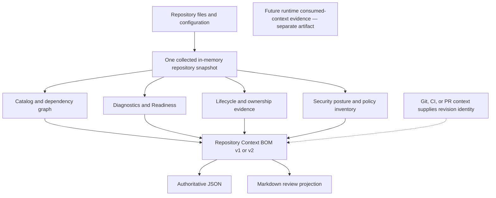

# Repository Context BOM

`renma bom` emits a declared repository manifest for review and CI consumers. Schema v2 is the default; `--schema v1` selects the frozen compatibility projection.

The BOM is not a runtime usage report. It does not describe what an LLM actually consumed, assemble prompts, choose task-specific context, inject context into agents, execute agents, call an LLM, import consumed-context evidence, or collect telemetry.

The diagram separates collection from projection: every BOM section is derived
from one collected snapshot, JSON is authoritative, and Markdown is a review
view. `--omit-generated-at` removes generation-time noise only. Revision
identity stays in the surrounding Git, CI, or pull-request context, and any
runtime consumed-context evidence remains a separate future artifact.

## Snapshot Contract

One BOM execution is derived from one in-memory repository snapshot:

1. Resolve configuration once.
2. Discover and read repository artifacts once.
3. Parse documents once.
4. Build the catalog once.
5. Derive graph, findings, diagnostics, Context Lens evidence, readiness, security posture, and security policy inventory from that same snapshot.
6. Format JSON or Markdown only after the complete report has been built.

Renma does not freeze the working tree while another process is modifying it. If files change during collection, the BOM reflects the artifacts Renma read for that execution; after collection, all report sections are derived from the collected snapshot.

## Output Authority

JSON is the authoritative BOM output. Markdown is a compact review projection for pull requests and humans; it is not the canonical serialization.

Array ordering is deterministic and part of Renma's output contract. Asset `sourcePath` values remain repository-relative. `root` and `configPath` remain absolute paths from the current environment.

V2 assets use `ownership.declaredOwner`, `ownership.effectiveOwner`,
`ownership.source`, and optional `ownership.inheritedFrom`. Readiness v2 uses
the effective owner. V1 exposes only a flat declared `owner`; inherited support
therefore remains unowned in v1.

## Reproducibility

`--omit-generated-at` means only:

- omit the run-time `generatedAt` field;
- remove clock-based differences caused by that field.

It does not mean:

- ignore `lastReviewedAt`, `reviewCycle`, or `expiresAt`;
- suppress freshness diagnostics;
- normalize `root` or `configPath`;
- make output portable across different checkout directories;
- hide file moves;
- guarantee identical output across different evaluation dates;
- freeze a repository while another process is modifying it.

Supported guarantee:

> With the same checkout path, config path, repository contents, Renma version, and UTC evaluation date, repeated `--omit-generated-at` runs should produce byte-identical JSON.

Freshness evaluation uses the UTC calendar date. Metadata dates remain part of the snapshot and must not be removed as timestamp noise. A real file move is a meaningful BOM change because `sourcePath` is repository evidence. Portable byte-for-byte output across different runners is not a v1 guarantee.

## Schema Evolution

`schemaVersion` represents the consumer-facing BOM schema. `generator.version` represents the Renma implementation version and is not the schema version.

Both schemas are explicit contracts. V1 remains frozen for legacy consumers;
v2 is the default contract for normalized ownership, first-class support
assets, and static support relationships.

Within a schema, changes should be backward-compatible and additive:

- existing fields must not be removed, renamed, or given incompatible types or meanings;
- new optional fields may be added when a real consumer requires them;
- enum additions are consumer-visible changes and must be documented;
- a future breaking contract requires a new schema version rather than silently changing existing semantics.

## Migration Notes

- Pin `--schema v1` while a consumer still reads flat `owner`.
- Move v2 consumers to the normalized `ownership` object.
- Treat `owns_local_resource`, `statically_references`, `inherits_owner`, and
  `inherits_policy` as static repository evidence, not runtime behavior.
- Branch on `schemaVersion`; `generator.version` is provenance only.

Follow-up documentation task: publish complete JSON Schema files and field-by-field examples for both BOM and Trust Graph versions in a documentation-only pull request.

`--omit-generated-at` does not make the report a generic canonical JSON format or a portable artifact.

## Source Provenance

BOM provenance is deliberately repository-local in both schemas:

- repository-relative source paths;
- per-asset content hashes;
- generator name and version;
- current absolute `root` and `configPath` information when available;
- lifecycle, dependency, diagnostic, readiness, security posture, and security policy inventory evidence.

Renma does not automatically invoke Git or add Git commit, branch, tag, or dirty-state fields. Git revision identity is expected to come from the surrounding Git, CI, artifact, or pull-request context. Native Git provenance fields and a BOM digest may be considered later if external artifact storage or cross-run consumers require them.

## Consumed-Context Evidence

Both BOM schemas describe declared repository state. Future consumed-context evidence must not redefine or mutate that meaning.

Runtime evidence should be a separate artifact or explicitly separate attachment. A future evidence record should relate back to a BOM using stable values such as a BOM digest or snapshot identity, asset ID, asset content hash, producer identity and version, and observation timestamp.

External agents, editor integrations, wrappers, or CI tools may produce those signals. Renma may later validate imported signals against the repository model, but Renma must not become the telemetry collector, runtime wrapper, dashboard, or provider gateway.
