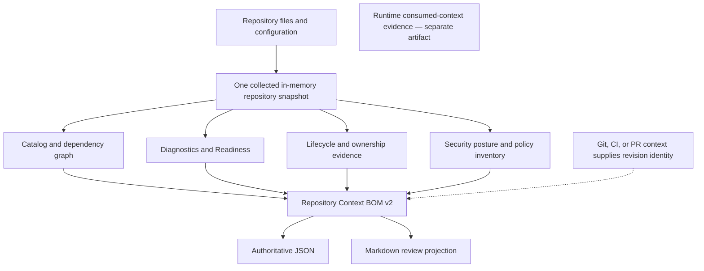

# Repository Context BOM

`renma bom` emits a declared repository manifest for review and CI consumers.
Renma supports only the v2 BOM schema; it does not provide a v1 compatibility
mode. V2 is the first supported long-term contract. Earlier v1 output was an
experimental pre-contract surface removed before broader adoption.

The BOM is not a runtime usage report. It does not describe what an LLM actually consumed, assemble prompts, choose task-specific context, inject context into agents, execute agents, call an LLM, import consumed-context evidence, or collect telemetry.


```mermaid
flowchart TD
  Sources["Repository files and configuration"]
  Snapshot["One collected in-memory repository snapshot"]
  Catalog["Catalog and dependency graph"]
  Diagnostics["Diagnostics and Readiness"]
  Governance["Lifecycle and ownership evidence"]
  Security["Security posture and policy inventory"]
  Bom["Repository Context BOM v2"]
  Json["Authoritative JSON"]
  Markdown["Markdown review projection"]
  Revision["Git, CI, or PR context supplies revision identity"]
  Runtime["Runtime consumed-context evidence — separate artifact"]
  Sources --> Snapshot
  Snapshot --> Catalog
  Snapshot --> Diagnostics
  Snapshot --> Governance
  Snapshot --> Security
  Catalog --> Bom
  Diagnostics --> Bom
  Governance --> Bom
  Security --> Bom
  Bom --> Json
  Bom --> Markdown
  Revision -.-> Bom
```

The diagram separates collection from projection: every BOM section is derived
from one collected snapshot, JSON is authoritative, and Markdown is a review
view. `--omit-generated-at` removes generation-time noise only. Revision
identity stays in the surrounding Git, CI, or pull-request context, and any
runtime consumed-context evidence remains a separate artifact.

## Snapshot Contract

One BOM execution is derived from one in-memory repository snapshot:

1. Resolve configuration once.
2. Discover and read repository artifacts once.
3. Parse documents once.
4. Build the catalog once.
5. Derive graph, findings, diagnostics, Context Lens evidence, readiness, security posture, security policy inventory, and executable-surface inventory from that same snapshot.
6. Format JSON or Markdown only after the complete report has been built.

Renma does not freeze the working tree while another process is modifying it. If files change during collection, the BOM reflects the artifacts Renma read for that execution; after collection, all report sections are derived from the collected snapshot.

## Output Authority

JSON is the authoritative BOM output. Markdown is a compact review projection for pull requests and humans; it is not the canonical serialization.

Array ordering is deterministic and part of Renma's output contract. Asset `sourcePath` values remain repository-relative. `root` and `configPath` remain absolute paths from the current environment.

Assets use `ownership.declaredOwner`, `ownership.effectiveOwner`,
`ownership.source`, and optional `ownership.inheritedFrom`. Readiness uses the
effective owner.

## Reproducibility

`--omit-generated-at` means only:

- omit the run-time `generatedAt` field;
- remove clock-based differences caused by that field.

It does not mean:

- ignore `lastReviewedAt`, `reviewCycle`, or `expiresAt`;
- suppress freshness diagnostics;
- normalize `root` or `configPath`;
- make output portable across different checkout directories;
- hide file moves;
- guarantee identical output across different evaluation dates;
- freeze a repository while another process is modifying it.

Supported guarantee:

> With the same checkout path, config path, repository contents, Renma version, and UTC evaluation date, repeated `--omit-generated-at` runs should produce byte-identical JSON.

Freshness evaluation uses the UTC calendar date. Metadata dates remain part of the snapshot and must not be removed as timestamp noise. A real file move is a meaningful BOM change because `sourcePath` is repository evidence. Portable byte-for-byte output across different runners is not a v2 guarantee.

## Schema Evolution

`schemaVersion` represents the consumer-facing BOM schema. `generator.version` represents the Renma implementation version and is not the schema version.

V2 is the first supported long-term contract for normalized ownership,
first-class support assets, and static support relationships. Consumers must
inspect `schemaVersion` independently from `generator.version`. An incompatible
contract must use a new schema version.

Within a schema, changes should be backward-compatible and additive:

- existing fields must not be removed, renamed, or given incompatible types or meanings;
- new optional fields may be added when a real consumer requires them;
- enum additions are consumer-visible changes and must be documented;
- a breaking contract requires a new schema version rather than silently changing existing semantics.

Treat `owns_local_resource`, `statically_references`, `inherits_owner`, and
`inherits_policy` as static repository evidence, not runtime behavior. Branch
on `schemaVersion`; `generator.version` is provenance only.

The published [BOM v2 JSON Schema](schemas/repository-context-bom-v2.schema.json)
is the machine-readable contract. `generatedAt` is required when `outputMode`
is `default` and forbidden when `outputMode` is `omit_generated_at`.
`configPath` remains optional and is absent when no configuration file was
loaded. Every other top-level field is required. Optional lifecycle, version,
status, target-resolution, and inherited-ownership fields appear only when
their evidence exists. Owner values are explicitly nullable; missing optional
fields are omitted rather than serialized as `null`.

Arrays are deterministically ordered by their identity/path keys, and count
fields are non-negative integers. Count maps contain every declared enum
member, including zero counts. Policy source ordering is `local`,
`security_profile`, `repository_config`, `owning_skill`. Static support
relationships use `owns_local_resource`, `statically_references`,
`inherits_owner`, and `inherits_policy`.

The additive `executableSurfaceInventory` field retains its own explicit schema
identifier, `renma.executable-surface-inventory.v1`. Its summary counts,
path-identified surface rows, line-level invocation rows, content and inventory
fingerprints, reachability depth, interpreter hints, and bounded effective
policy correlation are complete in JSON. The Markdown BOM renders a compact
review table. Surface rows are sorted by repository path; invocation rows are
sorted by source path, line, launcher, and target.

The Readiness summary is a closed contract for asset, ownership, graph,
diagnostic, workflow, Context Lens, security posture, and security policy
inventory evidence. Coverage and readiness percentages are constrained to
`0..100`. Security posture top-finding entries require an ID, non-negative
count, and maximum severity. Security policy `assetKinds` is a complete count
map containing every generated artifact kind, including zero values.

Representative top-level JSON (nested objects are shortened for readability;
the schema defines every nested field):

```json
{
  "schemaVersion": "renma.repository-context-bom.v2",
  "outputMode": "omit_generated_at",
  "generator": { "name": "renma", "version": "<installed-version>" },
  "root": "/checkout/repository",
  "scope": { "type": "declared_repository_manifest", "runtimeUsage": false, "telemetryCollected": false },
  "summary": { "scannedFileCount": 0, "assetCount": 0, "dependencyCount": 0, "resolvedDependencyCount": 0, "unresolvedDependencyCount": 0, "ownedAssetCount": 0, "unownedAssetCount": 0, "readinessScore": 100, "readinessLevel": "ready", "diagnosticCounts": { "error": 0, "warning": 0, "info": 0 } },
  "assets": [],
  "dependencies": [],
  "readiness": { "score": 100, "level": "ready", "checks": [], "summary": {} },
  "securityPosture": { "totalSecurityFindings": 0, "riskClasses": { "violation": 0, "suspicious": 0, "advisory": 0, "unclassified": 0 }, "severities": { "critical": 0, "high": 0, "medium": 0, "low": 0 }, "highOrCritical": 0, "topFindingIds": [] },
  "securityPolicyInventory": {},
  "executableSurfaceInventory": { "schema": "renma.executable-surface-inventory.v1", "summary": {}, "surfaces": [], "invocations": [] },
  "diagnostics": []
}
```

Generated representative reports are validated against the published schema in
the contract test suite.

`--omit-generated-at` does not make the report a generic canonical JSON format or a portable artifact.

## Source Provenance

BOM v2 provenance is deliberately repository-local:

- repository-relative source paths;
- per-asset content hashes;
- generator name and version;
- current absolute `root` and `configPath` information when available;
- lifecycle, dependency, diagnostic, readiness, security posture, security policy inventory, and executable-surface evidence.

Executable-surface evidence is static repository visibility, not a claim about
runtime use or safety. It does not execute files, follow symbolic links, inspect
permission bits, or scan package manifests, GitHub Actions, Dockerfiles, Git
hooks, remote scripts, ordinary external commands, or unrelated repository
files. Such sources remain intentionally unsupported in this inventory slice.

Renma does not automatically invoke Git or add Git commit, branch, tag, or
dirty-state fields. Git revision identity comes from the surrounding Git, CI,
artifact, or pull-request context.

## Consumed-Context Evidence

The BOM v2 schema describes declared repository state. Consumed-context evidence
must not redefine or mutate that meaning.

Runtime evidence should be a separate artifact or explicitly separate
attachment. Such a record should relate back to a BOM using stable values such
as a BOM digest or snapshot identity, asset ID, asset content hash, producer
identity and version, and observation timestamp.

External agents, editor integrations, wrappers, or CI tools may produce those
signals. They remain outside the BOM contract and Renma's role as a static
repository analyzer; Renma is not a telemetry collector, runtime wrapper,
dashboard, or provider gateway.
