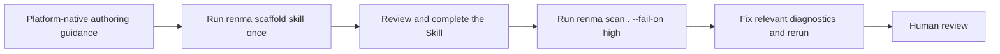
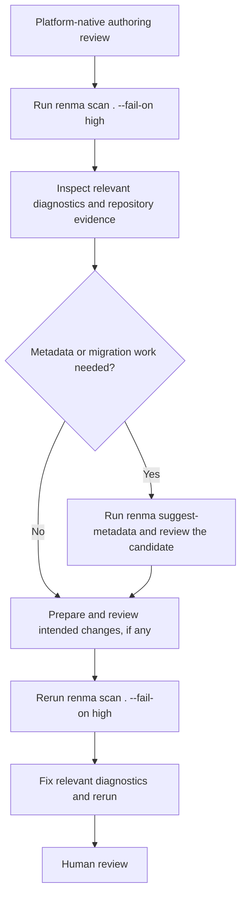

# renma User Manual

renma scans agent-facing repository assets and turns them into deterministic, agent-consumable reports. Use it to keep skills, shared context, prompts, docs, and ownership metadata reviewable in CI instead of relying on an LLM to infer repository intent.

## What Renma Does And Does Not Do

Renma is deterministic repository governance for context assets, skills, and agent-facing documentation. It reads local repository files, builds reviewable evidence, and reports what humans or coding agents should inspect.

Renma does not call an LLM, choose runtime context, assemble prompts, inject context, execute agents, or collect telemetry.

Use your platform's standard Skill authoring guidance for general Skill design,
then use Renma for repository-specific governance and validation. Platform
guidance owns the trigger description, instructions, workflow, constraints,
examples, and completion criteria. Renma owns deterministic repository evidence
for compatibility, metadata, relationships, ownership, lifecycle, security
policy, diagnostics, and readiness.

## Install And Build

From a checkout:

```bash
npm install
npm run build
```

Run the local CLI from the built entry point:

```bash
node dist/index.js scan .
```

When renma is installed as a package, use the `renma` binary:

```bash
renma scan .
```

For the breaking 0.16.0 Skill format, scan validation, and one-way migration
workflow, see [Agent Skills Compatibility and Migration](agent-skills-compatibility.md).
Agent Skills results appear inside `scan`; there is no separate Skill-validation
command.

Renma 0.16.0 requires specification-valid Agent Skills for operational Skills.
All Renma Skill governance and security metadata uses flat, string-valued
`metadata.renma.*` entries. Pre-0.16 top-level Skill metadata is accepted only
as migration input for `suggest-metadata`; non-Skill metadata behavior is
unchanged.

## Repository Layout

renma is most useful when agent knowledge is stored in predictable places:

- `skills/**/SKILL.md` and `.agents/skills/**/SKILL.md` are the canonical Agent
  Skills entrypoints. Renma still discovers historical `skill.md` and
  `*.skill.md` spellings under those roots for migration diagnostics, but those
  spellings are not Agent Skills-compatible.
- `contexts/**` for shared context assets.
- configurable prompt or documentation paths for reusable prompts and broader docs.
- `*.renma.json` for structured metadata assets.

Tool helper implementations usually belong under `tools/**`. They can be referenced from skills and commands, but they are not the same thing as user-facing documentation under `docs/**`.

Under explicit skill roots, `assets`, `examples`, `profiles`, `references`, and
`scripts` are reserved for skill-local support directories. These are valid
support paths:

- `skills/demo/assets/template.md`
- `skills/demo/examples/happy-path.md`
- `skills/demo/references/spec.md`
- `skills/demo/scripts/helper.sh`
- `skills/demo/profiles/local.md`

The same reserved names apply under `.agents/skills/**`.

These Skill-local support directories are valid. Keep material local when it is
specific to one Skill. Promote reusable source-of-truth knowledge to an owned
Context Asset, or a helper shared across workflows to `tools/**`, only when
repository evidence supports that change; Renma does not move files
automatically.

Skill-local support belongs only to the nearest Skill directory. When a local
support artifact does not declare an owner, ownership, Readiness, graph, Trust
Graph, and BOM reporting use the nearest Skill's owner as deterministic
effective ownership and mark it as inherited. This does not invent ownership
for shared Context Assets or unrelated repository files.

Only files marked Markdown-parser eligible contribute frontmatter metadata,
headings, links, code fences, and repeated-context evidence. Text scripts and
data assets remain raw text for dedicated static path or security analysis;
binary assets remain opaque.

Avoid using reserved support directory names as skill names. Paths such as
`skills/assets/SKILL.md`, `skills/examples/SKILL.md`,
`skills/references/SKILL.md`, `skills/scripts/SKILL.md`, and
`skills/profiles/SKILL.md` are not treated as skill entrypoints by default. If
one of those files is intended to define a Renma skill, rename the directory, for example to
`skills/example-review/SKILL.md`.

Specification-valid Agent Skills declare governance and security values as
flat string-valued `metadata.renma.*` entries. JSON-array strings represent lists;
Renma does not treat comma-separated canonical values as lists. These canonical
values feed the same catalog, ownership, graph, readiness, BOM, Trust Graph,
lifecycle, and reporting behavior as the pre-0.16 fields they replace.

Renma does not fall back to top-level pre-0.16 Skill fields. Invalid, hybrid,
and pre-0.16 Skills can be scanned and migrated but contribute no operational
Skill metadata. Contexts, context lenses, profiles, references,
examples, agents, configuration files, and other non-Skill assets continue to
use their existing top-level metadata syntax.

## Quick Start

For a first pass on an existing repository, run:

```bash
renma scan .
renma catalog . --format markdown
renma graph . --format markdown
renma readiness . --format markdown
```

Read these reports together:

- `scan` shows concrete problems to fix.
- `catalog` shows what assets and metadata Renma discovered.
- `graph` shows how skills and contexts are connected.
- `readiness` summarizes repository-level health and checks.

When creating a Skill, design it with platform-native authoring guidance, run
`scaffold skill` once, complete the generated file, and validate with
`renma scan . --fail-on high`. For deeper authoring guidance, see the
[Authoring Guide](authoring-guide.md). For rule details, see the
[Diagnostics Reference](diagnostics.md).

## LLM-Assisted Skill Maintenance

Renma output can support a human or coding agent, but the authoring and
governance responsibilities remain separate. Review the Skill with the
platform's standard authoring guidance, then use Renma as deterministic
repository evidence. Do not treat a clean scan as permission to invent domain
knowledge or as proof that the workflow is semantically correct.

Recommended loop:

1. Review triggers, instructions, workflow, constraints, and completion criteria
   using platform-native authoring guidance.
2. Run `renma --help` and the relevant deterministic inspection commands.
3. Review diagnostics and repository evidence.
4. Prepare a minimal patch without inventing domain knowledge, ownership,
   references, product rules, or source-of-truth claims.
5. Run `renma scan . --fail-on high`, fix relevant diagnostics, and rerun it.
6. Summarize changed files, resolved findings, remaining uncertainty, and
   verification commands.
7. Require human review before merging meaningful semantic changes.

Example instruction for an agent:

```text
Review the Skill with this platform's standard Skill authoring guidance, then use Renma to inspect its repository governance.

Start by running `renma --help` and use command-specific help to choose the appropriate workflow. Make only evidence-backed changes. Do not invent owners, references, product rules, or source-of-truth claims. Preserve existing semantics unless a diagnostic or explicit requirement supports a change. Run `renma scan . --fail-on high` after editing, fix relevant diagnostics, rerun it, and summarize both resolved and remaining findings.
```

## User Story: Create A New Skill With Scaffold

Use this flow when adding a new agent-facing Skill. Platform-native guidance
defines the Skill; Renma creates one repository-compatible starting point and
validates the result.



Renma creates and validates repository assets; the consuming agent follows the
finished Skill later according to its own runtime behavior.

1. Use platform-native authoring guidance to design the Skill's purpose,
   trigger, workflow, constraints, and completion criteria.

2. Run the Renma generator once for the target path.

```bash
renma scaffold skill skills/testing/spec-review/SKILL.md --owner qa-platform
```

3. Open and review the generated Skill.

`scaffold` creates a starter file, not a complete production-ready Skill. Use
platform-native guidance to complete the description, instructions, workflow,
constraints, completion criteria, and intended metadata.

The Skill scaffold writes canonical Agent Skills identity and
`metadata.renma.*` fields directly. Replace its placeholder prose and fill in
any required security policy before depending on it. Context and context-lens
scaffolds keep their existing top-level metadata shape. Preserve intended
repository behavior and do not invent owners, policies, dependencies, domain
rules, or source-of-truth claims.

Do not run a second independent generator against the same target. If a
platform-native tool can generate Skills, ask it to refine the existing Renma
scaffold or to use `renma scaffold skill` as its starting point.

4. Add shared Context Assets when the Skill depends on reusable knowledge.

```bash
renma scaffold context contexts/testing/boundary-value-analysis.md --owner qa-platform
```

Reusable domain, testing, product, platform, and tool knowledge should usually live under `contexts/**` instead of being buried inside one skill. A context asset can have its own owner, lifecycle state, review history, tags, and dependencies.

5. Connect the Skill to Context Assets.

In a canonical Skill, add `renma.requires-context` or
`renma.optional-context` under `metadata` as JSON-array strings. These fields
create static repository graph relationships. They do
not make Renma choose runtime context for an agent.

6. Run repository validation.

```bash
renma scan . --fail-on high
renma catalog . --format markdown
renma graph . --format markdown
renma readiness . --format markdown
```

7. Fix relevant diagnostics and rerun the scan.

Use `scan` for concrete problems, `catalog` for discovered assets and metadata,
`graph` for Skill-to-Context relationships, and `readiness` for repository-level
health. Do not weaken security policy or add suppressions merely to pass. After
fixes, rerun `renma scan . --fail-on high` and complete human review.

8. Optionally generate a BOM for review or CI artifacts.

```bash
renma bom . --format markdown
renma bom . --format json
```

The BOM is a declared repository manifest. It combines catalog, graph, diagnostics, readiness, lifecycle, hash, and security posture evidence. It is not a record of actual LLM runtime usage. See the [Repository Context BOM contract](repository-context-bom.md) for the v1 boundaries.

## User Story: Improve Existing Skills With Diagnostics

Use this flow when improving an existing Skill. Review the whole Skill with
platform-native guidance before treating metadata suggestions as complete.



LLM assistance is optional. Renma does not rewrite files or accept a proposed
change automatically.

1. Review the trigger description, instructions, workflow, constraints, and
   completion criteria using the platform's standard Skill guidance.

2. Run `scan` on the existing repository.

```bash
renma scan . --fail-on high
```

`scan` reports concrete findings such as broken references, risky instructions, missing or invalid metadata, unclear workflow structure, and layout issues.

3. Inspect relevant repository evidence. Use only the views that answer the
   current question; they are not mandatory ceremony.

Inspect the current asset inventory when needed:

```bash
renma catalog . --format markdown
```

`catalog` helps you see existing skills, contexts, references, profiles, examples, IDs, owners, lifecycle states, hashes, tags, and declared dependencies.

Check graph relationships when needed:

```bash
renma graph . --format markdown
renma graph . --focus skill.testing.spec-review --format markdown
```

`graph` helps find missing context, broken references, unexpected isolation, and unclear dependencies. Focused graph output keeps one asset and its direct neighborhood so you can inspect one skill or context without reading the whole graph.

Check readiness when needed:

```bash
renma readiness . --format markdown
```

`readiness` gives a repository-level health score and checks. It is a static repository review signal, not a runtime decision about which context an agent should use.

Use `inspect` for one file:

```bash
renma inspect skills/testing/spec-review/SKILL.md
renma inspect skills/testing/spec-review/SKILL.md --lines L10-L42
```

Use this when you want a compact outline or exact line slice before editing a specific asset.

4. Use `suggest-metadata` only when metadata or migration work is needed.

```bash
renma suggest-metadata skills/testing/spec-review/SKILL.md --owner qa-platform --format prompt
```

`suggest-metadata` does not rewrite files. It emits a deterministic prompt or
JSON payload that a human or coding agent can use to prepare a reviewed metadata
or one-way migration patch while preserving the existing Markdown body. Review
the candidate and apply only intended changes.

For a `SKILL.md` target, the command proposes only the one-way transition from
pre-0.16 Renma Skill fields to Agent Skills identity plus flat
`metadata.renma.*` string values. Unsafe or ambiguous input blocks canonical
frontmatter output. When blocked, review the conflicts or invalid evidence,
confirm intent using platform-native guidance, do not apply a candidate, correct
the source evidence, and rerun `suggest-metadata`. See
[Agent Skills Compatibility and Migration](agent-skills-compatibility.md).

An already canonical Skill with no metadata or migration need should not pass
through `suggest-metadata` merely as ceremony.

5. Use `suggest-semantic-split` when a file has grown too large or mixes multiple purposes.

```bash
renma suggest-semantic-split docs/large-runbook.md
```

`suggest-semantic-split` does not rewrite files either. It packages source context and guidance so a human or coding agent can draft a reviewable split.

6. Prepare and review intended changes, then validate, fix relevant
   diagnostics, and rerun.

```bash
renma scan . --fail-on high
renma catalog . --format markdown
renma graph . --format markdown
renma readiness . --format markdown
```

The loop ends with human review. A metadata suggestion or clean scan does not
replace semantic review of the Skill.

For a repository-aware specification-review example using a Skill, a Context
Lens, and direct Context Asset relationships, see
[`examples/context-repo`](../examples/context-repo). It is statically navigable
only for a consumer with the repository checkout that follows the Skill and
Lens relative links; Renma validates the relationships but does not load them.

## Configuration

Use `--config <path>` with commands that scan the repository:

```bash
renma scan . --config renma.config.json
```

The JSON configuration supports the same names used by the implementation, including:

- `globs`: glob patterns to scan.
- `exclude`: paths or path prefixes to skip.
- `suppressions`: rule suppressions that remove matching findings from normal reports and failure thresholds.
- `max_file_size_bytes`: largest file renma will read for content analysis. A
  larger discovered file remains repository existence evidence, so a valid
  reference is not also reported as missing.
- `max_depth`: maximum discovery depth.
- `concurrency`: scan concurrency.
- `fail_on`: scan exit threshold: `low`, `medium`, `high`, or `critical`.
- `format`: default report format.
- `layout`: compatibility-only `tool_namespace` and `workflow_aliases` input retained for existing configurations. These fields are validated and normalized but do not currently change findings or force Skill-local support migration.
- `security`: command, network, upload, and profile policy.

CLI flags override config values when both are provided.

Within a canonical Skill entrypoint or one of its classified support documents,
helper commands may use `scripts/helper.mjs` or `./scripts/helper.mjs`; Renma
resolves these paths against the owning Skill directory. `tools/helper.mjs` and
`./tools/helper.mjs` resolve from the repository root. Explicit repository-root
paths such as `skills/testing/demo/scripts/helper.mjs`,
`.agents/skills/testing/demo/scripts/helper.mjs`, and
`tools/testing/helper.mjs` remain valid. Renma rejects helper candidates whose
relative traversal would escape the owning Skill boundary and checks existence
against the collected repository snapshot. It validates the declared path but
does not execute the command. Non-Skill documents do not receive an inferred
Skill-relative base.

Static support reachability accepts explicit Skill-relative paths, explicit
basenames, Markdown link targets, quoted/code-form paths, and one additional
hop through a directly referenced index/reference. Free-prose matches against
generic filename stems such as `run`, `check`, or `logo` are not evidence.
Extensionless executables and quoted or linked asset paths with spaces are
valid; `..` traversal outside the Skill root remains invalid.

Use `exclude` for files Renma should not scan. Use `suppressions` for audited exceptions where Renma should scan the file, detect matching findings internally, then omit those findings from normal reports and failure decisions. A suppression applies only when both `id` and `paths` match. Each suppression includes `id`, `paths`, required `reason`, and optional `expires`; the reason lives in config for auditability.

Use a date in `YYYY-MM-DD` for temporary workarounds, or `"never"` when the exception is intentionally permanent. Permanent suppressions should still use narrow path patterns and a clear reason. Suppression path patterns are repository-relative and support exact paths, directory-prefix matches for non-glob patterns, `*` within one path segment, and `**` across directories.

If `--config` is not provided, renma looks for repository config files such as `renma.config.json` or `.renma.json` while resolving the scan target.

Canonical Agent Skills entrypoints are:

- `skills/**/SKILL.md`
- `.agents/skills/**/SKILL.md`

Renma also discovers these historical spellings for migration diagnostics:

- `skills/**/skill.md`
- `skills/**/*.skill.md`
- `.agents/skills/**/skill.md`
- `.agents/skills/**/*.skill.md`

Other default scan glob families are:

- `.agents/**/*.md`
- `AGENTS.md`
- `README.md`
- `context/**/*.md`
- `contexts/**/*.md`
- `lenses/**/*.md`
- `skills/**/profiles/**/*.md`
- `skills/**/references/**/*.md`
- `skills/**/examples/**/*.md`
- `skills/**/scripts/**/*`
- `skills/**/assets/**/*`
- `.agents/skills/**/profiles/**/*.md`
- `.agents/skills/**/references/**/*`
- `.agents/skills/**/examples/**/*.md`
- `.agents/skills/**/scripts/**/*`
- `.agents/skills/**/assets/**/*`
- `tools/**/*`

## Where To Go Next

- New to Renma? Start with [Authoring Guide](authoring-guide.md).
- Writing security-sensitive skills or context assets? Read [Security Policy Guide](security-policy.md).
- Fixing scan findings? See [Diagnostics Reference](diagnostics.md).
- Reviewing thresholds? See [Renma Quality Profile](quality-profile.md).
- Trying a minimal clarify-before-act Skill interaction? Use
  [`examples/interactive-placeholder`](../examples/interactive-placeholder).
- Trying richer repository-aware Skill, Context Lens, and Context Asset
  governance? See [`examples/context-repo`](../examples/context-repo).
- Focusing specifically on Context Lens governance? See
  [`examples/context-lens`](../examples/context-lens).
- Adding Renma evidence to CI? See the
  [GitHub Actions example](../examples/github-actions/renma-ci-report.yml).

## Commands

For a mini-repository with a statically navigable Skill, a Context Lens, shared
Context Assets, ownership metadata, and graph relationships, see
[`examples/context-repo`](../examples/context-repo). The consumer must have the
checkout and follow the Skill and Lens relative links; the fixture is not a
portable self-contained Agent Skills package.

renma commands fall into a few groups:

- Inventory and ownership: `catalog` lists discovered assets and references, `ownership` summarizes owned and unowned assets, `graph` shows relationships between catalog nodes, `trust-graph` exposes deterministic trust evidence, and `bom` combines declared repository evidence into a reviewable Repository Context BOM.
- Local inspection and authoring: `inspect` reads one file as an outline or exact line slice, `scaffold` creates starter assets or authoring prompts, `suggest-metadata` emits safe metadata retrofit guidance for existing assets, and `suggest-semantic-split` packages source context and helper commands so a human or coding agent can draft a split for mixed-purpose Markdown.
- Review and CI: `scan` emits deterministic findings, `readiness` turns repository state into checks and a score, `diff` compares two refs, and `ci-report` formats the comparison for pull-request review.

## Scan, Catalog, Graph, Trust Graph, Readiness, And BOM

These commands are related, but they answer different repository-review questions.

| Command | Main question | Best for | Output shape |
| --- | --- | --- | --- |
| `scan` | What concrete problems were found? | Fixing diagnostics and CI checks | Finding list |
| `catalog` | What assets exist? | Reviewing IDs, owners, lifecycle metadata, hashes, tags, and declared dependencies | Asset inventory |
| `graph` | How are assets connected? | Inspecting dependencies and references | Asset relationship graph |
| `trust-graph` | What evidence helps reviewers decide whether assets are safe, owned, current, and usable enough? | Tracing owner, lifecycle, policy, dependency, reference, and diagnostic evidence per asset | Evidence graph |
| `readiness` | Is the repository broadly ready for agent-facing use? | Maintainer summary and CI reporting | Repository-level scorecard |
| `bom` | What declared repository context manifest should reviewers inspect? | Combining catalog, graph, readiness, diagnostics, lifecycle, hashes, and security posture evidence | Repository Context BOM |

`catalog` is about what assets exist. `graph` is about how assets relate. `readiness` is about repository-level health score and checks. `trust-graph` is about traceability of trust-relevant evidence. `bom` is the reviewable declared repository manifest that combines asset inventory, dependencies, hashes, lifecycle, diagnostics, readiness, and security posture evidence.

Use `trust-graph` when a reviewer asks: "Why should this asset be considered safe, owned, current, and usable enough for an agent-facing repository?" The command does not decide that an asset is trustworthy. It connects deterministic evidence that humans and downstream tools can review: owner, lifecycle status, dependency and reference relationships, selected security profiles, effective policy fingerprints, and diagnostics.

In short:

- `scan` lists problems.
- `catalog` lists what assets exist.
- `graph` shows structural relationships.
- `trust-graph` connects trust-relevant evidence.
- `readiness` summarizes repository health.
- `bom` combines declared catalog, graph, readiness, diagnostics, lifecycle, hash, and security posture evidence.

Examples:

```bash
renma scan . --format json
renma catalog . --format json
renma graph . --format json
renma trust-graph . --format markdown
renma trust-graph . --format json
renma readiness . --format markdown
renma bom . --format json
renma bom . --format markdown
```

### `scan`

Scans a target path and prints findings.

```bash
renma scan .
renma scan . --format json
renma scan . --fail-on high
```

Use `--fail-on` in CI when findings at or above a severity should fail the job. The JSON output includes findings, evidence, diagnostics, `diagnosticsV2`, `reviewBundles`, `trustGraph`, and summary data that other tools can consume.

Output includes scan findings, discovery or catalog diagnostics, the effective exit threshold, and evidence paths or snippets for each finding. `diagnosticsV2` adds typed repair constraints, structured verification steps, and concise LLM hints; `reviewBundles` groups related diagnostics for code review.

### `catalog`

Builds a deterministic catalog of discovered assets.

```bash
renma catalog . --format json
renma catalog . --format markdown
```

Use the catalog to review asset IDs, owners, status, dependencies, and metadata-derived references.

Output includes catalog assets, dependency edges, owners, lifecycle status, tags, and diagnostics.

### `bom`

Prints a declared Repository Context BOM.

```bash
renma bom .
renma bom . --format json
renma bom . --format markdown
renma bom . --format json --omit-generated-at
```

Use the BOM when reviewers or CI consumers need one repository evidence manifest that combines existing Renma evidence: catalog asset inventory, repository-relative source paths, content hashes, owners, lifecycle metadata, tags, declared dependencies, graph resolution, diagnostics, readiness score and checks, workflow readiness, context lens summary, security posture, and security policy inventory. See the [Repository Context BOM contract](repository-context-bom.md) for the authoritative v1 schema, snapshot, reproducibility, provenance, and future consumed-context evidence boundaries.

The BOM is not a record of actual LLM runtime usage. Renma does not collect telemetry, assemble prompts, choose task-specific context, inject context into agents, import consumed-context evidence, or claim what an LLM actually consumed.

JSON is the source of truth for automation. Markdown is a compact pull-request review view.

Renma derives each BOM from one in-memory repository snapshot: configuration, discovered artifacts, parsed documents, catalog, graph evidence, diagnostics, readiness, and security summaries all come from the same collected state.

By default, `generatedAt` records when the BOM was produced. Add `--omit-generated-at` when CI or review automation needs to avoid clock-based diffs. With the same checkout path, config path, repository contents, Renma version, and UTC evaluation date, repeated `--omit-generated-at` runs should produce byte-identical JSON. The option does not remove metadata freshness dates, suppress freshness diagnostics, normalize absolute `root` or `configPath`, hide file moves, or guarantee portable byte-for-byte output across runners.

### `graph`

Prints the relationship graph between assets.

```bash
renma graph . --view summary
renma graph . --view workflow --format markdown
renma graph . --view full --format mermaid
renma graph . --view layered --format mermaid
```

Views are:

- `summary`: compact graph overview.
- `workflow`: workflow-oriented relationships.
- `full`: all known graph edges.
- `layered`: Mermaid-focused graph grouped by asset kind so skill-to-lens-to-context paths are easier to read. `lens` is accepted as an alias.

Layered Mermaid output groups skills, context lenses, contexts, support assets, and unresolved targets into separate subgraphs. JSON and Markdown keep the same node and edge detail while reporting the selected view.

#### Focusing The Graph

The graph command can be focused on one asset with `--focus <asset-id-or-path>`.

Use this when you want to inspect the local neighborhood around one context asset, skill, or other catalog entry instead of reading the entire repository graph. A focused graph is useful for answering questions such as:

- What does this asset depend on?
- What other assets reference this asset?
- Is this asset connected to the expected parts of the context repository?
- Is this asset isolated or unexpectedly central?

Examples:

```bash
renma graph . --focus context.testing.boundary-value-analysis
renma graph . --focus contexts/testing/boundary-value-analysis.md --view full
```

`--focus` accepts one value. The value must match either a catalog asset ID, a repository-relative source path such as `contexts/testing/boundary-value-analysis.md`, or an absolute source path. It does not match projected `summary` view node IDs such as `contexts/testing/*`.

When `--focus` is provided, renma keeps the matched asset, its directly connected incoming and outgoing graph edges, and the assets at the other ends of those edges. In other words, it filters graph contents to the focused asset's one-hop neighborhood; it does not only highlight or rearrange the full graph. If the focus value does not match an asset ID or source path, the command exits with usage code `2` and reports that `graph --focus did not match any asset id or source path`.

`--focus` runs before `--view` projection. For example, `--view summary --focus <asset>` first selects the focused neighborhood and then groups that smaller graph into the summary view. There is no separate depth option in the current graph command, and repeated `--focus` flags are not a multi-focus API.

Note: this graph `focus` argument is a CLI option. It is not a metadata field on an asset.

Output includes graph nodes, relationship edges, unresolved targets, and diagnostics. Mermaid output renders the same graph as a diagram definition.

### `trust-graph`

Prints deterministic Trust Graph evidence derived from catalog, graph, scan, and security policy data.

```bash
renma trust-graph . --format markdown
renma trust-graph . --format json
renma scan . --format json
```

Use this when a reviewer or downstream tool needs one stable evidence layer that links assets to owners, lifecycle status, declared dependencies, selected security profiles, effective policy fingerprints, and diagnostics.

Trust Graph is repository evidence. It does not compute a trust score, select or inject runtime context, assemble prompts, call an LLM, collect telemetry, or enforce policy at runtime.

Output includes stable node IDs, stable edge IDs, source evidence where parser support exists, normalized effective policy fingerprints, diagnostic links, and compact summary counts. JSON is the source of truth for downstream tools; Markdown is for human review. `scan --format json` includes the same Trust Graph under `trustGraph` so CI consumers can read one scan report when they do not need a separate command.

Reviewers can use Trust Graph to find assets without owners, find assets without lifecycle status, inspect assets sharing the same effective policy fingerprint, and connect diagnostics back to asset evidence. `trust-graph` exits `0` when the report is generated successfully; use `scan --fail-on` when CI should fail on findings.

### `inspect`

Inspects one file as an outline or exact line slice.

```bash
renma inspect skills/testing/spec-review/SKILL.md
renma inspect contexts/testing/boundary-value-analysis.md --format json
renma inspect skills/testing/spec-review/SKILL.md --lines L10-L42
```

Use this when editing one skill or context file and you want a deterministic outline without reading the whole repository catalog. Without `--lines`, output includes file size, line count, frontmatter range, headings, code fences, links, asset relationships, and a concise Context Lens governance summary when repository context can be inferred. Use `--lines <range>` for an exact source slice; ranges can look like `L10-L42` or `10-42`.

### `readiness`

Prints a deterministic readiness report.

```bash
renma readiness .
renma readiness . --format markdown
renma readiness . --format json
```

Readiness combines catalog diagnostics, Context Lens governance diagnostics, ownership metadata, graph resolution, required and optional context references, asset status, and selected scan findings into an agent-readiness score.

Output includes a readiness score and level, workflow checks, Context Lens counts, diagnostics, scan findings that affect readiness, and graph or ownership summary data. JSON output includes `summary.contextLens`; Markdown output includes a `Context Lens` section.

Security posture and Context Lens summaries remain static repository evidence in this report. Readiness does not choose runtime context, assemble prompts, inject context, or describe what an LLM actually used.

### `diff`

Compares deterministic readiness reports for two git refs.

```bash
renma diff . --from main --to HEAD
renma diff . --from main --to HEAD --format markdown
```

Use this to review what changed between branches or commits. The command builds readiness data for both refs and reports asset, graph, check, and finding deltas.

Output includes readiness deltas, changed assets, graph edge changes, check changes, and added or removed findings.

### `ci-report`

Formats a diff result for CI or pull-request review.

```bash
renma ci-report . --from main --to HEAD --format markdown
renma ci-report . --from main --to HEAD --format json
```

The report summarizes readiness deltas, graph-resolution changes, added and removed findings, and policy-relevant status. It is CI-oriented: `PASS` and `WARN` exit `0`, `FAIL` exits `1`, and usage, command, or configuration errors exit `2`.

Output includes a CI status (`PASS`, `WARN`, or `FAIL`), a summary, readiness changes, graph changes, and review-focused finding changes.

Repository Context BOM artifacts describe declared repository state, not prompt assembly, context injection, agent execution, actual LLM runtime usage, or telemetry. Use `renma bom . --format json` when CI needs a machine-readable manifest and `renma bom . --format markdown` for review comments or artifacts. For v1 compatibility and reproducibility details, see the [Repository Context BOM contract](repository-context-bom.md).

### `ownership`

Reports asset ownership.

```bash
renma ownership .
renma ownership . --include-owned
renma ownership . --owner qa-platform
renma ownership . --format json
```

Use this to find unowned assets, review what each owner is responsible for, and filter the report to assets owned by a specific owner.

Output includes total asset count, owned asset count, ownership coverage, owner groups, and assets without declared owner. `--owner <owner>` keeps the repository-level totals for context and adds filtered matched assets for that owner. Filtered JSON reports omit `unownedAssetList` so the repository-level `unownedAssets` count is not confused with owner-filtered asset details. `--include-owned` also includes the backward-compatible flat owned asset list.

#### Ownership policy

Renma treats `owner` as governance metadata. Declaring an owner is recommended because it makes context assets easier to review, maintain, and share across teams.

However, owner metadata is not globally required yet. Assets without an owner are accepted and reported as unowned in the ownership coverage report.

Renma does not infer owners automatically. If an asset is unowned, choose an owner through human review or team policy.

### `scaffold`

Creates a starter skill or context asset.

```bash
renma scaffold skill skills/testing/spec-review/SKILL.md --owner qa-platform
renma scaffold context contexts/testing/boundary-value-analysis.md --owner qa-platform
renma scaffold context_lens lenses/testing/spec-review-boundary-values.md --owner qa-platform
renma scaffold skill skills/testing/spec-review/SKILL.md --owner qa-platform --format prompt
```

`scaffold --format file` writes a starter file, `--format prompt` emits an authoring prompt, and `--format json` emits structured scaffold data. The generated content is intentionally minimal; fill in metadata, dependencies, and verification steps before depending on it in automation.

For a Skill, use platform-native authoring guidance before and after scaffolding.
File mode prints concise Skill-only next steps after the `Created` line. Prompt
mode includes the same responsibility boundary and validation loop. Context and
Context Lens output does not receive Skill-specific guidance. JSON retains the
existing bundle shape.

After completing a Skill, run `renma scan . --fail-on high`, fix relevant
diagnostics, rerun the scan, and complete human review. Do not use a second
independent generator against the same target file.

### `suggest-metadata`

Suggests a safe metadata retrofit workflow for an existing asset.

```bash
renma scan .
renma ownership .
renma suggest-metadata skills/testing/spec-review/SKILL.md --format prompt
renma suggest-metadata skills/testing/spec-review/SKILL.md --owner qa-platform --format json
```

Use this after `scan` detects metadata issues or `ownership` shows unowned assets. The command does not rewrite files. It emits a deterministic prompt or JSON payload that a human or coding agent can use to prepare a reviewed patch.

For Skill targets, the prompt also makes clear that metadata suggestion is not
the full authoring process. Review the trigger description, instructions,
workflow, constraints, and completion criteria with platform-native guidance;
apply only intended metadata or migration changes; run
`renma scan . --fail-on high`; fix relevant diagnostics; and rerun the scan.
Context Asset output does not receive this Skill-specific authoring guidance.
JSON retains the existing structured suggestion shape.

For Skill targets using the pre-0.16 Renma Skill format, the 0.16.0 metadata
migration path is one-way: recognized governance and security frontmatter
becomes Agent Skills identity plus `metadata.renma.*`. Separately, `skill.md` and `*.skill.md` targets
report any required entrypoint rename or move, even when their frontmatter
already uses Agent Skills fields. For a canonical Agent Skill, `--owner` may
instead propose an owner metadata retrofit; it never causes reverse migration.
The normative behavior is documented in
[Agent Skills Compatibility and Migration](agent-skills-compatibility.md).

Pre-0.16 security fields migrate with strict serialization: booleans become the
exact strings `"true"` or `"false"`, and lists become JSON-array strings of
strings. Unsafe or ambiguous values block canonical frontmatter generation.
For an already canonical Skill, `suggest-metadata` proposes neither migration
nor an unnecessary rewrite unless an explicit supported retrofit is requested.

When migration is blocked, do not apply a candidate. Review the conflict or
invalid evidence, confirm the Skill's intent with platform-native authoring
guidance, correct the source evidence, rerun `suggest-metadata`, then validate
intended corrections with `renma scan . --fail-on high`.

Owner metadata remains recommended but not required. Without `--owner`, `suggest-metadata` blocks owner as a suggested addition and says not to add one unless the asset already declares an owner or a maintainer provides one. With `--owner <owner>`, the command may include that owner because it was explicitly provided. If an existing asset already declares an owner, `suggest-metadata` preserves it; a different `--owner` value is treated as a human-review ownership change, not an automatic metadata suggestion. Renma does not infer owners from Git history, file paths, prose, or authors.

### `suggest-semantic-split`

Suggests a semantic split for large or mixed-purpose assets.

```bash
renma suggest-semantic-split docs/large-runbook.md
renma suggest-semantic-split docs/large-runbook.md --format json
renma suggest-semantic-split docs/large-runbook.md --max-context-bytes 32768
```

Use this as an editing aid when an asset has grown beyond one clear responsibility.

Output is a prompt by default. With `--format json`, output includes source context, sibling-file context, helper commands, and a structured review bundle. The command does not apply a split itself; it gives a human or coding agent enough context to draft a proposal.

## Output Formats

Use `--format <format>` to select output and `--json` as a shortcut where the command supports JSON.

| Command | Formats |
| --- | --- |
| `scan` | `text`, `json` |
| `bom` | `json`, `markdown` |
| `catalog` | `json`, `markdown` |
| `ownership` | `json`, `markdown` |
| `readiness` | `json`, `markdown` |
| `diff` | `json`, `markdown` |
| `ci-report` | `json`, `markdown` |
| `graph` | `json`, `markdown`, `mermaid` |
| `trust-graph` | `json`, `markdown` |
| `inspect` | `text`, `json` |
| `scaffold` | `file`, `prompt`, `json` |
| `suggest-metadata` | `prompt`, `json` |
| `suggest-semantic-split` | `prompt`, `json` |

Prefer JSON in automation and markdown for human review in pull requests. Use Mermaid when you want to render a graph diagram.

## CI Workflow

A typical CI flow is:

1. Build renma.
2. Run `renma scan . --fail-on high`.
3. Run `renma readiness . --format json` and store the result as an artifact.
4. Compare refs with `renma diff . --from main --to HEAD`.
5. Publish `renma ci-report` in the pull-request summary.

Example:

```bash
npm run build
renma scan . --fail-on high
renma readiness . --format json > renma-readiness.json
```

`renma readiness` exits `1` when blocking diagnostics make the repository not ready, including Context Lens governance errors such as duplicate lens IDs, missing required fields, or unresolved `applies_to` targets.

## Interpreting Results

renma reports three related but different kinds of output:

- Diagnostics: problems reading files, parsing metadata, or resolving catalog data. See [Diagnostics Reference](diagnostics.md).
- Scan findings: rule results from `scan`, such as layout, security, maintenance, quality, profile, and support issues. Each scan finding has a finding identifier, such as `SEC-LITERAL-SECRET`, that labels the kind of issue independently from the file path, asset ID, or human-readable message.
- Readiness checks: workflow-level pass, warning, or error states derived from catalog, graph, ownership, and finding data.

Treat errors as blockers for deterministic automation. Treat warnings as review items that can become blockers when they affect agent reliability.
