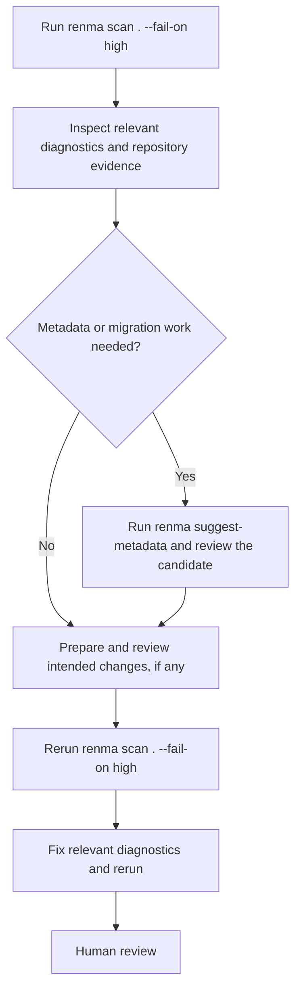

# renma User Manual

renma scans agent-facing repository assets and turns them into deterministic, agent-consumable reports. Use it to keep skills, shared context, prompts, docs, and ownership metadata reviewable in CI instead of relying on an LLM to infer repository intent.

## What Renma Does And Does Not Do

Renma is deterministic repository governance for context assets, skills, and agent-facing documentation. It reads local repository files, builds reviewable evidence, and reports what humans or coding agents should inspect.

Renma does not call an LLM, conduct an authoring conversation, ask the user
questions, retain session state, choose runtime context, assemble prompts,
inject context, execute agents, or collect telemetry.

Run `renma guide skill` before generation. It prints a deterministic protocol
that tells the consuming LLM to clarify the request, inspect applicable
user-provided artifacts, repository evidence, and permitted authoritative
source content, separate confirmed facts from proposals and unresolved human
truth, classify progression separately, and ask one to three focused questions
per batch while retaining the complete blocker set. Renma itself remains
non-interactive. The external LLM investigates and proposes, Renma validates
the supplied structure and repository evidence it can determine, and a human
reviews meaningful decisions. Renma does not independently certify that an
authoring conversation occurred or that caller-declared domain facts are true.

Before applying progression, distinguish decisions needed to author the Skill
contract from runtime task unknowns the finished Skill should detect, report,
request, or handle safely. Runtime task unknowns do not automatically block
creation, and “do not guess” does not mean stop on every unknown.

After blocking creation-gate decisions are resolved, platform-native Skill
authoring guidance may refine trigger descriptions, instructions, workflows,
constraints, completion criteria, and ambiguity-resolving examples only within
the agreed Renma boundaries. It is not the authority for Renma metadata,
Context placement, file count, source-of-truth representation, or support files
and scripts.

For agent workflows, the consuming LLM records the result in the versioned
`renma.skill-authoring-handoff.v1` exchange contract after the supplied state
declares no remaining Blocking decisions. The handoff is caller-declared
authoring evidence, not a Renma asset or conversation file:

```text
renma guide skill
  -> external LLM clarifies and reviews available evidence
  -> no declared Blocking authoring decision remains
  -> external LLM writes renma.skill-authoring-handoff.v1 JSON
  -> renma scaffold skill <agreed-path> --handoff <handoff.json>
  -> external LLM authors within the scaffold
  -> renma scan / catalog / graph / readiness
  -> human review
```

Renma reads this file locally, validates its version, bounded structure,
declared gate state, canonical Skill identity, target agreement, relationship
consistency, and resource kinds, then applies the supplied structural values.
It does not prove that clarification happened, every blocker was discovered,
a designated source is authoritative or was consulted, a human approved every
decision, or the declared facts are true. Proposed reversible defaults and
Unresolved Deferred items may remain; only a non-empty `progression.blocking`
list prevents scaffolding.

## Install And Build

From a checkout:

```bash
npm install
npm run build
```

Run the local CLI from the built entry point:

```bash
node dist/index.js scan .
```

When renma is installed as a package, use the `renma` binary:

```bash
renma scan .
```

For the canonical Skill format, scan validation, and one-way migration workflow,
see [Agent Skills Compatibility and Migration](agent-skills-compatibility.md).
Agent Skills results appear inside `scan`; there is no separate Skill-validation
command.

Operational Skills must be specification-valid Agent Skills. All Renma Skill
governance and security metadata uses flat, string-valued
`metadata.renma.*` entries. Legacy pre-0.16 top-level Skill metadata is accepted
only as migration input for `suggest-metadata`; non-Skill metadata behavior is
unchanged.

## Repository Layout

renma is most useful when agent knowledge is stored in predictable places:

- `skills/**/SKILL.md` and `.agents/skills/**/SKILL.md` are shorthand for the
  canonical Agent Skills roots and exact filename. A path crossing a reserved
  Skill-support directory is support, not an entrypoint; see the precise
  [entrypoint path contract](agent-skills-compatibility.md#entrypoint-paths).
  Renma still discovers historical `skill.md` and `*.skill.md` spellings under
  those roots for migration diagnostics.
  Historical spellings are not Agent Skills-compatible.
- `contexts/**` for shared context assets.
- configurable prompt or documentation paths for reusable prompts and broader docs.
- `renma.config.jsonc` is the recommended repository configuration filename;
  existing `renma.config.json` and `.renma.json` files remain supported.

Tool helper implementations usually belong under `tools/**`. They can be referenced from skills and commands, but they are not the same thing as user-facing documentation under `docs/**`.

Under explicit skill roots, `assets`, `examples`, `profiles`, `references`, and
`scripts` are reserved for skill-local support directories. These are valid
support paths:

- `skills/demo/assets/template.md`
- `skills/demo/examples/happy-path.md`
- `skills/demo/references/spec.md`
- `skills/demo/scripts/helper.sh`
- `skills/demo/profiles/local.md`

The same reserved names apply under `.agents/skills/**`.

These valid support paths are structurally Skill-local. Keep material local when
it is specific to one Skill. Promote reusable source-of-truth knowledge to an
owned Context Asset, or a helper shared across workflows to `tools/**`, only
when repository evidence supports that change; Renma does not move files
automatically.

Renma claims a parent only after repository evidence resolves exactly one Skill
entrypoint. When that resolved local support artifact does not declare an owner,
ownership, Readiness, graph, Trust Graph, and BOM reporting may use the parent
Skill's owner as deterministic effective ownership and mark it as inherited.
Missing or ambiguous parents never inherit. See
[classification evidence](diagnostics.md#how-to-read-classification-evidence)
for the detailed contract. This does not invent ownership for shared Context
Assets or unrelated repository files.

Only files marked Markdown-parser eligible contribute frontmatter metadata,
headings, links, code fences, and repeated-context evidence. Text scripts and
data assets remain raw text for dedicated static path and inventory analysis;
binary assets remain opaque. Renma does not analyze script or asset contents as
executable code. Security command analysis applies to eligible agent-facing
Markdown instructions that reference or invoke them. A separate raw
source-integrity check detects conservative hidden-Unicode signals in every
already-discovered text artifact without interpreting executable behavior or
widening discovery.

Avoid using reserved support directory names as skill names. Paths such as
`skills/assets/SKILL.md`, `skills/examples/SKILL.md`,
`skills/references/SKILL.md`, `skills/scripts/SKILL.md`, and
`skills/profiles/SKILL.md` are not treated as skill entrypoints by default. If
one of those files is intended to define a Renma skill, rename the directory, for example to
`skills/example-review/SKILL.md`. The same rule applies under `.agents/skills/`
and at any deeper level: `skills/demo/references/vendor/SKILL.md` remains
Skill-local Reference content owned structurally by `skills/demo`, not a nested
Skill.

Specification-valid Agent Skills declare governance and security values as
flat string-valued `metadata.renma.*` entries. JSON-array strings represent lists;
Renma does not treat comma-separated canonical values as lists. These canonical
values feed the same catalog, ownership, graph, readiness, BOM, Trust Graph,
lifecycle, and reporting behavior as the pre-0.16 fields they replace.

Canonical Skills may also declare exact static continuations with
`metadata.renma.continues-with`, using a JSON-array string of non-empty Skill
IDs or repository-relative `SKILL.md` paths. This field feeds only the prepared
Skill Discovery route index and does not enter the existing catalog dependency
collection. See the [Skill Discovery Graph contract](skill-discovery.md).

Renma does not fall back to top-level pre-0.16 Skill fields. Invalid, hybrid,
and pre-0.16 Skills can be scanned and migrated but contribute no operational
Skill metadata. Contexts, context lenses, profiles, references,
examples, agents, configuration files, and other non-Skill assets continue to
use their existing top-level metadata syntax.

## Authoritative Metadata Reference

This section is the complete field inventory for frontmatter metadata consumed
by Renma. Feature guides explain deeper semantics and edge cases, but this
section owns the Skill/non-Skill mapping, value shape, applicability, authoring
status, and primary projections.

### Metadata model and source selection

[Agent Skills](https://agentskills.io/specification) owns the portable Skill
top-level fields. Renma extensions for a canonical `SKILL.md` are flat entries
inside that portable `metadata` mapping:

```yaml
metadata:
  renma.owner: platform-team
  renma.tags: '["review","release"]'
  renma.network-allowed: "false"
```

Every Agent Skills metadata value is a string. Canonical Renma Skill lists are
therefore strings containing JSON arrays, and canonical booleans are quoted
strings. A nested `metadata.renma` mapping and unprefixed keys such as
`metadata.owner` are not canonical Renma Skill metadata.

Contexts, Context Lenses, profiles, references, examples, and other non-Skill
assets keep top-level Renma metadata. The normalized catalog accepts those
fields only on Markdown-parser-eligible assets classified as Context, Context
Lens, Profile, Reference, Example, Script, or Asset. Specialized non-Skill
parsers have the narrower applicability stated in the table. Raw Script and
Asset bytes cannot declare local security policy, although a uniquely resolved
Skill-local Script or Asset can inherit its owning Skill's effective policy.

Operational source selection is fail-closed:

```text
specification-valid canonical Skill
  -> recognized flat metadata.renma.* fields are operational

invalid, hybrid, or pre-0.16 Skill
  -> no operational Skill metadata
  -> recognized legacy fields are input only to suggest-metadata

non-Skill asset
  -> recognized top-level fields are operational for their stated parser
```

Unknown `renma.*` keys and other vendors' valid string metadata are preserved
but uninterpreted unless a current Renma registry recognizes them. Unknown
top-level non-Skill fields may remain in parsed source evidence, but they are
outside Renma's operational model unless a current parser is listed below.
Repository JSONC/JSON configuration has its own schema and is not frontmatter
metadata.

Metadata is governance and static declaration evidence. It does not replace
behavior-critical instructions, selection boundaries, permissions, stop
conditions, or source-of-truth boundaries in the Skill or asset body. Generic
Agent Skills clients may not expose vendor metadata to the model at all.

### Portable Agent Skills top-level fields

These are specification-owned fields, not `renma.*` extensions:

<!-- agent-skills-portable-fields:start -->
| Top-level field | Value format                                                                                                                                                       | Agent Skills requirement                                                   | Renma behavior                                                                               |
| --- | --- | --- | --- |
| `name` | Non-empty string; Renma validates 1–64 Unicode code points, lowercase NFKC form, letters/digits/hyphens, no edge or repeated hyphen, and immediate-directory match | Required | Skill identity validation and Discovery presentation |
| `description`   | Non-empty string, at most 1,024 Unicode code points                                                                                                                | Required; Renma recommends capability and usage boundaries                 | Portable Skill discovery text, quality and authoring diagnostics, and Discovery presentation |
| `license` | String | Optional | Agent Skills validation; not projected into Renma catalog metadata |
| `compatibility` | Non-empty string, at most 500 Unicode code points                                                                                                                  | Optional                                                                   | Agent Skills validation; not a Renma lifecycle or dependency declaration                     |
| `metadata`      | Mapping from string keys to string values                                                                                                                          | Optional in Agent Skills; required only when Renma extensions are declared | Container for flat `renma.*` and other vendor metadata                                       |
| `allowed-tools` | String                                                                                                                                                             | Optional                                                                   | Agent Skills validation; Renma does not treat it as a security-policy field                  |
<!-- agent-skills-portable-fields:end -->

`name` and `description` make a Skill portable; they do not make a hybrid or
otherwise invalid document operational. Renma authoring warnings do not by
themselves invalidate a specification-valid Skill.

### Renma operational metadata table

In the Skill column, a key means `metadata.<key>`. In the non-Skill column, a
key is top-level frontmatter. `—` means Renma has no operational equivalent on
that serialization surface. The markers delimit the rows checked against the
implementation-owned registries.

<!-- renma-operational-metadata:start -->
| Skill key                             | Non-Skill key                   | Value format                                                                                          | Applies to                                                                                   | Requirement / authoring status                                                                                 | Primary Renma effects                                                                                                                                                                                                                             |
| --- | --- | --- | --- | --- | --- |
| `renma.id`                            | `id`                            | Trimmed non-empty text                                                                                | Skill and cataloged non-Skill assets                                                         | Recommended for stable references; Context Lens requires `id`                                                  | Catalog identity, duplicate checks, inspect, graphs, BOM, Trust Graph, diff, and CI reporting                                                                                                                                                     |
| `renma.title`                         | —                               | Trimmed non-empty text                                                                                | Skill only                                                                                   | Optional                                                                                                       | Normalized Skill catalog and inspect presentation; top-level non-Skill `title` is not an operational equivalent                                                                                                                                   |
| —                                     | `type`                          | Trimmed text; `context_lens` is the supported Lens discriminator                                      | Non-Skill assets; only Context/Context Lens for Lens validation                              | Conditional when a file under a Context root must be classified as a Context Lens                              | Classification evidence, catalog kind, inspect, and Context Lens diagnostics                                                                                                                                                                      |
| `renma.version`                       | `version`                       | Trimmed text; a Context Lens accepts only `1` when present                                            | Skill and cataloged non-Skill assets                                                         | Optional                                                                                                       | Catalog, Context Lens validation, BOM, semantic diff, and CI reporting                                                                                                                                                                            |
| `renma.owner` | `owner` | Trimmed non-empty text | Skill and cataloged non-Skill assets | Context Lens requires it; recommended for shared Context; optional elsewhere | Declared/effective ownership, ownership reports, Readiness, BOM, Trust Graph, diff, and CI reporting |
| `renma.status`                        | `status`                        | `experimental`, `stable`, `suspended`, `deprecated`, or `archived`                                    | Skill and cataloged non-Skill assets                                                         | Optional lifecycle declaration; `suspended` is temporarily inactive and requires reason/date evidence          | Lifecycle/freshness findings, dependency review, Discovery publication eligibility, catalog, Readiness, BOM, Trust Graph, diff, and CI reporting                                                                                                  |
| `renma.status-reason`                 | `status_reason`                 | Trimmed non-empty text                                                                                | Skill and cataloged non-Skill assets                                                         | Required when status is `suspended`; optional for other statuses                                               | Reason for the latest reviewed lifecycle transition in catalog, inspect, Readiness, Discovery/Skill Index, BOM, Trust Graph, semantic diff, and CI reporting                                                                                      |
| `renma.status-changed-at`             | `status_changed_at`             | Real ISO date `YYYY-MM-DD`                                                                            | Skill and cataloged non-Skill assets                                                         | Required and blocking when status is `suspended`; optional for other statuses, but invalid declared dates warn | Date of the latest reviewed lifecycle transition in catalog, inspect, Readiness, Discovery/Skill Index, BOM, Trust Graph, semantic diff, and CI reporting                                                                                         |
| `renma.purpose`                       | `purpose`                       | Trimmed non-empty text                                                                                | Skill and cataloged non-Skill assets                                                         | Context Lens requires it; optional elsewhere                                                                   | Catalog/inspect metadata and Context Lens governance diagnostics                                                                                                                                                                                  |
| `renma.last-reviewed-at`              | `last_reviewed_at`              | Real ISO date `YYYY-MM-DD`                                                                            | Skill and cataloged non-Skill assets                                                         | Optional; recommended when freshness is governed                                                               | Freshness diagnostics, catalog, Readiness, BOM, semantic diff, and CI reporting                                                                                                                                                                   |
| `renma.review-cycle`                  | `review_cycle`                  | `P<positive integer>D`                                                                                | Skill and cataloged non-Skill assets                                                         | Conditional on cycle-based freshness review; meaningful with `last-reviewed-at`                                | Review-due calculation, freshness diagnostics, catalog, Readiness, BOM, diff, and CI reporting                                                                                                                                                    |
| `renma.expires-at`                    | `expires_at`                    | Real ISO date `YYYY-MM-DD`                                                                            | Skill and cataloged non-Skill assets                                                         | Optional                                                                                                       | Expiration findings, lifecycle/dependency review, catalog, Readiness, BOM, diff, and CI reporting                                                                                                                                                 |
| `renma.tags`                          | `tags`                          | Skill: JSON-array string; non-Skill: YAML list or comma-separated scalar                              | Skill and cataloged non-Skill assets                                                         | Optional                                                                                                       | Catalog, ownership grouping, graph/BOM/Trust Graph asset projections, semantic diff, and CI reporting                                                                                                                                             |
| `renma.when-to-use`                   | `when_to_use`                   | Skill: JSON-array string; non-Skill: YAML list or comma-separated scalar                              | Skill and cataloged non-Skill assets                                                         | Skill: recognized but deprecated for new authoring; active shared Context: recommended                         | Catalog usage-boundary evidence and Context diagnostics; canonical Skill discovery belongs in portable `description`                                                                                                                              |
| `renma.when-not-to-use`               | `when_not_to_use`               | Skill: JSON-array string; non-Skill: YAML list or comma-separated scalar                              | Skill and cataloged non-Skill assets                                                         | Skill: recognized but deprecated for new authoring; active shared Context: recommended                         | Catalog negative-boundary evidence and Context diagnostics; canonical Skill selection exclusions belong in portable `description`                                                                                                                 |
| `renma.requires-context`              | `requires_context`              | Skill: JSON-array string; non-Skill: YAML list or comma-separated scalar                              | Skill and cataloged non-Skill assets                                                         | Optional; required only when the declared relationship exists                                                  | Required catalog dependency, graph/composition/impact, Readiness, BOM, Trust Graph, semantic diff, and CI reporting                                                                                                                               |
| `renma.optional-context`              | `optional_context`              | Skill: JSON-array string; non-Skill: YAML list or comma-separated scalar                              | Skill and cataloged non-Skill assets                                                         | Optional                                                                                                       | Optional catalog dependency and the same static relationship projections                                                                                                                                                                          |
| `renma.requires-lens`                 | `requires_lens`                 | Skill: JSON-array string; non-Skill: YAML list or comma-separated scalar                              | Skill and cataloged non-Skill assets                                                         | Optional; required only when the declared Lens relationship exists                                             | Required Lens dependency, Lens usage diagnostics, graph/composition/impact, Readiness, BOM, Trust Graph, diff, and CI reporting                                                                                                                   |
| `renma.optional-lens`                 | `optional_lens`                 | Skill: JSON-array string; non-Skill: YAML list or comma-separated scalar                              | Skill and cataloged non-Skill assets                                                         | Optional                                                                                                       | Optional Lens dependency and the same static relationship projections                                                                                                                                                                             |
| `renma.conflicts`                     | `conflicts`                     | Skill: JSON-array string; non-Skill: YAML list or comma-separated scalar                              | Skill and cataloged non-Skill assets                                                         | Optional                                                                                                       | Conflict diagnostics, catalog dependency graph, BOM, Trust Graph, semantic diff, and CI reporting                                                                                                                                                 |
| `renma.superseded-by`                 | `superseded_by`                 | Skill: JSON-array string; non-Skill: YAML list or comma-separated scalar                              | Skill and cataloged non-Skill assets                                                         | Recommended when an asset is deprecated because a replacement exists; otherwise optional                       | Lifecycle/supersession diagnostics, reference edges, catalog, BOM, Trust Graph, diff, and CI reporting                                                                                                                                            |
| `renma.continues-with`                | —                               | JSON-array string of non-empty Skill IDs or repository-relative `SKILL.md` paths                      | Canonical Skill only                                                                         | Optional                                                                                                       | Parsed separately for prepared Skill Discovery, Skill Index, discovery graph, route/cycle diagnostics, Readiness evidence, semantic diff, and CI; never a catalog dependency                                                                      |
| —                                     | `applies_to`                    | YAML list or comma-separated scalar of Context IDs/paths                                              | Cataloged non-Skill assets via the general parser; supported authoring surface: Context Lens | Context Lens: required and target-validated; recommended authoring scope: Context Lens                         | Any catalog entry carrying a normalized value: metadata-declared `applies_to` dependency; Context Lens: requiredness, target resolution to Context Assets, Lens governance, inspect, graph, Readiness, BOM, Trust Graph, diff, and CI projections |
| —                                     | `focus`                         | YAML list or comma-separated scalar                                                                   | Cataloged non-Skill assets via the general parser; supported authoring surface: Context Lens | Context Lens: optional; recommended authoring scope: Context Lens                                              | General parser normalization and inspect presentation; Context Lens governance and meaningfulness checks; no dependency edge                                                                                                                      |
| —                                     | `expected_outputs`              | YAML list or comma-separated scalar                                                                   | Cataloged non-Skill assets via the general parser; supported authoring surface: Context Lens | Context Lens: optional; recommended authoring scope: Context Lens                                              | General parser normalization and inspect presentation; Context Lens governance and meaningfulness checks; no dependency edge                                                                                                                      |
| —                                     | `token_budget_override`         | Positive safe integer greater than the kind's default limit                                           | Markdown assets initially classified as Context, Reference, Profile, or Example              | Conditional; requires `token_budget_rationale` and is invalid when content is within the default limit         | Scan token-budget decision and quality finding details only                                                                                                                                                                                       |
| —                                     | `token_budget_rationale`        | Trimmed non-empty text                                                                                | Same eligible support-asset kinds as `token_budget_override`                                 | Required when an override is declared; otherwise non-operational                                               | Scan token-budget decision evidence only                                                                                                                                                                                                          |
| —                                     | `token_budget_reviewed_at`      | Real ISO date `YYYY-MM-DD`                                                                            | Same eligible support-asset kinds as `token_budget_override`                                 | Optional only when an override is declared                                                                     | Scan token-budget review provenance only; it does not create recurring freshness review                                                                                                                                                           |
| `renma.published-entrypoint`          | —                               | Exact string `"true"` only                                                                            | Canonical Skill only                                                                         | Optional one-state publication marker                                                                          | Parsed outside catalog metadata for prepared Skill Discovery, Skill Index, discovery graph, publication diagnostics, Readiness evidence, semantic diff, and CI reporting; no catalog dependency                                                   |
| `renma.network-allowed`               | `network_allowed`               | Skill: exact `"true"` or `"false"`; non-Skill: recognized boolean token                               | Canonical Skill or parser-eligible non-Skill Markdown                                        | Conditional security governance                                                                                | Effective security-policy resolution, instruction findings, Security Policy Inventory, BOM, Trust Graph, semantic diff, and CI reporting                                                                                                          |
| `renma.external-upload-allowed`       | `external_upload_allowed`       | Skill: exact `"true"` or `"false"`; non-Skill: recognized boolean token                               | Canonical Skill or parser-eligible non-Skill Markdown                                        | Conditional security governance                                                                                | Effective upload policy, destination/disclosure findings, inventory, BOM, Trust Graph, diff, and CI reporting                                                                                                                                     |
| `renma.secrets-allowed`               | `secrets_allowed`               | Skill: exact `"true"` or `"false"`; non-Skill: recognized boolean token                               | Canonical Skill or parser-eligible non-Skill Markdown                                        | Conditional security governance                                                                                | Effective secret-handling policy, findings, inventory, BOM, Trust Graph, diff, and CI reporting                                                                                                                                                   |
| `renma.requires-human-approval`       | `requires_human_approval`       | Skill: exact `"true"` or `"false"`; non-Skill: recognized boolean token                               | Canonical Skill or parser-eligible non-Skill Markdown                                        | Conditional security governance                                                                                | Effective approval policy, nearby-approval findings, inventory, BOM, Trust Graph, diff, and CI reporting                                                                                                                                          |
| `renma.allowed-data`                  | `allowed_data`                  | Skill: JSON-array string; non-Skill: YAML list or comma-separated scalar                              | Canonical Skill or parser-eligible non-Skill Markdown                                        | Conditional security governance                                                                                | Effective allowed-data policy, input findings, inventory, BOM, Trust Graph, diff, and CI reporting                                                                                                                                                |
| `renma.forbidden-inputs`              | `forbidden_inputs`              | Skill: JSON-array string; non-Skill: YAML list or comma-separated scalar                              | Canonical Skill or parser-eligible non-Skill Markdown                                        | Conditional security governance                                                                                | Effective forbidden-input policy, findings, inventory, BOM, Trust Graph, diff, and CI reporting                                                                                                                                                   |
| `renma.approved-network-destinations` | `approved_network_destinations` | Skill: JSON-array string; non-Skill: YAML list or comma-separated scalar                              | Canonical Skill or parser-eligible non-Skill Markdown                                        | Conditional when network access is declared or instructed                                                      | Effective destination policy, network findings, inventory, BOM, Trust Graph, diff, and CI reporting                                                                                                                                               |
| `renma.approved-upload-destinations`  | `approved_upload_destinations`  | Skill: JSON-array string; non-Skill: YAML list or comma-separated scalar                              | Canonical Skill or parser-eligible non-Skill Markdown                                        | Conditional when external upload is declared or instructed                                                     | Effective upload-destination policy, findings, inventory, BOM, Trust Graph, diff, and CI reporting                                                                                                                                                |
| `renma.allowed-floating-dependencies` | `allowed_floating_dependencies` | Skill: JSON-array string; non-Skill: YAML list or JSON-array scalar of valid `npm:`/`pypi:` selectors | Canonical Skill or parser-eligible non-Skill Markdown                                        | Optional, exceptional asset-local allowance                                                                    | Suppresses matching npm/PyPI floating-dependency findings only; recorded as local evidence but excluded from inheritance, effective-policy fingerprints/counts, and owning-Skill inheritance                                                      |
| `renma.security-profile`              | `security_profile`              | Trimmed non-empty profile name                                                                        | Canonical Skill or parser-eligible non-Skill Markdown                                        | Optional reusable-policy selection                                                                             | Profile-chain resolution and diagnostics, effective policy/inventory, BOM, Trust Graph, semantic diff, and CI reporting                                                                                                                           |
| —                                     | `scope`                         | Exact `context` when present; omission defaults to `context`                                          | Context Lens only                                                                            | Optional                                                                                                       | Context Lens scope validation and summary only                                                                                                                                                                                                    |
| —                                     | `target`                        | Presence is recognized; value is not selected as a target                                             | Context Lens only                                                                            | Deprecated; use `applies_to`                                                                                   | Deprecation diagnostic only                                                                                                                                                                                                                       |
| —                                     | `targets`                       | Presence is recognized; value is not selected as targets                                              | Context Lens only                                                                            | Deprecated; use `applies_to`                                                                                   | Deprecation diagnostic only                                                                                                                                                                                                                       |
| —                                     | `output`                        | Presence is recognized; value is not selected as output metadata                                      | Context Lens only                                                                            | Deprecated; use `expected_outputs`                                                                             | Deprecation diagnostic only                                                                                                                                                                                                                       |
| —                                     | `outputs`                       | Presence is recognized; value is not selected as output metadata                                      | Context Lens only                                                                            | Deprecated; use `expected_outputs`                                                                             | Deprecation diagnostic only                                                                                                                                                                                                                       |
| —                                     | `canonical_context`             | Comma-separated scalar of Context paths                                                               | Skill-local Reference only                                                                   | Recognized compatibility-only; do not add for new assets                                                       | Maintenance diagnosis for a deprecated local reference promoted to shared Context; not catalog metadata or a general dependency                                                                                                                   |
<!-- renma-operational-metadata:end -->

The table intentionally has no top-level non-Skill equivalent for
`renma.title`, continuation, or publication. A scaffolded non-Skill `title`
may remain useful to authors, and `suggest-metadata` may inspect it, but
`parseAssetMetadata()` does not normalize it. Likewise, `allowed-tools` is not
an alias for Renma security permission.

### External-upload governance reporting

`external_upload_allowed` and `requires_human_approval` remain independent
fields. Security Policy Inventory derives an additive combined count only after
the existing effective-policy resolver has applied local declarations,
profiles, repository configuration, and owning-Skill inheritance:

| External upload | Human approval | Inventory presentation |
| --- | --- | --- |
| `false` | any value | Upload denied |
| `true` | `true` | Upload allowed; approval required |
| `true` | `false` | Upload allowed; approval not required |
| `true` | unspecified | Upload allowed; approval requirement unspecified |
| unspecified | any value | Upload permission unspecified |

Both values being `true` means the effective static policy permits upload and
also requires human approval. Denied upload stays denied regardless of approval
metadata, and unspecified upload permission is never inferred as allowed from
an approval requirement. Approved upload destinations remain separate and do
not grant permission.

Renma reports this governance evidence in scan, Readiness, BOM, diff, and CI
inventory output. It does not execute an upload, request or record approval,
prove approval occurred, or enforce the requirement at runtime; the runtime or
agent layer must honor it. The reporting projection does not change effective
policy fingerprints, findings, Readiness scoring, or the separate scalar
transition rules for upload permission and human approval.

### Consolidated value formats and rejection rules

- Text fields become trimmed, non-empty strings where the parser defines text
  semantics. Empty text is generally treated as absent; a field-specific
  validator may also report it.
- Every canonical Skill metadata value must first be a YAML string. Canonical
  list fields contain JSON arrays whose members are strings. `[]` is valid.
  Renma trims members and drops empty members for ordinary catalog lists;
  `renma.continues-with` instead rejects an empty or whitespace-only member.
- Canonical security booleans accept only the exact strings `"true"` and
  `"false"`. The Discovery publication marker is one-state and accepts only
  exact `"true"`; `"false"` means invalid, not unpublished. Omission means
  unpublished.
- Top-level non-Skill catalog/security lists accept ordinary YAML block lists
  and the existing comma-separated scalar form. Top-level security booleans are
  case-insensitive `true`, `yes`, `allowed`, `allow`, or `1`, and `false`,
  `no`, `denied`, `deny`, or `0`. Prefer YAML `true`/`false` for new assets.
- Dates must be real calendar dates in `YYYY-MM-DD` form. Review cycles support
  only `P<positive integer>D`, such as `P90D`; months, years, zero, signs,
  fractions, and composite ISO durations are unsupported.
- `token_budget_override` must be a positive safe YAML integer, exceed the
  eligible artifact kind's default limit, and be needed by the measured
  content. It requires a non-empty rationale. `token_budget_reviewed_at` is
  optional but valid only alongside an override and does not imply a recurring
  review cycle.
- Lifecycle status is exactly `experimental`, `stable`, `suspended`,
  `deprecated`, or `archived`. Experimental and stable are declared active;
  suspended, deprecated, and archived are inactive for use. Omitted status
  retains its existing use-eligible meaning.
- `status_reason` describes the latest reviewed lifecycle transition, and
  `status_changed_at` dates that transition. It is distinct from
  `last_reviewed_at`, which records freshness review. A suspended asset requires
  both a non-blank reason and a real calendar date; other statuses accept both
  fields without requiring them.
- Suspension preserves inventory and evidence but excludes the asset from
  active dependency, composition, Skill publication, routing, reachability,
  coverage, and cycle use. A required direct declaration from an active source
  to a uniquely resolved suspended asset is an error; an optional declaration
  is a warning. An isolated suspended asset is not a blocker merely because it
  is suspended.
- A security profile is a non-empty selected name. The name must resolve in
  `security.profiles`; a missing or cyclic chain is diagnosed rather than
  silently substituted. Profile configuration uses the canonical camelCase
  field names documented in the
  [Security Policy Guide](security-policy.md#reusable-security-profiles).
  Legacy aliases remain accepted individually, but conflicting aliases for one
  semantic profile field are rejected as a configuration error.
- Floating-dependency allowances have an exact lowercase `npm:` or `pypi:`
  prefix followed by one supported package name and a selector classified as
  bare, dist-tag, range, or wildcard. They do not accept exact versions,
  variables, direct references, malformed selectors, Homebrew, or Docker.
  Matching is normalized but exact, not globbed or fuzzy.

Renma does not coerce comma-separated canonical lists, native YAML booleans for
canonical metadata, alternate canonical boolean casing, non-string JSON-array
members, malformed JSON, impossible dates, or unsupported duration forms.
Duplicate top-level Skill fields, duplicate `metadata` mappings, and duplicate
canonical child keys are ambiguous: Renma does not choose the first or last
value. Invalid recognized canonical security declarations fail closed and can
retain restrictive inherited policy while preventing permissive inheritance;
the [Security Policy Guide](security-policy.md) defines the field-specific
precedence and diagnostic behavior.

For example, suspend and later restore a Skill through two reviewed Git/PR
changes:

```yaml
metadata:
  renma.status: suspended
  renma.status-reason: Temporarily disabled while issue QE-1234 is corrected.
  renma.status-changed-at: "2026-08-03"
```

```yaml
metadata:
  renma.status: stable
  renma.status-reason: Restored after QE-1234 was corrected and verified.
  renma.status-changed-at: "2026-08-06"
```

Renma compares the three fields independently in semantic diff and CI evidence.
It does not store lifecycle history, schedule automatic expiry, or restore an
asset automatically; repository history remains the complete audit trail.

### Consumer and inheritance boundaries

Metadata-declared catalog dependencies come only from required/optional Context
and Lens fields, `applies_to`, conflicts, and supersession references. Renma
separately adds structurally derived static-support dependencies from
deterministic Skill-local containment and static-reference evidence; those
relationships are not frontmatter declarations. `continues-with` is a separate
Skill Discovery route declaration. `published-entrypoint` is separate
publication intent. Neither creates a catalog dependency or claims runtime
selection, loading, or execution.

Ownership inheritance is structural, not metadata merging: a Skill-local
support asset with no declared owner inherits only when Renma resolves exactly
one parent Skill with a declared owner. Missing or ambiguous parents remain
unowned. Shared Context assets never inherit an owner by path.

Security profile inheritance is a different mechanism. Valid asset-local
scalars take precedence over the selected profile chain; a child profile takes
precedence over its base. Allowed-data and forbidden-input lists use their
documented replacement/fail-closed rules, while approved network/upload
destinations accumulate from eligible profile and repository configuration
sources. Repository disallowed commands also accumulate. Separately, only a
uniquely resolved Skill-local Script or Asset inherits its owning Skill's
effective policy. Ordinary Skill-local References, Profiles, and Examples can
declare their own top-level policy but do not inherit the Skill's policy by
placement. `allowed-floating-dependencies` is always asset-local and never
participates in effective-policy inheritance or fingerprints.

The BOM and Trust Graph project normalized metadata and effective governance;
they do not make every declared field part of the same fingerprint. Discovery
publication and continuation remain outside catalog/BOM dependency metadata,
token-budget decisions remain quality-rule evidence, and compatibility-only
fields remain limited to their named diagnostics.

### Complete canonical Skill example

Save this as `skills/review-public-json/SKILL.md`. Its required Context target
is the complete Context example in the next section.

```markdown
---
name: review-public-json
description: Review a proposed public JSON change for compatibility and release risk. Use when a versioned Renma JSON contract may change; do not use for implementing the change or approving a release.
license: MIT
compatibility: Requires repository files and local Renma CLI output; no network access.
metadata:
  renma.id: skill.release.review-public-json
  renma.title: Review Public JSON Compatibility
  renma.version: "1.2.0"
  renma.owner: release-engineering
  renma.status: stable
  renma.last-reviewed-at: "2026-08-01"
  renma.review-cycle: P90D
  renma.expires-at: "2027-08-01"
  renma.tags: '["release","compatibility","json"]'
  renma.requires-context: '["context.release.public-json-compatibility"]'
  renma.optional-context: '[]'
  renma.conflicts: '[]'
  renma.continues-with: '[]'
  renma.allowed-data: '["repo-local-files","skill-bundled-context"]'
  renma.network-allowed: "false"
  renma.external-upload-allowed: "false"
  renma.secrets-allowed: "false"
  renma.requires-human-approval: "true"
  renma.forbidden-inputs: '["credentials","tokens","unsanitized-production-data"]'
---

# Review Public JSON Compatibility

## Required inputs

- The proposed JSON or schema diff.
- The current repository contract and release notes.
- `context.release.public-json-compatibility`.

## Workflow

1. Identify added, removed, renamed, or type-changed public fields.
2. Compare each change with the Context's compatibility criteria.
3. Separate compatible additions from breaking or unresolved changes.
4. Produce a review report with evidence paths, compatibility classification,
   release risk, and required follow-up.
5. Obtain explicit human approval before recommending release of a breaking or
   unresolved contract change.

## Hard constraints

- Do not fetch external sources, upload artifacts, or read secrets. Use the
  repository inputs; if required evidence is absent, report it as unresolved.
- Do not implement the change or approve the release. Return an evidence-backed
  review for the owning team to decide.

## Completion criteria

The report accounts for every public-contract change, cites repository
evidence, identifies unresolved facts, and records whether human approval is
still required.
```

The body repeats behavior-critical constraints because the security metadata
is governance evidence, not an instruction delivery mechanism. The empty
continuation array is valid and creates no route.

### Complete independent Context example

Save this as `contexts/release/public-json-compatibility.md`. It is independent
of the Skill: the Skill depends on the Context, while the Context retains its
own identity, owner, lifecycle, usage boundaries, and source-of-truth scope.

```markdown
---
id: context.release.public-json-compatibility
version: 1.0.0
owner: release-engineering
status: stable
purpose: Define the reviewed compatibility boundary for versioned public JSON contracts.
last_reviewed_at: 2026-08-01
review_cycle: P90D
expires_at: 2027-08-01
tags:
  - release
  - compatibility
  - json
when_to_use:
  - Reviewing a change to a versioned public JSON document or schema
when_not_to_use:
  - Reviewing internal diagnostic payloads with no published compatibility contract
allowed_data:
  - repo-local-files
network_allowed: false
external_upload_allowed: false
secrets_allowed: false
requires_human_approval: true
forbidden_inputs:
  - credentials
  - tokens
  - unsanitized-production-data
---

# Public JSON Compatibility Context

## Scope

Use this Context to classify changes to a repository-declared, versioned public
JSON contract. Additive optional fields are normally compatible. Removing a
field, renaming it, narrowing its accepted values, or changing its type requires
an explicit compatibility decision and release review.

## Review guidance

1. Compare the proposed and current contract from repository evidence.
2. Record every externally observable change.
3. Treat undocumented consumer assumptions as unresolved, not confirmed.
4. Require human approval before classifying a breaking or unresolved change
   as release-ready.

## Source-of-truth boundary

This Context is the maintained review policy for compatibility classification.
The versioned JSON contract in the target repository remains authoritative for
its actual fields and types, and release owners remain authoritative for
approval. Do not use this Context to invent missing schema details or consumer
requirements.
```

These two documents have matching IDs, dates, list encodings, policy, and body
constraints. They make no network, upload, secret, or external source-of-truth
claim and introduce no unresolved Lens or continuation target.

### Compatibility classification

- **Current canonical fields:** specification-valid Skills use the table's
  `metadata.renma.*` fields; supported non-Skill assets use the mapped top-level
  fields. Field omission remains allowed unless the table marks it required or
  conditional.
- **Recognized but discouraged:** `renma.when-to-use` and
  `renma.when-not-to-use` remain operational and preserved, but new canonical
  Skills should put portable discovery and exclusion semantics in
  `description`. Their top-level Context forms remain current and recommended
  for active shared Context usage boundaries. `canonical_context` is a narrow
  compatibility input to one maintenance diagnostic, not general metadata for
  new References.
- **Deprecated but retained operationally:** Context Lens `target`, `targets`,
  `output`, and `outputs` produce deprecation diagnostics and do not substitute
  for `applies_to` or `expected_outputs`.
- **Migration-only:** pre-0.16 top-level Skill governance and security fields
  are accepted only as one-way `suggest-metadata` input. They never merge with,
  override, or fall back from canonical metadata.
- **Preserved but uninterpreted:** unknown canonical `renma.*` keys and other
  vendors' valid string metadata remain portable metadata but have no Renma
  projection. Unknown top-level non-Skill fields remain outside the operational
  model unless added to a current parser registry.
- **Invalid or ambiguous:** a specification-invalid, hybrid, or pre-0.16 Skill
  contributes no operational Skill metadata. Duplicate canonical declarations
  are not resolved by ordering. Malformed recognized catalog values are absent
  or diagnosed by their field contract; malformed security, continuation, and
  publication declarations retain exact evidence and fail closed for their
  consumer.

## Quick Start

For a new repository that wants to record explicit Renma adoption and pin its
minimal initial repository policy, run:

```bash
renma init .
```

`renma init` initializes repository-level Renma configuration. It does not
create Skills or Context Assets. An existing repository can use Renma's
built-in defaults without running `renma init`, so initialization is not a
prerequisite for scanning or cataloging an existing repository.

For a first pass on an existing repository, run:

```bash
renma scan .
renma catalog . --format markdown
renma graph . --format markdown
renma skill-index .
renma readiness . --format markdown
```

Read these reports together:

- `scan` shows concrete problems to fix.
- `catalog` shows what assets and metadata Renma discovered.
- `graph` shows how skills and contexts are connected.
- `readiness` summarizes repository-level health and checks.

When creating a Skill, run `renma guide skill`; let the consuming LLM clarify
human truth, inspect relevant evidence, and pass the creation gate; then define
the smallest intended asset graph, record a
`renma.skill-authoring-handoff.v1` exchange artifact, run
`scaffold skill <path> --handoff <handoff.json>` once, create or reuse only
justified Context Assets, complete the focused workflow, and validate with
`renma scan . --fail-on high`. For deeper authoring guidance, see the
[Authoring Guide](authoring-guide.md). For rule details, see the
[Diagnostics Reference](diagnostics.md).

## LLM-Assisted Skill Maintenance

Renma output can support a human or coding agent, but the authoring and
governance responsibilities remain separate. Respect the repository's existing
Renma boundaries while using platform-native Skill authoring guidance to refine
semantics. Do not treat a clean scan as permission to invent domain knowledge
or as proof that the workflow is semantically correct or its source
authoritative.

Recommended loop for ordinary maintenance:

1. Run `renma scan . --fail-on high --format json`.
2. Inspect the target and relevant repository evidence.
3. Review triggers, instructions, workflow, constraints, and completion criteria
   when the requested change calls for semantic review.
4. Prepare a minimal patch without inventing domain knowledge, ownership,
   references, product rules, or source-of-truth claims.
5. Run `renma scan . --fail-on high`, fix relevant diagnostics, and rerun it.
6. Summarize changed files, resolved findings, remaining uncertainty, and
   verification commands.
7. Require human review before merging meaningful semantic changes.

Example instruction for an agent:

```text
Start with `renma scan . --fail-on high`, then inspect the target and only the repository evidence needed for the change. Make only evidence-backed changes. Do not invent owners, references, product rules, or source-of-truth claims. Preserve existing semantics unless a diagnostic or explicit requirement supports a change. Run `renma scan . --fail-on high` after editing, fix relevant diagnostics, rerun it, and summarize both resolved and remaining findings.
```

Use `renma guide skill` during existing-Skill work only when intentionally
reconsidering Skill or Context boundaries, file or resource placement, source
representation, scripts or other support, or the asset graph.

Recommended evidence-first preflight:

1. Run `renma scan . --fail-on high --format json`.
2. Run `renma inspect <SKILL.md> --format json`.
3. Inspect relevant local resources and referenced Context Assets.
4. Use `renma suggest-metadata` only when retrofit or migration evidence exists.
5. Prepare the smallest intended patch.
6. Rerun `renma scan . --fail-on high --format json`.
7. Stop without manufacturing work when `suggest-metadata` reports
   `decisionStatus: "no-change-recommended"`; this currently uses
   `suggestedMode: "no-proposal"`.
8. Report unresolved human decisions.

For one classification question, `renma inspect <target> --format json` may be
the initial preflight. Repository-wide work should normally start with `scan`.

## Context Asset Discovery Boundary

`contexts/**` is the preferred independent Context Asset root and `context/**`
remains supported. Nested directory names never override a recognized root.
Files under canonical Skill `references/`, `profiles/`, `examples/`, `scripts/`,
and `assets/` directories are structurally Skill-local. Renma claims one parent
and possible inherited governance only after repository evidence resolves
exactly one Skill under `skills/**` or `.agents/skills/**`. Supported explicit
local metadata remains valid but is not required. See
[classification evidence](diagnostics.md#how-to-read-classification-evidence)
for the detailed contract.

Top-level `references/**` is not a Context root. `tools/**` contains shared
repository implementation, not Context knowledge, and `skills/**/tools/**` is
not a canonical local support directory. Skill-local executable support belongs
under `scripts/`.

```text
contexts/foo/references/policy.md
  -> independent Context Asset

skills/foo/references/policy.md
  -> Skill-local Reference

references/policy.md
  -> outside the Context root

tools/helper.mjs
  -> repository implementation

skills/foo/tools/helper.mjs
  -> not canonical Skill-local support
```

Placement as independent Context is a human decision about ownership,
lifecycle, reuse, and source of truth. Classification after placement is
deterministic. Renma never moves a file based on content. A successful
`no-proposal` result means no edit should be manufactured.

## User Story: Create A New Skill With Scaffold

Use this flow when adding a new agent-facing Skill. Renma defines the repository
contract and creates one compatible starting point; platform-native Skill
authoring guidance refines Skill semantics within that contract only after the
clarification gate.


```mermaid
flowchart LR
  Guide["Run renma guide skill"] --> Clarify["LLM clarifies truth and batches blockers"]
  Clarify --> Structure["Declare no blockers and define the smallest asset structure"]
  Structure --> Handoff["Write renma.skill-authoring-handoff.v1"]
  Handoff --> Scaffold["Run renma scaffold skill --handoff once"]
  Scaffold --> Context["Scaffold or reuse justified Context"]
  Context --> Complete["Complete the focused workflow"]
  Complete --> Validate["Run renma scan . --fail-on high"]
  Validate --> Evidence["Classify findings and inspect evidence"]
  Evidence --> Boundary{"Asset boundary change?"}
  Boundary -- Yes --> Clarify
  Boundary -- No --> Fix["Apply uniquely supported repairs and rerun"]
  Fix --> Review["Human review"]
```

Renma creates and validates repository assets; the consuming agent follows the
finished Skill later according to its own runtime behavior.

1. Run `renma guide skill`. The consuming LLM develops a provisional
   understanding, inspects only applicable truth sources, separates Confirmed,
   Proposed, and Unresolved decisions from Blocking, Reversible default, and
   Deferred progression, and asks one to three focused questions per turn. The
   complete Blocking set remains visible; additional blockers are queued for the
   next batch rather than hidden or relabeled Deferred. The user need not provide
   a plan-quality specification. Repository evidence must be applicable,
   effective, and unambiguous; supplied artifacts need clear provenance and
   applicability; source content must be successfully consulted or supplied
   rather than recalled from model memory.

   Classify unknown scope before progression. Ask now or queue only authoring
   decision themes that block the current stage; use safe Proposed defaults,
   Defer non-material items, and make evidence-backed runtime unknowns findings
   in the finished Skill's output. Group related raw gaps into themes and
   reassess them only at meaningful workflow stage transitions. When the next
   execution stage depends on a runtime task unknown, treat it as a runtime-stage
   blocker and follow the Skill's authored ask, report, defer, or stop policy;
   do not add the task-instance fact to the authoring creation-gate blocker set.
   Return to authoring clarification only when that policy or an asset boundary
   is unresolved.

   Before creating files, establish the focused recurring task, expected result,
   meaningful completion or failure behavior, smallest justified structure,
   source authority, authoring-time consultation, finished-Skill runtime access,
   blocking security and domain decisions, and the file-mode owner. Wording,
   tags, examples, and speculative future extensions do not block creation.
   Proceed when no Blocking decision remains; visible safe reversible defaults
   and meaningful Deferred decisions may remain Proposed or Unresolved. See the
   [Authoring Guide](authoring-guide.md#progression-and-question-batches) for the
   complete batching and boundary-reconsideration protocol.

2. After the supplied state declares no Blocking decisions, have the external
   LLM write a `renma.skill-authoring-handoff.v1` JSON file. Its
   `currentUnderstanding` preserves Confirmed, Proposed, and Unresolved state;
   `progression` separately preserves Blocking, Reversible default, and Deferred
   state. It also records the core Skill contract, one Skill node, planned
   supporting Context or Context Lens nodes, local resources, source-authority
   status, security decisions, and runtime-unknown handling. It contains no
   finished Markdown or complete implementation plan.

3. Run the Renma generator once for the explicit target path.

```bash
renma scaffold skill skills/testing/spec-review/SKILL.md \
  --handoff /tmp/spec-review-handoff.json
```

The positional target must agree with `assetGraph.skill.path` after safe
normalization. `--handoff` cannot be combined with `--id`, `--title`, `--owner`,
`--tags`, or `--resources`; the handoff is the single structural authority.
Existing direct use with `--owner` remains supported when no handoff is
provided.

4. Open and review the generated Skill.

`scaffold` creates a starter file, not a complete production-ready Skill. Use
platform-native Skill authoring guidance only to refine the description,
instructions, workflow, constraints, completion criteria, and
ambiguity-resolving examples within the Renma asset and metadata boundaries.

The Skill scaffold writes canonical Agent Skills identity and
`metadata.renma.*` fields directly. Replace its placeholder prose and fill in
any required security policy before depending on it. Context and context-lens
scaffolds keep their existing top-level metadata shape. Preserve intended
repository behavior and do not invent owners, policies, dependencies, domain
rules, or source-of-truth claims.

Do not create a generic Skill for later Renma enrichment or run a second
independent generator against the same target. A tool that provides
platform-native Skill authoring guidance must not generate before the gate, add
assets outside the agreed structure, or create a second target; after the gate,
ask it only to refine semantics inside the existing Renma scaffold and graph.
If refinement reveals a justified asset-boundary change, stop structural edits,
record it as Proposed or Unresolved, inspect evidence, and re-enter the creation
gate before changing the structure.

5. Add a Context Asset when knowledge is reusable across Skills, has independent
   ownership or lifecycle, is maintained separately, is an authoritative source
   of truth, or has another explicit reason for independent review and
   governance. Source-of-truth status alone is sufficient; correctness
   importance alone is not.

```bash
renma scaffold context contexts/testing/boundary-value-analysis.md --owner qa-platform
```

Cross-Skill reuse is not required. An external authoritative URL normally
justifies a concise Context Asset through its user-designated source-of-truth
role. The designation does not confirm the source's schema, fields, constraints,
or behavior; those facts require successfully consulted or supplied content.
The Context records the governed source, URL, consultation rule, scope, and
fallback behavior without copying the full external document. After Context is
independently justified, use correctness dependency to choose a required versus
optional relationship.

Authoring-time consultation depends on the current request, tools, and
environment. If it is unavailable, request supplied content or keep dependent
facts Unresolved. Separately decide whether future execution fetches the URL or
expects approved supplied content. A Markdown URL does not grant runtime network
permission, and future Skill metadata never retroactively authorizes the
authoring agent. For runtime access, review the supported allowed-data, network,
approved-destination, external-upload, secrets, and human-approval policy. Keep
the Skill body, Context instructions, and effective policy aligned.

6. Connect the Skill to Context Assets.

In a canonical Skill, add `renma.requires-context` or
`renma.optional-context` under `metadata` as JSON-array strings. These fields
create static repository graph relationships. They do
not make Renma choose runtime context for an agent.

7. Run repository validation.

```bash
renma scan . --fail-on high
renma catalog . --format markdown
renma graph . --format markdown
renma readiness . --format markdown
```

7. Fix relevant diagnostics and rerun the scan.

Use `scan` for concrete problems, `catalog` for discovered assets and metadata,
`graph` for Skill-to-Context relationships, and `readiness` for repository-level
health. Classify each finding as a deterministic repair, repository
investigation, human decision required, or no change justified. Inspect before
asking when repository evidence may resolve the issue. A finding is not an
automatic repair merely because detection is deterministic: follow Diagnostics
v2 constraints, require a uniquely determined patch, and treat repeated-context
consolidation as investigation plus human review. If validation reveals a
possible boundary change, re-enter clarification and the creation gate. Do not
weaken security policy, manufacture metadata, or add suppressions merely to
pass. Rerun relevant validation after supported repairs and complete human
review.
Neither a clean scan nor a valid graph proves the external source is
authoritative or accessible at runtime.

Persist only durable reviewed workflow, boundary, relationship, authority,
fallback, metadata, and security decisions. Do not write the conversation
transcript, temporary Confirmed / Proposed / Unresolved summary, rejected
proposals, unanswered questions, or invented conversation-state metadata into
the repository.

8. Optionally generate a BOM for review or CI artifacts.

```bash
renma bom . --format markdown
renma bom . --format json
```

The BOM is a declared repository manifest. It combines catalog, graph, diagnostics, readiness, lifecycle, hash, and security posture evidence. It is not a record of actual LLM runtime usage. See the [Repository Context BOM contract](repository-context-bom.md) for v2 boundaries.

## User Story: Improve Existing Skills With Diagnostics

Use this flow for ordinary maintenance of an existing Skill. Start with
repository evidence and treat metadata suggestions as narrowly scoped
candidates.


```mermaid
flowchart TD
  Scan["Run renma scan . --fail-on high"]
  Scan --> Evidence["Inspect relevant diagnostics and repository evidence"]
  Evidence --> NeedMetadata{"Metadata or migration work needed?"}
  NeedMetadata -- Yes --> Suggest["Run renma suggest-metadata and review the candidate"]
  NeedMetadata -- No --> Prepare["Prepare and review intended changes, if any"]
  Suggest --> Prepare
  Prepare --> Validate["Rerun renma scan . --fail-on high"]
  Validate --> Fix["Fix relevant diagnostics and rerun"]
  Fix --> Review["Human review"]
```

LLM assistance is optional. Renma does not rewrite files or accept a proposed
change automatically.

1. Run `scan` on the existing repository.

```bash
renma scan . --fail-on high
```

`scan` reports concrete findings such as broken references, risky instructions, missing or invalid metadata, unclear workflow structure, and layout issues.

2. Inspect relevant repository evidence. Use only the views that answer the
   current question; they are not mandatory ceremony.

Inspect the current asset inventory when needed:

```bash
renma catalog . --format markdown
```

`catalog` helps you see existing skills, contexts, references, profiles, examples, IDs, owners, lifecycle states, hashes, tags, and declared dependencies.

Check graph relationships when needed:

```bash
renma graph . --format markdown
renma graph . --focus skill.testing.spec-review --format markdown
```

`graph` helps find missing context, broken references, unexpected isolation, and unclear dependencies. Focused graph output keeps one asset and its direct neighborhood so you can inspect one skill or context without reading the whole graph.

Check readiness when needed:

```bash
renma readiness . --format markdown
```

`readiness` gives a repository-level health score and checks. It is a static repository review signal, not a runtime decision about which context an agent should use.

Use `inspect` for one file:

```bash
renma inspect skills/testing/spec-review/SKILL.md
renma inspect skills/testing/spec-review/SKILL.md --lines L10-L42
```

Use this when you want a compact outline or exact line slice before editing a specific asset.

3. Use `suggest-metadata` only when metadata or migration work is needed.

```bash
renma suggest-metadata skills/testing/spec-review/SKILL.md --owner qa-platform --format prompt
```

`suggest-metadata` does not rewrite files. It emits a deterministic prompt or
JSON payload that a human or coding agent can use to prepare a reviewed metadata
or one-way migration patch while preserving the existing Markdown body. Review
the candidate and apply only intended changes.

For a `SKILL.md` target, the command proposes only the one-way transition from
pre-0.16 Renma Skill fields to Agent Skills identity plus flat
`metadata.renma.*` string values. Unsafe or ambiguous input blocks canonical
frontmatter output. When blocked, review the conflicts or invalid evidence,
confirm intent using platform-native Skill authoring guidance, do not apply a
candidate, correct the source evidence, and rerun `suggest-metadata`. See
[Agent Skills Compatibility and Migration](agent-skills-compatibility.md).

An already canonical Skill with no metadata or migration need should not pass
through `suggest-metadata` merely as ceremony.

4. Use `suggest-semantic-split` when a file has grown too large or mixes multiple purposes.

```bash
renma suggest-semantic-split docs/large-runbook.md
```

`suggest-semantic-split` does not rewrite files either. It packages source context and guidance so a human or coding agent can draft a reviewable split.

5. Prepare and review intended changes, then validate, fix relevant
   diagnostics, and rerun.

```bash
renma scan . --fail-on high
renma catalog . --format markdown
renma graph . --format markdown
renma readiness . --format markdown
```

The loop ends with human review. A metadata suggestion or clean scan does not
replace semantic review of the Skill.

For a repository-aware specification-review example using a Skill, a Context
Lens, and direct Context Asset relationships, see
[`examples/context-repo`](https://github.com/KazuCocoa/renma/tree/main/examples/context-repo).
It is statically navigable
only for a consumer with the repository checkout that follows the Skill and
Lens relative links; Renma validates the relationships but does not load them.

## Configuration

Use `--config <path>` with commands that scan the repository:

```bash
renma scan . --config renma.config.jsonc
```

JSONC is JSON with line and block comments. Comments let maintainers preserve
the human rationale for temporary governance exceptions, and are discarded
during parsing rather than exposed to Renma diagnostics or reports. Renma does
not execute configuration as JavaScript: `.js`, `.mjs`, and `.ts` configuration
files are not supported. Existing `.json` configuration remains valid.

For example:

```jsonc
{
  "security": {
    // Weakening an effective security boundary requires explicit review.
    "ci_policy": "fail"
  },
  "scan_boundary": {
    // A reviewed revision cannot narrow what CI is able to inspect or retain.
    "ci_policy": "fail"
  },
  "executable_surface": {
    // High-signal executable contract changes require explicit review.
    "ci_policy": "warn"
  },
  "skill_discovery": {
    "adopted": true,

    // Keep this warning-only until existing repositories complete migration
    // and maintainers have reviewed the observed warning quality.
    "ci_policy": "warn"
  }
}
```

The configuration supports the same names used by the implementation, including:

- `globs`: glob patterns to scan.
- `exclude`: paths or path prefixes to skip.
- `suppressions`: rule suppressions that remove matching findings from the
  active report and failure threshold while retaining them in structured
  `suppressedFindings` evidence.
- `max_file_size_bytes`: largest file renma will read for content analysis. A
  larger discovered file remains repository existence evidence, so a valid
  reference is not also reported as missing.
- `max_depth`: maximum discovery depth.
- `concurrency`: scan concurrency.
- `fail_on`: scan exit threshold: `low`, `medium`, `high`, or `critical`.
- `format`: default `scan` output format.
- `layout`: compatibility-only `tool_namespace` and `workflow_aliases` input retained for existing configurations. These fields are validated and normalized but do not currently change findings or force Skill-local support migration.
- `security`: command, network, upload, profile, and revision-review policy.
  `ci_policy` supports `off`, `warn`, and `fail`, defaults to `fail`, and
  governs effective boolean security-policy relaxations in `ci-report`.
- `scan_boundary`: revision-review policy for changes to `globs`, `exclude`,
  `max_file_size_bytes`, `max_depth`, and `suppressions`. `ci_policy` supports
  `off`, `warn`, and `fail` and defaults to `fail`.
- `executable_surface`: revision-review policy for high-signal changes already
  present in the canonical executable-surface diff. `ci_policy` supports
  `off`, `warn`, and `fail` and defaults to `off`. `renma init` does not enable
  it.
- `skill_discovery`: strict repository-wide Skill Discovery configuration.
  Supported keys are boolean `adopted` and string `ci_policy`. The policy
  supports only `off` and `warn`, defaults to `off`, and `warn` requires
  `adopted: true`. Unknown keys and unsupported values are errors. `renma init`
  does not enable adoption or the CI policy.

For `scan`, `--fail-on` and `--format` override the corresponding configuration
values. `--strict` is caller-selected execution policy and is never loaded from
repository configuration. Likewise, `ci-report --fail-on-status` is a
CI-integrator exit threshold, not repository policy. Other commands use their
documented command-specific format defaults and flags.

Within a canonical Skill entrypoint or one of its classified support documents,
helper commands may use `scripts/helper.mjs` or `./scripts/helper.mjs`; Renma
resolves these paths against the owning Skill directory. `tools/helper.mjs` and
`./tools/helper.mjs` resolve from the repository root. Explicit repository-root
paths such as `skills/testing/demo/scripts/helper.mjs`,
`.agents/skills/testing/demo/scripts/helper.mjs`, and
`tools/testing/helper.mjs` remain valid. Renma rejects helper candidates whose
relative traversal would escape the owning Skill boundary and checks existence
against the collected repository snapshot. It validates the declared path but
does not execute the command. Non-Skill documents do not receive an inferred
Skill-relative base.

Static support reachability accepts explicit Skill-relative paths, explicit
basenames, Markdown link targets, quoted/code-form paths, and one additional
hop through a directly referenced index/reference. Free-prose matches against
generic filename stems such as `run`, `check`, or `logo` are not evidence.
Extensionless executables and quoted or linked asset paths with spaces are
valid; `..` traversal outside the Skill root remains invalid.

Use `exclude` for files Renma should not scan. Use `suppressions` for audited
exceptions where Renma should scan the file, detect matching findings, omit
them from the active finding set and failure decision, and retain them in the
structured suppression ledger. A finding is never duplicated into both
`findings` and `suppressedFindings`. Each retained row identifies the finding,
severity/risk class, evidence location, matching rule and path pattern, reason,
and expiration. A suppression applies only when both `id` and `paths` match.
Each suppression includes `id`, `paths`, required `reason`, and optional
`expires`; the reason lives in config for auditability.

Use a date in `YYYY-MM-DD` for temporary workarounds, or `"never"` when the exception is intentionally permanent. Permanent suppressions should still use narrow path patterns and a clear reason. Suppression path patterns are repository-relative and support exact paths, directory-prefix matches for non-glob patterns, `*` within one path segment, and `**` across directories.

If `--config` is not provided, Renma checks the repository root in this order:
`renma.config.jsonc`, `renma.config.json`, then `.renma.json`. More than one
conventional file is an error because Renma does not choose, parse, or merge
ambiguous repository configuration. An explicit `--config <path>` selects that
`.json` or `.jsonc` file even when conventional files coexist; other extensions
are rejected.

Canonical Agent Skills entrypoints are:

These are qualified discovery shorthand globs; the structural exclusions in the
[entrypoint path contract](agent-skills-compatibility.md#entrypoint-paths) still
apply after a glob matches:

- `skills/**/SKILL.md`
- `.agents/skills/**/SKILL.md`

Renma also discovers these historical spellings for migration diagnostics:

- `skills/**/skill.md`
- `skills/**/*.skill.md`
- `.agents/skills/**/skill.md`
- `.agents/skills/**/*.skill.md`

Other default scan glob families are:

- `.agents/**/*.md`
- `AGENTS.md`
- `README.md`
- `context/**/*.md`
- `contexts/**/*.md`
- `lenses/**/*.md`
- `skills/**/profiles/**/*.md`
- `skills/**/references/**/*`
- `skills/**/examples/**/*.md`
- `skills/**/scripts/**/*`
- `skills/**/assets/**/*`
- `.agents/skills/**/profiles/**/*.md`
- `.agents/skills/**/references/**/*`
- `.agents/skills/**/examples/**/*.md`
- `.agents/skills/**/scripts/**/*`
- `.agents/skills/**/assets/**/*`
- `tools/**/*`

The two Skill roots intentionally use the same support discovery modes.
Profiles and examples are Markdown-oriented. References, scripts, and assets
may contain arbitrary file types. A discovered non-Markdown Reference remains
`reference` support and is not Markdown-parser eligible merely because the
default glob includes it.

## Where To Go Next

- New to Renma? Start with [Authoring Guide](authoring-guide.md).
- Writing security-sensitive skills or context assets? Read [Security Policy Guide](security-policy.md).
- Fixing scan findings? See [Diagnostics Reference](diagnostics.md).
- Reviewing thresholds? See [Renma Quality Profile](quality-profile.md).
- Trying a minimal clarify-before-act Skill interaction? Use
  [`examples/interactive-placeholder`](https://github.com/KazuCocoa/renma/tree/main/examples/interactive-placeholder).
- Trying richer repository-aware Skill, Context Lens, and Context Asset
  governance? See
  [`examples/context-repo`](https://github.com/KazuCocoa/renma/tree/main/examples/context-repo).
- Focusing specifically on Context Lens governance? See
  [`examples/context-lens`](https://github.com/KazuCocoa/renma/tree/main/examples/context-lens).
- Adding live Skill validation, composition, catalog, and CI evidence to GitHub
  Actions? See the
  [GitHub Actions example](https://github.com/KazuCocoa/renma/blob/main/examples/github-actions/renma-ci-report.yml).
  It updates one CI report comment for same-repository pull requests and keeps
  uploaded artifacts as the fallback for fork pull requests.

## Commands

For a mini-repository with a statically navigable Skill, a Context Lens, shared
Context Assets, ownership metadata, and graph relationships, see
[`examples/context-repo`](https://github.com/KazuCocoa/renma/tree/main/examples/context-repo).
The consumer must have the
checkout and follow the Skill and Lens relative links; the fixture is not a
portable self-contained Agent Skills package.

renma commands fall into a few groups:

- Repository adoption: `init` records a minimal explicit repository policy without creating assets.
- Inventory and ownership: `catalog` lists discovered assets and references, `ownership` summarizes owned and unowned assets, `graph` shows relationships between catalog nodes, `skill-index` shows static Skill Discovery first hops and declared continuations, `trust-graph` exposes deterministic trust evidence, and `bom` combines declared repository evidence into a reviewable Repository Context BOM, and experimental `execution-contract` projects one Skill's portable executable evidence closure.
- Local inspection and authoring: `guide` prints the deterministic pre-generation Skill authoring contract, `inspect` reads one file as an outline or exact line slice, `scaffold` creates starter assets or authoring prompts, `suggest-metadata` emits safe metadata retrofit guidance for existing assets, and `suggest-semantic-split` packages source context and helper commands so a human or coding agent can draft a split for mixed-purpose Markdown.
- Review and CI: `scan` emits deterministic findings, `readiness` turns repository state into checks and a score, `diff` compares two refs, and `ci-report` formats the comparison for pull-request review.

Use `renma --version` (or `renma -v`) to print the installed package version.

### Exit codes

The Renma CLI exposes one process-level exit-code contract:

| Exit code | Meaning |
| --- | --- |
| `0` | The command completed successfully. |
| `1` | The command completed and emitted its normal report, but the requested Renma policy or status gate did not pass. |
| `2` | The invocation, configuration, requested target, or Git comparison ref is invalid or unavailable and can be corrected by the caller. |
| `3` | Renma encountered an unexpected internal failure. |

Exit `1` is a completed semantic outcome, not a command-execution error. For
example, a `ci-report` that is generated successfully with status `FAIL` exits
`1`. A `ci-report` that cannot resolve its requested baseline ref exits `2`
without generating a report. An unexpected invariant or implementation failure
exits `3` with a concise stderr message. Successful reports and completed
exit-`1` reports remain on stdout; invocation, configuration, input, and
internal error messages use stderr. Exit codes are process metadata and do not
add fields to Renma's JSON report schemas.

## Scan, Catalog, Graph, Trust Graph, Readiness, And BOM

These commands are related, but they answer different repository-review questions.

| Command              | Main question                                                                                    | Best for                                                                                                 | Output shape                                                 |
| --- | --- | --- | --- |
| `scan`               | What concrete problems were found?                                                               | Fixing diagnostics and CI checks                                                                         | Finding list                                                 |
| `catalog`            | What assets exist?                                                                               | Reviewing IDs, owners, lifecycle metadata, hashes, tags, and declared dependencies                       | Asset inventory                                              |
| `graph`              | How are assets connected?                                                                        | Inspecting dependencies and references                                                                   | Asset relationship graph                                     |
| `execution-contract` | What executable relationships are statically possible from one Skill?                            | Binding a future external runtime trace to deterministic static repository evidence                      | Experimental `renma.experimental-execution-contract.v1` JSON |
| `skill-index`        | Where can static Skill Discovery begin and continue?                                             | Finding published entrypoints, declared continuations, reachability, coverage, and exact review evidence | Compact Markdown or `renma.skill-index.v1` JSON              |
| `trust-graph`        | What evidence helps reviewers decide whether assets are safe, owned, current, and usable enough? | Tracing owner, lifecycle, policy, dependency, reference, and diagnostic evidence per asset               | Evidence graph                                               |
| `readiness`          | Is the repository broadly ready for agent-facing use?                                            | Maintainer summary and CI reporting                                                                      | Repository-level scorecard                                   |
| `bom`                | What declared repository context manifest should reviewers inspect?                              | Combining catalog, graph, readiness, diagnostics, lifecycle, hashes, and security posture evidence       | Repository Context BOM                                       |

`catalog` is about what assets exist. `graph` is about how assets relate. `readiness` is about repository-level health score and checks. `trust-graph` is about traceability of trust-relevant evidence. `bom` is the reviewable declared repository manifest that combines asset inventory, dependencies, hashes, lifecycle, diagnostics, readiness, and security posture evidence.

Use `trust-graph` when a reviewer asks: "Why should this asset be considered safe, owned, current, and usable enough for an agent-facing repository?" The command does not decide that an asset is trustworthy. It connects deterministic evidence that humans and downstream tools can review: owner, lifecycle status, dependency and reference relationships, selected security profiles, effective policy fingerprints, and diagnostics.

In short:

- `scan` lists problems.
- `catalog` lists what assets exist.
- `graph` shows structural relationships.
- `execution-contract` packages one Skill's static possible executable closure.
- `skill-index` shows static Skill Discovery entrypoints and continuations.
- `trust-graph` connects trust-relevant evidence.
- `readiness` summarizes repository health.
- `bom` combines declared catalog, graph, readiness, diagnostics, lifecycle, hash, and security posture evidence.

Examples:

```bash
renma scan . --format json
renma catalog . --format json
renma graph . --format json
renma execution-contract . --entrypoint skill.release-prep --format json
renma skill-index .
renma skill-index . --format json
renma trust-graph . --format markdown
renma trust-graph . --format json
renma readiness . --format markdown
renma bom . --format json
renma bom . --format markdown
```

### `init`

Initializes repository-level Renma configuration at `root`, which defaults to
`.`:

```bash
renma init
renma init .
renma init path/to/repository
```

When no conventional configuration file exists, `init` creates a concise
`renma.config.jsonc` containing the initial `fail_on` and `format` policy plus
one comment demonstrating where to preserve the rationale for a temporary
policy exception. The command never overwrites, parses, normalizes, migrates,
or validates an existing `renma.config.jsonc`, `renma.config.json`, or
`.renma.json`. If multiple conventional files exist, `init` reports the
ambiguity and changes none of them.

Use `init` when a repository wants to record explicit Renma adoption. Existing
repositories can continue directly to `scan` because Renma operates with
built-in defaults when no configuration file exists. The command does not
create Skills, Context Assets, Context Lenses, example assets, or asset
directories, and it does not run any repository analysis command.

`renma scaffold` creates one explicitly requested Skill, Context Asset, or
Context Lens after its responsibility and asset boundary have been decided. It
does not initialize repository configuration. Init the repository. Scaffold an
asset.

### `scan`

Scans a target path and prints findings.

```bash
renma scan .
renma scan . --format json
renma scan . --fail-on high
renma scan . --fail-on high --strict
```

Without `--strict`, `scan` retains its finding-threshold contract: active
findings at or above `--fail-on` fail the command. Strict scan supplements that
threshold and also fails for a specification-invalid Agent Skill, any Renma
`error` diagnostic, or a blocking inspection-coverage issue. It does not make
warnings generally fatal, and active suppressions keep their existing meaning.
A below-threshold finding remains below threshold in strict mode.

Every scan includes `renma.inspection-coverage.v1` JSON evidence. It counts
expected first-class agent-facing paths, paths actually represented in parsed
semantic evidence, and blocking issues. Canonical Skill entrypoints and other
deterministically classified first-class agent-facing assets are blocking when
they are symlinks, unreadable, oversized, depth-limited, or otherwise present
but unavailable to semantic inspection. Blocking issues distinguish `exact`
expected artifacts from `subtree` traversal boundaries. A symlinked,
unreadable, or depth-limited directory under `skills`, `.agents/skills`,
`contexts`, `context`, `lenses`, or `.agents` is a subtree issue when the
configured globs can select first-class descendants there; the evidence names
the affected boundary without guessing a hidden descendant path. Relevance is
decided conservatively from the glob's literal prefix before its first magic
segment: a provably disjoint prefix is ignored, while character classes,
extglobs, braces, and other magic remain potentially overlapping. Exact
non-glob paths use precise descendant and classification checks. Explicit
scan-boundary exclusion is not a single-revision coverage failure. Ordinary
unsupported repository subtrees such as `tools/vendor-cache` do not turn
strict scan into a requirement to parse every file. Renma never follows a
blocked subtree or repository symlink.

Human-readable output states whether inspection was complete, so zero findings
with blocking coverage issues is not described as a complete result. The JSON
output includes findings, evidence, diagnostics, `diagnosticsV2`,
`reviewBundles`, `trustGraph`, `executableSurfaceInventory`, inspection
coverage, and summary data that other tools can consume.

Output includes scan findings, discovery or catalog diagnostics, the effective exit threshold, and evidence paths or snippets for each finding. `diagnosticsV2` adds typed repair constraints, structured verification steps, and concise LLM hints; `reviewBundles` groups related diagnostics for code review.

`executableSurfaceInventory` uses schema
`renma.executable-surface-inventory.v1`. An executable surface is an
already-discovered repository-local Skill script or `tools/**` helper that
falls within Renma's existing bounded helper evidence. Rows report normalized
path, scope, content classification and hash, conservative interpreter hints,
static references and invocations, Skill-local reachability, and bounded
security-policy correlation. Invocation rows retain launcher, target, source
line, exact resolution state, and invocation-context governance evidence.
Current rows also include bounded static executable dependency evidence and a
per-surface `direct`, `transitive`, or `unreached` projection.

These layers have separate responsibilities: the executable surface inventory
describes executable behavior Renma can statically observe in one revision;
the executable surface diff describes what changed between two revisions; and
`executable_surface.ci_policy` selects which high-signal diff transitions
affect `ci-report` status. Evidence generation does not depend on enabling the
policy.

Executable TypeScript surface extensions are `.ts`, `.mts`, and `.cts`, in
addition to the established JavaScript, Python, and shell extensions. `.tsx`
and `.jsx` are not executable surfaces in this release. This is static
repository evidence and does not claim that every Node configuration executes
TypeScript.

Dependency analysis is deliberately limited to two private built-ins:

- `js-ts` analyzes text `.js`, `.mjs`, `.ts`, `.mts`, and `.cts` surfaces. It
  recognizes static string-literal ESM imports and `export ... from`
  declarations, including multiline, semicolonless, and import-attribute forms.
  Targets must start with `./` or `../` and explicitly end in `.js`, `.mjs`,
  `.cjs`, `.ts`, `.mts`, `.cts`, `.py`, `.sh`, or `.bash`.
- `python` analyzes text `.py` surfaces. It recognizes only explicit relative
  `from` imports. A module produces exact `.py` and `/__init__.py` candidates;
  `from . import helper, parser` produces separate candidate sets. Multiple
  parsed candidates are `ambiguous`.

The JS/TS collector ignores `.cjs` sources, `.jsx`, `.tsx`, dynamic `import()`,
CommonJS `require`, packages, `node:` built-ins, absolute paths, template
specifiers, query/fragment suffixes, extensionless imports, TypeScript
declaration-level type-only syntax, and named import or re-export clauses made
entirely of inline `type Binding` or `type Binding as Alias` specifiers. Mixed
type/runtime clauses, default imports, namespace imports, and bindings
literally named `type` remain runtime evidence. `import = require`, compiler
substitution, directory indexes, aliases, package exports, project references,
and import maps are also excluded. The Python collector ignores `.pyi`, `.pyc`,
absolute imports, dynamic import helpers, package metadata, virtual
environments, `PYTHONPATH`, runtime `sys.path` changes, and implicit
containing-package edges. Neither collector executes code or implements a
complete parser.

Dependency targets resolve only to surfaces already in the inventory.
`not-inventory` means the exact parsed repository file exists but is outside
that surface boundary. Other states are `resolved`, `missing`, `unsafe`,
`ambiguous`, `noncanonical`, `excluded`, `deep`, `oversize`, `unsupported`,
`symlink`, and `unreadable`. Python preserves every candidate and sets
`normalizedTarget` only when selection is deterministic.

Every recognized syntactic declaration remains an auditable dependency row and
contributes to `totalDependencies`, including identical declarations on the
same source line. Public rows retain line numbers and occurrence ordinals; the
private source offset used to distinguish declarations is not emitted. Graph
topology instead contains one edge per unique source path and normalized target
for `resolved` and `noncanonical` rows. Analyzer, relation, line, raw specifier,
and occurrence ordinal do not distinguish graph edges. Incoming/outgoing
counts, adjacency, reachability, and semantic diff graph signatures share this
unique edge set.

Directly invoked surfaces have minimum dependency depth `0`; a reachable
imported surface is `transitive` at its minimum breadth-first depth; otherwise
it is `unreached`. Cycles terminate, direct wins over transitive, and imports
from unreached sources do not seed reachability. `invokedSurfaces` remains the
direct count, so `uninvokedSurfaces` may include both transitive and unreached
surfaces. “Uninvoked” does not mean unused, and transitive evidence is not
runtime proof.

Surface policy evidence and invocation-context policy evidence have different
meanings. Surface evidence belongs to or is inherited by the executable surface
itself. Invocation-context evidence records prepared policy rows associated
with the instruction artifact and its structurally resolved owning Skill.
Calling-Skill policy is never assigned to a shared repository tool.
Invocation-context policy is not propagated, merged, intersected, or checked
for conflicts across executable dependency edges.

Invocation governance retains `source-artifact` and `owning-skill`
relationships separately, including useful negative evidence. Renma does not
merge their policy fields, select a precedence winner, or expose complete
effective-policy values. “With effective policy evidence” means only that at
least one recorded relationship already has effective policy evidence.
Multiple distinct fingerprints describe visible policy variants; they are not
a conflict, safety result, or compliance verdict.

Default scan text is action-oriented. A healthy inventory renders one compact
line with total surfaces, direct/transitive static reachability, resolved invocation coverage, and
invocation-context policy-evidence coverage; a surface-only inventory reports
that no invocations were recognized and reports zero transitive reachability.
Scan JSON and BOM JSON/Markdown retain the complete inventory.

Scan text expands to `Executable Surface Review` only for missing, unsafe,
unscoped, non-canonical, or unavailable invocations; non-canonical surfaces;
unreachable Skill-local surfaces; invocations without effective context-policy
evidence; invocations with multiple effective fingerprints; or dependency rows
that are not `resolved`. Expanded output includes a bounded
`Review dependencies:` section with source line, analyzer, relation, target
candidates, and exact resolution. It does not print complete source files.
Output is bounded and includes only relevant surface, invocation, and
dependency evidence.
Repository-tool surface-policy absence, unreferenced tools, and uninvoked tools
do not trigger review by themselves. Dependency `unreached` state also does not
trigger review by itself. The review is informational and uses neutral evidence
terminology.

Canonical scopes are `skill-local` for a script under the resolved owning
Skill's `scripts/**`, and `repository-tool` for a helper under repository-root
`tools/**`. Discovered scripts without one of those supported placements remain
visible as `noncanonical`; the inventory does not silently discard them.
Skill-local reachability uses the same static reference graph and minimum depth
as existing support diagnostics. Repository tools have no invented owning
Skill or Skill reachability state.

The inventory recognizes only the existing `node`, `bash`, `sh`, `python`, and
`python3` helper grammar and supported helper extensions. Interpreter hints
come from recognized launchers, a bounded first-line shebang for text files,
then a supported extension fallback. Hints are descriptive evidence, not an
execution decision.

Direct helper commands remain recognized on fenced-code lines. Renma also
recognizes this exact bounded inline form:

```markdown
Run `node tools/check.mjs`.
Run: `python scripts/check.py`.
- Run `bash scripts/check.sh` before proceeding.
```

The complete command must occupy one `inlineCode` node on one source line. Its
direct mdast parent must be a paragraph, and the visible paragraph text before
the code span must normalize to exactly case-sensitive `Run` or `Run:`.
Top-level, ordered-list, unordered-list, and nested-list paragraphs qualify,
including a soft source wrap between the cue and code span. Harmless formatting
of the cue with emphasis or strong may qualify when it contains only allowed
textual cue content and its visible text remains exactly `Run`. Markdown line
breaks are whitespace and HTML comments may be ignored. Links, images, inline
code, non-comment HTML, reference-like nodes, and unsupported descendants
cannot contribute cue text; in particular, a link label or image alt value of
`Run` is not an imperative cue. The command span itself must still be a direct
paragraph child.

Headings, blockquotes, linked commands, emphasized or strongly formatted
command spans, frontmatter, HTML-comment examples, multiline code spans, and
ordinary inline code are excluded structurally. Blockquotes are intentionally
excluded because quoted material may be an example or copied external
instruction. Lowercase or case-insensitive cues, other English verbs,
multilingual cues, broad prose classification, and shell prompt stripping are
not supported. For example, `Then run`, `Do not run`, `Try`, `Run this:`, and
bare `` `node tools/check.mjs` `` remain outside the grammar.

Only the span immediately following the exact cue can qualify. In
``Run `node tools/check.mjs`; pass `--local` when requested.``, the command is
one invocation and the option span is not another. In
``Run `/status` and `node tools/smoke.mjs`.``, the second span is not
recognized because its preceding visible paragraph text is no longer exactly
the cue. Chained commands, alternatives, and secondary spans are deliberately
deferred.

Inline and fenced commands use the same helper parser, path resolver,
invocation governance, and executable-dependency reachability. A path already
visible as a static reference on the same source path and line remains one
reference rather than being counted again when it becomes an invocation.
Inline syntax adds no origin field or separate public schema: scan JSON and BOM
use the established invocation rows. Recognition is deterministic,
reporting-only, and does not execute the command or imply general
natural-language understanding.

Invocation resolution distinguishes `resolved`, `missing`, `unsafe`,
`unscoped`, `noncanonical`, `excluded`, `deep`, `oversize`, `unsupported`,
`symlink`, and `unreadable`. Unavailable targets never become invented surface
rows. Path safety and scope are resolved first, then exact repository
availability; canonical surface scope is considered only for parsed targets,
so a non-canonical path never hides missing or unavailable evidence. A parsed
Skill-local target is resolved only with exactly one owning Skill.

Shebang evidence requires `#!` at offset zero of the original first line.
Indented or byte-order-mark-prefixed text is not a shebang; recognized
invocation launchers and supported file extensions remain independent
interpreter hints. Renma does not follow symlinks, inspect executable permission
bits, execute/import/compile/sandbox files, or classify ordinary external
commands.

### `catalog`

Builds a deterministic catalog of discovered assets.

```bash
renma catalog . --format json
renma catalog . --format markdown
```

Use the catalog to review asset IDs, owners, status, dependencies, and metadata-derived references.

Output includes catalog assets, dependency edges, owners, lifecycle status, tags, and diagnostics.

### `bom`

Prints a declared Repository Context BOM.

```bash
renma bom .
renma bom . --format json
renma bom . --format markdown
renma bom . --format json --omit-generated-at
```

Use the BOM when reviewers or CI consumers need one repository evidence manifest
that combines existing Renma evidence. Renma supports only v2, the first
supported long-term BOM contract; there is no v1 compatibility mode. V2 includes
normalized declared/effective ownership plus static support relationships. See
the [Repository Context BOM contract](repository-context-bom.md).

The BOM is not a record of actual LLM runtime usage. Renma does not collect telemetry, assemble prompts, choose task-specific context, inject context into agents, import consumed-context evidence, or claim what an LLM actually consumed.

JSON is the source of truth for automation. Markdown is a compact pull-request review view.

Renma derives each BOM from one in-memory repository snapshot: configuration, discovered artifacts, parsed documents, catalog, graph evidence, diagnostics, readiness, and security summaries all come from the same collected state.

BOM v2 additively includes the complete `executableSurfaceInventory`
projection—schema, summary, surface, invocation, and dependency rows—so consumers can
audit and diff the same evidence emitted by scan. No standalone executable BOM
command is needed. Current output includes invocation governance and per-surface
invocation aggregates, dependency rows, and per-surface dependency summaries
unconditionally. The published BOM v2 schema keeps those additive fields
optional at the compatibility boundary so earlier 0.27.x BOMs remain valid;
each new object is strict when present. BOM v2 and executable-surface inventory
v1 versions are unchanged.

By default, `generatedAt` records when the BOM was produced. Add `--omit-generated-at` when CI or review automation needs to avoid clock-based diffs. With the same checkout path, config path, repository contents, Renma version, and UTC evaluation date, repeated `--omit-generated-at` runs should produce byte-identical JSON. The option does not remove metadata freshness dates, suppress freshness diagnostics, normalize absolute `root` or `configPath`, hide file moves, or guarantee portable byte-for-byte output across runners.

### `execution-contract`

This experimental command generates one portable static-evidence contract for an exact Skill ID or
repository-relative `SKILL.md` path:

```bash
renma execution-contract . \
  --entrypoint skill.release-prep \
  --format json

renma execution-contract . \
  --entrypoint skills/release-prep/SKILL.md \
  --source-revision <git-sha> \
  --format json
```

The schema identity is
`renma.experimental-execution-contract.v1` with `stability: "experimental"`;
this first shape has no long-term compatibility promise. Every canonical
`invokes` relationship has `expectation: "possible"`. Direct and transitive
repository-script relationships reuse the executable graph's canonical edge
semantics, while line-level duplicates remain in each relationship's evidence.
`contains` remains separate structural placement and is never traversed as
invocation. Neither relationship implies ownership, exclusive belonging,
required execution, runtime use, or authorization. A suspended Skill retains
its declared lifecycle evidence, but generating its contract does not permit
execution.

The command calls repository collection once and derives every section from
the same in-memory snapshot. It does not call the public BOM or graph commands,
embed an absolute checkout root, or add `generatedAt`. Repeated output is
byte-identical for the same repository contents, configuration, Renma version,
evaluation date, entrypoint, and supplied revision value.

The artifact exposes three complementary identities:

| Identity         | Produced by                     | What it binds                                                         |
| --- | --- | --- |
| `sourceRevision` | Caller, optional and unverified | A supplied revision provenance value                                  |
| `evidenceDigest` | Renma, always present           | The selected execution-contract evidence projection                   |
| External SHA-256 | Caller, optional                | Exact serialized JSON bytes, including `sourceRevision` when supplied |

`evidenceDigest` uses SHA-256 with scope
`selected_execution_contract_evidence_v1`. Renma calculates it from a
versioned, domain-separated canonical payload containing the subject identity
and content hash, projected executable surfaces and hashes/fingerprints,
canonical and structural relationships, exact auditable relationship and
unresolved evidence rows, bounded coverage/observation facts, and relevant
diagnostics. Duplicate evidence remains digest-relevant even when topology is
deduplicated.

The embedded payload excludes `sourceRevision`, itself, absolute checkout-root
identity, timestamps, and output formatting. It is independent of checkout
location and caller revision labels, but changes with selected content or
auditable evidence. Unrelated files outside the selected projection do not
change it. Exact source-authored evidence is retained, including unsafe
absolute targets recognized from repository content. The digest works for
dirty working trees, non-Git directories, extracted archives, and other VCS
checkouts without inspecting Git state. It is not a repository hash,
repository snapshot hash, Git-tree hash, or complete filesystem hash.

An external SHA-256 over `execution-contract.json` remains a separate exact-
artifact identity. It covers the serialized formatting, optional
`sourceRevision`, and embedded digest. That external hash is performed by the
caller; Renma calculates the embedded selected-evidence digest.

`unresolvedEvidence` preserves relevant recognized evidence that did not
become topology, including resolution classifications, raw targets or
specifiers, paths, lines, launchers/analyzers, candidates, and occurrence
ordinals. Zero unresolved rows means only that no unresolved recognized static
evidence was observed. The bounded analyzers do not prove absence of dynamic,
unsupported, or runtime-only behavior, and this phase performs no drift or
runtime comparison.

`--source-revision` is recorded verbatim with `providedBy: "caller"` and
`verifiedByRenma: false`. It complements the Renma evidence digest and is not a
more authoritative version of that identity. Renma does not invoke Git or
claim that the value matches the analyzed files. For historical evidence, the
caller creates a detached worktree and supplies the same commit:

```bash
revision=<git-sha>
worktree=$(mktemp -d)

git -C /path/to/repository worktree add --detach "$worktree/repository" "$revision"

renma execution-contract "$worktree/repository" \
  --entrypoint skill.release-prep \
  --source-revision "$revision" \
  --format json \
  > execution-contract.json

sha256sum execution-contract.json
```

Git/worktree creation and exact-artifact hashing are caller operations, not
Renma operations.
Observation schemas, runtime-log import, conformance verification, and
allowed/required/forbidden, ordering, call-count, approval, and execution-policy
semantics remain deferred. See the dedicated
[Experimental Execution Contract](execution-contract.md) document.

### `skill-index`

Prints the canonical static Skill Index from one shared repository snapshot and
its already prepared Discovery index:

```bash
renma skill-index
renma skill-index .
renma skill-index . --format markdown
renma skill-index . --format json
renma skill-index . --json
renma skill-index . --focus skill.release-prep --format markdown
renma skill-index . --focus skills/release-prep/SKILL.md --format json
```

Markdown is the default compact human/agent view. JSON uses
`schemaVersion: "renma.skill-index.v1"` and preserves the existing complete
Discovery Skill and route structures, adoption, repository-scoped coverage,
publication and reachability facts, structural-root, standalone, and unrouted
IDs, and separate repository and Discovery diagnostic arrays. Repository
diagnostics stay repository-wide in a focused report. Route-cycle warnings
appear naturally in the existing Discovery diagnostic array and affected Skill
or route `linkedDiagnostics`; the v1 schema and top-level shape do not change.

Focus accepts only an exact effective Skill ID or exact repository-relative
`SKILL.md` source path. It retains the selected Skill and its direct incoming
and outgoing declarations without transitive traversal. It does not accept
titles, tags, aliases, basenames, suffixes, case-insensitive or fuzzy matches,
or task text. Selecting focus does not make a Skill reachable:

```text
coverage is repository-scoped

summary and visible ID arrays are projection-scoped
```

The command writes only to stdout and creates no `.renma/` directory, config,
metadata, or generated index. It does not interpret a user request, recommend
or rank Skills, load Context, assemble prompts, infer undeclared routes, call an
LLM, invoke a child Skill, or execute a workflow. Warnings still produce exit
`0`; an error in either diagnostic collection produces exit `1`; invalid CLI,
config, focus, or report construction produces exit `2`.

Open the referenced source `SKILL.md`, apply its description and routing
conditions, and follow only a declared continuation supported by those source
conditions. Renma reports possible declared paths; it does not choose them.

### `graph`

Prints the relationship graph between assets.

```bash
renma graph . --view summary
renma graph . --view workflow --format markdown
renma graph . --view full --format mermaid
renma graph . --view layered --format mermaid
renma graph . --view discovery --format markdown
renma graph . --view composition --focus skill.testing.spec-review --format json
renma graph . --view impact --focus context.shared-api --format markdown
renma graph . --view executable --focus skill.release-prep --format markdown
renma graph . --view executable --focus tools/check-changelog.sh --format markdown
```

Views are:

- `summary`: compact graph overview.
- `workflow`: workflow-oriented relationships.
- `full`: all known graph edges.
- `layered`: Mermaid-focused graph grouped by asset kind so skill-to-lens-to-context paths are easier to read. `lens` is accepted as an alias.
- `composition`: the focused root's complete explicit required and optional
  Context/Lens closure. This view requires `--focus`.
- `impact`: the focused asset's complete reverse explicit required and optional
  Context/Lens closure, including declared dependent Skills. This view requires
  `--focus`.
- `discovery`: exact declared Skill-to-Skill continuations, route
  eligibility/usability, declaration evidence, diagnostics, structural roots,
  and standalone Skills. Focus is optional and exact.
- `executable`: normalized Skill-to-script and script-to-script invocation
  relationships plus independent deterministic Skill-local structural
  containment. Focus is optional and accepts either a Skill ID/path or an
  executable path.

Layered Mermaid output groups skills, context lenses, contexts, support assets, and unresolved targets into separate subgraphs. JSON and Markdown keep the same node and edge detail while reporting the selected view.

#### Inspect executable relationships

Use the executable view to answer either direction of the same canonical
relationship:

```bash
# Scripts invoked by a Skill
renma graph . --view executable --focus skill.release-prep --format markdown

# Skills using a repository script
renma graph . --view executable --focus tools/check-changelog.sh --format markdown
```

`invokes` edges come from normalized executable invocation evidence and the
same canonical deduplicated script dependency topology used by inventory
counts, adjacency, reachability, fingerprints, and diff signatures where
applicable. Repeated declaration locations remain in the invocation and script
dependency evidence tables while producing one graph edge. A script invoked by
multiple Skills is labeled as shared, and focusing that script renders the
canonical relationship in reverse as `used by`.

`contains` is separate structural evidence: Renma emits it only for a script
inside the canonical `scripts/**` boundary of one uniquely resolved Skill.
The reverse human label is `belongs to`; it means structural placement only.
Invocation does not imply ownership, containment does not imply exclusive use,
and a shared or repository-root script may be invoked without being contained.
Observed absolute external executable targets are labeled separately and never
receive containment. Ordinary external-command discovery remains outside the
bounded helper grammar.

JSON preserves detailed evidence rows under `executable`; Markdown presents
the relationship neighborhood and evidence tables; Mermaid distinguishes
Skill, repository-script, and external-executable nodes and uses separate edge
labels. If no canonical relationship is available, the view explains the
normalization boundary and directs the reader to
`scan --format json` → `executableSurfaceInventory` for unresolved evidence.

The composition view expands only `requires_context`, `optional_context`,
`requires_lens`, `optional_lens`, and Lens `applies_to`. It reports the root,
required and optional members, line-level declaration provenance, unknown and
wrong-kind targets, required and optional cycles, declared conflicts, lifecycle
and freshness concerns, and separate `requiredComplete`, `optionalComplete`,
and `cycleFree` flags. It does not expand `references`, `conflicts`,
`superseded_by`, ownership, policy, static support, or `extends`.

Renma models explicit composition, not general natural-language inheritance.
Declaration order does not define precedence, overriding, or conflict winners.
The same stable asset ID appears once while all declaration provenance remains.
A composition may be complete and still cyclic. See the
[Declared Composition contract](declared-composition.md).

The impact view traverses incoming forms of the same five composition
relationships. It reports required and optional dependents, required and
optional affected Skills, direct versus transitive status, original-direction
declaration provenance, and invalid resolved incoming declarations. An
all-required dependent-to-focus route is required impact; any optional
declaration keeps that route optional upstream. Required classification wins
when both route classes reach the same stable ID, while both provenance classes
remain visible.

Impact does not expand general references, conflicts, `superseded_by`,
ownership, policy, static support, lifecycle, or `extends`. It does not infer an
unresolved declaration's target or invent Skill-to-Skill composition. A
resolved asset with no incoming composition declarations returns a successful
empty report. See the [Declared Impact contract](declared-impact.md).

The discovery view expands canonical `metadata.renma.continues-with` items and
the exact string marker
`metadata.renma.published-entrypoint: "true"`. It resolves one exact stable asset ID or
repository-relative source path, rejects absolute and repository-escaping
paths, and never matches aliases, titles, tags, basenames, suffixes, prose, or
ordinary Markdown links. Resolution remains separate from route usability, so
invalid, inactive, duplicate-ID, wrong-kind, ambiguous, and missing targets
stay visible without becoming authoritative graph edges. Structural roots are
route-eligible Skills with no incoming usable route; they are not published
entrypoints or coverage claims. Publication is explicit and additionally
requires a valid, active, unique-ID canonical Skill. Repository-wide adoption
is declared separately by boolean `skill_discovery.adopted`; the view reports
`not-adopted`, `partial`, `incomplete`, or `adopted`. Effective published
entrypoints seed cycle-safe traversal over only usable representative resolved
Skill-to-Skill routes. Partial adoption with an effective entrypoint reports
descriptive reachability; adopted repositories report authoritative coverage
and one warning per not-reached eligible Skill. JSON coverage counts remain
repository-scoped under `--focus`, while visible ID arrays and summary counts
are filtered to the exact direct-neighborhood projection. JSON, Markdown, and
Mermaid use one index prepared in the repository snapshot. See the
[Skill Discovery Graph contract](skill-discovery.md).

The same authoritative usable route graph is checked for self-loops and
multi-Skill strongly connected components. `DISCOVERY-ROUTE-CYCLE` reports one
warning per maximal component with complete internal declaration evidence.
Cycle detection runs repository-wide before focus; a focused report retains the
warning when any internal cycle route is visible. A cycle is static
continuation evidence, not proof of runtime recursion. Traversal remains
cycle-safe, and an intentional bounded review or retry loop may remain after a
human reviews its stop, ask, retry, handoff, and completion behavior.

The graph forms answer distinct questions:

| Form                      | Question                                                                                                                                                          |
| --- | --- |
| `full` without focus      | What is in the whole catalog graph?                                                                                                                               |
| `full` with focus         | What is the direct incoming and outgoing neighborhood?                                                                                                            |
| `composition` with focus  | What is in the transitive outgoing composition closure?                                                                                                           |
| `impact` with focus       | What is in the transitive incoming composition closure?                                                                                                           |
| `discovery` without focus | Which eligible Skills are reachable from explicit published entrypoints through usable declared continuations, and is that evidence descriptive or authoritative? |
| `discovery` with focus    | What global reachability state and direct incoming/outgoing declarations touch this exact Skill while repository adoption and coverage stay repository-scoped?    |

#### Focusing The Graph

The graph command can be focused on one asset with `--focus <asset-id-or-path>`.

Use this when you want to inspect the local neighborhood around one context asset, skill, or other catalog entry instead of reading the entire repository graph. A focused graph is useful for answering questions such as:

- What does this asset depend on?
- What other assets reference this asset?
- Is this asset connected to the expected parts of the context repository?
- Is this asset isolated or unexpectedly central?

Examples:

```bash
renma graph . --focus context.testing.boundary-value-analysis
renma graph . --focus contexts/testing/boundary-value-analysis.md --view full
renma graph . --focus skill.testing.spec-review --view composition --format markdown
renma graph . --focus context.shared-api --view impact --format markdown
renma graph . --focus skill.review-request --view discovery --format markdown
```

`--focus` accepts one value. The value must match either a catalog asset ID, a repository-relative source path such as `contexts/testing/boundary-value-analysis.md`, or an absolute source path. It does not match projected `summary` view node IDs such as `contexts/testing/*`.

Discovery focus is narrower: it accepts one exact Skill ID or
repository-relative Skill source path and shows only direct incoming and
outgoing declared continuation routes. A duplicate Skill ID makes ID focus
ambiguous, so use one exact `SKILL.md` path. Discovery focus performs no fuzzy
matching or automatic transitive traversal.

For summary, workflow, full, and layered views, `--focus` keeps the matched
asset, its directly connected incoming and outgoing graph edges, and the assets
at the other ends of those edges. The composition view instead uses the focus
as the root of its transitive outgoing declared closure. The impact view uses
the focus as the target of its transitive incoming declared closure. If the
focus value does not match an asset ID or source path, the command exits with
usage code `2` and reports that `graph --focus did not match any asset id or
source path`.

For non-transitive projections, `--focus` runs before view grouping. For
example, `--view summary --focus <asset>` selects the focused neighborhood and
then groups that smaller graph. Composition and impact have no depth option
because each resolves a finite explicit closure; repeated `--focus` flags are
not a multi-focus API.

Note: this graph `focus` argument is a CLI option. It is not a metadata field on an asset.

Output includes graph nodes, relationship edges, declaration form and evidence,
unresolved targets, and diagnostics. Composition JSON adds the complete
composition-specific report; impact JSON adds the complete impact-specific
report; discovery JSON adds visible Skill identities, all declarations,
resolution and usability, evidence, structural roots, standalone IDs, and
route diagnostics. Mermaid output renders the selected repository graph as a diagram
definition, never runtime execution flow. Declared Impact is change-review
scope evidence, not actual runtime usage or guaranteed breakage.

### `trust-graph`

Prints deterministic Trust Graph evidence derived from catalog, graph, scan, and security policy data.

```bash
renma trust-graph . --format markdown
renma trust-graph . --format json
renma scan . --format json
```

Use this when a reviewer or downstream tool needs one stable evidence layer that links assets to owners, lifecycle status, declared dependencies, selected security profiles, effective policy fingerprints, and diagnostics.

Trust Graph is repository evidence. It does not compute a trust score, select or inject runtime context, assemble prompts, call an LLM, collect telemetry, or enforce policy at runtime.

Renma supports only Trust Graph v2, the first supported long-term contract. It
includes normalized ownership and static `owns_local_resource`,
`statically_references`, `inherits_owner`, and `inherits_policy` evidence. JSON
is the source of truth; Markdown is for human review. `scan --format json`
includes the same v2 contract under `trustGraph`.

Consumers must branch on `schemaVersion`, not on the Renma package version.
Changes within v2 must remain additive and backward-compatible; an incompatible
change requires a new schema version.

Reviewers can use Trust Graph to find assets without owners, find assets without lifecycle status, inspect assets sharing the same effective policy fingerprint, and connect diagnostics back to asset evidence. `trust-graph` exits `0` when the report is generated successfully; use `scan --fail-on` when CI should fail on findings.

### `inspect`

Inspects one file as an outline or exact line slice.

```bash
renma inspect skills/testing/spec-review/SKILL.md
renma inspect contexts/testing/boundary-value-analysis.md --format json
renma inspect skills/testing/spec-review/SKILL.md --lines L10-L42
```

Use this when editing one skill or context file and you want a deterministic outline without reading the whole repository catalog. Without `--lines`, output includes file size, line count, frontmatter range, headings, code fences, links, asset relationships, and a concise Context Lens governance summary when repository context can be inferred. It also always includes `classification` with `kind`, `scope`, `matchedRule`, `reasonCode`, root or parent evidence, and concise competing rules. A Skill-local path exposes `parentAssetCandidatePath`; `parentAssetPath` appears only when `parentResolution` is `resolved`, while `missing` and `ambiguous` remain explicit fail-closed states. `governance` is separate and reports ownership, policy, and metadata provenance only from repository evidence. Unknown files and repository tools still receive classification. Use `--lines <range>` for an exact source slice; ranges can look like `L10-L42` or `10-42`. `--lines` output itself is unchanged.

JSON also includes `repositoryBoundary`. Resolved results record the root,
repository-relative path, and resolution source. Unresolved results retain a
stable reason code and `candidateRoots`; structural ambiguity uses
`repository-boundary-ambiguous` instead of selecting a broad ancestor.

For a file target, Renma resolves a repository root from an explicit caller root,
the nearest safe `.git` file/directory or Renma config marker, or an unambiguous
structural boundary, in that order. Current-working-directory containment alone
does not establish a repository. This keeps nested repositories and absolute
targets outside the current directory deterministic without scanning an
unrelated parent tree.

### `readiness`

Prints a deterministic readiness report.

```bash
renma readiness .
renma readiness . --format markdown
renma readiness . --format json
```

Readiness combines catalog diagnostics, Context Lens governance diagnostics, ownership metadata, graph resolution, required and optional context references, asset status, selected scan findings, and a compact projection of the prepared Skill Discovery index.

Readiness answers whether the repository currently passes Renma's readiness
gates. The authoritative JSON `level` remains `ready`, `needs_attention`, or
`not_ready`: a score of at least 90 with no failing check is `ready`, 70-89
with no failing check is `needs_attention`, and a score below 70 or any failing
check is `not_ready`. `renma readiness` exits `0` only for `ready`; both other
levels exit `1`.

Markdown adds a presentation-only `Status` so actionable evidence does not
look contradictory beside a `ready` level:

- `Ready`: level is `ready`, with no warning check, warning diagnostic, or finding.
- `Ready with advisories`: level is still `ready`, with at least one warning check, warning diagnostic, or finding. An info diagnostic alone is not an advisory.
- `Needs attention`: level is `needs_attention`.
- `Not ready`: level is `not_ready`.

`Ready with advisories` is not a fourth machine state and still exits `0`.
Warning-check and finding counts are shown separately because the underlying
evidence can overlap. Findings on a `ready` report appear as non-blocking
findings: they remain actionable, but they do not make the repository Not Ready
unless an existing readiness score or check rule says so. Finding severity and
Readiness blocking status are separate dimensions.

Output includes a readiness score and level, workflow checks, Context Lens counts, diagnostics, scan findings, graph or ownership summary data, and `summary.skillDiscovery`. The Skill Discovery summary reports the existing adoption state and counts for effective published entrypoints, route-eligible Skills, reachable and not-reached Skills, unrouted Skills, usable and unusable routes, unresolved routes, and maximal cyclic components. It does not embed the complete Skill or route graph.

The focused checks are `discovery.publication`,
`discovery.route_validity`, `discovery.coverage`,
`discovery.unrouted_skills`, and `discovery.cycle_review`. Coverage gaps are
authoritative only when `skill_discovery.adopted: true`; partial and
not-adopted coverage is descriptive and does not reduce the score. Cycles
remain warning-level review evidence and do not by themselves make a
repository not ready. These checks add no scoring weight, and Discovery
diagnostics are referenced rather than duplicated or penalized again.

Markdown includes compact `Context Lens` and `Skill Discovery` sections. Run
`renma skill-index` for the complete static Discovery report or
`renma graph --view discovery` for topology and source evidence.

Security posture, Context Lens, and Skill Discovery summaries remain static repository evidence in this report. Readiness does not accept task text, select or execute a Skill, choose runtime context, assemble prompts, inject context, or describe what an LLM actually used.

### `diff`

Compares deterministic repository evidence for two git refs.

```bash
renma diff . --base origin/main
renma diff . --from main
renma diff . --from main --to HEAD
renma diff . --from main --to HEAD --format markdown
```

Use this to review changes in Renma evidence between branches or commits. This is
not a generic source-code diff.

Exactly one baseline is required: `--from <ref>` or its ergonomic alias
`--base <ref>`. Renma does not guess a baseline, and supplying both options is
an exit-`2` usage error even when their values match. `--to <ref>` defaults to
the concrete Git ref `HEAD`; it does not mean the uncommitted working tree.
Explicit `--to` still selects another target ref. Renma compares the requested
refs directly and does not substitute a merge base. Invalid baseline or target
refs exit `2`, with no generated comparison report.

Output includes readiness deltas, changed assets, graph edge changes, check
changes, added or removed findings, and an additive
`renma.skill-discovery-diff.v1` section. It also includes an
`executableSurface` section with count deltas, added/removed/changed surface
paths, concise change reasons, semantic invocation-resolution changes, and
line-insensitive invocation-governance changes. It reports line-insensitive
added/removed executable dependencies, dependency resolution changes, new
dependency evidence for review, newly transitive surfaces, lost static
invocation reachability, and meaningful minimum-depth changes. Dependency edge
count changes use `dependency-graph`; reachability/depth changes use
`invocation-reachability`. Import-only changes are not classified as
`invocations`, `invocation-governance`, or `security-policy`. Caller-only aggregate changes
use `invocation-governance`; `security-policy` remains reserved for changes to
the surface's own policy evidence. These governance changes are informational:
no combined policy, conflict classification, or enforcement decision is
derived. Generated diff JSON also lists newly added invocations that already
carry multiple effective fingerprints, separately from path/resolution
problems and from governance changes to invocations present at both endpoints.
The Discovery section reports exact
adoption and coverage transitions, count deltas, published entrypoint changes,
newly reachable/not-reached and newly/resolved unrouted Skill identities,
route additions/removals/state changes, and added/resolved cyclic components.

Asset comparison also uses the canonical catalog content hash. Newly generated
JSON includes endpoint `contentHash`, a `contentChanged` boolean on changed
asset rows, and `summary.contentChangedAssets`; `changedFields` remains limited
to governance metadata such as path, kind, ownership, and lifecycle. A
content-only edit is therefore a changed asset even when `changedFields` is
empty. Markdown reports the content-change count and, for bounded changed-asset
details, the before/after hashes. This remains semantic identity evidence, not
a generic source-hunk renderer.

Legacy or partially comparable snapshots do not assert that content stayed
unchanged. `contentChanged` is omitted for an asset unless both endpoint hashes
are present, and the aggregate content-change count is omitted unless every
shared asset is comparable. Comparable changed rows may still retain their
individual hash evidence in a partially comparable report.

Skills are identified by repository-relative path and ID. Routes are grouped
by normalized source Skill path and normalized declared target, so declaration
reordering, YAML array position, and source-line movement do not create false
changes. Duplicate declarations change one `declarationCount`; resolution,
candidate, target, lifecycle, usability, and reason changes under the same
identity remain a changed route instead of removal plus addition. Cycle
identity uses the sorted maximal component member IDs.

The `renma.scan-boundary-diff.v1` section separately records canonical endpoint
boundaries and every exact weakening or tightening fact. Its endpoint evidence
uses `renma.scan-boundary.v1` and contains config path (or `null` for defaults),
sorted exact glob and exclusion declarations, maximum file size and depth, and
active suppression declarations. Exact string identity is intentional because
runtime discovery passes those declarations directly to `path.matchesGlob` and
the exclusion predicate; evidence does not erase leading `./`, trailing `/`, or
backslash differences. Suppression paths remain separately normalized according
to their runtime matcher. Suppressed finding ledgers remain available under the
finding diff. The other semantic sections report facts only and do not affect
the direct `diff` command exit code. Markdown caps detailed lists and directs
readers to JSON for omitted entries.

### `ci-report`

Formats a diff result for CI or pull-request review.

```bash
renma ci-report . --base origin/main
renma ci-report . --from main
renma ci-report . --from main --to HEAD --format markdown
renma ci-report . --from main --to HEAD --format json
renma ci-report . --from main --to HEAD --fail-on-status warn
```

`ci-report` uses exactly the same ref contract as `diff`: one mandatory
`--from` or `--base` baseline, a `--to` default of the Git ref `HEAD`, a
from/base conflict error, and exit `2` for an invalid requested ref.

The report summarizes readiness deltas, graph-resolution changes, added and
removed findings, inspection-coverage regressions, and policy-relevant status.
By default (`--fail-on-status fail`), `PASS` and `WARN` exit `0` and `FAIL`
exits `1`. With `--fail-on-status warn`, `PASS` exits `0` while `WARN` and
`FAIL` exit `1`. The threshold never changes the semantic report status and is
never read from repository configuration. Usage, command, configuration,
target, or ref errors exit `2`; unexpected Renma failures exit `3`. See
[Exit codes](#exit-codes) for the authoritative process contract.

A worse readiness level, a previously passing readiness check becoming
failing/error, a new blocking readiness check, or a newly introduced blocking
inspection-coverage issue makes the report at least `WARN`; an independently
failing condition remains `FAIL`. Existing baseline coverage issues are not
revision regressions. Coverage diff containment is subtree-aware: a baseline
exact path that was parsed and then falls below a target blocked subtree is
reported as a meaningful regression, and a newly blocked agent-facing subtree
is reviewable even when no exact baseline asset path is known. Target-state
rejection of an already-existing issue is the responsibility of
`scan --strict`.

Output includes a CI status (`PASS`, `WARN`, or `FAIL`), a summary, readiness
changes, graph changes, review-focused finding changes, and Skill Discovery
topology changes. An informational `Executable Surface Changes` section reports
surface deltas, added/removed/changed paths, new unresolved, unsafe,
non-canonical, or unavailable invocation evidence, Skill-local reachability
changes, surface policy-evidence coverage, invocation-context policy-evidence
deltas, newly observed invocations without effective policy evidence, gained
or lost evidence, total before/after multiple-fingerprint counts, newly added
multi-fingerprint invocations, and governance changes involving multiple
effective fingerprints. It also reports dependency totals, resolved counts,
analyzer counts, new dependency evidence for review, dependency resolution
changes, newly transitive surfaces, and surfaces that lost static invocation
reachability. The bounded dependency and governance lists use neutral evidence
terminology, omit complete fingerprints, and do not enter
`newProblematicInvocations`. The detailed evidence does not by itself affect
the CI verdict; the separate executable-surface CI evaluator consumes only its
documented high-signal item-level transitions. Newly generated JSON includes the complete
`renma.skill-discovery-diff.v1` value once at top-level `skillDiscovery` plus
one `renma.skill-discovery-ci-policy.v1` evaluation at top-level
`skillDiscoveryPolicy`. It also includes one
`renma.security-policy-ci-policy.v1` evaluation at top-level `securityPolicy`;
the nested `diff.security.policyTransitions` array is the canonical per-asset
scalar/list transition evidence consumed by that evaluation. New reports also
include `renma.scan-boundary-ci-policy.v1` at top-level `scanBoundaryPolicy`.
Reports also include `renma.executable-surface-ci-policy.v1` at top-level
`executableSurfacePolicy`, with archived `from`, `to`, and stricter `effective`
modes, outcome, match count, and complete structured matches. The scan-boundary
evaluation's `effectiveBoundary` is `renma.ci-evidence-boundary.v1`: target repository
paths are evaluated against both archived endpoint coverage predicates and the
inspected-path union is retained. `sourceBoundaries` (ordered base then target)
and `inspectedPaths` are authoritative; flattened glob, exclusion, and limit
fields are a deterministic envelope for review rather than a new merged-glob
language. Repository semantic configuration, including
effective security policy and Skill Discovery semantics, remains revision-local.
Only evidence coverage is fail-closed against target-only narrowing. The
existing nested `diff` remains Discovery-policy-free. Diff endpoints also expose
the readiness ownership numerator, eligible-asset denominator, and coverage
percentage while retaining the existing `summary.ownershipCoverageDelta` field.

Markdown is a bounded, progressively disclosed review artifact. Its always
visible portion shows status, range, readiness, ownership coverage, non-zero
summary deltas, the content-changed asset count when available, and review notes
so `WARN` and `FAIL` reasons remain immediately
visible in a pull request. When detailed evidence changes without affecting
those net deltas, compact non-zero change groups also call out affected assets,
graph edges, checks, Skill Discovery, executable surfaces and governance,
findings, or security-policy metrics. A true no-change report omits this
overview instead of printing a zero-filled inventory.

Readiness details, semantic changes, executable-surface evidence, security
metrics, and unchanged inventory are grouped under a collapsed
`Full report details` disclosure.

The detailed Markdown shows before/after ownership counts and percentages,
added and changed asset metadata with canonical declared and effective
ownership, added and removed graph edges with resolution state, readiness check
status/severity and summary changes, and concrete security policy inventory
deltas. Each detail collection uses the shared presentation limit and directs
reviewers to JSON when more items exist. JSON remains the complete, unbounded
machine-readable report and is unaffected by Markdown disclosure.

A content-only asset edit is neutral by itself: it does not change CI status or
the command exit code. It remains visibly reviewable as a changed asset, while
an independently added high/critical finding or governed policy regression can
make the same edit `FAIL`.

When an asset's normalized effective security boundary changes, the `Security
Changes` section under `Full report details` adds only the non-empty policy
details. Scalar network, external-upload, secret-handling, and human-approval
fields render as `before -> after`. Approved network destinations, approved
upload destinations, allowed-data values, forbidden inputs, and disallowed
commands render as separate added and removed values. Removed forbidden inputs
and removed disallowed commands remain visible. If network or upload access
becomes enabled, Markdown also shows the resulting effective destination scope,
even when the destination list itself did not change. That scope uses the shared
presentation limit and reports omitted values; an empty scope says `none declared`
and is not described as unrestricted. JSON retains the complete
post-change destination lists.

JSON exposes the additive `diff.security.policyChanges` array with the complete
normalized before/after effective-policy state, changed fields, canonical asset
ID/path, and field-level provenance. Provenance labels a change `direct`,
`inherited`, `mixed`, or `unresolved` and names the asset, owning Skill,
selected or changed security profile, and/or repository security configuration
supported by the existing evidence. `mixed` means that both a direct asset
decision and inherited evidence contributed to the effective boundary
transition; unrelated local and shared declarations changing in the same diff
do not make the result mixed. `unresolved` means exact field-level attribution
cannot be established without guessing; known partial sources may remain in its
source list. For accumulating lists, Renma compares each changed shared source's
normalized effective declaration additions and removals with the effective field
transition. If several changed profiles or repository configuration supply the
same added or removed value, each source is retained consistently in field-level
provenance and `diff.security.sharedPolicyChanges`; one redundant contributor
does not erase another. Local replacement lists and invalid fail-closed
destinations still exclude suppressed sources, while a changed profile parent
link remains attributable when its reachable contributor-chain delta supplies
the transition. `diff.security.sharedPolicyChanges` groups a changed reusable
profile or repository security configuration only with the complete,
deterministically sorted list of assets for which that shared change contributed
to an effective-policy transition. Markdown shows the affected count and a
sorted list bounded by the shared presentation limit; JSON retains every asset
and every value. Declaration reordering and duplicate list values do not create
semantic changes, and Markdown does not print policy fingerprints.

JSON also exposes `diff.security.policyTransitions` for matched assets. Each
row retains canonical asset ID/path/kind, property, provenance, and a `kind`
discriminator. Scalar rows contain exact boolean-or-`unspecified`
`fromState`/`toState`; list rows contain complete normalized `added`/`removed`
values. New and deleted assets do not produce transition rows. Aggregate
inventory counts are summaries only; CI policy consumes these per-asset rows,
so a relaxation on one asset and a tightening on another cannot cancel.

For network, external upload, and secrets, effective `false` is restrictive:
`false -> true` and `false -> unspecified` are relaxations. For human approval,
effective `true` is restrictive: `true -> false` and `true -> unspecified` are
relaxations. Under current effective diagnostic semantics,
`true <-> unspecified` is neutral for permission fields and
`false <-> unspecified` is neutral for approval; moving from `unspecified` to
the restrictive state is tightening. `Unspecified` remains absence of an
effective declaration, not a runtime permission grant.

Adding an approved network destination, approved upload destination, or
allowed-data value expands an effective allow boundary and is a relaxation.
Removing a forbidden input or disallowed command reduces an effective deny
boundary and is also a relaxation. The opposite list directions are
tightening. When one list replacement contains both directions, canonical
transition evidence retains both, while the CI match identifies only the
weakening values.

These policy details are a deterministic projection of static declared and
effective Renma evidence. An approved destination is not the same as a
destination mentioned in instructions, and neither is evidence that a runtime
connection or upload occurred. The projection adds no target detector, runtime
monitoring, permission inference, or enforcement. The security transition gate
classifies the scalar and list relaxations above for revision review; it does not
change `scan --fail-on`, Readiness score, or Readiness level.

Direct `diff` Markdown shows a bounded `Security policy relaxations` list before
an explicit `Aggregate security metrics` subsection. CI-report keeps a matching
policy outcome and per-asset transitions visible above the collapsed details.
Stable match IDs are `security_policy_ci.network_relaxed`,
`security_policy_ci.approved_network_destination_added`,
`security_policy_ci.external_upload_relaxed`,
`security_policy_ci.approved_upload_destination_added`,
`security_policy_ci.allowed_data_added`,
`security_policy_ci.forbidden_input_removed`,
`security_policy_ci.secrets_relaxed`,
`security_policy_ci.human_approval_removed`, and
`security_policy_ci.disallowed_command_removed`. CI matches carry canonical
asset identity, property, provenance, an explicit relaxation direction, and
either scalar from/to states or exact added/removed weakening values.

Configure this review policy independently from Skill Discovery:

```json
{
  "security": {
    "ci_policy": "fail"
  }
}
```

The default is `fail`. CI reads both archived revisions and selects the stricter
mode under `off < warn < fail`; a simultaneous `fail -> off` change therefore
cannot bypass the gate. A match under `fail` makes CI-report `FAIL` and exit
`1`; under `warn` it promotes `PASS` to `WARN`; under `off` it has no status
effect, while transition evidence and matches remain visible. No security
outcome downgrades an existing failure.

Renma permits declared security policies to evolve, but weakening a security
boundary is a reviewable security event. A reduction in scan findings caused by
policy relaxation is not considered verified remediation. CI-report suppresses
the generic `Scan findings decreased.` praise and explicitly says the decrease
is not verified remediation when both occur. Removing or correcting the
contradictory instruction without relaxing policy remains valid remediation.

Scan-boundary weakening is governed independently:

```json
{
  "scan_boundary": {
    "ci_policy": "fail"
  }
}
```

The default is `fail`, and CI selects the stricter archived mode under
`off < warn < fail`. Removing an include glob, adding an exclusion, reducing a
size/depth limit, adding or expanding a suppression, or extending its lifetime
is weakening. Opposite changes are tightening. A pattern replacement may
retain both facts rather than pretending its net effect is known. Stable match
IDs use the `scan_boundary_ci.*` namespace and identify exact patterns, limits,
or suppression scopes rather than aggregate counts. The IDs are
`scan_boundary_ci.glob_removed`, `scan_boundary_ci.exclusion_added`,
`scan_boundary_ci.max_depth_reduced`,
`scan_boundary_ci.max_file_size_reduced`,
`scan_boundary_ci.suppression_added`, and
`scan_boundary_ci.suppression_lifetime_extended`.

CI enforcement scans the target through the union of the base and target path
coverage predicates. This both preserves base-trusted coverage and admits new
target coverage without heuristic glob-language subset reasoning. A
suppression affects that enforcement view only for an exact rule ID and
normalized path scope active on both revisions at the evaluation date. Its
trusted expiration is the stricter endpoint lifetime (`never` is positive
infinity), so tightening
does not reactivate an unchanged finding and weakening cannot extend base trust.
Reason-only edits do not invalidate enforcement equivalence, and path scopes are
intersected without broadening. Target-only additions, path expansion, or
lifetime extension remain evidence but cannot hide a finding. When a finding
count falls alongside boundary weakening, CI does not call the reduction
verified remediation. Markdown renders repository-controlled suppression
reasons as single-line inline code, and terminal text exposes line breaks and
control characters visibly instead of interpreting them.

Executable-surface CI review is configured independently:

```json
{
  "executable_surface": {
    "ci_policy": "warn"
  }
}
```

The default is `off` for backward compatibility: executable inventory and diff
evidence continue to be generated, but matching changes remain informational.
`warn` makes a matching change contribute `WARN`; `fail` makes it contribute
`FAIL`. CI reads the actual configuration archived at both endpoints and uses
the stricter mode under `off < warn < fail`, so a target revision cannot bypass
an existing gate with `fail -> warn`, `fail -> off`, or `warn -> off`.

The initial policy consumes item-level evidence already present in the
canonical `ExecutableSurfaceDiff`. Its stable matches are:

- `executable_surface_ci.surface_added` from `addedSurfacePaths`.
- `executable_surface_ci.problematic_invocation_added` from
  `newProblematicInvocations`.
- `executable_surface_ci.problematic_dependency_added` from
  `newProblematicDependencies`.
- `executable_surface_ci.invocation_policy_evidence_missing` from
  `newInvocationsWithoutEffectivePolicyEvidence`.
- `executable_surface_ci.invocation_policy_evidence_lost` from
  `invocationsLostEffectivePolicyEvidence`.
- `executable_surface_ci.invocation_policy_ambiguous` from newly added
  multi-fingerprint invocations and existing invocations whose target-side
  fingerprint count changes from at most one to more than one.
- `executable_surface_ci.skill_local_reachability_lost` from
  `newlyUnreachableSkillLocalPaths`.
- `executable_surface_ci.static_invocation_reachability_lost` from
  `surfacesLostStaticInvocationReachability`.
- `executable_surface_ci.transitive_reachability_added` from
  `newlyTransitivelyReachableSurfacePaths`.

One invocation may retain multiple independent policy reasons, so `matchCount`
counts reasons rather than unique source lines. Matches are deterministically
ordered and retain exact path, source line, target, occurrence, resolution, and
governance transition evidence appropriate to their kind. Markdown presents a
bounded `## Executable Surface CI Policy` projection; JSON retains all matches
without duplicating them into the canonical executable diff.

Ordinary content-only edits to an existing executable, surface removal,
resolved dependency addition, resolved invocation addition with complete and
unambiguous policy evidence, interpreter-only changes, line-only movement,
reference-count-only changes, resolved problematic evidence, policy-evidence
improvements, ambiguity resolution, and reachability improvements do not match
by themselves. If one of those changes also causes an explicitly matched
transition, that transition remains reviewable.

For `ci-report`, the evaluator consumes the same enforcement-view
`report.diff.executableSurface` collected under the union of base and target
scan-boundary coverage. It never performs a target-local rescan, so adding a
tool while removing its target glob cannot hide that surface from this policy.
The scan-boundary policy may independently match the narrowing. Direct
`renma diff` remains observation-only and gains no status or exit policy.

This is static evidence. Renma does not execute scripts, prove runtime
reachability, infer that a file is malicious, replace SAST, or perform general
language-level semantic or data-flow analysis. “Transitively reachable” means
reachable in the bounded static dependency graph, not observed execution.

Asset details in diff and CI-report JSON use canonical `declaredOwner` and
`effectiveOwner` values. CI-report Markdown always renders both values so
declared, inherited, and unowned states remain explicit.

Markdown also includes a bounded `## Skill Discovery Changes` section after
the general governance details. It summarizes configured and effective policy,
policy outcome, adoption, coverage, published entrypoints, reachability,
unrouted Skills, routes, cyclic components, and bounded policy matches. Use
JSON for every identity when a Markdown section reports omitted entries.

The policy is disabled by default. To opt in:

```json
{
  "skill_discovery": {
    "adopted": true,
    "ci_policy": "warn"
  }
}
```

CI reads `ci_policy` from both archived refs and uses the stricter mode under
`off < warn`; both `off -> warn` and `warn -> off` therefore evaluate as
`warn`. The fixed conditions are adoption weakening, target adoption being
incomplete, newly not-reached Skills under authoritative target coverage,
existing routes becoming unusable under authoritative target coverage, and
added unusable routes under authoritative target coverage. Stable IDs and the
full exact condition contract are listed in the
[Skill Discovery contract](skill-discovery.md).

Cycles and self-loops, removed entrypoints, newly unrouted Skills, removed
routes, declaration-count-only changes, newly reachable or resolved
not-reached Skills, routes becoming usable, adoption becoming authoritative,
and count-only deltas do not match. Policy matches add one review note and may
upgrade existing `PASS` to `WARN`; they never create `FAIL`. `WARN` exits `0`,
while any existing non-Discovery `FAIL` remains dominant and exits `1`.
Ownership, asset, edge, readiness-check, and security inventory details are
observability evidence and do not independently alter `PASS`, `WARN`, or
`FAIL`. Readiness scoring and direct `renma diff` remain policy-free, and
Discovery CI policy continues to control only its existing configured review
behavior.

Serialized reports that predate the Discovery fields continue to format without
a synthetic Discovery section. A report that contains `skillDiscovery` but no
`skillDiscoveryPolicy` retains its observation-only Discovery section without an
invented policy result. Earlier serialized reports without `securityPolicy` or
`diff.security.policyTransitions`, or without `executableSurfacePolicy`, also
continue to format, while newly built reports always emit the current policy
fields.

Repository Context BOM artifacts describe declared repository state, not prompt assembly, context injection, agent execution, actual LLM runtime usage, or telemetry. Use `renma bom . --format json` when CI needs a machine-readable manifest and `renma bom . --format markdown` for review comments or artifacts. For v2 compatibility and reproducibility details, see the [Repository Context BOM contract](repository-context-bom.md).

### `ownership`

Reports asset ownership.

```bash
renma ownership .
renma ownership . --include-owned
renma ownership . --owner qa-platform
renma ownership . --format json
```

Use this to find unowned assets, review what each owner is responsible for, and filter the report to assets owned by a specific owner.

Output includes total asset count, owned asset count, ownership coverage, owner groups, and assets without declared owner. `--owner <owner>` keeps the repository-level totals for context and adds filtered matched assets for that owner. Filtered JSON reports omit `unownedAssetList` so the repository-level `unownedAssets` count is not confused with owner-filtered asset details. `--include-owned` also includes the backward-compatible flat owned asset list.

#### Ownership policy

Renma treats `owner` as governance metadata. Declaring an owner is recommended because it makes context assets easier to review, maintain, and share across teams.

However, owner metadata is not globally required yet. Assets without an owner are accepted and reported as unowned in the ownership coverage report.

Renma does not infer owners automatically. If an asset is unowned, choose an owner through human review or team policy.

### `guide`

Prints the deterministic authoring contract for a supported topic. `skill` is
the only supported topic:

```bash
renma guide skill
renma guide skill --format prompt
renma guide skill --format json
renma guide skill --json
```

Prompt is the default. Prompt and JSON are projections of the same structured
guidance data and include the installed Renma version. The command writes only
to stdout, needs no repository, and performs no filesystem or network
operations. Missing or unknown topics and unsupported arguments exit `2`; use
`renma guide --help` for the supported contract.

The default prompt always includes the interactive authoring protocol. It tells
the consuming LLM—not Renma—to develop a provisional understanding, inspect
applicable truth sources, distinguish Confirmed, Proposed, and Unresolved
decisions, classify Blocking, Reversible default, and Deferred progression
separately, ask one to three focused questions per batch without dropping queued
blockers, pass the creation gate, classify findings conservatively, and re-enter
the gate when asset boundaries may change. It also distinguishes authoring
decisions from runtime task unknowns and gives unresolved items an action:
Ask now, Queue as blocker, Proceed with reversible default, Defer, or Report as
finding. These working classifications are not repository metadata or stored
conversation state.
A short request is enough to begin; no `--interactive` option or upfront plan
document is required.

Both projections describe the small
`renma.skill-authoring-handoff.v1` contract. JSON includes a structured
`handoff` section with its purpose, trust boundary, construction rules, and a
template; the default prompt includes a concise template rather than a full
JSON Schema. The consuming LLM creates a filled handoff only after no declared
Blocking authoring decision remains. `guide` never fills or writes one itself.

The protocol is domain-neutral and structurally separate from its optional
illustrations. Renma does not classify a request by matching it to a built-in
example or ask the LLM to choose the closest one. The consuming LLM applies the
normative protocol to current evidence. It may ignore illustrations or combine
individual decision patterns, but must not copy their workflows, structures,
questions, completion criteria, security policies, unresolved items, or domain
assumptions as templates. Optional illustrations do not change the normative
interaction protocol.

The default prompt keeps illustrations compact to reduce anchoring. JSON retains
their useful optional structures and source-specific review details. Both
projections derive from the same structured guidance source; they are not
required to render every field identically.

Use it before generation, or when intentionally redesigning asset boundaries,
to identify the smallest non-redundant asset graph, source-of-truth Context,
focused Skill workflow, justified support files, metadata discipline,
conciseness rules, and verification loop. It does not conduct the conversation,
retain state, call an LLM, accept a natural-language task, design a Skill,
create files, fetch URLs, select runtime Context, infer governance or domain
facts, or claim that `scan` creates Context Assets.

### `scaffold`

Creates one explicitly requested Skill, Context Asset, or Context Lens after
its responsibility and asset boundary have been decided and, for Skill
authoring, after `renma guide skill` establishes the intended graph. A Skill is
a focused workflow entrypoint, Context is independently maintained knowledge,
and a Context Lens is purpose-specific interpretation of one or more declared
Context Assets. `scaffold` does not initialize repository-level configuration.

```bash
renma scaffold skill skills/testing/spec-review/SKILL.md --owner qa-platform
renma scaffold skill skills/testing/spec-review/SKILL.md --handoff /tmp/spec-review-handoff.json
renma scaffold context contexts/testing/boundary-value-analysis.md --owner qa-platform
renma scaffold context_lens lenses/testing/spec-review-boundary-values.md --owner qa-platform
renma scaffold skill skills/testing/spec-review/SKILL.md --owner qa-platform --format prompt
renma scaffold skill skills/testing/spec-review/SKILL.md --owner qa-platform --id skill.testing.spec-review --title "Spec review" --tags testing,review --resources references,scripts,assets
```

`scaffold --format file` writes a starter file, `--format prompt` emits an
authoring prompt, and `--format json` emits structured scaffold data. The
generated content is intentionally minimal; fill in metadata, dependencies, and
verification steps before depending on it in automation.

`--id`, `--title`, and comma-separated or repeated `--tags` set scaffold
metadata. For a Skill scaffold, `--resources` creates only the selected empty
`references`, `scripts`, or `assets` directories; it never creates placeholder
files or accepts other resource directory names.

`--handoff <path>` is an additive Skill-only workflow. The exchange file may
be outside the repository and is read without network access. Before any
filesystem side effect, Renma reads and parses it, requires
`schemaVersion: "renma.skill-authoring-handoff.v1"` and `topic: "skill"`,
checks that `progression.blocking` is empty, confirms safe target-path agreement,
validates canonical `skills/**/SKILL.md` or `.agents/skills/**/SKILL.md`
identity and Agent Skills naming, rejects blank IDs, titles, and owners or
`owner: "unowned"`, and validates unique non-overlapping Context and Lens
relationships, planned supporting-asset consistency, Context justifications,
and the supported `references`, `scripts`, and `assets` resource kinds.

All handoff failures are caller errors (exit `2`) and create no target or
resource directory. A non-empty blocker list is not a policy-report failure
and therefore never exits `1`. The positional target remains the explicit
side-effect boundary. Do not combine `--handoff` with `--id`, `--title`,
`--owner`, `--tags`, or `--resources`; no precedence or merge is attempted.

For a valid handoff, scaffold applies the supplied `id`, `title`, `owner`,
`tags`, `resources`, `requiresContext`, `optionalContext`, `requiresLens`, and
`optionalLens` values directly. File mode writes the deterministic placeholder
Skill plus only declared local resource directories. Planned supporting
Context and Lens assets are recorded but never created by that invocation.
Prompt mode includes the supplied decision sets, Skill contract, asset graph,
source authorities, security decisions, and runtime-unknown handling for the
authoring LLM. JSON mode adds the structured `handoff` projection to the normal
bundle. Temporary Confirmed / Proposed / Unresolved and Blocking / Reversible
default / Deferred state is not written into `SKILL.md`, and Renma does not
synthesize polished prose from the supplied contract.

The published [Skill Authoring Handoff v1 JSON
Schema](schemas/skill-authoring-handoff-v1.schema.json) bounds the exchange
shape. Cross-field checks remain deterministic TypeScript validation. Schema
or structural success is not proof that the conversation occurred, the blocker
set is complete, a source was actually authoritative or consulted, human review
occurred, or domain declarations are true.

For a Context Lens, replace every placeholder `purpose`, `applies_to`, `focus`,
and `expected_outputs` value with repository-grounded content. Every
`applies_to` target must resolve to a real Context Asset. Do not use a Lens as
generic persona storage, a prompt template, or a runtime routing rule, and do
not create one when there is no Context Asset to interpret. See the
[Context Lens guide](context-lens.md) for the canonical decision model.

For a Skill, establish Renma boundaries first and use platform-native Skill
authoring guidance only to refine semantics within them. File mode directs
authors back to `renma guide skill`, Context decisions, scan, catalog and graph
evidence, rerun, and human review. Prompt mode includes the same responsibility
boundary and validation loop. Context and Context Lens output does not receive
Skill-specific guidance. JSON retains the existing bundle shape.

After completing a Skill, run `renma scan . --fail-on high`, fix relevant
diagnostics, rerun the scan, and complete human review. Do not use a second
independent generator against the same target file.

### `suggest-metadata`

Suggests a safe metadata retrofit workflow for an existing asset.

```bash
renma scan .
renma ownership .
renma suggest-metadata skills/testing/spec-review/SKILL.md --format prompt
renma suggest-metadata skills/testing/spec-review/SKILL.md --owner qa-platform --format json
```

Use this after `scan` detects metadata issues or `ownership` shows unowned assets. The command does not rewrite files. It emits a deterministic prompt or JSON payload that a human or coding agent can use to prepare a reviewed patch.

For Skill targets, metadata suggestion remains narrower than semantic
authoring. Apply only intended metadata or migration changes; run
`renma scan . --fail-on high`; fix relevant diagnostics; and rerun the scan.
Use platform-native Skill authoring guidance separately when the requested work
calls for semantic review. Context Asset output does not receive this
Skill-specific metadata guidance.
JSON adds `classification`, `decisionStatus`, structured `decision` evidence,
and safe `nextActions` to the existing suggestion fields. Each action has
`kind` and `invocation`; execute `invocation.command` with the exact
`invocation.args` array. `invocation.display` is for people and must not be
parsed as the machine contract, including on paths with spaces, quotes, or
Windows separators.

When no repository root resolves, `decisionStatus` is `blocked` and Renma does
not emit an executable `scan .` action. Establish the repository root with an
explicit root or repository marker before verification; the caller's current
directory is not assumed to contain the target.

For Skill targets using the legacy pre-0.16 Renma Skill format, metadata
migration is one-way: recognized governance and security frontmatter becomes
Agent Skills identity plus `metadata.renma.*`. Separately, `skill.md` and `*.skill.md` targets
report any required entrypoint rename or move, even when their frontmatter
already uses Agent Skills fields. For a canonical Agent Skill, `--owner` may
instead propose an owner metadata retrofit; it never causes reverse migration.
Skill migration `sourcePath` and `targetPath` values are repository-relative,
including when the user invokes Renma from the parent of a nested repository.
The normative behavior is documented in
[Agent Skills Compatibility and Migration](agent-skills-compatibility.md).

Pre-0.16 security fields migrate with strict serialization: booleans become the
exact strings `"true"` or `"false"`, and lists become JSON-array strings of
strings. Unsafe or ambiguous values block canonical frontmatter generation.
For an already canonical Skill, `suggest-metadata` proposes neither migration
nor an unnecessary rewrite unless an explicit supported retrofit is requested.

When migration is blocked, do not apply a candidate. Review the conflict or
invalid evidence, confirm the Skill's intent with platform-native Skill
authoring guidance, correct the source evidence, rerun `suggest-metadata`, then validate
intended corrections with `renma scan . --fail-on high`.

Owner metadata remains recommended but not required. Without `--owner`, Renma
does not invent an owner. With `--owner <owner>`, the command may include that
owner because it was explicitly provided. If an existing asset already
declares an owner, `suggest-metadata` preserves it; a different `--owner` value
is treated as conflicting evidence and blocks a candidate. Renma does not infer
owners from Git history, file paths, prose, or authors.
If the explicit owner equals the existing canonical `metadata.renma.owner`, the
result is `suggestedMode: "no-proposal"` with
`decisionStatus: "no-change-recommended"`; no candidate metadata, canonical
frontmatter, or patch instruction is emitted.

Ordinary Skill-local support returns `suggestedMode: "no-proposal"` and
`decisionStatus: "no-change-recommended"` when it can inherit governance from
one resolved parent Skill. Its `candidateMetadata` is empty. A missing or
ambiguous parent returns `decisionStatus: "blocked"`, leaves governance
unowned or unresolved, and provides a scan/layout action instead of claiming
inheritance. Existing explicit local owner or policy metadata is preserved
under `skill-local-existing-metadata-preserved`; an explicit `--owner` can still
request a supported intentional override after the parent resolves. Prompt and
JSON output both distinguish the observed path fact, deterministic
interpretation, recommendation, and remaining human decision. Repository tools
and unknown paths never receive fabricated Context metadata candidates.

`decisionStatus` is authoritative: `blocked` never authorizes a patch,
`no-change-recommended` stops without a patch, `human-confirmation-required`
identifies what must be confirmed before applying only the candidate fields,
and `deterministic` permits the reviewed candidate. Consumers should include a
conservative default for unknown future `suggestedMode` values rather than
assuming every non-`no-proposal` value is applicable.

### `suggest-semantic-split`

Suggests a semantic split for large or mixed-purpose assets.

```bash
renma suggest-semantic-split docs/large-runbook.md
renma suggest-semantic-split docs/large-runbook.md --format json
renma suggest-semantic-split docs/large-runbook.md --max-source-bytes 32768
renma suggest-semantic-split docs/large-runbook.md --max-context-bytes 32768
```

Use this as an editing aid when an asset has grown beyond one clear responsibility.

Output is a prompt by default. With `--format json`, output includes source context, sibling-file context, helper commands, and a structured review bundle. The command does not apply a split itself; it gives a human or coding agent enough context to draft a proposal.

## Output Formats

Use `--format <format>` to select output and `--json` as a shortcut where the
command help lists that shortcut. `scaffold` supports JSON only through
`--format json`. Avoid combining `--json` and `--format`: `skill-index` rejects
`--json` with a non-JSON `--format`; the other commands that accept `--json`
let it select JSON.

| Command                  | Formats                       |
| --- | --- |
| `scan` | `text`, `json` |
| `bom` | `json`, `markdown` |
| `catalog` | `json`, `markdown` |
| `ownership` | `json`, `markdown` |
| `readiness` | `json`, `markdown` |
| `diff` | `json`, `markdown` |
| `ci-report` | `json`, `markdown` |
| `graph` | `json`, `markdown`, `mermaid` |
| `execution-contract` | `json` |
| `skill-index` | `json`, `markdown` |
| `trust-graph` | `json`, `markdown` |
| `inspect` | `text`, `json` |
| `guide` | `prompt`, `json` |
| `scaffold` | `file`, `prompt`, `json` |
| `suggest-metadata` | `prompt`, `json` |
| `suggest-semantic-split` | `prompt`, `json` |

Prefer JSON in automation and markdown for human review in pull requests. Use Mermaid when you want to render a graph diagram.

## CI Workflow

A typical CI flow is:

1. Build renma.
2. Run `renma scan . --fail-on high --strict`.
3. Run `renma readiness . --format json` and store the result as an artifact.
4. Compare refs with `renma diff . --base origin/main`.
5. Publish and enforce
   `renma ci-report . --base origin/main --format markdown --fail-on-status warn`
   in the pull-request summary.

Example:

```bash
npm run build
renma scan . --fail-on high --strict
renma readiness . --format json > renma-readiness.json
renma ci-report . --base origin/main --format markdown --fail-on-status warn
```

These gates are complementary: strict scan validates the current target state,
while the WARN threshold rejects meaningful review-time regressions. Security
policy governance and scan-boundary governance remain independent contributors
to the CI-report status.

`renma readiness` exits `1` when blocking diagnostics make the repository not ready, including Context Lens governance errors such as duplicate lens IDs, missing required fields, or unresolved `applies_to` targets.

## Interpreting Results

renma reports three related but different kinds of output:

- Diagnostics: problems reading files, parsing metadata, or resolving catalog data. See [Diagnostics Reference](diagnostics.md).
- Scan findings: rule results from `scan`, such as layout, security, maintenance, quality, profile, and support issues. Each scan finding has a finding identifier, such as `SEC-LITERAL-SECRET`, that labels the kind of issue independently from the file path, asset ID, or human-readable message.
- Readiness checks: workflow-level pass, warning, or error states derived from catalog, graph, ownership, and finding data.

Treat errors as blockers for deterministic automation. Treat warnings as review items that can become blockers when they affect agent reliability.
