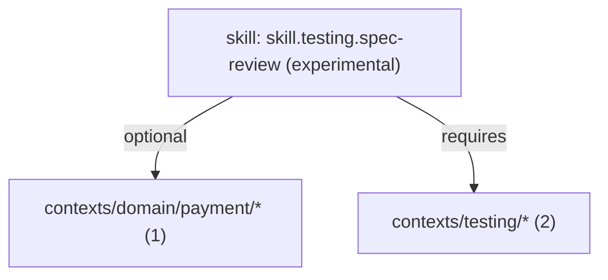

# Example Context Repository

This fixture is a small repository-shaped set of agent assets for trying renma commands. It includes one skill, several shared context assets, and one tool note so catalog, graph, ownership, readiness, and inspect output have real relationships to show.

Run these commands from the renma repository root after building the CLI:

```bash
npm run build
node dist/index.js scan examples/context-repo
node dist/index.js catalog examples/context-repo --format markdown
node dist/index.js ownership examples/context-repo --format markdown
node dist/index.js graph examples/context-repo --focus skill.testing.spec-review --format mermaid
node dist/index.js readiness examples/context-repo --format markdown
node dist/index.js inspect examples/context-repo/skills/testing/spec-review/SKILL.md --lines L10-L42
```

With an installed CLI, replace `node dist/index.js` with `renma`:

```bash
renma scan examples/context-repo
renma catalog examples/context-repo --format markdown
renma ownership examples/context-repo --format markdown
renma graph examples/context-repo --focus skill.testing.spec-review --format mermaid
renma readiness examples/context-repo --format markdown
renma inspect examples/context-repo/skills/testing/spec-review/SKILL.md --lines L10-L42
```

The scan command checks the example assets for findings. Catalog lists the assets and metadata. Ownership groups assets by owner. Graph shows required and optional context relationships; the focused graph centers the skill and its connected context assets. Readiness turns the catalog and graph into workflow checks. Inspect shows a focused outline or line slice for one asset.

