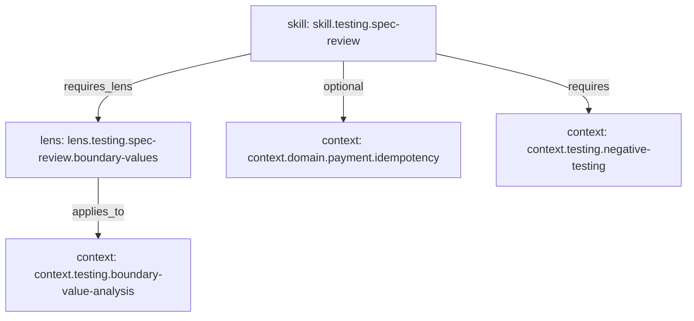

# Example Context Repository

This fixture is a focused workflow-authoring and repository-governance example.
It is statically navigable for a consuming agent that has this repository
checkout and can follow the relative Markdown links in the Skill. The agent can
inspect an incomplete request, ask focused clarification questions, apply
reusable Context, record evidence and assumptions, and produce findings for
human review. Renma discovers and validates the repository assets; it does not
open the links or execute the interaction.

## Repository Assets

- [`skills/testing/spec-review/SKILL.md`](skills/testing/spec-review/SKILL.md)
  is the Agent Skills-compatible entrypoint and interactive usage guide.
- [`lenses/testing/spec-review-boundary-values.md`](lenses/testing/spec-review-boundary-values.md)
  interprets reusable boundary knowledge for specification review.
- [`contexts/testing/boundary-value-analysis.md`](contexts/testing/boundary-value-analysis.md)
  is the independently owned source of truth used through the Lens.
- [`contexts/testing/negative-testing.md`](contexts/testing/negative-testing.md)
  is used directly by the Skill; a Context Lens is not required for every
  Context Asset.
- [`contexts/domain/payment/idempotency.md`](contexts/domain/payment/idempotency.md)
  is optional and applies only when a review covers retryable payment writes.

The `metadata.renma.*` dependency values are governance relationships. Generic
Agent Skills clients are not required to resolve them, so the Skill and Lens
bodies provide a repository-relative path to every required asset. The Skill
links the Lens and direct Context Asset, the Lens links Boundary Value Analysis,
and the Skill links this asset index for its optional payment branch. Agent
Skills-compatible syntax alone does not make those external assets portable,
and copying the Skill without the rest of this fixture produces an incomplete
workflow.

The declared relationships demonstrate both supported shapes:

```text
Skill -> Context Lens -> Context Asset
Skill -> Context Asset
```

These are static repository relationships. They do not make Renma select or
load Context for a live request.

## Responsibility Boundary

Renma:

- discovers and normalizes the example assets;
- validates metadata and declared relationships;
- reports deterministic diagnostics; and
- exposes Catalog, graph, Trust Graph, Readiness, and Repository Context BOM
  views.

The consuming agent:

- interprets the user's request and follows the Skill guidance;
- asks focused clarification questions without inventing missing requirements;
- opens the explicit repository-relative links in the Skill and Lens;
- applies the Lens and direct Context relationships where relevant; and
- records evidence, assumptions, unresolved questions, rationale, and findings.

The human:

- supplies missing domain knowledge and decision ownership;
- reviews clarifications, assumptions, findings, and any resulting patch; and
- accepts, rejects, or corrects the final result.

Human review occurs before the findings become accepted requirements or before
any implementation change is merged.

## Inspect With Renma

Run these commands from the renma repository root after building the CLI:

```bash
npm run build
node dist/index.js scan examples/context-repo
node dist/index.js catalog examples/context-repo --format markdown
node dist/index.js ownership examples/context-repo --format markdown
node dist/index.js graph examples/context-repo --view layered --format mermaid
node dist/index.js trust-graph examples/context-repo --format markdown
node dist/index.js readiness examples/context-repo --format markdown
node dist/index.js bom examples/context-repo --format json --omit-generated-at
node dist/index.js bom examples/context-repo --format markdown
node dist/index.js inspect examples/context-repo/skills/testing/spec-review/SKILL.md
```

With an installed CLI, replace `node dist/index.js` with `renma`:

```bash
renma scan examples/context-repo
renma catalog examples/context-repo --format markdown
renma ownership examples/context-repo --format markdown
renma graph examples/context-repo --view layered --format mermaid
renma trust-graph examples/context-repo --format markdown
renma readiness examples/context-repo --format markdown
renma bom examples/context-repo --format json --omit-generated-at
renma bom examples/context-repo --format markdown
renma inspect examples/context-repo/skills/testing/spec-review/SKILL.md
```

`scan` checks the assets for findings. Catalog and ownership show inventory and
responsibility. The layered graph makes Skill-to-Lens-to-Context and direct
Skill-to-Context relationships visible. Trust Graph connects review evidence.
Readiness summarizes repository health. BOM combines declared repository
evidence into authoritative JSON or a Markdown review projection. `inspect`
shows the structure of the workflow entrypoint.

The example is structurally ready: its Skill and Lens validate, every declared
relationship resolves, and every cataloged asset has an owner. `scan` also
keeps advisory missing-security-policy findings visible for the fixture's
Skill and Context Assets. The example does not invent security policy merely to
produce an empty finding list; fixture owners would need to review and declare
that policy.

## Intentionally Not Demonstrated

This fixture does not add or imply a Renma runtime state machine, automatic
question generation, live Skill or Context selection, prompt assembly, agent
execution, automatic file rewriting, telemetry collection, or automatic human
approval. The interactive behavior belongs to the consuming agent and the
final judgment belongs to the human. Renma metadata does not make the workflow
self-contained or cause a generic Agent Skills client to load external assets.

The declared relationship shape is:


