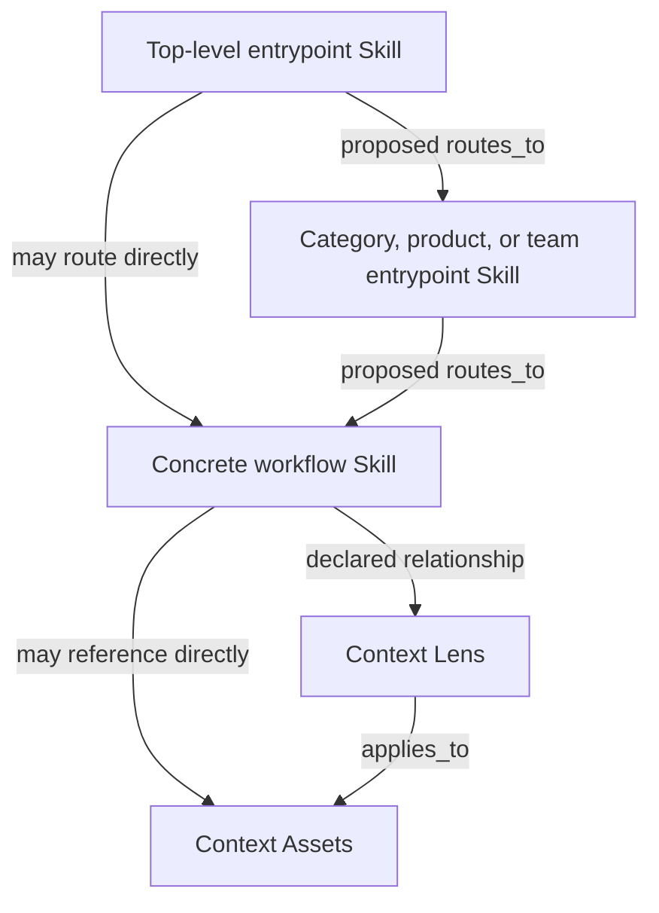

# Renma Skill Discovery Plan

Status: deferred exploratory design

Target: unassigned (post-0.18.0)

Scope: optional, backward-compatible skill discovery for large single repositories

Only **Current Baseline** describes implemented behavior. `routes_to`,
`skill-index`, discovery aliases, explicit routing entrypoints, generated
indexes, and related diagnostics are deferred proposals. They are not Renma
0.18.0 behavior and have no assigned release. Runtime Skill selection remains
outside Renma.

## Summary

Renma should add a static skill discovery projection for repositories that have grown beyond the point where an agent can reliably inspect every `SKILL.md` before choosing where to start.

Any future implementation must be reconsidered against Renma's focused-workflow
model and boundaries:

```text
Skill = focused, bounded workflow entrypoint and usage guide
Context Lens = purpose-oriented interpretation layer over context assets
Context Asset = independently owned source-of-truth knowledge
```

The new capability should not introduce a required directory hierarchy, move existing files, select a skill for a live task, assemble prompts, or call an LLM. It should model the layered `SKILL.md` routing that repositories already use, validate that routing deterministically, and generate compact indexes and visualizations from the same repository evidence used by catalog, graph, readiness, diff, Trust Graph, and Repository Context BOM.

The intended operating model is:

```text
Existing SKILL.md files own routing
  -> Renma records and validates skill-to-skill routes
  -> Renma emits a static skill index
  -> an agent reads the index and source SKILL.md files
  -> humans review summaries, diffs, and visualizations
```

No-LLM workflows remain first-class:

```text
LLM proposes. Renma verifies. Human approves.
```

## Current Baseline

The implemented 0.18.0 product provides infrastructure that a future design
could reuse without implementing Skill-to-Skill routing:

- Repository file discovery for Skills, Context Assets, Context Lenses,
  profiles, references, examples, scripts, assets, agents, and config.
- First-class Skill-local support discovery, static reachability and ownership
  relationships, and no-follow symlink handling.
- A normalized catalog model with deterministic IDs, paths, hashes, owners, lifecycle metadata, tags, and declared dependencies.
- A shared `RepositoryEvidence` collection path used by catalog, graph, and Repository Context BOM work.
- Static graph relationships for required and optional context, required and optional lenses, lens application, conflicts, supersession references, and coverage evidence.
- Markdown, JSON, and Mermaid reports for human review, CI, and downstream tooling.
- Readiness, semantic diff, ownership, Trust Graph v2, Repository Context BOM
  v2, diagnostics v2, review bundles, scaffold, and metadata suggestions.
- Effective security-policy provenance across local metadata, profiles,
  repository configuration, and owning-Skill inheritance.
- A compact metadata parser that supports scalar values and selected block-list fields while intentionally discouraging large nested frontmatter.

Deferred Skill-to-Skill discovery is distinct from this implemented repository
and support-resource discovery. Any future work must not create a parallel
scanner, second catalog, runtime service, or separate source of truth.

## Decision Status

Constraints for any future design are:

- Renma remains a deterministic repository-governance layer, not a runtime
  selector.
- Existing canonical `SKILL.md` files remain source assets.
- Discovery is a projection over shared repository evidence.
- No required category, product, team, or workflow directory hierarchy is
  introduced.
- Adoption remains backward-compatible and human-reviewable.

Everything else in this document is prototype knowledge or a proposed
implementation decision until code, contract tests, and release review accept
it. In particular, `routes_to`, `skill-index`, discovery aliases, explicit
entrypoints, diagnostic identifiers, report fields, views, thresholds, and
phase ordering are proposals rather than current product contracts.

## Problem

A repository with 100 or more skills and many contributing teams has two different discovery problems:

1. Renma must organize and validate the assets.
2. An agent must find the right starting `SKILL.md` without reading the entire repository.

The first problem is already within Renma's current governance model. The second becomes difficult when a flat catalog exposes too many plausible skills at once.

Existing repositories often solve this with layered Skills. The proposed model
records that topology as a graph rather than requiring this directory tree:



Existing `SKILL.md` files would remain the source of routing policy. Renma would
record, validate, and present declared routes; tree-like views would remain
projections, and Renma would not select a Skill for a live user request.

Examples include:

```text
setup
  -> Appium setup
    -> Android UiAutomator2 setup
```

and:

```text
test case generation
  -> Checkout test case generation
    -> current team workflow
      -> requirements-based generation
```

This structure is valuable. It separates responsibilities, keeps individual skills small, and lets different owners maintain different routing boundaries. Renma should make this structure visible and verifiable rather than replacing it with one large handwritten index.

## Product Decisions

### 1. Keep one repository as the governance boundary

The first implementation should target one repository containing its skills, lenses, contexts, metadata, and generated review artifacts.

A single repository provides one review surface for:

- Skill-to-skill reachability.
- Context and lens references.
- Product knowledge reuse.
- Ownership changes.
- Lifecycle and deprecation routing.
- Repeated-context evidence.
- Semantic diff and readiness.

Multi-repository federation, package synchronization, and organization-wide distribution remain out of scope for the initial implementation.

### 2. Preserve every existing `SKILL.md`

All existing specification-valid `SKILL.md` files remain Skill assets. This
proposal must not require a migration to a new directory shape or a new Skill
type.

A category entrypoint, product entrypoint, team entrypoint, hybrid router, and concrete workflow are all still `skill` assets. Their role is expressed through their route relationships and existing usage boundaries, not through a mandatory physical hierarchy.

### 3. Model discovery as a graph, not a required tree

Repositories may route by category, product, platform, input type, owner, workflow stage, or a combination of those dimensions. The order is not guaranteed to be the same across the repository.

Renma should therefore model:

```text
skill -> skill
```

as a typed route relationship and derive tree-like views only as projections.

The graph may represent any of these shapes:

```text
category -> product -> workflow
category -> team -> workflow
product -> category -> workflow
category -> workflow
entrypoint -> entrypoint -> leaf
```

No category, team, or product directory is required for correctness.

### 4. Treat product identity as stable and ownership as mutable

Teams and maintainers may change. Product identity and product behavior usually change more slowly.

Durable product knowledge should therefore remain in independently owned context assets with stable IDs. A product-oriented path such as `contexts/products/checkout/` may be recommended where useful, but the stable asset ID and references matter more than the directory name.

For example:

```text
context.product.checkout.behavior
context.product.checkout.regression-risk
lens.product.checkout.test-case-generation
```

A skill owned by Team A today and Team D later can keep referencing the same product contexts. Renma diff should report the owner or route change separately from the unchanged product knowledge.

Product is a logical facet in the first implementation, not a new required artifact kind. Product views can be derived from stable context IDs, exact context/lens relationships, and optional namespaced tags such as `product:checkout`.

### 5. Keep routing policy close to the skill that owns it

A category `SKILL.md` should remain the human-owned routing contract for that category. The generated index should summarize and link to it, not copy all of its instructions.

```text
Top-level index owns first-hop visibility.
Entrypoint SKILL.md owns routing policy.
Leaf SKILL.md owns concrete workflow guidance.
Context lens owns interpretation focus.
Context asset owns durable knowledge.
Owner metadata records current responsibility.
Renma owns deterministic validation and reviewability.
```

### 6. Generate output without mutating the repository by default

The initial command should write to stdout, like existing Renma report commands. Users may redirect output into a checked-in file or publish it as a CI artifact.

```bash
renma skill-index . --format markdown > SKILL_INDEX.md
renma skill-index . --format json > skill-index.json
renma skill-index . --format mermaid > skill-index.mmd
```

Renma should not create `.renma/`, move skills, rewrite metadata, or update a generated index automatically during scan.

## Discovery Model

### Skill route edge

Add a static dependency kind for skill routing:

```text
routes_to
```

The relationship means:

```text
The source skill explicitly directs an agent to inspect or continue with the target skill.
```

It does not mean:

- Renma selected the target for a live user task.
- The target must be loaded into a prompt.
- The target was actually consumed at runtime.
- The source and target must follow a fixed directory hierarchy.

Route edges should preserve source evidence, including path, line range, target spelling, and declaration form.

### Declared and observed routes

Adoption should not require immediate metadata changes across every existing skill.

Renma should support two deterministic evidence forms:

1. **Declared route**: an optional `routes_to` metadata list containing exact skill IDs or repository-relative paths.
2. **Observed route**: an exact local Markdown link from one discovered skill file to another discovered skill file.

Declared routes are explicit repository contracts. Observed routes preserve existing layered `SKILL.md` structures and provide a zero-restructure adoption path.

The report should keep the declaration form visible. Later diagnostics may recommend declaring important observed routes explicitly, but the MVP should not require this for all repositories.

### Entrypoints

A discovery entrypoint is an active skill intended to appear in the first-hop index.

The default inference should be conservative:

- Active skills with no incoming route are inferred roots.
- Exact explicitly configured or declared entrypoints are always roots.
- Deprecated and archived skills are not published as normal roots.
- Standalone skills remain visible even when they are not yet connected.

An optional flat Renma metadata field may be added when repositories need to
override inference. Under the canonical 0.16.0 Skill syntax, the proposal would
use a string value under `metadata`:

```yaml
metadata:
  renma.discovery-entrypoint: "true"
```

An optional config list may later provide a small repository-level root set. It must contain only broad roots and must not become a central list of every skill.

### Minimal metadata direction

The current parser intentionally supports compact scalar and list metadata. Discovery should preserve that constraint.

Potential additive semantics are shown below using the canonical 0.16.0 Skill
serialization. These names are proposals, not currently operational fields:

```yaml
metadata:
  renma.routes-to: '["products.checkout.test-case-generation","products.search.test-case-generation"]'
  renma.discovery-aliases: '["generate test cases","test case design"]'
  renma.discovery-entrypoint: "true"
```

Existing fields remain primary routing evidence:

- `renma.id`
- `renma.owner`
- `renma.status`
- `renma.tags`
- `renma.when-to-use`
- `renma.when-not-to-use`
- `renma.requires-context`
- `renma.optional-context`
- `renma.requires-lens`
- `renma.optional-lens`

Namespaced tags can provide optional facets without fixing a hierarchy:

```yaml
metadata:
  renma.tags: '["category:test-case-generation","product:checkout","platform:android"]'
```

Do not add nested discovery maps to frontmatter in the first implementation. Do not require all fields on all skills. Add a field only when a command or deterministic diagnostic uses it.

### Product projection

Product views should derive from durable evidence rather than current team names.

Possible evidence, in priority order:

1. Direct `product:<id>` tags on a skill, lens, or context.
2. A skill's exact relationship to a product-scoped lens or context.
3. Stable IDs such as `context.product.<id>.*` or `lens.product.<id>.*`.
4. Optional repository configuration for aliases only when naming cannot be normalized otherwise.

Renma should not infer product identity from `owner` alone.

A product view should show:

- Product-scoped contexts.
- Product-scoped lenses.
- Skills that use them.
- Current owners of those skills and assets.
- Route entrypoints that lead to those skills.
- Missing, deprecated, or orphaned relationships.

This lets a human verify that product knowledge remains stable even when ownership changes.

## Command Direction

Use **Skill Discovery** as the product concept and begin with a static index command:

```bash
renma skill-index [path] [--format json|markdown|mermaid]
```

`skill-index` is preferable to a command that accepts task text because it clearly describes a repository artifact and does not imply runtime skill selection.

The implementation should be a thin projection over `RepositoryEvidence`. Internally, use names such as `skill-discovery` or `skill-index` to avoid confusing this feature with the existing repository file discovery module.

### Views

Reuse the existing `--view` and `--focus` command conventions where possible.

Proposed views:

```text
entrypoints
  Compact first-hop index. This is the default Markdown view.

routes
  Full skill-to-skill routing graph with route evidence and reachability.

products
  Product contexts, lenses, consuming skills, routes, and current owners.

full
  Complete discovery projection for tooling and debugging.
```

Examples:

```bash
renma skill-index . --format markdown
renma skill-index . --view routes --format json
renma skill-index . --view products --format markdown
renma skill-index . --focus test-case-generation --format mermaid
```

JSON should be the canonical machine-readable shape. Markdown should remain compact enough for an agent to read and a human to paste into a pull request. Mermaid should provide a review visualization without creating a hosted dashboard.

### Compact Markdown contract

The first-hop Markdown view should explain how to use the index without becoming a prompt package:

```text
1. Match the repository task to a broad entrypoint's usage boundaries.
2. Open the source SKILL.md.
3. Follow that skill's declared or observed routes.
4. Read the selected leaf skill and its required lenses and contexts.
5. Treat source SKILL.md, lenses, and contexts as authoritative over the generated index.
6. Do not guess when no route is clear.
```

Each root entry should include only compact evidence:

- ID and title or first heading.
- Source path.
- Owner and lifecycle state.
- `when_to_use` and `when_not_to_use` summaries when available.
- Direct route targets.
- Product facets when deterministically known.
- Blocking discovery diagnostics.

Detailed workflow instructions remain in the source skill.

## Diagnostics

Discovery diagnostics should reuse the current diagnostic and review-bundle model. They should be emitted by normal deterministic scans and summarized by `skill-index`, readiness, semantic diff, and CI reports where appropriate.

Initial rules should be narrow and exact:

```text
DISCOVERY-UNRESOLVED-ROUTE
  A declared or exact local skill route does not resolve to a discovered skill.

DISCOVERY-ROUTE-TARGET-NOT-SKILL
  A routes_to declaration resolves to a non-skill asset.

DISCOVERY-DEPRECATED-SKILL-ROUTED
  An active skill routes to a deprecated or archived skill.

DISCOVERY-ROUTE-CYCLE
  Skill routing contains a cycle that prevents a clear traversal boundary.

DISCOVERY-UNREACHABLE-SKILL
  An active published skill cannot be reached from any discovery entrypoint.

DISCOVERY-DUPLICATE-ALIAS
  Multiple active skills claim the same normalized discovery alias.

DISCOVERY-ROOT-SURFACE-LARGE
  The inferred first-hop surface is too large to be a useful compact index.

DISCOVERY-ENTRYPOINT-WITHOUT-BOUNDARIES
  An explicit entrypoint lacks usable when-to-use or when-not-to-use boundaries.
```

Existing findings for missing negative routing, weak usage guidance, missing ownership, broken context references, deprecated context, orphaned context, and lens governance should be reused rather than duplicated under new codes.

Threshold-based rules such as a large root surface should begin as advisory and configurable. They must not impose a universal repository shape.

## Readiness, Diff, Trust Graph, and BOM Integration

### Readiness

After the route model stabilizes, readiness may add a compact `skillDiscovery` section containing:

- Active skill count.
- Explicit and inferred entrypoint count.
- Reachable skill percentage.
- Unresolved route count.
- Deprecated routed skill count.
- Route cycle count.
- Root surface status.

This section describes repository preparedness. It does not score the correctness of a live skill choice.

### Semantic diff

Semantic diff should report:

- Added and removed route edges.
- Entrypoint changes.
- Skills that became reachable or unreachable.
- Alias changes and collisions.
- Owner changes independently from product context identity.
- Product context and lens reference changes.
- New routes to deprecated or archived skills.

A team ownership change should not appear as a product context replacement when stable product context IDs remain unchanged.

### Trust Graph

Trust Graph may include route evidence after the route semantics are stable. It should expose owner, lifecycle, diagnostic, and route evidence for review without assigning a subjective trust or routing score.

### Repository Context BOM

Repository Context BOM may later include an additive skill discovery summary and route manifest. The BOM remains a declared repository evidence snapshot, not a runtime report of which skill an LLM selected or consumed.

These integrations should follow the standalone route model and `skill-index` MVP rather than expanding the first patch.

## Human and LLM-Assisted Maintenance

Humans are expected to review compact summaries, semantic diffs, diagnostics, and Mermaid views rather than manually inspect every edge in a large repository.

LLM coding agents may help maintain the graph by:

- Adding exact route metadata.
- Converting a large handwritten index into layered entrypoint skills.
- Extracting durable product knowledge into product-scoped context assets.
- Updating owners while preserving stable product context IDs.
- Resolving deprecated routes.
- Proposing aliases and usage boundaries.

Renma should support that workflow with deterministic diagnostics, `suggest-metadata`, scaffold output, and review bundles. Renma should not call a provider, choose the patch, or rewrite the repository automatically.

The repair loop remains:

```text
renma scan / skill-index / diff
  -> deterministic diagnostics and review evidence
  -> human or coding agent proposes a patch
  -> human reviews the patch
  -> renma validates the result
```

## Implementation Phases

### Phase 0: Schema and fixture design

Define the smallest additive model before adding a command.

Work:

- Add representative fixtures for layered setup routing and layered test-case generation.
- Include product-scoped context, context lenses, mutable owners, deprecated skills, an unresolved route, and a route cycle.
- Confirm exact ID and path resolution rules for skill targets.
- Decide how declared and observed route evidence is represented without changing existing dependency semantics.
- Define a versioned `SkillIndexReport` JSON shape.

Acceptance criteria:

- No existing output changes.
- No new required metadata.
- Fixtures represent category-first, product-first, team-first, and direct-leaf routing without requiring different code paths.

### Phase 1: Route evidence in the normalized model

Add skill-to-skill route evidence to the existing catalog and graph pipeline.

Work:

- Parse optional `routes_to` block lists.
- Resolve exact skill IDs and repository-relative paths.
- Record exact local skill-to-skill Markdown links as observed routes.
- Add source evidence and declaration form.
- Add the `routes_to` relationship kind to graph output.
- Keep current catalog fields and dependency kinds backward compatible through additive output.
- Add unresolved, non-skill, deprecated-target, and cycle diagnostics.

Acceptance criteria:

- Existing layered skills produce a route graph without moving files.
- Existing commands remain deterministic.
- Repositories that do not use route metadata continue to scan successfully.
- No fuzzy matching, semantic search, or LLM inference is used.

### Phase 2: `renma skill-index` MVP

Build the static discovery projection from shared repository evidence.

Work:

- Add `SkillIndexReport` with roots, skills, routes, reachability, facets, and diagnostics.
- Add JSON and compact Markdown output.
- Support `--focus` and the `entrypoints`, `routes`, and `full` views.
- Infer roots conservatively and support explicit entrypoint metadata.
- Keep standalone skills visible in a separate section instead of silently hiding them.
- Emit output to stdout only.

Acceptance criteria:

- A repository with more than 100 skills produces a bounded first-hop Markdown index.
- The index points to source skills rather than copying detailed workflow text.
- Specific leaf skills remain directly discoverable by ID, alias, path, or focused view.
- The command never accepts free-form task text and never ranks skills for a live task.

### Phase 3: Product and ownership views

Add a stable product-oriented review projection.

Work:

- Recognize exact `product:<id>` tags.
- Recognize stable product context and lens IDs.
- Traverse context and lens relationships to associate skills with product evidence.
- Add the `products` view.
- Show current owners separately from product identity.
- Add fixtures where ownership changes but product context remains unchanged.

Acceptance criteria:

- Product views remain stable across owner changes.
- Renma never derives product identity from owner alone.
- Product contexts can be reused by multiple skills and teams without duplication.
- No product directory or first-class product node is required.

### Phase 4: Readiness and semantic diff integration

Make discovery health reviewable in CI and pull requests.

Work:

- Add discovery summary fields to readiness.
- Add route, reachability, entrypoint, alias, product-facet, and ownership changes to semantic diff.
- Add compact discovery sections to CI reports.
- Reuse diagnostics v2 and review bundles for repair guidance.
- Define suppression behavior for advisory scale rules.

Acceptance criteria:

- A pull request clearly shows when a skill becomes unreachable.
- Owner changes are separated from product context changes.
- Discovery regressions can be gated only when a repository opts into the relevant severity threshold.
- Existing readiness and diff consumers remain compatible with additive fields.

### Phase 5: Visualization and review artifacts

Add human-readable graph views after the report model is stable.

Work:

- Add Mermaid output for route and product views.
- Visually separate entrypoints, routers, leaves, lenses, contexts, and unresolved targets.
- Keep direct skill-to-context and skill-to-lens relationships visible without obscuring routes.
- Document redirection into checked-in or CI artifacts.

Acceptance criteria:

- A focused test-case-generation graph clearly shows entrypoint-to-skill routing and skill-to-lens-to-context relationships.
- A product graph clearly shows stable product context and current owners.
- No hosted dashboard or generated file mutation is required.

### Phase 6: Authoring assistance

Reduce maintenance cost without making Renma a semantic author or runtime selector.

Work:

- Extend scaffold with optional route metadata inputs.
- Extend `suggest-metadata` to propose missing exact routes, aliases, and explicit entrypoints from deterministic evidence.
- Create review bundles for large root surfaces, unreachable skills, deprecated routes, and repeated product context.
- Document how coding agents can use the bundles to prepare reviewable patches.

Acceptance criteria:

- Suggestions are deterministic and do not modify files.
- Every suggested route cites exact repository evidence.
- A human can reject or edit suggestions without affecting core validation.
- No external LLM is required.

## Backward Compatibility and Rollout

The rollout should be incremental.

### Adoption stage 1: inspect only

Users run the new report against the existing repository:

```bash
renma skill-index . --format markdown
```

No files move. No metadata is required. Existing exact links provide initial route evidence.

### Adoption stage 2: clarify crowded areas

Maintainers add `routes_to`, aliases, or explicit entrypoint metadata only to ambiguous or high-volume areas.

A repository may improve `test-case-generation/SKILL.md` without changing unrelated skills.

### Adoption stage 3: stabilize product context

Maintainers and coding agents move durable product behavior out of team-only instructions when semantic review confirms that it should outlive the current owner.

The original team-specific material may remain when it records a genuinely team-specific process or lens.

### Adoption stage 4: enable CI gating

Repositories opt into failure thresholds for exact discovery problems such as unresolved routes or deprecated routed skills. Scale and quality advisories remain warnings until local policy says otherwise.

## Testing Strategy

Tests should follow current Renma patterns and use deterministic fixtures.

Required coverage:

- Metadata parsing for route lists, aliases, and explicit entrypoints.
- Exact skill ID and path resolution.
- Observed local skill links.
- Missing and non-skill targets.
- Deprecated and archived targets.
- Route cycles.
- Root inference and explicit roots.
- Standalone and unreachable skills.
- Duplicate aliases.
- Category-first, product-first, team-first, and direct-leaf graphs.
- Product contexts shared by multiple owners.
- Owner changes with stable product context.
- JSON snapshot stability.
- Markdown table escaping.
- Mermaid escaping and cycle safety.
- More than 100 generated fixture skills to verify bounded output and acceptable performance.
- No changes to existing command outputs unless additive discovery fields are explicitly introduced.

## Non-Goals

The following remain out of scope:

- Accepting a live user task and choosing a skill.
- Ranking skills with embeddings, fuzzy search, or an LLM.
- Prompt assembly or context bundling.
- Loading or injecting the selected skill into an agent.
- Agent execution or tool orchestration.
- Runtime telemetry collection.
- Automatically moving or rewriting `SKILL.md` files.
- Requiring category, product, team, or workflow directories.
- Requiring all skills to declare new metadata.
- Replacing source `SKILL.md`, lens, or context content with generated index prose.
- Multi-repository package synchronization in the initial implementation.
- A hosted discovery dashboard.

## Success Criteria

This direction is successful when:

1. Existing Renma users can adopt it after skill growth without a repository restructure.
2. Existing layered `SKILL.md` routing becomes visible and validated.
3. A first-hop index remains usable with 100 or more skills and many teams.
4. Broad tasks lead agents to stable entrypoint skills, while specific tasks can still reach concrete leaf skills directly.
5. Category, product, team, and workflow ordering can vary without breaking the model.
6. Durable product context remains stable when ownership changes.
7. Context and lens reuse remain visible and are not overshadowed by discovery metadata.
8. Humans can review compact Markdown, semantic diff, diagnostics, and Mermaid views.
9. Core outputs remain deterministic and useful without an LLM.
10. Renma remains a repository governance layer, not a runtime skill selector.

The governing principle remains:

```text
Existing structure is preserved.
Routing becomes explicit and reviewable.
Product knowledge remains durable.
Generated indexes remain projections.
Renma verifies; it does not select at runtime.
```
